<!-- AUTO-DOCS:START -->

 

  

**UNIVERSIDAD PERUANA DE CIENCIAS APLICADAS**

 

**Facultad de Ingeniería**

**Carrera de Ingeniería de Software**

 

**Ciclo Académico 2026-2**

 

**Código:** 1ASI0730   |   **Curso:** Aplicaciones Web   |   **NRC:** 8130

 

**Docente:** Villafuerte Bazan, Oscar Ivan

 

**Informe de Trabajo Final - AV2**

 

**Nombre de la Startup:**

**startup**

 

**Nombre del Producto:**

**ProductName**

 

**Relación de integrantes**

<table align="center" style="margin: 0 auto; font-size: 15px;">
  <tbody>
    <tr>
      <td align="center">U201923820</td>
      <td align="left">Cáceres Pizarro, Albino Florencio</td>
    </tr>
    <tr>
      <td align="center">U202410746</td>
      <td align="left">Huaranga Romero, Matias Daniel</td>
    </tr>
    <tr>
      <td align="center">U20231B504</td>
      <td align="left">Merino Ordinola, Winnie Lisbeth</td>
    </tr>
    <tr>
      <td align="center">u201815005</td>
      <td align="left">Quispe Alomnacid, Andre Sebastian </td>
    </tr>
    <tr>
      <td align="center">U20241G152</td>
      <td align="left">Torres Huaman, Alexis Calin</td>
    </tr>
  </tbody>
</table>

  

**Lima, agosto de 2026**

---

# Registro de versiones del informe
| Versión | Fecha | Autores | Descripción              |
| :--- | :--- | :--- |:-------------------------|
| 1.0.0 | 20/09/2026 | Cáceres Pizarro, Albino Florencio Huaranga Romero, Matias Daniel Merino Ordinola, Winnie Lisbeth Quispe Alomnacid, Andre Sebastian Torres Huaman, Alexis Calin| Carátula Registro de Versiones del Informe Project Report Collaboration Insights Contenido Student Outcome Capítulo I: Introducción Capítulo II: Requirements Elicitation & Analysis. Capítulo III: Requirements Specification. Capítulo IV: Product Design. Capítulo V: Product Implementation, Validation & Deployment. 5.1. Software Configuration Management. 5.1.1. Software Development Environment Configuration. 5.1.2. Source Code Management. 5.1.3. Source Code Style Guide & Conventions. 5.1.4. Software Deployment Configuration. 5.2. Landing Page, Services & Applications Implementation. 5.2.1. Sprint 1 5.2.1.1. Sprint Planning 1. 5.2.1.2. Aspect Leaders and Collaborators. 5.2.1.3. Sprint Backlog 1. 5.2.1.4. Development Evidence for Sprint Review. 5.2.1.5. Execution Evidence for Sprint Review. 5.2.1.6. Services Documentation Evidence for Sprint Review. 5.2.1.7. Software Deployment Evidence for Sprint Review. 5.2.1.8. Team Collaboration Insights during Sprint. Conclusiones Bibliografía Anexos. |
| 2.0.0 | DD/MM/AAAA | Nombres completos de los integrantes | [Descripción de los cambios realizados en esta versión] |
| 3.0.0 | DD/MM/AAAA |Nombres de integrantes | [Descripción de los cambios realizados en esta versión] |

---

# Project Report Collaboration Insights
El presente apartado tiene como finalidad evidenciar el trabajo colaborativo realizado durante el desarrollo del informe. Para ello, se pone a disposición el repositorio oficial del proyecto, alojado en una organización pública de GitHub:

Link de la organización: 🔗https://github.com/Market-Labs

A partir de este repositorio, se analiza la participación de los integrantes del equipo mediante indicadores como número de commits, frecuencia de contribuciones y actividad general registrada en la plataforma.

En el contexto de las entregas AV1, TB1, AV2 y TB2, se presenta un análisis de colaboración que permite visualizar el nivel de aporte individual de cada miembro del equipo, sustentado en los registros de GitHub. Este análisis busca demostrar la distribución del trabajo, la constancia en el desarrollo del informe y el cumplimiento de las actividades asignadas.

## AV1

La siguiente figura muestra el tráfico registrado en el repositorio del proyecto durante el periodo de desarrollo.

**Figura 1.** Tráfico registrado en el repositorio del proyecto.  
**Fuente:** GitHub Insights.

La siguiente figura presenta la participación de los integrantes del equipo como contribuidores del repositorio.

**Figura 2.** Contribuidores del repositorio del proyecto.  
**Fuente:** GitHub Insights.

La siguiente figura muestra el historial de commits realizados por los integrantes del equipo durante el desarrollo del proyecto.

**Figura 3.** Registro de commits realizados por los integrantes del equipo.  
**Fuente:** GitHub.

La siguiente figura presenta las estadísticas generales de actividad y contribución registradas en el repositorio.

**Figura 4.** Estadísticas generales del repositorio del proyecto.  
**Fuente:** GitHub Insights.

---

# Contenido

## Tabla de contenidos

### Front Matter

- [Carátula](./front-matter/01-title-page.md)
- [Registro de Versiones del Informe](./front-matter/02-version-control-log.md)
- [Student Outcome](./front-matter/05-student-outcomes.md)

### Contenido del Informe

- [Abstract](./10-chapter-01.md#abstract)
- [Resumen](./10-chapter-01.md#resumen)

- [Capítulo I: Introducción](./10-chapter-01.md)
    - [1.1. Startup Profile](./10-chapter-01.md#11-startup-profile)
    - [1.2. Solution Profile](./10-chapter-01.md#12-solution-profile)
    - [1.3. Segmentos objetivo](./10-chapter-01.md#13-segmentos-objetivo)

- [Capítulo II: Requirements Elicitation & Analysis](./11-chapter-02.md)
    - [2.1. Competidores](./11-chapter-02.md#21-competidores)
    - [2.2. Entrevistas](./11-chapter-02.md#22-entrevistas)
    - [2.3. Needfinding](./11-chapter-02.md#23-needfinding)
    - [2.4. Big Picture EventStorming](./11-chapter-02.md#24-big-picture-eventstorming)
    - [2.5. Ubiquitous Language](./11-chapter-02.md#25-ubiquitous-language)

- [Capítulo III: Requirements Specification](./12-chapter-03.md)
    - [3.1. User Stories](./12-chapter-03.md#31-user-stories)
    - [3.2. Impact Mapping](./12-chapter-03.md#32-impact-mapping)
    - [3.3. Product Backlog](./12-chapter-03.md#33-product-backlog)

- [Capítulo IV: Product Design](./13-chapter-04.md)
    - [4.1. Style Guidelines](./13-chapter-04.md#41-style-guidelines)
    - [4.2. Information Architecture](./13-chapter-04.md#42-information-architecture)
    - [4.3. Landing Page UI Design](./13-chapter-04.md#43-landing-page-ui-design)
    - [4.4. Web Applications UX/UI Design](./13-chapter-04.md#44-web-applications-uxui-design)
    - [4.5. Web Applications Prototyping](./13-chapter-04.md#45-web-applications-prototyping)
    - [4.6. Domain-Driven Software Architecture](./13-chapter-04.md#46-domain-driven-software-architecture)
    - [4.7. Software Object-Oriented Design](./13-chapter-04.md#47-software-object-oriented-design)
    - [4.8. Database Design](./13-chapter-04.md#48-database-design)

- [Capítulo V: Product Implementation, Validation & Deployment](./14-chapter-05.md)
    - [5.1. Software Configuration Management](./14-chapter-05.md#51-software-configuration-management)
        - [5.1.1. Software Development Environment Configuration](./14-chapter-05.md#511-software-development-environment-configuration)
        - [5.1.2. Source Code Management](./14-chapter-05.md#512-source-code-management)
        - [5.1.3. Source Code Style Guide & Conventions](./14-chapter-05.md#513-source-code-style-guide--conventions)
        - [5.1.4. Software Deployment Configuration](./14-chapter-05.md#514-software-deployment-configuration)

    - [5.2. Landing Page, Services & Applications Implementation](./14-chapter-05.md#52-landing-page-services--applications-implementation)
        - [5.2.1. Sprint 1](./14-chapter-05.md#521-sprint-1)
        - [5.2.2. Sprint 2](./14-chapter-05.md#522-sprint-2)
        - [5.2.3. Sprint 3](./14-chapter-05.md#523-sprint-3)

    - [5.3. Validation Interviews](./14-chapter-05.md#53-validation-interviews)
        - [5.3.1. Diseño de Entrevistas](./14-chapter-05.md#531-diseño-de-entrevistas)
        - [5.3.2. Registro de Entrevistas](./14-chapter-05.md#532-registro-de-entrevistas)
        - [5.3.3. Evaluaciones según heurísticas](./14-chapter-05.md#533-evaluaciones-según-heurísticas)

    - [5.4. Video About-the-Product](./14-chapter-05.md#54-video-about-the-product)

- [Capítulo VI: Conclusions](./15-chapter-06.md)
    - [6.1. Conclusiones y recomendaciones](./15-chapter-06.md#61-conclusiones-y-recomendaciones)
    - [6.2. Video About-the-Team](./15-chapter-06.md#62-video-about-the-team)

- [Bibliografía](./99-bibliography.md)

- [Anexos](./16-annexes.md)
    - [Anexo A: Videos de Exposiciones](./16-annexes.md#anexo-a-videos-de-exposiciones)

---

# Student Outcome
El curso contribuye al cumplimiento del Student Outcome ABET:

**ABET – EAC - Student Outcome 5**  
**Criterio:** La capacidad de funcionar efectivamente en un equipo cuyos miembros juntos proporcionan liderazgo, crean un entorno de colaboración e inclusivo, establecen objetivos, planifican tareas y cumplen objetivos.

En el siguiente cuadro se describen las acciones realizadas y las conclusiones del equipo, que permiten sustentar el logro del ABET – EAC - Student Outcome 5.

---

## Tabla de Student Outcome
<table style="width:100%; border-collapse: collapse;">
  <tr>
    <th style="width:25%;">Criterio específico</th>
    <th style="width:45%;">Acciones realizadas</th>
    <th style="width:30%;">Conclusiones</th>
  </tr>

  <tr>
    <td>
      Trabaja en equipo para proporcionar liderazgo en forma conjunta
    </td>
    <td>
      <strong>Cáceres Pizarro, Albino Florencio</strong> 
      <strong>AV1:</strong> Creación del repositorio, establecimiento de la idea de negocio 
      <strong>TB1:</strong> . 
      <strong>AV2:</strong>  
      <strong>TF:</strong> 
      <strong>integrante 2</strong>  
      <strong>AV1:</strong> que hizo  
      <strong>TB1:</strong> que hizo  
      <strong>AV2:</strong> que hizo 
      <strong>TF:</strong> que hizo  
      <strong>integrante 3</strong>  
      <strong>AV1:</strong> que hizo  
      <strong>TB1:</strong> que hizo  
      <strong>AV2:</strong> que hizo 
      <strong>TF:</strong> que hizo  
      <strong>integrante 4</strong>  
      <strong>AV1:</strong> que hizo  
      <strong>TB1:</strong> que hizo  
      <strong>AV2:</strong> que hizo 
      <strong>TF:</strong> que hizo  
      <strong>integrante 5</strong>  
      <strong>AV1:</strong> que hizo  
      <strong>TB1:</strong> que hizo  
      <strong>AV2:</strong> que hizo 
      <strong>TF:</strong> que hizo  
    </td>
    <td>
      <strong>AV1:</strong> El equipo demostró liderazgo compartido al asignar responsables específicos basándose en las fortalezas técnicas de cada integrante. 
      <strong>TB1:</strong>contenido  
      <strong>AV2:</strong> contenido 
      <strong>TF:</strong> contenido 
    </td>
  </tr>
  <tr>
    <td>
      Crea un entorno colaborativo e inclusivo, establece metas, planifica tareas y cumple objetivos
    </td>
    <td>
       <strong>Cáceres Pizarro, Albino Florencio</strong> 
      <strong>AV1:</strong> Creación del repositorio, establecimiento de la idea de negocio 
      <strong>TB1:</strong> . 
      <strong>AV2:</strong>  
      <strong>TF:</strong> 
      <strong>integrante 2</strong>  
      <strong>AV1:</strong> que hizo  
      <strong>TB1:</strong> que hizo  
      <strong>AV2:</strong> que hizo 
      <strong>TF:</strong> que hizo  
      <strong>integrante 3</strong>  
      <strong>AV1:</strong> que hizo  
      <strong>TB1:</strong> que hizo  
      <strong>AV2:</strong> que hizo 
      <strong>TF:</strong> que hizo  
      <strong>integrante 4</strong>  
      <strong>AV1:</strong> que hizo  
      <strong>TB1:</strong> que hizo  
      <strong>AV2:</strong> que hizo 
      <strong>TF:</strong> que hizo  
      <strong>integrante 5</strong>  
      <strong>AV1:</strong> que hizo  
      <strong>TB1:</strong> que hizo  
      <strong>AV2:</strong> que hizo 
      <strong>TF:</strong> que hizo  
    </td>
    <td>
      <strong>AV1:</strong> La planificación de tareas mediante un backlog inicial permitió cumplir con todos los artefactos de Needfinding y Lean UX. 
      <strong>TB1:</strong> CONTENIDO 
      <strong>AV2:</strong> CONTENIDO 
    </td>
  </tr>
</table>

---

# Capítulo I: Introducción

## 1.1. Startup Profile

### 1.1.1. Descripción de la Startup

Market-Labs es una startup tecnológica peruana de reciente creación, orientada al desarrollo de iniciativas empresariales basadas en tecnología e innovación. La organización nace con el propósito de identificar oportunidades de mejora en actividades comerciales y operativas, transformándolas en propuestas de valor que puedan generar beneficios económicos, sociales y ambientales.

Como empresa emergente, Market-Labs adopta un enfoque de innovación continua, característico de las startups, buscando validar sus ideas de negocio de manera progresiva y adaptarse a las necesidades de su mercado objetivo. Su modelo de desarrollo se basa en la identificación de problemas reales, la experimentación y la mejora constante de sus propuestas, priorizando la generación de valor antes que el crecimiento basado únicamente en estructuras empresariales tradicionales. En este sentido, Market-Labs aspira a consolidarse progresivamente como una empresa tecnológica capaz de identificar nuevas oportunidades de negocio y desarrollar propuestas innovadoras que respondan a necesidades concretas del mercado. Su crecimiento se plantea mediante la generación de productos y servicios digitales escalables, procurando establecer relaciones sostenibles con sus clientes y demás actores relacionados con sus actividades empresariales.

**Misión:** Desarrollar iniciativas tecnológicas innovadoras que permitan atender necesidades reales del mercado, generando valor para los usuarios y contribuyendo al desarrollo de actividades empresariales más eficientes y sostenibles.

**Visión:** Consolidarse como una startup tecnológica peruana reconocida por su capacidad de innovación, adaptación y generación de propuestas digitales escalables que respondan a los nuevos desafíos del mercado.

**Valores:** Innovación, eficiencia, sostenibilidad, transparencia, adaptabilidad y orientación al usuario.

### 1.1.2. Perfiles de integrantes del equipo

> **Plantilla:** completar los datos de cada integrante y reemplazar la ruta de la imagen por la fotografía correspondiente.

| Imagen | Apellidos y nombres | Código | Carrera | Perfil |
|:---:|:---|:---:|:---|:---|
|  | **Cáceres Pizarro, Albino Florencio** | U201923820 | Ingeniería de Software | Me considero una persona responsable y proactiva que le gusta trabajar en equipo. Además, siempre estoy abierto a ayudar, en lo posible, a cualquier integrante del equipo. Además, busco adaptarme rápidamente a los diversos retos que se presentan en el ciclo. |
| | **Merino Ordinola, Winnie Lisbeth** | U20231E504 | Ingeniería de Software | Estudiante de la carrera de Ingeniería de Software. Mis principales destrezas son las habilidades para trabajar en equipo, la creatividad y la investigación. Mi mayor interés es tanto proponer ideas innovadoras que solucionen problemas cercanos en nuestra realidad, como llevarlas a cabo a través del software. |
|  | **Quispe Almonacid, Andre Sebastian** | U201815005 | Ingeniería de Software | Me considero una persona analítica, constante y apasionada por la tecnología. Tengo un fuerte interés en la gestión de bases de datos, la estructura de los sistemas y el desarrollo de software. Disfruto entendiendo cómo funcionan las cosas desde la raíz y transformando la lógica en soluciones limpias y eficientes. Mi meta es seguir creciendo en el campo tecnológico y consolidarme como una profesional capaz de conectar bases de datos sólidas con el desarrollo moderno. |
|  | **Huaranga Romero, Matias Daniel** | U202410746 | Ingeniería de Software | Estudiante de Ingeniería de Software, responsable, proactivo y orientado al trabajo en equipo. Me destaco por mi creatividad, capacidad de investigación y disposición constante para apoyar a mis compañeros. Apasionado por transformar problemas reales en soluciones innovadoras a través del software, con una rápida adaptación frente a nuevos retos académicos y profesionales. |
|  | **Torres Huaman, Alexis Calín** | U20241G152 | Ingeniería de Software | Estudiante de Ingeniería de Software. Me considero una persona comprometida, analítica y apasionada por la resolución de problemas mediante el uso de la tecnología. Destaco por mi habilidad para trabajar en equipo, investigar nuevas herramientas y proponer ideas innovadoras que optimicen el desarrollo de software dentro del proyecto. |

---

## 1.2. Solution Profile

Nuestra solución, MarketGo, es una plataforma web orientada a la gestión, conservación y abastecimiento de productos orgánicos. La solución conecta a administradores de minimarkets y proveedores dentro de un mismo ecosistema digital, permitiendo administrar inventarios, lotes, pedidos, entregas y condiciones de almacenamiento desde una plataforma centralizada.

La plataforma utiliza un dashboard común para ambos segmentos, pero aplica diferentes permisos de acuerdo con el rol del usuario. Los administradores de minimarkets cuentan con permisos de lectura y escritura sobre la información de su operación, mientras que los proveedores disponen de permisos de consulta y acciones específicas relacionadas con la generación de pedidos, sin poder modificar directamente el inventario del minimarket.

Para los administradores de minimarkets, la plataforma permite controlar el inventario propio, gestionar lotes y fechas de vencimiento, monitorear las condiciones ambientales de almacenamiento, recibir alertas sobre productos en riesgo y gestionar procesos de merma o donación. Asimismo, pueden consultar la disponibilidad de productos ofrecidos por los proveedores, realizar pedidos de abastecimiento y aceptar o rechazar los pedidos generados. Cuando un pedido es aceptado, los productos correspondientes se incorporan automáticamente al inventario del minimarket.

Para los proveedores, la plataforma permite consultar los productos que ofrecen y su disponibilidad, generar pedidos de abastecimiento dirigidos a los minimarkets y consultar el estado de las operaciones realizadas. Los proveedores no pueden modificar directamente el inventario del minimarket, ya que cualquier incorporación de productos depende de la aceptación del pedido por parte del administrador.

La solución busca reducir las pérdidas asociadas al deterioro de productos orgánicos y mejorar la coordinación entre compradores y proveedores mediante información centralizada, trazabilidad y un sistema de permisos que controla las acciones disponibles para cada segmento.

### 1.2.1. Antecedentes y problemática

Los productos orgánicos y alimentos frescos presentan una alta sensibilidad a factores como la temperatura, humedad, manipulación y tiempo de almacenamiento. Cuando estas condiciones no son controladas adecuadamente, aumenta el riesgo de deterioro y, como consecuencia, pueden generarse pérdidas económicas, desperdicio de alimentos y disminución de la disponibilidad de productos para los consumidores.

En los minimarkets, uno de los principales desafíos consiste en mantener un control adecuado sobre los productos almacenados, sus lotes y fechas de vencimiento. La ausencia de mecanismos centralizados de seguimiento puede dificultar la identificación temprana de productos en riesgo y provocar que estos sean detectados cuando ya no pueden comercializarse.

A esta problemática se suma la necesidad de mantener condiciones apropiadas de conservación. El monitoreo manual o fragmentado de variables como temperatura y humedad limita la capacidad de los responsables del establecimiento para identificar oportunamente situaciones anómalas que puedan afectar determinados productos.

Por otro lado, el abastecimiento representa un segundo desafío. Los administradores de minimarkets necesitan conocer qué productos y lotes se encuentran disponibles para realizar pedidos oportunamente, mientras que los proveedores necesitan disponer de un mecanismo que les permita generar pedidos y consultar el estado de las operaciones relacionadas con los productos que ofrecen.

Esta situación genera una fragmentación de información entre inventarios, pedidos, entregas e incidencias. La utilización de herramientas no especializadas puede dificultar la coordinación entre ambas partes y aumentar el riesgo de errores, retrasos y pérdidas de productos.

Ante este escenario, se propone una plataforma digital que centralice la información de inventarios, lotes, conservación y abastecimiento, conectando a los administradores de minimarkets y proveedores mediante un dashboard común y un sistema de permisos que limite las acciones de acuerdo con el rol de cada usuario.

**Técnica "The 5W's y 2H's" aplicada al problema:**

| The 5W's y 2H's | Pregunta | Descripción |
|:---|:---|:---|
| **Who** | ¿Quiénes están involucrados? | Administradores de minimarkets responsables de la comercialización y abastecimiento de productos orgánicos, y proveedores encargados de ofrecer y distribuir dichos productos. |
| **What** | ¿Cuál es el problema? | Dificultad para gestionar de manera integrada el inventario, conservación, lotes, vencimientos y abastecimiento de productos orgánicos, generando riesgo de pérdidas y desabastecimiento. |
| **Where** | ¿Dónde ocurre? | Principalmente en los procesos de almacenamiento y comercialización de productos orgánicos en minimarkets, así como en la gestión de pedidos y abastecimiento entre minimarkets y proveedores. |
| **When** | ¿Cuándo sucede? | Durante el almacenamiento, seguimiento de lotes, control de fechas de vencimiento y procesos de abastecimiento, pedidos y recepción de productos. |
| **Why** | ¿Por qué sucede? | Debido a la fragmentación de la información, utilización de procesos manuales y ausencia de una plataforma especializada que conecte inventario, conservación y abastecimiento. |
| **How** | ¿Cómo se manifiesta? | Mediante dificultades para identificar productos en riesgo, controlar lotes y vencimientos, conocer disponibilidad de productos, realizar pedidos y dar seguimiento a las operaciones de abastecimiento. |
| **How Much** | ¿Cuánto impacto tiene? | El problema puede traducirse en pérdidas económicas por productos deteriorados o vencidos, desperdicio de alimentos, interrupciones en el abastecimiento y mayores costos operativos. |

---

### 1.2.2. Lean UX Process

#### 1.2.2.1. Lean UX Problem Statements

Los administradores de minimarkets que comercializan productos orgánicos necesitan mantener un control constante sobre sus inventarios, lotes, fechas de vencimiento y condiciones de almacenamiento. Sin embargo, la información puede encontrarse fragmentada entre diferentes registros y herramientas, dificultando la identificación temprana de productos en riesgo.

La ausencia de monitoreo integrado de las condiciones ambientales también limita la capacidad de los responsables para reaccionar oportunamente ante variaciones de temperatura o humedad que puedan afectar la conservación de los productos.

Paralelamente, los administradores de minimarkets necesitan conocer la disponibilidad de productos ofrecidos por los proveedores para realizar pedidos de abastecimiento. Los proveedores, por su parte, necesitan disponer de un mecanismo que les permita generar pedidos y consultar el estado de las operaciones realizadas.

Como consecuencia, pueden producirse pérdidas por deterioro, vencimiento, errores en pedidos, retrasos en el abastecimiento y situaciones de desabastecimiento.

Ante esto nos surge la siguiente pregunta:

**¿Cómo podría una plataforma web centralizar la gestión de inventarios, conservación y abastecimiento de productos orgánicos, utilizando un dashboard común con permisos diferenciados, para reducir pérdidas y mejorar la coordinación entre administradores de minimarkets y proveedores?**

1. **Domain:** Gestión, conservación y abastecimiento de productos orgánicos.

2. **Customer Segments:** Administradores de minimarkets y proveedores de productos orgánicos.

3. **Pain Points:** Pérdidas por deterioro o vencimiento, falta de visibilidad sobre las condiciones de almacenamiento, dificultades para controlar lotes y problemas de coordinación durante el abastecimiento.

4. **Gap:** Falta de una plataforma especializada que integre inventario, lotes, conservación y abastecimiento mediante un dashboard común con permisos adecuados para cada tipo de usuario.

5. **Vision/Strategy:** Centralizar digitalmente la información operativa y proporcionar herramientas que permitan identificar riesgos, gestionar inventarios y facilitar el abastecimiento mediante permisos diferenciados según el rol.

6. **Initial Segment:** Administradores de minimarkets y proveedores de productos orgánicos que requieran mejorar el control de inventarios, conservación y coordinación de abastecimiento.

---

#### 1.2.2.2. Lean UX Assumptions

**Business Assumptions:**

1. Se considera que los administradores de minimarkets necesitan mejorar el control de sus productos orgánicos para reducir pérdidas asociadas al deterioro y vencimiento.

2. Se plantea que una plataforma centralizada puede mejorar la visibilidad sobre inventarios, lotes, vencimientos y condiciones de almacenamiento.

3. Se considera que los proveedores necesitan una herramienta que les permita consultar los productos disponibles y generar pedidos de abastecimiento dirigidos a los minimarkets.

4. Se asume que la integración entre minimarkets y proveedores permitirá mejorar la eficiencia del proceso de abastecimiento.

5. Se considera que las alertas generadas a partir de las condiciones de conservación permitirán identificar oportunamente productos o lotes en riesgo.

6. Se plantea que la centralización de los pedidos permitirá mejorar la trazabilidad de las operaciones de abastecimiento entre compradores y proveedores.

7. Se estima que un modelo SaaS puede facilitar el acceso de pequeñas y medianas empresas a las funcionalidades de la plataforma sin requerir infraestructura tecnológica propia.

8. Se considera que la principal diferenciación de la solución será integrar en una misma plataforma la gestión de inventarios, conservación y abastecimiento de productos orgánicos.

9. Se asume que la plataforma podrá evolucionar posteriormente para incorporar sensores IoT reales y modelos de Machine Learning.

10. Se presume que uno de los principales riesgos de adopción será la resistencia de los usuarios a reemplazar procesos manuales y herramientas informales.

11. Se plantea que un dashboard común con permisos diferenciados permitirá mantener una experiencia consistente, evitando mostrar o permitir acciones que no correspondan al rol de cada usuario.

12. Se considera que la viabilidad del producto dependerá de que los beneficios obtenidos mediante la reducción de pérdidas y mejora del abastecimiento sean percibidos como superiores al costo de la solución.

**Business Outcome Assumptions**

1. Reducir la cantidad de productos dados de baja como consecuencia de condiciones inadecuadas de almacenamiento.

2. Incrementar la trazabilidad de los lotes y fechas de vencimiento gestionados por los minimarkets.

3. Reducir el tiempo necesario para identificar productos o lotes en condiciones de riesgo.

4. Mejorar la disponibilidad de información para la toma de decisiones relacionadas con el abastecimiento.

5. Incrementar la trazabilidad de los pedidos desde su creación hasta su aceptación y posterior incorporación al inventario.

**User Assumptions**

1. Los administradores de minimarkets necesitan visualizar rápidamente el estado de su inventario y los productos próximos a vencer.

2. Los administradores de minimarkets valoran recibir alertas cuando las condiciones de almacenamiento puedan afectar determinados productos.

3. Los administradores de minimarkets necesitan consultar la disponibilidad de productos y lotes ofrecidos por los proveedores.

4. Los proveedores necesitan consultar los productos que ofrecen y generar pedidos de abastecimiento desde un único sistema.

5. Los proveedores necesitan consultar el estado de los pedidos realizados y de las operaciones asociadas a los productos ofrecidos.

6. Ambos segmentos necesitan consultar el estado de un pedido y disponer de información centralizada sobre las operaciones de abastecimiento.

**User Outcome Assumptions**

1. Los administradores de minimarkets tendrán mayor confianza en la información de su inventario al disponer de un registro centralizado de productos, lotes y vencimientos.

2. Los administradores de minimarkets podrán identificar oportunamente condiciones ambientales anómalas que puedan representar un riesgo para los productos.

3. Los administradores de minimarkets podrán consultar productos disponibles y gestionar pedidos de abastecimiento desde la plataforma.

4. Los proveedores podrán generar pedidos y consultar el estado de sus operaciones sin modificar directamente el inventario del minimarket.

5. Los usuarios experimentarán una reducción de la incertidumbre respecto al estado de los pedidos y operaciones de abastecimiento.

6. Los administradores de minimarkets podrán mantener actualizado su inventario de forma más eficiente al incorporar automáticamente los productos correspondientes cuando acepten un pedido.

---

#### 1.2.2.3. Lean UX Hypothesis Statements

**Hypothesis 1**

Creemos que al centralizar la gestión de inventarios, lotes y fechas de vencimiento de los minimarkets, facilitaremos la identificación de productos próximos a vencer. Lo sabremos cuando los administradores puedan identificar los productos críticos desde el dashboard sin necesidad de consultar diferentes registros.

**Hypothesis 2**

Creemos que al implementar un sistema de monitoreo de temperatura y humedad, acompañado de alertas basadas en los requisitos de conservación de cada producto, mejoraremos la capacidad de los administradores para detectar condiciones de riesgo. Lo sabremos cuando puedan identificar y atender oportunamente las alertas generadas.

**Hypothesis 3**

Creemos que al permitir que los proveedores consulten productos disponibles y generen pedidos de abastecimiento desde el mismo dashboard, facilitaremos la coordinación de las operaciones entre proveedores y minimarkets. Lo sabremos cuando los proveedores puedan realizar pedidos y consultar su estado sin utilizar canales externos de comunicación.

**Hypothesis 4**

Creemos que al centralizar el ciclo de vida de los pedidos y automatizar la incorporación de los productos al inventario después de su aceptación, reduciremos los errores y el tiempo necesario para actualizar el inventario. Lo sabremos cuando los administradores puedan aceptar un pedido y visualizar automáticamente los productos correspondientes en su inventario.

**Hypothesis 5**

Creemos que al utilizar un dashboard común con permisos diferenciados para administradores de minimarkets y proveedores, facilitaremos el uso de la plataforma y mantendremos la seguridad de la información. Lo sabremos cuando cada usuario pueda acceder a la información y ejecutar únicamente las acciones correspondientes a su rol.

---

#### 1.2.2.4. Lean UX Canvas

<table>
  <tr>
    <td valign="top">
      <strong>Business problem</strong>
        
      Los administradores de minimarkets y proveedores de productos orgánicos gestionan inventarios, lotes, conservación y abastecimiento mediante procesos que pueden encontrarse fragmentados.
        
      Esta falta de centralización dificulta identificar productos en riesgo, controlar vencimientos, conocer la disponibilidad de productos y realizar seguimiento de los pedidos.
        
      Como consecuencia, pueden generarse pérdidas por deterioro o vencimiento, errores de abastecimiento y dificultades de coordinación entre compradores y proveedores.
    </td>
    <td rowspan="2" valign="top">
      <strong>Solution ideas</strong>
        
      - Plataforma web especializada en productos orgánicos
        
      - Dashboard común con permisos diferenciados según el tipo de usuario
        
      - Gestión de inventarios, ubicaciones, lotes y vencimientos
        
      - Monitoreo de temperatura y humedad mediante datos simulados
        
      - Sistema de alertas para productos y lotes en riesgo
        
      - Gestión de mermas y donaciones
        
      - Consulta de productos y disponibilidad de proveedores
        
      - Generación y seguimiento de pedidos de abastecimiento
        
      - Incorporación automática de productos al inventario después de la aceptación del pedido
    </td>
    <td valign="top">
      <strong>Business Outcomes</strong>
        
      - Reducir pérdidas asociadas al deterioro y vencimiento
        
      - Mejorar la trazabilidad de productos y lotes
        
      - Mejorar la eficiencia del abastecimiento
        
      - Incrementar la visibilidad sobre el estado de pedidos y operaciones
        
      - Centralizar la información operativa de minimarkets y proveedores
    </td>
  </tr>
  <tr>
    <td valign="top">
      <strong>Users and customers</strong>
        
      - Administradores de minimarkets
       
      - Proveedores de productos orgánicos
    </td>
    <td valign="top">
      <strong>User benefits</strong>
        
      - Mayor visibilidad del inventario
        
      - Identificación temprana de productos en riesgo
        
      - Control centralizado de lotes y vencimientos
        
      - Consulta de productos disponibles
        
      - Generación y seguimiento de pedidos
        
      - Actualización automática del inventario después de aceptar pedidos
    </td>
  </tr>
  <tr>
    <td valign="top">
      <strong>Hypotheses</strong>
        
      - Si se centraliza el inventario y los lotes, se facilitará la identificación de productos próximos a vencer.
        
      - Si se implementan alertas basadas en temperatura y humedad, se detectarán oportunamente condiciones de riesgo.
        
      - Si los proveedores pueden generar pedidos desde la plataforma, se facilitará la coordinación del abastecimiento.
        
      - Si los pedidos aceptados actualizan automáticamente el inventario, se reducirán errores y tareas manuales.
        
      - Si cada rol cuenta con permisos específicos dentro de un dashboard común, se facilitará el uso y se protegerá la información.
    </td>
    <td valign="top">
      <strong>What’s the most important thing we need to learn first?</strong>
        
      Si los administradores de minimarkets y proveedores perciben suficiente valor en una plataforma integrada de gestión de inventario, conservación y abastecimiento como para incorporarla a sus procesos operativos.
    </td>
    <td valign="top">
      <strong>What’s the least amount of work we need to do to learn the next most important thing?</strong>
        
      Realizar entrevistas con administradores de minimarkets y proveedores y validar mediante un prototipo de baja fidelidad los flujos principales de inventario, alertas, consulta de productos, generación de pedidos y actualización automática del inventario.
    </td>
  </tr>
</table>

---

## 1.3. Segmentos Objetivos

La solución está dirigida a **dos segmentos objetivos principales** que participan directamente en la cadena de abastecimiento de productos orgánicos: **administradores de minimarkets y proveedores**.

Estos segmentos representan dos tipos de organizaciones con necesidades de negocio diferentes. Por ello, la plataforma utiliza un **dashboard común**, pero aplica permisos específicos para cada segmento. Los administradores de minimarkets cuentan con permisos de lectura y escritura sobre la información de su operación, mientras que los proveedores cuentan con permisos de consulta y acciones específicas para generar pedidos, sin acceso para modificar directamente el inventario del minimarket.

Los roles operativos que puedan existir dentro de cada empresa forman parte de la estructura interna de cada segmento y no constituyen segmentos objetivos independientes.

### 1.3.1. Segemento Objetivo 1: Administradores de Minimarkets

| Dimensión | Detalle del perfil |
|---|---|
| **Perfil Demográfico** | Propietarios, administradores o responsables de pequeños y medianos minimarkets dedicados a la comercialización de productos orgánicos y alimentos frescos. Son responsables de supervisar las operaciones comerciales y tomar decisiones relacionadas con inventario, conservación y abastecimiento. |
| **Perfil Geográfico** | Negocios ubicados principalmente en zonas urbanas con demanda de productos orgánicos y necesidad de mantener un abastecimiento constante. El segmento inicial puede concentrarse en Lima Metropolitana. |
| **Perfil Psicográfico** | Personas orientadas a mantener la calidad de sus productos, reducir pérdidas y asegurar la disponibilidad constante de mercadería. Valoran soluciones sencillas que permitan controlar las operaciones del negocio y tomar decisiones basadas en información actualizada. |
| **Puntos de Dolor** | Pérdidas ocasionadas por deterioro o vencimiento de productos, dificultad para controlar lotes y fechas de vencimiento, falta de visibilidad sobre las condiciones de almacenamiento, desabastecimiento y dificultad para coordinar pedidos con proveedores. |
| **Uso de Tecnología** | Utilizan herramientas digitales para administrar ventas, inventarios y comunicación con proveedores, aunque pueden depender de hojas de cálculo, aplicaciones de mensajería y sistemas independientes que no integran toda la información operativa. |

### 1.3.2. Segmento objetivo 2: Proveedores

| Dimensión | Detalle del perfil |
|---|---|
| **Perfil Demográfico** | Empresas, productores, distribuidores o comerciantes mayoristas de productos orgánicos que abastecen a minimarkets. Sus representantes participan en la oferta de productos y en las operaciones de abastecimiento realizadas mediante la plataforma. |
| **Perfil Geográfico** | Proveedores ubicados en zonas productoras, centros de distribución o áreas comerciales que atienden a minimarkets y otros negocios comercializadores de productos orgánicos. |
| **Perfil Psicográfico** | Negocios orientados a mantener una relación comercial eficiente con sus clientes y facilitar el abastecimiento oportuno de productos. Valoran la trazabilidad, organización y visibilidad de las operaciones relacionadas con los productos que ofrecen. |
| **Puntos de Dolor** | Dificultad para mantener visibilidad sobre los pedidos realizados, falta de centralización de la información de las operaciones comerciales y dependencia de diferentes canales de comunicación para coordinar el abastecimiento. |
| **Uso de Tecnología** | Utilizan herramientas digitales, hojas de cálculo y aplicaciones de comunicación para gestionar sus operaciones comerciales, pero pueden carecer de una plataforma especializada que centralice la información de los productos ofrecidos y los pedidos realizados por los minimarkets. |

---

### 2.1.1. Análisis competitivo

Este análisis permite identificar cómo se posiciona **MarketGo** frente a soluciones especializadas en la gestión y conservación de productos perecibles, así como frente a plataformas digitales orientadas a la conexión entre compradores y proveedores. A partir de ello, se busca definir una ventaja competitiva basada en la integración de la gestión de inventarios, conservación y abastecimiento de productos orgánicos dentro de una misma plataforma.

<table style="text-align: center; width: 100%;">
  <tbody>
    <tr>
      <td colspan="5"><strong>Competitive Analysis Landscape</strong></td>
    </tr>
    <tr>
      <td colspan="2"><strong>¿Por qué llevar a cabo este análisis?</strong></td>
      <td colspan="3">
        Este análisis permite identificar las principales soluciones existentes relacionadas con la gestión de productos perecibles,
        conservación de inventarios y conexión entre compradores y proveedores, diferenciando la propuesta de MarketGo frente a
        plataformas especializadas en una sola parte del proceso.
      </td>
    </tr>
    <tr>
      <td colspan="2"><strong>Logotipos</strong></td>
      <td></td>
      <td></td>
      <td></td>
      <td></td>
    </tr>
    <tr>
      <td colspan="2"><strong>Software</strong></td>
      <td><strong>MarketGo</strong></td>
      <td><strong>FreshTracker</strong></td>
      <td><strong>ShelfLife</strong></td>
      <td><strong>Peru Marketplace</strong></td>
    </tr>
    <tr>
      <td rowspan="2"><strong>Perfil</strong></td>
      <td>Overview</td>
      <td>Startup SaaS orientada a centralizar la gestión, conservación y abastecimiento de productos orgánicos para minimarkets y proveedores.</td>
      <td>Plataforma orientada al monitoreo y conservación de productos frescos mediante control de temperatura, humedad, vencimientos y alertas.</td>
      <td>Plataforma especializada en la gestión de inventarios de productos perecibles, lotes, fechas de vencimiento y reducción de desperdicios.</td>
      <td>Marketplace B2B que conecta compradores y proveedores, facilitando la búsqueda de productos, solicitudes y operaciones comerciales.</td>
    </tr>
    <tr>
      <td>Ventaja competitiva, ¿Qué valor ofrece a los clientes?</td>
      <td>Integra inventario, lotes, conservación y abastecimiento en una sola plataforma, utilizando un dashboard común con permisos según el rol del usuario.</td>
      <td>Monitoreo de condiciones ambientales y generación de alertas para prevenir pérdidas relacionadas con la conservación.</td>
      <td>Control especializado de inventario y vencimientos para reducir mermas de productos perecibles.</td>
      <td>Conexión entre compradores y proveedores mediante un ecosistema digital orientado a operaciones B2B.</td>
    </tr>
    <tr>
      <td rowspan="2"><strong>Perfil de Marketing</strong></td>
      <td>Mercado objetivo</td>
      <td>Minimarkets y proveedores de productos orgánicos que buscan centralizar sus procesos de inventario, conservación y abastecimiento.</td>
      <td>Comercios y negocios que manejan productos frescos y requieren controlar sus condiciones de almacenamiento.</td>
      <td>Negocios que comercializan productos perecibles y necesitan mejorar el control de inventarios y vencimientos.</td>
      <td>Empresas y compradores que buscan proveedores y productos mediante una plataforma digital B2B en Perú.</td>
    </tr>
    <tr>
      <td>Estrategias de marketing</td>
      <td>Propuesta B2B enfocada en reducción de pérdidas, trazabilidad y centralización de procesos para pequeños y medianos negocios.</td>
      <td>Posicionamiento basado en reducción del desperdicio mediante monitoreo y automatización de la conservación.</td>
      <td>Enfoque en reducción de desperdicio y optimización de inventarios de productos perecibles.</td>
      <td>Construcción de un ecosistema digital que facilite la interacción entre compradores y proveedores.</td>
    </tr>
    <tr>
      <td rowspan="3"><strong>Perfil de Producto</strong></td>
      <td>Productos &amp; Servicios</td>
      <td>Gestión de inventarios, lotes, vencimientos, conservación, alertas, mermas, donaciones, productos de proveedores y pedidos de abastecimiento.</td>
      <td>Monitoreo de temperatura y humedad, seguimiento de productos frescos, alertas y herramientas para control de conservación.</td>
      <td>Gestión de inventario, seguimiento de lotes, fechas de vencimiento y herramientas para reducir pérdidas.</td>
      <td>Marketplace B2B, búsqueda de proveedores, productos, solicitudes, cotizaciones y pedidos.</td>
    </tr>
    <tr>
      <td>Precios &amp; Costos</td>
      <td>Modelo SaaS proyectado para pequeños y medianos negocios, con acceso según el plan contratado.</td>
      <td>Servicio basado en funcionalidades de monitoreo y gestión de conservación.</td>
      <td>Servicio orientado a negocios que requieren herramientas especializadas de control de inventario.</td>
      <td>Modelo comercial asociado a servicios de intermediación y operaciones B2B.</td>
    </tr>
    <tr>
      <td>Canales de distribución (Web y/o Móvil)</td>
      <td>Plataforma web con dashboard común y permisos diferenciados para administradores de minimarkets y proveedores.</td>
      <td>Plataforma digital orientada a monitoreo y gestión de productos frescos.</td>
      <td>Plataforma digital orientada a la gestión de inventarios perecibles.</td>
      <td>Plataforma web orientada a operaciones comerciales B2B.</td>
    </tr>
    <tr>
      <td rowspan="4"><strong>Análisis SWOT</strong></td>
      <td>Fortalezas</td>
      <td>
        <ul style="text-align: left; margin: 0; padding-left: 18px;">
          <li>Integra inventario y conservación.</li>
          <li>Conecta minimarkets y proveedores.</li>
          <li>Dashboard común con permisos por rol.</li>
          <li>Automatización de incorporación al inventario.</li>
        </ul>
      </td>
      <td>
        <ul style="text-align: left; margin: 0; padding-left: 18px;">
          <li>Monitoreo de temperatura y humedad.</li>
          <li>Alertas de conservación.</li>
          <li>Enfoque en productos frescos.</li>
          <li>Prevención de pérdidas.</li>
        </ul>
      </td>
      <td>
        <ul style="text-align: left; margin: 0; padding-left: 18px;">
          <li>Especialización en productos perecibles.</li>
          <li>Control de inventario.</li>
          <li>Seguimiento de vencimientos.</li>
          <li>Reducción de desperdicio.</li>
        </ul>
      </td>
      <td>
        <ul style="text-align: left; margin: 0; padding-left: 18px;">
          <li>Conexión entre compradores y proveedores.</li>
          <li>Catálogo de productos.</li>
          <li>Operaciones B2B.</li>
          <li>Presencia en el mercado peruano.</li>
        </ul>
      </td>
    </tr>
    <tr>
      <td>Debilidades</td>
      <td>
        <ul style="text-align: left; margin: 0; padding-left: 18px;">
          <li>Marca nueva.</li>
          <li>Menor reconocimiento inicial.</li>
          <li>Red de usuarios limitada durante la etapa inicial.</li>
          <li>Dependencia de la adopción de minimarkets y proveedores.</li>
        </ul>
      </td>
      <td>
        <ul style="text-align: left; margin: 0; padding-left: 18px;">
          <li>Mayor especialización en conservación.</li>
          <li>Menor enfoque en abastecimiento B2B.</li>
          <li>Dependencia de datos de monitoreo.</li>
          <li>No integra todo el ciclo de abastecimiento.</li>
        </ul>
      </td>
      <td>
        <ul style="text-align: left; margin: 0; padding-left: 18px;">
          <li>Enfoque principalmente interno.</li>
          <li>Menor interacción con proveedores.</li>
          <li>No integra monitoreo ambiental completo.</li>
          <li>Menor enfoque en abastecimiento.</li>
        </ul>
      </td>
      <td>
        <ul style="text-align: left; margin: 0; padding-left: 18px;">
          <li>Menor especialización en conservación.</li>
          <li>No está orientado específicamente a productos orgánicos.</li>
          <li>No centraliza el control interno del inventario.</li>
          <li>Menor integración con monitoreo ambiental.</li>
        </ul>
      </td>
    </tr>
    <tr>
      <td>Oportunidades</td>
      <td>
        <ul style="text-align: left; margin: 0; padding-left: 18px;">
          <li>Crecimiento de la digitalización de pequeños negocios.</li>
          <li>Necesidad de reducir desperdicio.</li>
          <li>Mayor demanda de trazabilidad.</li>
          <li>Integración futura con IoT y Machine Learning.</li>
        </ul>
      </td>
      <td>
        <ul style="text-align: left; margin: 0; padding-left: 18px;">
          <li>Creciente interés en reducción de desperdicios.</li>
          <li>Mayor adopción de monitoreo digital.</li>
          <li>Expansión hacia nuevos comercios.</li>
          <li>Integración con sistemas de inventario.</li>
        </ul>
      </td>
      <td>
        <ul style="text-align: left; margin: 0; padding-left: 18px;">
          <li>Crecimiento del comercio de alimentos frescos.</li>
          <li>Digitalización del control de inventarios.</li>
          <li>Mayor preocupación por el desperdicio.</li>
          <li>Expansión a nuevos mercados.</li>
        </ul>
      </td>
      <td>
        <ul style="text-align: left; margin: 0; padding-left: 18px;">
          <li>Crecimiento del comercio digital B2B.</li>
          <li>Mayor conexión entre compradores y proveedores.</li>
          <li>Digitalización de pequeñas empresas.</li>
          <li>Expansión de categorías de productos.</li>
        </ul>
      </td>
    </tr>
    <tr>
      <td>Amenazas</td>
      <td>
        <ul style="text-align: left; margin: 0; padding-left: 18px;">
          <li>Resistencia al cambio.</li>
          <li>Uso persistente de Excel y aplicaciones de mensajería.</li>
          <li>Competidores especializados.</li>
          <li>Dificultad inicial para construir una red de usuarios.</li>
        </ul>
      </td>
      <td>
        <ul style="text-align: left; margin: 0; padding-left: 18px;">
          <li>Mayor adopción de soluciones IoT.</li>
          <li>Entrada de nuevos competidores.</li>
          <li>Reducción de costos de sensores.</li>
          <li>Integración de monitoreo en ERPs.</li>
        </ul>
      </td>
      <td>
        <ul style="text-align: left; margin: 0; padding-left: 18px;">
          <li>Competencia de sistemas de inventario generales.</li>
          <li>Uso de herramientas tradicionales.</li>
          <li>Mayor oferta de soluciones especializadas.</li>
          <li>Preferencia por soluciones integrales.</li>
        </ul>
      </td>
      <td>
        <ul style="text-align: left; margin: 0; padding-left: 18px;">
          <li>Competencia de marketplaces generales.</li>
          <li>Negociación directa entre compradores y proveedores.</li>
          <li>Dependencia de la cantidad de usuarios registrados.</li>
          <li>Mayor competencia digital B2B.</li>
        </ul>
      </td>
    </tr>
  </tbody>
</table>

### 2.1.2. Estrategias y tácticas frente a competidores

A partir de la identificación de fortalezas y debilidades competitivas, la startup **Market-Labs** aplicará el siguiente conjunto de estrategias y tácticas preliminares para posicionar a **MarketGo** como una solución integral para la gestión y abastecimiento de productos orgánicos en minimarkets.

#### Estrategia ofensiva: integración de capacidades frente a FreshTracker y ShelfLife

FreshTracker y ShelfLife presentan una especialización en aspectos concretos relacionados con la conservación e inventario de productos perecibles. MarketGo aprovechará esta brecha para integrar dichas necesidades con el proceso de abastecimiento entre minimarkets y proveedores.

- **Gestión integral:** centralizar en una misma plataforma el inventario, lotes, vencimientos, conservación y abastecimiento.
- **Trazabilidad completa:** permitir relacionar los productos recibidos desde proveedores con los lotes registrados en el inventario del minimarket.
- **Automatización del inventario:** incorporar automáticamente los productos correspondientes al inventario cuando el administrador acepte un pedido.

#### Estrategia defensiva: diferenciación frente a Peru Marketplace

Peru Marketplace facilita la conexión entre compradores y proveedores, pero MarketGo buscará diferenciarse mediante la integración de la operación comercial con el control interno del inventario y conservación de los productos.

- **Abastecimiento conectado al inventario:** permitir que los pedidos no sean únicamente operaciones comerciales, sino que formen parte del flujo de actualización del inventario del minimarket.
- **Control de productos perecibles:** complementar el proceso de abastecimiento con información de lotes, vencimientos y condiciones de conservación.
- **Enfoque especializado:** orientar la propuesta específicamente a minimarkets y proveedores relacionados con productos orgánicos.

#### Estrategia adaptativa: reducción de la resistencia al cambio

Para afrontar la dependencia de herramientas tradicionales como Excel y aplicaciones de mensajería, MarketGo buscará simplificar las principales operaciones de sus usuarios.

- **Dashboard común:** utilizar una misma interfaz para ambos segmentos, reduciendo la complejidad de aprendizaje.
- **Permisos según rol:** permitir que los administradores de minimarkets cuenten con permisos de lectura y escritura, mientras que los proveedores dispongan de permisos de consulta y acciones específicas como la generación de pedidos.
- **Flujo simplificado:** reducir la cantidad de pasos necesarios para consultar productos, generar pedidos y actualizar el inventario.

#### Estrategia de innovación y escalabilidad

MarketGo buscará construir una base tecnológica que permita ampliar progresivamente sus capacidades de acuerdo con las necesidades del mercado.

- **Monitoreo inteligente:** utilizar datos simulados de temperatura y humedad durante la etapa inicial, con posibilidad de integrar sensores IoT reales posteriormente.
- **Analítica futura:** incorporar progresivamente herramientas de analítica y Machine Learning para identificar patrones de deterioro y apoyar la toma de decisiones.
- **Escalabilidad:** extender la solución hacia otros negocios que gestionen productos perecibles manteniendo el enfoque inicial en minimarkets y proveedores de productos orgánicos.

## 2.2. Entrevistas

En esta sección se aborda la investigación tomando como base la recolección de información mediante entrevistas a representantes de los segmentos objetivo. Las entrevistas serán registradas en video como evidencia del proceso de obtención de requisitos.

### 2.2.1. Diseño de entrevistas

Para el desarrollo de las entrevistas de los segmentos objetivo, se redactaron las siguientes preguntas siguiendo las buenas prácticas para el diseño de recolección de información:

**Segmento objetivo: Administradores de Minimarkets**

#### Preguntas Demográficas

1. ¿Cuál es su nombre completo y qué edad tiene?
2. ¿Cuál es su cargo dentro del minimarket y cuántos años de experiencia tiene en la gestión del negocio?
3. ¿En qué distrito o provincia se encuentra ubicado el minimarket?

#### Preguntas de Hábitos Digitales

4. ¿Qué dispositivo utiliza con mayor frecuencia durante su jornada laboral para gestionar las actividades del minimarket?
5. ¿Qué herramientas utiliza actualmente para registrar o consultar información del inventario?
6. ¿Qué medios utiliza con mayor frecuencia para comunicarse con sus proveedores?

#### Preguntas Principales

7. ¿Cómo registra y controla actualmente los productos disponibles en el minimarket?
8. ¿Podría describir el proceso desde que identifica la necesidad de abastecer un producto hasta que este queda registrado en el inventario?
9. ¿Cómo controla actualmente los lotes y las fechas de vencimiento de los productos?
10. ¿Cómo determina qué productos necesitan ser repuestos o retirados por encontrarse próximos a vencer?
11. ¿Cómo controla actualmente las condiciones de almacenamiento de los productos, como temperatura y humedad?
12. ¿Cómo consulta actualmente la disponibilidad de productos ofrecidos por sus proveedores?
13. ¿Cómo realiza el seguimiento de los pedidos o solicitudes de abastecimiento realizados a sus proveedores?
14. ¿Qué dificultades encuentra actualmente al gestionar inventario, lotes, vencimientos y abastecimiento?
15. ¿Ha experimentado pérdidas por productos deteriorados, vencidos, falta de stock o condiciones inadecuadas de almacenamiento? ¿Cómo las gestiona?
16. ¿Considera que una plataforma que centralice el inventario, lotes, vencimientos, condiciones de almacenamiento, proveedores y pedidos de abastecimiento facilitaría su gestión? ¿Por qué?

---

**Segmento objetivo: Proveedores de Productos Orgánicos**

#### Preguntas Demográficas

1. ¿Cuál es su nombre completo y qué edad tiene?
2. ¿Cuál es su cargo dentro de la empresa y cuántos años de experiencia tiene en la comercialización o distribución de productos?
3. ¿En qué distrito o provincia se encuentra ubicado su negocio o centro de operaciones?

#### Preguntas de Hábitos Digitales

4. ¿Qué dispositivo utiliza con mayor frecuencia durante su jornada laboral para gestionar productos y pedidos?
5. ¿Qué herramientas utiliza actualmente para registrar o consultar información de los productos que ofrece?
6. ¿Qué medios utiliza con mayor frecuencia para comunicarse con sus clientes?

#### Preguntas Principales

7. ¿Cómo registra y administra actualmente el catálogo de productos que ofrece?
8. ¿Cómo controla actualmente la disponibilidad y los lotes de los productos que tiene para ofrecer?
9. ¿Podría describir el proceso desde que un minimarket solicita productos hasta que el pedido es preparado y despachado?
10. ¿Cómo gestiona actualmente los pedidos o solicitudes provenientes de diferentes minimarkets?
11. ¿Cómo comunica actualmente a sus clientes la disponibilidad, precios y características de los productos?
12. ¿Cómo realiza el seguimiento del estado de los pedidos realizados por sus clientes?
13. ¿Qué dificultades encuentra para mantener actualizada la información sobre sus productos, disponibilidad y lotes?
14. ¿Qué problemas ha experimentado relacionados con errores de comunicación, pérdida de información, retrasos o falta de disponibilidad? ¿Cómo los resuelve?
15. ¿Cómo coordina actualmente con los minimarkets las confirmaciones, cambios o rechazos relacionados con los pedidos?
16. ¿Considera que una plataforma que permita gestionar productos, disponibilidad, lotes y pedidos de abastecimiento, además de consultar el estado de cada operación, facilitaría su gestión? ¿Por qué?

### 2.2.2. Registro de entrevistas

**Segmento objetivo: Administradores de Minimarkets**

**Nombre del archivo de video consolidado:** `ENTREVISTA ADMIN.mp4`

<table style="width:100%; border-collapse:collapse;" border="1">
  <tbody>
    <tr>
      <td colspan="4" align="center"><strong>Entrevista N.° 1</strong></td>
    </tr>
    <tr>
      <td colspan="4" align="center">
        
      </td>
    </tr>
    <tr>
      <td colspan="2" align="center"><strong>Información del entrevistado</strong></td>
      <td colspan="2" align="center"><strong>Contexto tecnológico</strong></td>
    </tr>
    <tr>
      <td><strong>Nombre completo</strong></td>
      <td>Rodrigo Guevara</td>
      <td><strong>Dispositivo de mayor frecuencia</strong></td>
      <td>Celular (movilidad) y laptop (en caja)</td>
    </tr>
    <tr>
      <td><strong>Edad</strong></td>
      <td>26 años</td>
      <td><strong>Sistema operativo/browser</strong></td>
      <td>No especificado</td>
    </tr>
    <tr>
      <td><strong>Definición profesional / cargo</strong></td>
      <td>Administrador general (3 años de experiencia)</td>
      <td><strong>Canales digitales de comunicación</strong></td>
      <td>WhatsApp Business y correo electrónico</td>
    </tr>
    <tr>
      <td><strong>Residencia / ubicación</strong></td>
      <td>José Leonardo Ortíz, Chiclayo, Lambayeque</td>
      <td><strong>Software especializado utilizado</strong></td>
      <td>Excel (Google Drive) y sistema POS básico</td>
    </tr>
    <tr>
      <td colspan="2"><strong>Duración</strong>: 05:04</td>
      <td colspan="2"><strong>URL de grabación: </strong><a href="https://youtu.be/BuiCkyydM7k" target="_blank">https://youtu.be/BuiCkyydM7k</a></td>
</tr>
    <tr>
      <td colspan="4">
        <strong>Resumen de la entrevista</strong>  
        Rodrigo Guevara es el administrador general de un minimarket en JLO, Chiclayo. Gestiona el negocio apoyándose principalmente en su celular y una laptop, utilizando un sistema POS básico integrado con Excel en Drive para el registro de inventario. La comunicación, consulta de catálogos y seguimiento de pedidos con sus proveedores se realiza de forma casi exclusiva a través de WhatsApp Business.  
        Actualmente, sus procesos de control de calidad son manuales: el registro de lotes y fechas de vencimiento se lleva en una libreta física, y la revisión de stock y condiciones de almacenamiento (temperatura) se hace de manera visual en los anaqueles y congeladoras. Rodrigo identifica que su principal problema es el tiempo excesivo que demanda este control manual, el desorden al coordinar por chats y las pérdidas económicas generadas por productos vencidos o malogrados que no se detectan a tiempo. Concluye que una plataforma centralizada para inventarios, vencimientos y proveedores solucionaría estos puntos críticos al ahorrar tiempo y evitar mermas.
      </td>
    </tr>
  </tbody>
</table>

<table style="width:100%; border-collapse:collapse;">
  <tbody>
    <tr>
      <td colspan="4" align="center"><strong>Entrevista N.° 2</strong></td>
    </tr>
    <tr>
      <td colspan="4" align="center">
        
      </td>
    </tr>
    <tr>
      <td colspan="2" align="center"><strong>Información del entrevistado</strong></td>
      <td colspan="2" align="center"><strong>Contexto tecnológico</strong></td>
    </tr>
    <tr>
      <td><strong>Nombre completo</strong></td>
      <td>Roly Hans Luna</td>
      <td><strong>Dispositivo de mayor frecuencia</strong></td>
      <td>Teléfono celular(Smartphone)</td>
    </tr>
    <tr>
      <td><strong>Edad</strong></td>
      <td>28 años</td>
      <td><strong>Sistema operativo/browser</strong></td>
      <td>iOS / Android (Mobile Browser)</td>
    </tr>
    <tr>
      <td><strong>Definición profesional / cargo</strong></td>
      <td>Administrador de Minimarket Orgánico</td>
      <td><strong>Canales digitales de comunicación</strong></td>
      <td>WhatsApp</td>
    </tr>
    <tr>
      <td><strong>Residencia / ubicación</strong></td>
      <td>San Isidro, Lima</td>
      <td><strong>Software especializado utilizado</strong></td>
      <td>Microsoft Excel (Google Drive)</td>
    </tr>
    <tr>
      <td colspan="2"><strong>Duración</strong>: [15:00]</td>
      <td colspan="2"><strong>URL de grabación: https://youtu.be/NzzEsy9Kx7Y </strong><a href="https://youtu.be/NzzEsy9Kx7Y" target="_blank">https://youtu.be/NzzEsy9Kx7Y</a></td>
    </tr>
    <tr>
      <td colspan="4">
        <strong>Resumen de la entrevista</strong>  
        Roly es un administrador con 4 años de experiencia, enfocado en el crecimiento de su minimarket de productos orgánicos. Muestra una personalidad proactiva, pero con altos niveles de frustración operativa y estrés debido a la carga de trabajo manual. A nivel tecnológico, su comportamiento es puramente <em>mobile-first</em>; utiliza su teléfono celular durante el 90% de su jornada laboral debido al constante dinamismo en los pasillos, relegando el uso de la laptop únicamente para cierres administrativos.  Sus canales de interacción digital son limitados y fragmentados: utiliza hojas de cálculo de Google Drive (Excel) combinadas con cuadernos de apuntes para el inventario, y depende 100% de WhatsApp como canal de comunicación oficial para cotizar y solicitar pedidos a sus proveedores.  Durante la entrevista, expresó que sus principales problemas (<em>Pains</em>) son las mermas de productos perecibles (hortalizas y lácteos) por falta de control. Actualmente, monitorea las fechas de vencimiento mediante revisiones visuales semanales y verifica la temperatura de las vitrinas con termómetros físicos, lo cual lo deja expuesto a fallas mecánicas durante la madrugada. Se mostró altamente entusiasta (<em>Gains</em>) ante la propuesta de una solución tecnológica centralizada, indicando que un sistema que le envíe alertas al celular sobre el clima o los vencimientos, y que actualice su stock automáticamente al aprobar un pedido, le ahorraría tiempo y reduciría sus pérdidas económicas a cero.
      </td>
    </tr>
  </tbody>
</table>

<table style="width:100%; border-collapse:collapse;">
  <tbody>
    <tr>
      <td colspan="4" align="center"><strong>Entrevista N.° 3</strong></td>
    </tr>
    <tr>
      <td colspan="4" align="center">
        
      </td>
    </tr>
    <tr>
      <td colspan="2" align="center"><strong>Información del entrevistado</strong></td>
      <td colspan="2" align="center"><strong>Contexto tecnológico</strong></td>
    </tr>
    <tr>
      <td><strong>Nombre completo</strong></td>
      <td>María Fernanda Rojas Castillo</td>
      <td><strong>Dispositivo de mayor frecuencia</strong></td>
      <td>Teléfono celular y laptop</td>
    </tr>
    <tr>
      <td><strong>Edad</strong></td>
      <td>38 años</td>
      <td><strong>Sistema operativo/browser</strong></td>
      <td>[Sistema operativo y navegador]</td>
    </tr>
    <tr>
      <td><strong>Definición profesional / cargo</strong></td>
      <td>Administradora de minimarket con 7 años de experiencia en la gestión del negocio</td>
      <td><strong>Canales digitales de comunicación</strong></td>
      <td>WhatsApp y llamadas telefónicas</td>
    </tr>
    <tr>
      <td><strong>Residencia / ubicación</strong></td>
      <td>Santiago de Surco, Lima</td>
      <td><strong>Software especializado utilizado</strong></td>
      <td>Microsoft Excel</td>
    </tr>
    <tr>
      <td colspan="2"><strong>Duración</strong>: [00:00]</td>
      <td colspan="2"><strong>URL de grabación: </strong><a href="[URL del video]" target="_blank">Ver video</a></td>
    </tr>
    <tr>
      <td colspan="4">
        <strong>Resumen de la entrevista</strong>  
        La entrevista realizada a una administradora de minimarket de 38 años, con aproximadamente 7 años de experiencia en la gestión del negocio, permitió identificar que actualmente utiliza principalmente Excel, WhatsApp y registros manuales para gestionar el inventario y coordinar con sus proveedores. El control de productos, lotes y fechas de vencimiento requiere revisiones físicas periódicas, mientras que los pedidos de abastecimiento se coordinan principalmente mediante WhatsApp y llamadas telefónicas.  
        Entre las principales dificultades identificadas se encuentran la información distribuida en diferentes medios, la actualización tardía del inventario, el tiempo requerido para revisar fechas de vencimiento y la dificultad para realizar el seguimiento de varios pedidos simultáneamente. Asimismo, se han presentado pérdidas por productos vencidos o deteriorados y situaciones de falta de stock.  
        Finalmente, la entrevistada considera útil contar con una plataforma que permita consultar en un solo lugar el inventario, los lotes, las fechas de vencimiento, las condiciones de almacenamiento, la información de los proveedores y los pedidos de abastecimiento. También valora la posibilidad de recibir alertas sobre productos con bajo stock o próximos a vencer, ya que facilitaría la organización y permitiría tomar acciones con anticipación.
      </td>
    </tr>
  </tbody>
</table>

<table style="width:100%; border-collapse:collapse;">
  <tbody>
    <tr>
      <td colspan="4" align="center"><strong>Entrevista N.° 4</strong></td>
    </tr>
    <tr>
      <td colspan="4" align="center">
        
      </td>
    </tr>
    <tr>
      <td colspan="2" align="center"><strong>Información del entrevistado</strong></td>
      <td colspan="2" align="center"><strong>Contexto tecnológico</strong></td>
    </tr>
    <tr>
      <td><strong>Nombre completo</strong></td>
      <td>Álvaro Chojaga</td>
      <td><strong>Dispositivo de mayor frecuencia</strong></td>
      <td>Laptop</td>
    </tr>
    <tr>
      <td><strong>Edad</strong></td>
      <td>54 años</td>
      <td><strong>Sistema operativo/browser</strong></td>
      <td>Chrome</td>
    </tr>
    <tr>
      <td><strong>Definición profesional / cargo</strong></td>
      <td>Administrador / Jefe de Operaciones y Ventas</td>
      <td><strong>Canales digitales de comunicación</strong></td>
      <td>Whatsapp</td>
    </tr>
    <tr>
      <td><strong>Residencia / ubicación</strong></td>
      <td>Lima, Miraflores</td>
      <td><strong>Software especializado utilizado</strong></td>
      <td>Excel</td>
    </tr>
    <tr>
      <td colspan="2"><strong>Duración</strong>: [04:06]</td>
      <td colspan="2"><strong>URL de grabación: </strong><a href="https://upcedupe-my.sharepoint.com/personal/u202410746_upc_edu_pe/_layouts/15/stream.aspx?id=%2Fpersonal%2Fu202410746%5Fupc%5Fedu%5Fpe%2FDocuments%2FWhatsApp%20Video%202026%2D09%2D13%20at%209%2E09%2E01%20PM%2Emp4&referrer=StreamWebApp%2EWeb&referrerScenario=AddressBarCopied%2Eview%2Ea50bc394%2D6f9c%2D4932%2Db137%2D8b9b49babf91" target="_blank">Ver video</a></td>
    </tr>
    <tr>
      <td colspan="4">
        <strong>Resumen de la entrevista</strong>  
        El video presenta una entrevista con Álvaro Chojaga, un proveedor de productos orgánicos, donde se introduce una plataforma web diseñada para mejorar la gestión y comercialización de productos orgánicos. La plataforma ofrece funciones como publicidad de productos, control de stock, gestión sanitaria, pedidos, y seguimiento de entregas. El contenido está orientado a proveedores y distribuidores que buscan optimizar su manejo de inventarios, pedidos y precios, aprendiendo mejores prácticas para evitar errores comunes y mejorar la comunicación con sus clientes.
      </td>
    </tr>
  </tbody>
</table>

<table style="width:100%; border-collapse:collapse;">
  <tbody>
    <tr>
      <td colspan="4" align="center"><strong>Entrevista N.° 5</strong></td>
    </tr>
    <tr>
      <td colspan="4" align="center">
        
      </td>
    </tr>
    <tr>
      <td colspan="2" align="center"><strong>Información del entrevistado</strong></td>
      <td colspan="2" align="center"><strong>Contexto tecnológico</strong></td>
    </tr>
    <tr>
      <td><strong>Nombre completo</strong></td>
      <td>Luz Rojas</td>
      <td><strong>Dispositivo de mayor frecuencia</strong></td>
      <td>Telefono</td>
    </tr>
    <tr>
      <td><strong>Edad</strong></td>
      <td>47 años</td>
      <td><strong>Sistema operativo/browser</strong></td>
      <td>Chrome</td>
    </tr>
    <tr>
      <td><strong>Definición profesional / cargo</strong></td>
      <td>Comerciante / Mayorista de Productos Orgánicos</td>
      <td><strong>Canales digitales de comunicación</strong></td>
      <td>Whatsapp</td>
    </tr>
    <tr>
      <td><strong>Residencia / ubicación</strong></td>
      <td>Lima, Miraflores</td>
      <td><strong>Software especializado utilizado</strong></td>
      <td>Excel</td>
    </tr>
    <tr>
      <td colspan="2"><strong>Duración</strong>: [03:18]</td>
      <td colspan="2"><strong>URL de grabación: </strong><a href="https://upcedupe-my.sharepoint.com/:v:/g/personal/u202410746_upc_edu_pe/IQCwo0q-bj1uQYt69CNCW2yzASlNO3LdQ3uNfi95xgfa4Dg?nav=eyJyZWZlcnJhbEluZm8iOnsicmVmZXJyYWxBcHAiOiJPbmVEcml2ZUZvckJ1c2luZXNzIiwicmVmZXJyYWxBcHBQbGF0Zm9ybSI6IldlYiIsInJlZmVycmFsTW9kZSI6InZpZXciLCJyZWZlcnJhbFZpZXciOiJNeUZpbGVzTGlua0NvcHkifX0&e=Ya7Fk5" target="_blank">ver video</a></td>
    </tr>
    <tr>
      <td colspan="4">
        <strong>Resumen de la entrevista</strong>  
        Este video presenta una entrevista con Luz Rojas sobre el uso y desafíos en la gestión y comercialización de productos orgánicos a través de una plataforma digital llamada Market-Labs. El objetivo central es mostrar cómo esta plataforma puede facilitar la gestión de inventarios, precios, pedidos y seguimiento de entregas para productores y proveedores. Está especialmente dirigido a pequeños y medianos productores o comerciantes de productos orgánicos que buscan optimizar su operación y evitar errores comunes en stock, precios y logística. El espectador aprenderá las dificultades habituales en la administración manual y el potencial beneficio de digitalizar estos procesos con herramientas tecnológicas.
      </td>
    </tr>
  </tbody>
</table>

<table style="width:100%; border-collapse:collapse;">
  <tbody>
    <tr>
      <td colspan="4" align="center"><strong>Entrevista N.° 6</strong></td>
    </tr>
    <tr>
      <td colspan="4" align="center">
        
      </td>
    </tr>
    <tr>
      <td colspan="2" align="center"><strong>Información del entrevistado</strong></td>
      <td colspan="2" align="center"><strong>Contexto tecnológico</strong></td>
    </tr>
    <tr>
      <td><strong>Nombre completo</strong></td>
      <td>Anita Gamboa</td>
      <td><strong>Dispositivo de mayor frecuencia</strong></td>
      <td> celular / laptop </td>
    </tr>
    <tr>
      <td><strong>Edad</strong></td>
      <td>32 años</td>
      <td><strong>Sistema operativo/browser</strong></td>
      <td>Windows/Chrome</td>
    </tr>
    <tr>
      <td><strong>Definición profesional / cargo</strong></td>
      <td>Proveedor de productos orgánicos</td>
      <td><strong>Canales digitales de comunicación</strong></td>
      <td>Whatsapp</td>
    </tr>
    <tr>
      <td><strong>Residencia / ubicación</strong></td>
      <td>Cerro Colorado - Arequipa</td>
      <td><strong>Software especializado utilizado</strong></td>
      <td>Excel</td>
    </tr>
    <tr>
      <td colspan="2"><strong>Duración</strong>: 7:50 min</td>
      <td colspan="2"><strong>URL de grabación: </strong><a href="https://youtu.be/A0u3vSoaUJk" target="_blank">https://youtu.be/A0u3vSoaUJk</a></td>
    </tr>
    <tr>
      <td colspan="4">
        <strong>Resumen de la entrevista</strong>  
        La entrevista evidencia que la gestión actual depende principalmente de herramientas separadas como Excel, WhatsApp, llamadas y registros internos. Aunque estas permiten administrar productos y pedidos, la actualización manual de la información genera dificultades para mantener sincronizados el catálogo, la disponibilidad, los lotes y el estado de los pedidos.

El proceso de abastecimiento comienza con la recepción de solicitudes de los minimarkets, seguida de la verificación de disponibilidad, confirmación, preparación de productos, revisión de lotes y coordinación del despacho. Cuando existen varios pedidos o modificaciones simultáneas, el seguimiento se vuelve más complejo y pueden producirse inconsistencias, como informar disponibilidad desactualizada o perder cambios realizados mediante conversaciones.

En conclusión, se identifica la necesidad de centralizar la información de productos, lotes, disponibilidad y pedidos. Una plataforma que permita consultar y actualizar estos datos, además de visualizar el estado de cada operación, podría reducir la dependencia de archivos y conversaciones dispersas y facilitar la coordinación entre el proveedor y los minimarkets.
      </td>
    </tr>
  </tbody>
</table>

### 2.2.3. Análisis de entrevistas

### Análisis por segmento objetivo

**Segmento objetivo: Administradores de Minimarkets**

#### 1. Descripción general del segmento

Este segmento agrupa a administradores responsables de supervisar las operaciones de minimarkets, incluyendo actividades relacionadas con el control de inventario, gestión de productos, lotes, fechas de vencimiento, condiciones de almacenamiento y coordinación del abastecimiento con proveedores. A partir de las entrevistas realizadas a los administradores, se identificaron patrones comunes relacionados con el uso de herramientas digitales, la dependencia de procesos manuales y las dificultades para mantener actualizada y centralizada la información del negocio. Estos hallazgos sirven como base para la construcción del arquetipo correspondiente.

#### 2. Características objetivas del segmento

| Característica | Sustento estadístico | Evidencia en entrevistas | Relación con el arquetipo |
|:---|:---|:---|:---|
| **Uso de hojas de cálculo para la gestión** | 100% (3/3) | **Entrevistas 1, 2 y 3:** Los administradores utilizan Excel o Google Drive para registrar, consultar o actualizar información relacionada con el inventario y las operaciones del minimarket. | El arquetipo posee experiencia utilizando herramientas digitales básicas, pero requiere una alternativa especializada que permita organizar la información de manera integrada. |
| **Uso frecuente del teléfono celular durante la jornada laboral** | 100% (3/3) | **Entrevistas 1, 2 y 3:** El celular forma parte de las herramientas utilizadas diariamente. En particular, se emplea por su facilidad de acceso y movilidad durante las actividades del minimarket. | El arquetipo necesita acceder a información y realizar consultas desde dispositivos móviles durante sus actividades diarias. |
| **Uso de WhatsApp para la comunicación con proveedores** | 100% (3/3) | **Entrevistas 1, 2 y 3:** WhatsApp o WhatsApp Business es utilizado para consultar productos, coordinar pedidos y mantener comunicación con proveedores. | El arquetipo está acostumbrado a canales digitales rápidos, pero actualmente la información de abastecimiento permanece distribuida en conversaciones independientes. |
| **Control manual de inventario, lotes o vencimientos** | 100% (3/3) | **Entrevistas 1, 2 y 3:** Se realizan revisiones físicas de productos, stock, lotes o fechas de vencimiento, complementadas con cuadernos, Excel o sistemas básicos. | El arquetipo combina herramientas digitales con procedimientos manuales, generando una necesidad de simplificar y organizar sus actividades de control. |

#### 3. Características subjetivas del segmento

| Característica | Sustento estadístico | Evidencia en entrevistas | Relación con el arquetipo |
|:---|:---|:---|:---|
| **Preocupación por productos vencidos o deteriorados** | 100% (3/3) | **Entrevistas 1, 2 y 3:** Los administradores identifican los vencimientos y el deterioro de productos como situaciones que pueden generar pérdidas económicas y requieren revisiones constantes. | El arquetipo busca anticiparse a vencimientos y deterioros para reducir mermas y tomar acciones oportunamente. |
| **Necesidad de reducir el tiempo dedicado al control manual** | 100% (3/3) | **Entrevistas 1, 2 y 3:** La revisión de stock, vencimientos y registros requiere tiempo debido a que parte de la información debe verificarse manualmente o consultarse en diferentes medios. | El arquetipo valora herramientas que agilicen las consultas y reduzcan el esfuerzo necesario para mantener actualizada la información. |
| **Necesidad de centralizar la información operativa** | 100% (3/3) | **Entrevistas 1, 2 y 3:** La información se encuentra distribuida entre Excel, cuadernos, sistemas básicos y conversaciones de WhatsApp, dificultando su seguimiento. | El arquetipo necesita disponer de inventario, lotes, vencimientos, proveedores y pedidos desde un mismo entorno. |
| **Valoración de alertas para anticipar problemas** | 67% (2/3) | **Entrevistas 2 y 3:** Los entrevistados muestran interés en recibir alertas relacionadas con vencimientos, stock o condiciones que requieren atención. | El arquetipo valora mecanismos preventivos que le permitan identificar situaciones importantes antes de que generen pérdidas o problemas de abastecimiento. |

#### 4. Hallazgos principales

- **Fragmentación de la información (100% de coincidencia):** Los tres administradores utilizan diferentes herramientas y medios para gestionar sus operaciones, principalmente Excel, registros manuales y WhatsApp. Esto dificulta mantener una visión integrada y actualizada del inventario, los vencimientos y el abastecimiento.

- **Dependencia de controles manuales (100% de coincidencia):** Los tres entrevistados realizan revisiones físicas o manuales para controlar aspectos como stock, lotes, fechas de vencimiento o condiciones de almacenamiento. Estas actividades demandan tiempo y pueden ocasionar que determinados problemas no sean detectados oportunamente.

- **Necesidad de mejorar la prevención y organización operativa (100% de coincidencia):** Los entrevistados evidencian dificultades relacionadas con productos vencidos o deteriorados, falta de stock, actualización de información y seguimiento de pedidos. Una gestión más organizada permitiría detectar estas situaciones con anticipación y facilitar la toma de decisiones.

#### 5. Conclusión del segmento

Las entrevistas realizadas a los administradores de minimarkets evidencian un patrón común de gestión basado en la combinación de herramientas digitales básicas, principalmente Excel y WhatsApp, con procedimientos manuales para controlar inventario, lotes, vencimientos y abastecimiento. Aunque estas herramientas permiten desarrollar las actividades diarias, la información permanece distribuida en diferentes medios y requiere constantes revisiones y actualizaciones.

Los principales problemas identificados se relacionan con el tiempo empleado en los controles manuales, la dificultad para mantener actualizada la información, el seguimiento de fechas de vencimiento, las pérdidas ocasionadas por productos vencidos o deteriorados y la coordinación de pedidos con proveedores. Asimismo, los entrevistados muestran interés en disponer de información organizada y mecanismos que permitan anticipar situaciones como bajo stock o próximos vencimientos.

A partir de estos patrones, el arquetipo del segmento puede representarse como un administrador que participa activamente en las operaciones del minimarket, utiliza dispositivos móviles y herramientas digitales durante su jornada y necesita consultar información de manera rápida y confiable. Sus principales necesidades se concentran en organizar el inventario, controlar lotes y vencimientos, supervisar las condiciones de almacenamiento y facilitar la coordinación del abastecimiento con proveedores, aspectos que deberán ser considerados en el diseño de MarketGo.

---

# Capítulo III: Requirements Specification

## TO-BE Scenario Mapping

### Administradores de Minimarkets

| Fase | Doing (Qué hace) | Thinking (Qué piensa) | Feeling (Qué siente) |
|------|------------------|-----------------------|----------------------|
| Consulta y revisión de información | Consulta el dashboard común para revisar el inventario, productos, lotes, fechas de vencimiento, condiciones de conservación, pedidos y órdenes de envío del minimarket. | “Necesito encontrar rápidamente la información de mis productos y conocer cuáles requieren atención.” | Organizado y con mayor sensación de control. |
| Gestión y abastecimiento | Identifica necesidades de abastecimiento, consulta los productos ofrecidos por los proveedores y genera pedidos indicando los productos y cantidades requeridas. | “Necesito solicitar los productos adecuados para mantener abastecido el minimarket.” | Atento y enfocado en mantener la disponibilidad de productos. |
| Toma de decisión | Consulta las órdenes de envío generadas por los proveedores y decide aceptarlas o rechazarlas después de revisar los productos y cantidades enviados. | “Necesito verificar que los productos recibidos correspondan con lo solicitado antes de incorporarlos al inventario.” | Responsable y seguro al contar con información centralizada. |
| Seguimiento y control | Consulta el estado de sus pedidos y órdenes de envío. Cuando acepta una orden de envío, los productos recibidos se incorporan automáticamente al inventario del minimarket. | “Necesito conocer cómo avanzan mis pedidos y asegurar que solo los productos recibidos ingresen al inventario.” | Vigilante, con mayor sensación de control y seguridad. |

### Proveedores de Productos Orgánicos

| Fase | Doing (Qué hace) | Thinking (Qué piensa) | Feeling (Qué siente) |
|------|------------------|-----------------------|----------------------|
| Consulta y revisión de información | Consulta el dashboard común para revisar los productos que ofrece, los pedidos recibidos de los minimarkets y las órdenes de envío relacionadas con sus operaciones. | “Necesito conocer qué productos solicitan los minimarkets y revisar rápidamente mis operaciones pendientes.” | Organizado y con mayor claridad sobre sus operaciones. |
| Gestión de pedidos | Consulta los pedidos recibidos de los minimarkets y decide aceptarlos o rechazarlos según su disponibilidad de productos. | “Necesito verificar si puedo atender correctamente los productos y cantidades solicitadas.” | Atento y responsable al evaluar las solicitudes recibidas. |
| Gestión de órdenes de envío | Para los pedidos aceptados, genera una orden de envío indicando los productos, cantidades y demás información correspondiente al despacho. | “Necesito registrar correctamente lo que voy a enviar para que el minimarket pueda verificarlo al recibirlo.” | Enfocado y seguro al mantener trazabilidad del envío. |
| Seguimiento y control | Consulta el estado de las órdenes de envío generadas y verifica si fueron aceptadas o rechazadas por los administradores de los minimarkets. | “Necesito saber si los productos enviados fueron aceptados y mantener un registro de mis operaciones.” | Tranquilo y con mayor sensación de control y trazabilidad. |

## 3.1. User Stories

## Epics

| EPIC ID | Titulo | Descripcion |
|--------|--------|-------------|
| EP-01 | Gestión de inventario | Permite registrar, visualizar, buscar y actualizar la información de los productos disponibles en el inventario del minimarket, incluyendo cantidades y datos asociados. |
| EP-02 | Gestión de lotes y vencimientos | Permite controlar los lotes, fechas de vencimiento y trazabilidad de los productos registrados en el inventario. |
| EP-03 | Gestión de conservación | Permite registrar y visualizar las condiciones de conservación de los productos, así como generar alertas cuando se detecten condiciones de riesgo. |
| EP-04 | Gestión de abastecimiento | Permite gestionar el flujo de abastecimiento mediante pedidos generados por los administradores de minimarkets y órdenes de envío generadas por los proveedores, incluyendo su aceptación, rechazo y seguimiento. |
| EP-05 | Gestión de proveedores y productos | Permite consultar y administrar la información relacionada con proveedores y los productos que ofrecen dentro de la plataforma. |
| EP-06 | Gestión de usuarios y seguridad | Permite registrar usuarios, gestionar roles y controlar el acceso a las funcionalidades mediante permisos según el segmento. |
| EP-07 | Análisis y control de gestión | Permite visualizar indicadores, historial de operaciones, alertas e información consolidada para facilitar la toma de decisiones. |

## User Stories

| US ID | Título | Descripción | Criterio de Aceptación | Relacionado con (EPIC ID) |
|------|--------|-------------|------------------------|--------------------------|
| US 001 | Registrar producto en inventario | **Como** administrador de minimarket, **Quiero** registrar productos en el inventario, **Para** mantener actualizada la información de los productos disponibles. | **Escenario 1: Registro correcto** **Dado** que el administrador completa los campos obligatorios del producto, **Cuando** guarda el registro, **Entonces** el sistema registra el producto con un identificador único y estado activo.  **Escenario 2: Datos incompletos** **Dado** que faltan campos obligatorios, **Cuando** intenta guardar el producto, **Entonces** el sistema bloquea el registro y muestra las validaciones correspondientes. | EP-01 |
| US 002 | Visualizar inventario | **Como** administrador de minimarket, **Quiero** visualizar los productos registrados, **Para** conocer el estado actual de mi inventario. | **Escenario 1: Inventario con datos** **Dado** que existen productos registrados, **Cuando** accede al inventario, **Entonces** el sistema muestra los productos con cantidad, lote, vencimiento y estado correspondiente.  **Escenario 2: Inventario vacío** **Dado** que no existen productos registrados, **Cuando** accede al inventario, **Entonces** el sistema muestra un mensaje indicando que no existen productos registrados. | EP-01 |
| US 003 | Buscar productos en inventario | **Como** administrador de minimarket, **Quiero** buscar productos dentro del inventario, **Para** encontrarlos rápidamente. | **Escenario 1: Coincidencia encontrada** **Dado** que existen productos relacionados con el término de búsqueda, **Cuando** realiza la búsqueda, **Entonces** el sistema muestra los productos coincidentes.  **Escenario 2: Sin coincidencias** **Dado** que no existen productos coincidentes, **Cuando** realiza la búsqueda, **Entonces** el sistema muestra un mensaje informativo. | EP-01 |
| US 004 | Filtrar inventario | **Como** administrador de minimarket, **Quiero** filtrar productos por categoría, estado o vencimiento, **Para** identificar rápidamente productos que requieren atención. | **Escenario 1: Filtro aplicado** **Dado** que selecciona uno o más criterios, **Cuando** aplica el filtro, **Entonces** el sistema muestra únicamente los productos que cumplen los criterios.  **Escenario 2: Sin resultados** **Dado** que no existen productos que cumplan los criterios, **Cuando** aplica el filtro, **Entonces** el sistema muestra un mensaje indicando que no existen coincidencias. | EP-01 / EP-02 |
| US 005 | Actualizar inventario | **Como** administrador de minimarket, **Quiero** actualizar la información de los productos, **Para** mantener el inventario correctamente registrado. | **Escenario 1: Actualización correcta** **Dado** que el producto existe y el administrador tiene permisos de escritura, **Cuando** modifica información permitida, **Entonces** el sistema guarda los cambios correctamente.  **Escenario 2: Información inválida** **Dado** que los datos ingresados no cumplen las validaciones, **Cuando** intenta guardar los cambios, **Entonces** el sistema bloquea la actualización y muestra el error correspondiente. | EP-01 |
| US 006 | Registrar lote | **Como** administrador de minimarket, **Quiero** registrar lotes de productos, **Para** mantener la trazabilidad de los productos almacenados. | **Escenario 1: Registro correcto** **Dado** que existe un producto registrado, **Cuando** registra un lote con los datos obligatorios, **Entonces** el sistema crea el lote y lo relaciona con el producto correspondiente.  **Escenario 2: Datos incompletos** **Dado** que falta información del lote, **Cuando** intenta registrarlo, **Entonces** el sistema solicita completar los campos obligatorios. | EP-02 |
| US 007 | Consultar lotes | **Como** administrador de minimarket, **Quiero** consultar los lotes registrados, **Para** conocer el origen y estado de los productos. | **Escenario 1: Lotes disponibles** **Dado** que existen lotes registrados, **Cuando** consulta la información del producto, **Entonces** el sistema muestra sus lotes asociados y datos relevantes.  **Escenario 2: Sin lotes** **Dado** que el producto no tiene lotes registrados, **Cuando** consulta la información, **Entonces** el sistema muestra un mensaje indicando que no existen lotes asociados. | EP-02 |
| US 008 | Controlar fechas de vencimiento | **Como** administrador de minimarket, **Quiero** visualizar las fechas de vencimiento de los productos, **Para** identificar productos próximos a vencer. | **Escenario 1: Productos próximos a vencer** **Dado** que existen productos cuya fecha de vencimiento se encuentra dentro del periodo de alerta, **Cuando** consulta el inventario, **Entonces** el sistema los identifica como próximos a vencer.  **Escenario 2: Productos sin riesgo** **Dado** que las fechas de vencimiento se encuentran fuera del periodo de alerta, **Cuando** consulta el inventario, **Entonces** el sistema los muestra sin alerta de vencimiento. | EP-02 |
| US 009 | Generar alertas de vencimiento | **Como** administrador de minimarket, **Quiero** recibir alertas sobre productos próximos a vencer, **Para** tomar acciones antes de que se generen pérdidas. | **Escenario 1: Producto en riesgo** **Dado** que un producto se encuentra dentro del umbral de vencimiento configurado, **Cuando** el sistema procesa la información, **Entonces** genera una alerta asociada al producto o lote.  **Escenario 2: Sin productos en riesgo** **Dado** que ningún producto se encuentra dentro del umbral, **Cuando** se ejecuta la validación, **Entonces** el sistema no genera nuevas alertas. | EP-02 |
| US 010 | Consultar condiciones de conservación | **Como** administrador de minimarket, **Quiero** consultar las condiciones de conservación de los productos, **Para** identificar posibles riesgos de deterioro. | **Escenario 1: Datos disponibles** **Dado** que existen registros de temperatura y humedad, **Cuando** consulta el módulo de conservación, **Entonces** el sistema muestra los valores registrados y el estado correspondiente.  **Escenario 2: Sin registros** **Dado** que no existen datos disponibles, **Cuando** consulta el módulo, **Entonces** el sistema muestra un mensaje informativo. | EP-03 |
| US 011 | Monitorear temperatura y humedad | **Como** administrador de minimarket, **Quiero** visualizar registros de temperatura y humedad, **Para** conocer las condiciones de almacenamiento de los productos. | **Escenario 1: Valores dentro del rango** **Dado** que existen datos de monitoreo, **Cuando** el sistema procesa los valores, **Entonces** muestra los registros y los identifica como normales cuando se encuentran dentro del rango establecido.  **Escenario 2: Valores fuera del rango** **Dado** que los valores superan los rangos establecidos, **Cuando** el sistema procesa los datos, **Entonces** identifica la condición como riesgosa. | EP-03 |
| US 012 | Generar alertas de conservación | **Como** administrador de minimarket, **Quiero** recibir alertas cuando las condiciones de conservación sean inadecuadas, **Para** reaccionar oportunamente ante posibles riesgos de deterioro. | **Escenario 1: Condición riesgosa** **Dado** que la temperatura o humedad se encuentra fuera del rango permitido, **Cuando** el sistema detecta la condición, **Entonces** genera una alerta asociada al producto o zona correspondiente.  **Escenario 2: Condición normal** **Dado** que los valores se encuentran dentro del rango, **Cuando** el sistema realiza la validación, **Entonces** no genera una alerta de riesgo. | EP-03 |
| US 013 | Registrar merma | **Como** administrador de minimarket, **Quiero** registrar productos que hayan sufrido merma, **Para** mantener un historial de pérdidas de inventario. | **Escenario 1: Registro correcto** **Dado** que existe un producto registrado en inventario, **Cuando** registra la cantidad y motivo de la merma, **Entonces** el sistema guarda el registro y actualiza la información correspondiente.  **Escenario 2: Cantidad inválida** **Dado** que la cantidad de merma supera la cantidad disponible, **Cuando** intenta registrarla, **Entonces** el sistema bloquea la operación y muestra una validación. | EP-01 / EP-07 |
| US 014 | Registrar oferta de productos | **Como** administrador de minimarket, **Quiero** registrar productos disponibles como oferta, **Para** promocionar productos con stock disponible y mantener trazabilidad sobre su salida comercial del inventario. | **Escenario 1: Registro correcto** **Dado** que existen productos disponibles para oferta, **Cuando** registra el producto como oferta, **Entonces** el sistema guarda la oferta y actualiza el inventario.  **Escenario 2: Cantidad insuficiente** **Dado** que la cantidad solicitada supera el stock disponible, **Cuando** intenta registrar la oferta, **Entonces** el sistema impide la operación. | EP-01 / EP-07 |
| US 015 | Consultar productos de proveedores | **Como** administrador de minimarket, **Quiero** consultar los productos ofrecidos por los proveedores, **Para** identificar opciones disponibles para abastecer el minimarket. | **Escenario 1: Productos disponibles** **Dado** que existen productos ofrecidos por proveedores, **Cuando** accede al catálogo, **Entonces** el sistema muestra los productos y la información disponible para la operación.  **Escenario 2: Sin productos** **Dado** que no existen productos disponibles, **Cuando** accede al catálogo, **Entonces** el sistema muestra un mensaje informativo. | EP-05 |
| US 016 | Registrar productos ofrecidos | **Como** proveedor de productos orgánicos, **Quiero** registrar los productos que ofrezco, **Para** ponerlos a disposición de los minimarkets. | **Escenario 1: Registro correcto** **Dado** que el proveedor completa los datos obligatorios del producto, **Cuando** guarda el registro, **Entonces** el producto queda disponible para consulta según las reglas de la plataforma.  **Escenario 2: Datos incompletos** **Dado** que faltan datos obligatorios, **Cuando** intenta guardar el producto, **Entonces** el sistema bloquea el registro y muestra las validaciones. | EP-05 |
| US 017 | Consultar productos ofrecidos | **Como** proveedor de productos orgánicos, **Quiero** consultar los productos que tengo registrados, **Para** mantener control sobre mi oferta dentro de la plataforma. | **Escenario 1: Productos registrados** **Dado** que existen productos asociados al proveedor, **Cuando** consulta su catálogo, **Entonces** el sistema muestra los productos correspondientes.  **Escenario 2: Sin productos** **Dado** que no existen productos registrados, **Cuando** consulta el catálogo, **Entonces** el sistema muestra un mensaje informativo. | EP-05 |
| US 018 | Crear pedido de abastecimiento | **Como** administrador de minimarket, **Quiero** crear un pedido de abastecimiento dirigido a un proveedor, **Para** solicitar los productos que necesita el minimarket. | **Escenario 1: Pedido creado** **Dado** que el administrador selecciona un proveedor, productos y cantidades válidas, **Cuando** confirma el pedido, **Entonces** el sistema crea el pedido con un identificador único y estado “Pendiente”.  **Escenario 2: Datos inválidos** **Dado** que faltan productos, cantidades o proveedor destino, **Cuando** intenta confirmar el pedido, **Entonces** el sistema bloquea la operación y muestra las validaciones correspondientes. | EP-04 |
| US 019 | Consultar pedidos de abastecimiento | **Como** usuario autorizado, **Quiero** consultar los pedidos de abastecimiento, **Para** conocer las solicitudes realizadas o recibidas y su estado actual. | **Escenario 1: Pedidos disponibles** **Dado** que existen pedidos registrados, **Cuando** accede al módulo de pedidos, **Entonces** el sistema muestra los pedidos correspondientes según su rol y permisos.  **Escenario 2: Sin pedidos** **Dado** que no existen pedidos registrados, **Cuando** accede al módulo, **Entonces** el sistema muestra un mensaje informativo. | EP-04 |
| US 020 | Aceptar o rechazar pedido | **Como** proveedor de productos orgánicos, **Quiero** aceptar o rechazar los pedidos recibidos de los minimarkets, **Para** indicar si puedo atender los productos y cantidades solicitadas. | **Escenario 1: Pedido aceptado** **Dado** que existe un pedido pendiente dirigido al proveedor, **Cuando** el proveedor acepta el pedido, **Entonces** el sistema cambia su estado a “Aceptado” y permite generar una orden de envío asociada.  **Escenario 2: Pedido rechazado** **Dado** que el proveedor no puede atender el pedido, **Cuando** registra el rechazo y su motivo, **Entonces** el sistema cambia el estado a “Rechazado” y conserva el motivo. | EP-04 |
| US 021 | Crear orden de envío | **Como** proveedor de productos orgánicos, **Quiero** generar una orden de envío asociada a un pedido aceptado, **Para** registrar los productos y cantidades que serán enviados al minimarket. | **Escenario 1: Orden creada** **Dado** que existe un pedido aceptado, **Cuando** el proveedor registra los productos, cantidades y datos requeridos del envío, **Entonces** el sistema crea la orden de envío con un identificador único y estado “Pendiente de recepción”.  **Escenario 2: Pedido no aceptado** **Dado** que el pedido se encuentra pendiente o rechazado, **Cuando** intenta generar una orden de envío, **Entonces** el sistema bloquea la operación. | EP-04 |
| US 022 | Consultar órdenes de envío | **Como** usuario autorizado, **Quiero** consultar las órdenes de envío, **Para** conocer los envíos generados y su estado actual. | **Escenario 1: Órdenes disponibles** **Dado** que existen órdenes de envío asociadas al usuario, **Cuando** accede al módulo de órdenes de envío, **Entonces** el sistema muestra las órdenes correspondientes según su rol y permisos.  **Escenario 2: Sin órdenes** **Dado** que no existen órdenes de envío disponibles, **Cuando** accede al módulo, **Entonces** el sistema muestra un mensaje informativo. | EP-04 |
| US 023 | Aceptar orden de envío | **Como** administrador de minimarket, **Quiero** aceptar una orden de envío recibida, **Para** confirmar la recepción e incorporar los productos recibidos al inventario. | **Escenario 1: Orden aceptada** **Dado** que existe una orden de envío pendiente de recepción, **Cuando** el administrador verifica los productos y acepta la orden, **Entonces** el sistema cambia su estado a “Aceptada” e incorpora automáticamente los productos y cantidades correspondientes al inventario del minimarket.  **Escenario 2: Orden ya procesada** **Dado** que la orden ya fue aceptada o rechazada, **Cuando** intenta aceptarla nuevamente, **Entonces** el sistema bloquea la operación para evitar duplicidades en el inventario. | EP-01 / EP-04 |
| US 024 | Rechazar orden de envío | **Como** administrador de minimarket, **Quiero** rechazar una orden de envío, **Para** evitar incorporar al inventario productos que no correspondan con el envío esperado. | **Escenario 1: Rechazo correcto** **Dado** que existe una orden pendiente de recepción, **Cuando** el administrador registra el rechazo y su motivo, **Entonces** el sistema cambia el estado de la orden a “Rechazada” sin modificar el inventario.  **Escenario 2: Sin motivo** **Dado** que el administrador intenta rechazar la orden sin indicar un motivo, **Cuando** confirma la acción, **Entonces** el sistema solicita completar el motivo antes de procesar el rechazo. | EP-04 |
| US 025 | Consultar historial de abastecimiento | **Como** usuario autorizado, **Quiero** consultar el historial de pedidos y órdenes de envío, **Para** mantener trazabilidad de las operaciones de abastecimiento realizadas. | **Escenario 1: Historial disponible** **Dado** que existen pedidos y órdenes de envío procesados, **Cuando** accede al historial, **Entonces** el sistema muestra las operaciones correspondientes según su rol, incluyendo fecha, participantes, productos y estados.  **Escenario 2: Historial vacío** **Dado** que no existen operaciones procesadas, **Cuando** accede al historial, **Entonces** el sistema muestra un mensaje informativo. | EP-04 / EP-07 |
| US 026 | Registrar usuario | **Como** usuario administrador autorizado, **Quiero** registrar usuarios en el sistema, **Para** permitir el acceso controlado a MarketGo. | **Escenario 1: Registro válido** **Dado** que el formulario contiene información válida, **Cuando** registra al usuario, **Entonces** el sistema crea la cuenta y asigna el rol correspondiente.  **Escenario 2: Datos inválidos** **Dado** que existen datos incompletos o duplicados, **Cuando** intenta registrar al usuario, **Entonces** el sistema bloquea el registro y muestra las validaciones correspondientes. | EP-06 |
| US 027 | Inicio de sesión | **Como** usuario, **Quiero** iniciar sesión, **Para** acceder al dashboard de MarketGo según mis permisos. | **Escenario 1: Credenciales correctas** **Dado** que el usuario ingresa credenciales válidas, **Cuando** inicia sesión, **Entonces** el sistema autentica al usuario y muestra el dashboard común con las funcionalidades correspondientes a su rol.  **Escenario 2: Credenciales incorrectas** **Dado** que las credenciales ingresadas no son válidas, **Cuando** intenta iniciar sesión, **Entonces** el sistema rechaza el acceso y muestra un mensaje de error. | EP-06 |
| US 028 | Gestionar permisos por rol | **Como** usuario administrador autorizado, **Quiero** gestionar los permisos asociados a los roles, **Para** controlar las acciones que cada segmento puede realizar. | **Escenario 1: Permisos aplicados** **Dado** que existe un usuario con un rol asignado, **Cuando** accede al sistema, **Entonces** únicamente puede ejecutar las funcionalidades permitidas para su rol.  **Escenario 2: Acción no permitida** **Dado** que el usuario intenta ejecutar una acción fuera de sus permisos, **Cuando** realiza la acción, **Entonces** el sistema bloquea la operación. | EP-06 |
| US 029 | Controlar acceso según operación | **Como** usuario de MarketGo, **Quiero** que las acciones disponibles en pedidos, órdenes de envío e inventario dependan de mi rol, **Para** evitar modificaciones no autorizadas. | **Escenario 1: Administrador de minimarket** **Dado** que el usuario tiene rol de administrador de minimarket, **Cuando** accede a MarketGo, **Entonces** puede gestionar sus pedidos e inventario y aceptar o rechazar órdenes de envío, pero no modificar directamente las órdenes creadas por el proveedor.  **Escenario 2: Proveedor** **Dado** que el usuario tiene rol de proveedor, **Cuando** accede a MarketGo, **Entonces** puede consultar y aceptar o rechazar pedidos recibidos y gestionar sus órdenes de envío, pero no modificar directamente el inventario del minimarket. | EP-01 / EP-04 / EP-06 |
| US 030 | Dashboard general | **Como** usuario de MarketGo, **Quiero** visualizar un dashboard común con información relevante según mi rol, **Para** consultar rápidamente el estado de mis operaciones. | **Escenario 1: Administrador de minimarket** **Dado** que el usuario tiene rol de administrador de minimarket, **Cuando** accede al dashboard, **Entonces** el sistema muestra información relevante de inventario, conservación, pedidos, órdenes de envío y alertas correspondientes a su operación.  **Escenario 2: Proveedor** **Dado** que el usuario tiene rol de proveedor, **Cuando** accede al mismo dashboard, **Entonces** el sistema muestra información relevante de productos ofrecidos, pedidos recibidos y órdenes de envío según sus permisos. | EP-07 |

## Technical Stories

| TS ID | Título | Descripción | Criterios de Aceptación | Relacionado con (EPIC ID) |
|------|--------|-------------|------------------------|--------------------------|
| TS-IAM-001 | Sign-in API | **Como** frontend developer, **Quiero** autenticar usuarios mediante una API de inicio de sesión, **Para** obtener las credenciales de sesión y permisos correspondientes. | **Escenario 1: Credenciales válidas** **Dado** que el usuario proporciona credenciales válidas, **Cuando** la API procesa la solicitud, **Entonces** responde `200 OK` con la información básica del usuario, rol y token de autenticación.  **Escenario 2: Credenciales inválidas** **Dado** que las credenciales no son válidas, **Cuando** se solicita el inicio de sesión, **Entonces** la API responde con un error controlado sin emitir un token. | EP-06 |
| TS-IAM-002 | Sign-up API | **Como** frontend developer, **Quiero** registrar usuarios mediante una API, **Para** habilitar el acceso controlado a MarketGo. | **Escenario 1: Registro válido** **Dado** un payload con los datos obligatorios, **Cuando** la API crea el usuario, **Entonces** responde `201 Created` con los datos básicos del usuario.  **Escenario 2: Registro inválido** **Dado** que existen datos incompletos o duplicados, **Cuando** la API valida la solicitud, **Entonces** responde `400 Bad Request` con información de la validación. | EP-06 |
| TS-IAM-003 | Users directory API | **Como** frontend developer, **Quiero** consultar y registrar usuarios mediante la API, **Para** administrar los usuarios autorizados de MarketGo. | **Escenario 1: Listado** **Dado** que existen usuarios registrados, **Cuando** se consulta el recurso de usuarios, **Entonces** la API responde una colección de usuarios con sus roles y estados.  **Escenario 2: Creación** **Dado** un payload válido, **Cuando** se registra el usuario, **Entonces** la API responde con el recurso creado. | EP-06 |
| TS-IAM-004 | User detail and update API | **Como** frontend developer, **Quiero** consultar y actualizar usuarios mediante la API, **Para** mostrar su información y mantener sus roles o estados actualizados. | **Escenario 1: Usuario encontrado** **Dado** un identificador existente, **Cuando** se consulta el detalle, **Entonces** la API responde `200 OK`.  **Escenario 2: Actualización** **Dado** cambios válidos, **Cuando** se ejecuta la actualización, **Entonces** persiste los campos permitidos y devuelve el usuario actualizado. | EP-06 |
| TS-PROF-001 | Profile read and update API | **Como** frontend developer, **Quiero** consultar y actualizar el perfil del usuario o negocio, **Para** mostrar información actualizada dentro de MarketGo. | **Escenario 1: Perfil disponible** **Dado** un perfil existente, **Cuando** se consulta el recurso, **Entonces** la API responde la información del perfil.  **Escenario 2: Perfil actualizado** **Dado** datos válidos, **Cuando** se actualiza el perfil, **Entonces** la API devuelve el perfil actualizado. | EP-06 |
| TS-PROD-001 | Products catalog API | **Como** frontend developer, **Quiero** consultar y registrar productos mediante la API, **Para** alimentar el inventario y el catálogo de productos ofrecidos. | **Escenario 1: Listado** **Dado** que existen productos registrados, **Cuando** se consulta el catálogo, **Entonces** la API responde nombre, categoría, unidad e información disponible.  **Escenario 2: Creación** **Dado** datos válidos, **Cuando** se registra un producto, **Entonces** la API responde `201 Created`. | EP-01 / EP-05 |
| TS-PROD-002 | Product detail and update API | **Como** frontend developer, **Quiero** consultar y actualizar productos, **Para** mantener la información del catálogo y del inventario actualizada. | **Escenario 1: Producto encontrado** **Dado** un identificador existente, **Cuando** se consulta el detalle, **Entonces** responde la información del producto.  **Escenario 2: Actualización** **Dado** datos válidos, **Cuando** se actualiza el producto, **Entonces** persiste los cambios permitidos. | EP-01 / EP-05 |
| TS-INV-001 | Inventory list and create API | **Como** frontend developer, **Quiero** consultar y registrar elementos del inventario, **Para** mostrar y mantener actualizado el stock del minimarket. | **Escenario 1: Listado de inventario** **Dado** que existen productos en inventario, **Cuando** se consulta el recurso, **Entonces** responde cantidad, producto, lote, vencimiento y estado.  **Escenario 2: Registro** **Dado** datos válidos, **Cuando** se crea un registro de inventario, **Entonces** la API responde el recurso creado. | EP-01 |
| TS-INV-002 | Inventory update API | **Como** frontend developer, **Quiero** actualizar los registros de inventario, **Para** reflejar cambios en las cantidades y datos de los productos. | **Escenario 1: Actualización válida** **Dado** un producto existente y un usuario autorizado, **Cuando** se ejecuta la actualización, **Entonces** la API modifica el registro y devuelve la información actualizada.  **Escenario 2: Usuario no autorizado** **Dado** que el usuario no tiene permisos de escritura, **Cuando** intenta actualizar el inventario, **Entonces** la API rechaza la operación. | EP-01 / EP-06 |
| TS-INV-003 | Inventory search and filter API | **Como** frontend developer, **Quiero** consultar el inventario utilizando filtros, **Para** implementar búsquedas por producto, categoría, estado o vencimiento. | **Escenario 1: Resultados encontrados** **Dado** que existen registros que cumplen los criterios, **Cuando** se ejecuta la consulta, **Entonces** la API responde únicamente los registros coincidentes.  **Escenario 2: Sin resultados** **Dado** que no existen coincidencias, **Cuando** se ejecuta la consulta, **Entonces** responde una colección vacía sin generar errores. | EP-01 / EP-02 |
| TS-LOT-001 | Lots API | **Como** frontend developer, **Quiero** consultar y registrar lotes, **Para** implementar la trazabilidad de los productos. | **Escenario 1: Lote creado** **Dado** un producto y datos válidos del lote, **Cuando** se envía la solicitud, **Entonces** la API responde `201 Created` con el lote asociado al producto.  **Escenario 2: Consulta** **Dado** que existen lotes registrados, **Cuando** se consulta el recurso, **Entonces** responde los lotes relacionados con el producto correspondiente. | EP-02 |
| TS-LOT-002 | Lot detail and update API | **Como** frontend developer, **Quiero** consultar y actualizar información de lotes, **Para** mantener actualizada la trazabilidad de los productos. | **Escenario 1: Lote encontrado** **Dado** un identificador válido, **Cuando** se consulta el lote, **Entonces** responde la información correspondiente.  **Escenario 2: Actualización** **Dado** datos válidos, **Cuando** se actualiza el lote, **Entonces** la API devuelve la información actualizada. | EP-02 |
| TS-EXP-001 | Expiration tracking API | **Como** frontend developer, **Quiero** consultar productos y lotes próximos a vencer, **Para** alimentar las alertas de vencimiento. | **Escenario 1: Productos en riesgo** **Dado** que existen productos dentro del umbral de vencimiento, **Cuando** se consulta el recurso, **Entonces** la API devuelve los productos y lotes correspondientes.  **Escenario 2: Sin riesgos** **Dado** que no existen productos próximos a vencer, **Cuando** se consulta el recurso, **Entonces** devuelve una colección vacía. | EP-02 |
| TS-CON-001 | Conservation monitoring API | **Como** frontend developer, **Quiero** consultar registros de temperatura y humedad, **Para** mostrar las condiciones de conservación de los productos. | **Escenario 1: Datos disponibles** **Dado** que existen registros de monitoreo, **Cuando** se consulta la API, **Entonces** responde los valores registrados con fecha y estado.  **Escenario 2: Sin datos** **Dado** que no existen registros, **Cuando** se realiza la consulta, **Entonces** responde una colección vacía. | EP-03 |
| TS-CON-002 | Conservation alerts API | **Como** frontend developer, **Quiero** consultar las alertas generadas por condiciones de conservación, **Para** mostrarlas al administrador del minimarket. | **Escenario 1: Condición riesgosa** **Dado** que existen valores fuera del rango establecido, **Cuando** el sistema procesa los datos, **Entonces** genera y expone una alerta asociada.  **Escenario 2: Condición normal** **Dado** que los valores están dentro del rango, **Cuando** se procesa la información, **Entonces** no se genera una alerta de riesgo. | EP-03 |
| TS-SUP-001 | Supplier directory API | **Como** frontend developer, **Quiero** consultar y registrar proveedores, **Para** mantener disponible la información necesaria para el abastecimiento. | **Escenario 1: Proveedor creado** **Dado** que se envían datos válidos, **Cuando** se registra el proveedor, **Entonces** la API responde `201 Created`.  **Escenario 2: Listado** **Dado** que existen proveedores registrados, **Cuando** se consulta el recurso, **Entonces** responde la colección correspondiente. | EP-05 |
| TS-SUP-002 | Supplier products API | **Como** frontend developer, **Quiero** consultar los productos ofrecidos por cada proveedor, **Para** mostrar el catálogo disponible para los minimarkets. | **Escenario 1: Productos disponibles** **Dado** que el proveedor tiene productos registrados, **Cuando** se consulta su catálogo, **Entonces** la API responde los productos disponibles.  **Escenario 2: Sin productos** **Dado** que no existen productos registrados, **Cuando** se consulta el catálogo, **Entonces** responde una colección vacía. | EP-05 |
| TS-ORD-001 | Supply requests API | **Como** frontend developer, **Quiero** consultar y crear pedidos de abastecimiento mediante la API, **Para** permitir que los administradores soliciten productos a los proveedores. | **Escenario 1: Pedido creado** **Dado** un administrador, proveedor, productos y cantidades válidas, **Cuando** se registra el pedido, **Entonces** la API responde `201 Created` con un identificador único y estado “Pendiente”.  **Escenario 2: Consulta según rol** **Dado** que existen pedidos, **Cuando** se consulta el recurso, **Entonces** responde los pedidos realizados por el administrador o recibidos por el proveedor según el usuario autenticado. | EP-04 |
| TS-ORD-002 | Supply request response API | **Como** frontend developer, **Quiero** procesar la aceptación o rechazo de pedidos, **Para** permitir que los proveedores respondan a las solicitudes de los minimarkets. | **Escenario 1: Aceptación** **Dado** un pedido pendiente y un proveedor autorizado, **Cuando** acepta el pedido, **Entonces** la API cambia su estado a “Aceptado”.  **Escenario 2: Rechazo** **Dado** un pedido pendiente, **Cuando** el proveedor registra el rechazo y su motivo, **Entonces** la API cambia su estado a “Rechazado” y conserva el motivo. | EP-04 |
| TS-ORD-003 | Shipping orders API | **Como** frontend developer, **Quiero** consultar y crear órdenes de envío, **Para** registrar los envíos generados por los proveedores a partir de pedidos aceptados. | **Escenario 1: Orden creada** **Dado** un pedido aceptado y un proveedor autorizado, **Cuando** registra los datos del envío, **Entonces** la API crea una orden asociada al pedido con estado “Pendiente de recepción”.  **Escenario 2: Pedido no válido** **Dado** un pedido pendiente o rechazado, **Cuando** intenta crear una orden de envío, **Entonces** la API rechaza la operación. | EP-04 |
| TS-ORD-004 | Shipping order reception API | **Como** frontend developer, **Quiero** procesar la aceptación o rechazo de órdenes de envío, **Para** confirmar la recepción de productos y actualizar el inventario cuando corresponda. | **Escenario 1: Orden aceptada** **Dado** una orden pendiente y un administrador autorizado, **Cuando** acepta la orden, **Entonces** la API cambia su estado a “Aceptada” e incorpora automáticamente los productos y cantidades correspondientes al inventario.  **Escenario 2: Orden rechazada** **Dado** una orden pendiente, **Cuando** el administrador la rechaza indicando un motivo, **Entonces** la API cambia su estado a “Rechazada” sin modificar el inventario. | EP-01 / EP-04 |
| TS-MER-001 | Waste and offer API | **Como** frontend developer, **Quiero** registrar mermas y ofertas de productos, **Para** mantener trazabilidad sobre las operaciones que afectan el inventario. | **Escenario 1: Registro válido** **Dado** un producto disponible y una cantidad válida, **Cuando** se registra la operación, **Entonces** la API guarda la información y actualiza la cantidad correspondiente cuando aplique.  **Escenario 2: Cantidad inválida** **Dado** que la cantidad supera el stock disponible, **Cuando** se registra la operación, **Entonces** la API rechaza la solicitud. | EP-01 / EP-07 |
| TS-DASH-001 | Dashboard API | **Como** frontend developer, **Quiero** consultar indicadores generales de MarketGo, **Para** alimentar el dashboard común con información relevante según el rol. | **Escenario 1: Administrador** **Dado** que el usuario es administrador de minimarket, **Cuando** consulta el dashboard, **Entonces** la API responde información de inventario, conservación, pedidos, órdenes de envío y alertas correspondiente a su operación.  **Escenario 2: Proveedor** **Dado** que el usuario es proveedor, **Cuando** consulta el mismo dashboard, **Entonces** la API responde información de productos ofrecidos, pedidos recibidos y órdenes de envío correspondiente a sus permisos. | EP-07 |
| TS-DASH-002 | Alerts and notifications API | **Como** frontend developer, **Quiero** consultar las alertas y notificaciones del usuario, **Para** informar oportunamente sobre eventos relevantes. | **Escenario 1: Alertas disponibles** **Dado** que existen eventos relevantes, **Cuando** se consulta el recurso, **Entonces** la API devuelve las alertas correspondientes al usuario.  **Escenario 2: Sin alertas** **Dado** que no existen eventos pendientes, **Cuando** se consulta el recurso, **Entonces** devuelve una colección vacía. | EP-03 / EP-07 |
| TS-AUD-001 | Activity history API | **Como** frontend developer, **Quiero** consultar el historial de operaciones, **Para** mantener trazabilidad de las acciones realizadas en MarketGo. | **Escenario 1: Historial disponible** **Dado** que existen acciones registradas, **Cuando** se consulta el historial, **Entonces** la API devuelve usuario, fecha, acción y recurso afectado.  **Escenario 2: Sin registros** **Dado** que no existen acciones registradas, **Cuando** se consulta el historial, **Entonces** devuelve una colección vacía. | EP-06 / EP-07 |

### Functional Stories

| FS ID | Título | Descripción | Criterios de Aceptación | Relacionado con (EPIC ID) |
|------|--------|-------------|--------------------------|---------------------------|
| FS-001 | Permisos de pedidos según rol | **Como** sistema, **Quiero** aplicar permisos diferenciados sobre el módulo de pedidos, **Para** que el administrador pueda crear y gestionar sus pedidos mientras el proveedor únicamente pueda consultarlos y aceptar o rechazar los que recibe. | **Escenario 1: Administrador** **Dado** que el usuario es administrador de minimarket, **Cuando** accede al módulo de pedidos, **Entonces** puede crear y gestionar sus pedidos.  **Escenario 2: Proveedor** **Dado** que el usuario es proveedor, **Cuando** accede al módulo de pedidos, **Entonces** puede consultar los pedidos recibidos y aceptar o rechazar cada solicitud, pero no modificar su contenido. | EP-04 / EP-06 |
| FS-002 | Permisos de órdenes de envío según rol | **Como** sistema, **Quiero** aplicar permisos diferenciados sobre las órdenes de envío, **Para** que el proveedor pueda gestionar sus órdenes mientras el administrador únicamente pueda consultarlas y aceptar o rechazar su recepción. | **Escenario 1: Proveedor** **Dado** que el usuario es proveedor, **Cuando** accede al módulo de órdenes de envío, **Entonces** puede crear y gestionar las órdenes asociadas a pedidos aceptados.  **Escenario 2: Administrador** **Dado** que el usuario es administrador de minimarket, **Cuando** accede a una orden de envío recibida, **Entonces** puede consultar su contenido y aceptar o rechazar la recepción, pero no modificar directamente la orden. | EP-04 / EP-06 |

### Backend Technical Improvements

| ID | Título | Descripción | Evidencia esperada |
|------|--------|-------------|-------------------|
| IMP-BE-001 | Backend foundations | Configurar el backend de MarketGo con autenticación, autorización basada en roles, manejo de errores, CORS, documentación de API y versionado de los servicios REST. | Rama `feature/backend-foundations`, documentación Swagger/OpenAPI, autenticación configurada y endpoint de health check disponible. |
| IMP-BE-002 | Persistence, migrations and seed data | Modelar la persistencia de usuarios, roles, minimarkets, proveedores, productos, inventario, lotes, pedidos, órdenes de envío, alertas y registros de conservación, incluyendo migraciones y datos iniciales para pruebas. | Rama `feature/backend-persistence-migrations`, migraciones versionadas, modelo de datos y seed data funcional. |
| IMP-BE-003 | Business rules and integration readiness | Implementar las reglas de negocio relacionadas con permisos por rol, pedidos de abastecimiento, aceptación o rechazo por parte del proveedor, generación de órdenes de envío, aceptación o rechazo de la recepción por parte del administrador y actualización automática del inventario después de aceptar una orden de envío. | Rama `feature/backend-business-rules`, endpoints funcionales, validaciones de roles y evidencia del flujo completo `Pedido → Aceptación del proveedor → Orden de envío → Aceptación del administrador → Inventario`. |

### API Endpoint Coverage for Backend Web Services

La siguiente matriz consolida los contratos REST utilizados para la primera versión de los Web Services de **MarketGo**. Los endpoints se encuentran alineados con la configuración actual definida en `api-endpoint.js` y `routes.json`, considerando recursos globales y recursos asociados a un minimarket mediante `minimarketId`.

| Endpoint | Métodos esperados | Fuente de requisito | Contexto frontend / backend |
|------|-------------------|---------------------|-----------------------------|
| `/api/v1/health` | GET | IMP-BE-001 | shared / platform |
| `/api/v1/auth/sign-in` | POST | TS-IAM-001 / US-027 | iam |
| `/api/v1/auth/sign-up` | POST | TS-IAM-002 / US-026 | iam |
| `/api/v1/users` | GET, POST | TS-IAM-003 / US-026 | iam |
| `/api/v1/users/{id}` | GET, PATCH | TS-IAM-004 / US-026 / US-028 | iam |
| `/api/v1/profiles` | GET | TS-PROF-001 | profiles |
| `/api/v1/profiles/{id}` | GET, PUT/PATCH | TS-PROF-001 | profiles |
| `/api/v1/products` | GET, POST | TS-PROD-001 / US-001 / US-016 | products |
| `/api/v1/products/{id}` | GET, PATCH, DELETE | TS-PROD-002 / US-005 / US-016 / US-017 | products |
| `/api/v1/inventory` | GET, POST | TS-INV-001 / US-001 / US-002 | inventory |
| `/api/v1/inventory/{id}` | GET, PATCH | TS-INV-002 / US-005 / US-029 | inventory |
| `/api/v1/inventory/search` | GET | TS-INV-003 / US-003 / US-004 | inventory |
| `/api/v1/lots` | GET, POST | TS-LOT-001 / US-006 / US-007 | lots |
| `/api/v1/lots/{id}` | GET, PATCH | TS-LOT-002 / US-007 | lots |
| `/api/v1/expirations` | GET | TS-EXP-001 / US-008 / US-009 | lots / expirations |
| `/api/v1/conservation/monitoring` | GET | TS-CON-001 / US-010 / US-011 | conservation |
| `/api/v1/conservation/alerts` | GET | TS-CON-002 / US-012 | conservation |
| `/api/v1/suppliers` | GET, POST | TS-SUP-001 / US-015 / US-016 / US-017 | suppliers |
| `/api/v1/suppliers/{id}` | GET, PATCH | TS-SUP-001 / US-017 | suppliers |
| `/api/v1/suppliers/{id}/products` | GET, POST | TS-SUP-002 / US-015 / US-016 / US-017 | suppliers / products |
| `/api/v1/requisitions` | GET, POST | TS-ORD-001 / US-018 / US-019 | requisitions |
| `/api/v1/requisitions/{id}` | GET | TS-ORD-001 / US-019 | requisitions |
| `/api/v1/requisitions/{id}/accept` | POST | TS-ORD-002 / US-020 | requisitions |
| `/api/v1/requisitions/{id}/reject` | POST | TS-ORD-002 / US-020 | requisitions |
| `/api/v1/purchase-orders` | GET, POST | TS-ORD-003 / US-021 / US-022 | purchase-orders |
| `/api/v1/purchase-orders/{id}` | GET | TS-ORD-003 / US-022 | purchase-orders |
| `/api/v1/purchase-orders/{id}/accept` | POST | TS-ORD-004 / US-023 | purchase-orders / inventory |
| `/api/v1/purchase-orders/{id}/reject` | POST | TS-ORD-004 / US-024 | purchase-orders |
| `/api/v1/waste` | GET, POST | TS-MER-001 / US-013 | waste |
| `/api/v1/offers` | GET, POST | TS-MER-001 / US-014 | offers |
| `/api/v1/dashboard` | GET | TS-DASH-001 / US-030 | dashboard |
| `/api/v1/notifications` | GET, PATCH | TS-DASH-002 / US-009 / US-012 | notifications |
| `/api/v1/activity-history` | GET | TS-AUD-001 / US-025 | audit |

#### Consideraciones de cobertura

- Los recursos `users`, `dashboard`, `analytics`, `inventory`, `lots`, `expirations`, `requisitions`, `purchase-orders`, `conservation`, `communication`, `activity-history` y `waste` se encuentran asociados al contexto de un minimarket mediante `/api/v1/minimarkets/{minimarketId}/...`.
- Los recursos `products`, `suppliers`, `profiles` y `auth` se mantienen como recursos globales de la plataforma.
- `requisitions` representa los **pedidos de abastecimiento creados por los administradores de minimarkets**. El proveedor puede consultarlos y aceptar o rechazar la solicitud según sus permisos.
- `purchase-orders` representa las **órdenes de envío gestionadas por los proveedores** a partir de pedidos aceptados. El administrador del minimarket puede consultar la orden y aceptar o rechazar la recepción.
- La aceptación de una orden de envío es la operación que permite posteriormente incorporar los productos y cantidades recibidas al inventario del minimarket.
- El dashboard es común para ambos segmentos; la información y las acciones disponibles dependen del rol y sus permisos.
- El recurso `waste` se utiliza para registrar las **mermas** del inventario.
- Los productos próximos al vencimiento pueden ser identificados mediante `expirations` y posteriormente registrados como **oferta** según la lógica funcional de MarketGo.
- El endpoint de `donations` deja de formar parte de la cobertura funcional esperada, debido a que las donaciones ya no pertenecen al alcance actual de MarketGo.

## 3.2. Impact Mapping

## 3.3. Product Backlog

| Orden | User Story ID | Título | Descripción | Story Points |
|------|--------------|--------|-------------|--------------|
| 1 | US-001 | Registrar producto en inventario | Como administrador de minimarket, quiero registrar productos en el inventario para mantener un control estructurado de los productos disponibles. | 5 |
| 2 | US-002 | Visualizar inventario | Como administrador de minimarket, quiero visualizar el inventario para conocer los productos disponibles y su información actual. | 5 |
| 3 | US-003 | Buscar productos en inventario | Como administrador de minimarket, quiero buscar productos en el inventario para encontrarlos rápidamente. | 3 |
| 4 | US-004 | Filtrar inventario | Como administrador de minimarket, quiero filtrar el inventario por diferentes criterios para consultar productos de manera eficiente. | 3 |
| 5 | US-005 | Actualizar inventario | Como administrador de minimarket, quiero actualizar la información del inventario para mantener los datos de los productos actualizados. | 5 |
| 6 | US-006 | Registrar lote | Como administrador de minimarket, quiero registrar lotes de productos para mantener la trazabilidad de los productos almacenados. | 5 |
| 7 | US-007 | Consultar lotes | Como administrador de minimarket, quiero consultar los lotes registrados para conocer la información asociada a cada grupo de productos. | 3 |
| 8 | US-008 | Controlar fechas de vencimiento | Como administrador de minimarket, quiero consultar las fechas de vencimiento de los productos para identificar aquellos que requieren atención. | 5 |
| 9 | US-009 | Generar alertas de vencimiento | Como administrador de minimarket, quiero recibir alertas sobre productos próximos a vencer para tomar acciones oportunamente. | 3 |
| 10 | US-010 | Consultar condiciones de conservación | Como administrador de minimarket, quiero consultar las condiciones de conservación de los productos para verificar que se mantengan adecuadamente almacenados. | 3 |
| 11 | US-011 | Monitorear temperatura y humedad | Como administrador de minimarket, quiero visualizar los datos de temperatura y humedad de las áreas de almacenamiento para identificar condiciones que puedan afectar los productos. | 5 |
| 12 | US-012 | Generar alertas de conservación | Como administrador de minimarket, quiero recibir alertas cuando las condiciones de conservación representen un riesgo para los productos. | 5 |
| 13 | US-013 | Registrar merma | Como administrador de minimarket, quiero registrar productos que hayan sufrido merma para mantener un control de las pérdidas. | 3 |
| 14 | US-014 | Registrar oferta de productos | Como administrador de minimarket, quiero registrar productos disponibles como oferta para promocionar aquellos que requieran una salida comercial, especialmente los próximos a vencer. | 3 |
| 15 | US-015 | Consultar productos de proveedores | Como administrador de minimarket, quiero consultar los productos ofrecidos por los proveedores para identificar opciones de abastecimiento. | 5 |
| 16 | US-016 | Registrar productos ofrecidos | Como proveedor, quiero registrar los productos que ofrezco para ponerlos a disposición de los minimarkets. | 5 |
| 17 | US-017 | Consultar productos ofrecidos | Como proveedor, quiero consultar los productos que ofrezco para verificar su información y disponibilidad. | 3 |
| 18 | US-018 | Crear pedido de abastecimiento | Como administrador de minimarket, quiero crear pedidos de abastecimiento dirigidos a los proveedores para solicitar los productos que necesita el minimarket. | 5 |
| 19 | US-019 | Consultar pedidos de abastecimiento | Como usuario autorizado, quiero consultar los pedidos de abastecimiento para conocer las solicitudes realizadas o recibidas y su estado actual. | 3 |
| 20 | US-020 | Aceptar o rechazar pedido | Como proveedor, quiero aceptar o rechazar los pedidos recibidos de los minimarkets para indicar si puedo atender los productos y cantidades solicitadas. | 3 |
| 21 | US-021 | Crear orden de envío | Como proveedor, quiero crear una orden de envío asociada a un pedido aceptado para registrar los productos y cantidades que serán enviados al minimarket. | 5 |
| 22 | US-022 | Consultar órdenes de envío | Como usuario autorizado, quiero consultar las órdenes de envío para conocer los envíos generados y su estado actual. | 3 |
| 23 | US-023 | Aceptar orden de envío | Como administrador de minimarket, quiero aceptar una orden de envío para confirmar la recepción de los productos e incorporarlos automáticamente al inventario. | 5 |
| 24 | US-024 | Rechazar orden de envío | Como administrador de minimarket, quiero rechazar una orden de envío para evitar incorporar al inventario productos que no correspondan con el envío esperado. | 3 |
| 25 | US-025 | Consultar historial de abastecimiento | Como usuario autorizado, quiero consultar el historial de pedidos y órdenes de envío para mantener trazabilidad de las operaciones de abastecimiento realizadas. | 3 |
| 26 | US-026 | Registrar usuario | Como administrador, quiero registrar usuarios en el sistema para permitir el acceso controlado a MarketGo. | 3 |
| 27 | US-027 | Inicio de sesión | Como usuario, quiero iniciar sesión para acceder al sistema según los permisos correspondientes a mi rol. | 3 |
| 28 | US-028 | Gestionar permisos por rol | Como administrador, quiero gestionar los permisos de los usuarios según su rol para controlar las acciones disponibles dentro del sistema. | 5 |
| 29 | US-029 | Controlar acceso según operación | Como usuario de MarketGo, quiero que las acciones disponibles en pedidos, órdenes de envío e inventario dependan de mi rol para evitar modificaciones no autorizadas. | 5 |
| 30 | US-030 | Dashboard general | Como usuario, quiero visualizar un dashboard común con la información correspondiente a mi rol para consultar rápidamente el estado de mis operaciones. | 5 |
| 31 | IMP-BE-001 | Backend foundations | Como desarrollador, quiero configurar ASP.NET Core/C# con seguridad, health check, Swagger y XML docs para sostener los Web Services de MarketGo. | 3 |
| 32 | IMP-BE-002 | Persistence, migrations and seed data | Como desarrollador, quiero configurar EF Core, persistencia, migraciones y datos iniciales para reemplazar los datos simulados con persistencia real. | 5 |
| 33 | TS-IAM-001 | Sign-in API | Como frontend developer, quiero autenticar usuarios mediante `POST /api/v1/auth/sign-in` para obtener una sesión segura. | 2 |
| 34 | TS-IAM-002 | Sign-up API | Como frontend developer, quiero registrar usuarios mediante `POST /api/v1/auth/sign-up` para habilitar el registro de nuevos usuarios. | 2 |
| 35 | TS-IAM-003 | Users directory API | Como frontend developer, quiero listar y crear usuarios mediante `/api/v1/minimarkets/{minimarketId}/users` para administrar los accesos al sistema. | 3 |
| 36 | TS-IAM-004 | User detail and update API | Como frontend developer, quiero consultar y actualizar usuarios asociados al minimarket para gestionar su información, rol y estado. | 3 |
| 37 | TS-PROF-001 | Profile read and update API | Como frontend developer, quiero consumir `/api/v1/profiles` para mostrar y actualizar la información del perfil del usuario. | 3 |
| 38 | TS-PROD-001 | Products catalog API | Como frontend developer, quiero consumir `/api/v1/products` para consultar y gestionar el catálogo de productos orgánicos. | 3 |
| 39 | TS-PROD-002 | Product detail and update API | Como frontend developer, quiero consultar y actualizar productos mediante `/api/v1/products` para mantener su información vigente. | 3 |
| 40 | TS-INV-001 | Inventory list and create API | Como frontend developer, quiero listar y registrar productos mediante `/api/v1/minimarkets/{minimarketId}/inventory` para controlar el inventario del minimarket. | 3 |
| 41 | TS-INV-002 | Inventory update API | Como frontend developer, quiero actualizar los registros del inventario del minimarket para reflejar cambios en los productos disponibles. | 2 |
| 42 | TS-INV-003 | Inventory search and filter API | Como frontend developer, quiero buscar y filtrar el inventario mediante `/api/v1/minimarkets/{minimarketId}/inventory/search` para facilitar la consulta de productos. | 2 |
| 43 | TS-LOT-001 | Lots list and create API | Como frontend developer, quiero listar y registrar lotes mediante `/api/v1/minimarkets/{minimarketId}/lots` para mantener la trazabilidad de los productos. | 3 |
| 44 | TS-LOT-002 | Lot detail and update API | Como frontend developer, quiero consultar y actualizar lotes asociados al minimarket para mantener su información actualizada. | 2 |
| 45 | TS-EXP-001 | Expiration tracking API | Como frontend developer, quiero consultar las fechas de vencimiento mediante `/api/v1/minimarkets/{minimarketId}/expirations` para identificar productos próximos a vencer y facilitar su incorporación a ofertas. | 3 |
| 46 | TS-CON-001 | Conservation monitoring API | Como frontend developer, quiero consultar los datos de conservación mediante `/api/v1/minimarkets/{minimarketId}/conservation/monitoring` para visualizar las condiciones de almacenamiento. | 3 |
| 47 | TS-CON-002 | Conservation alerts API | Como frontend developer, quiero consultar las alertas mediante `/api/v1/minimarkets/{minimarketId}/communication/alerts` para identificar condiciones que representen riesgos para los productos. | 3 |
| 48 | TS-SUP-001 | Suppliers directory API | Como frontend developer, quiero listar y registrar proveedores mediante `/api/v1/suppliers` para mantener un directorio organizado. | 3 |
| 49 | TS-SUP-002 | Supplier products API | Como frontend developer, quiero consultar los productos ofrecidos por los proveedores mediante `/api/v1/suppliers` y `/api/v1/products` para mostrar las opciones de abastecimiento disponibles. | 3 |
| 50 | TS-ORD-001 | Supply requests API | Como frontend developer, quiero listar y crear pedidos mediante `/api/v1/minimarkets/{minimarketId}/requisitions` para permitir que los administradores soliciten productos a los proveedores. | 3 |
| 51 | TS-ORD-002 | Supply request response API | Como frontend developer, quiero gestionar la aceptación o rechazo de pedidos mediante `/api/v1/minimarkets/{minimarketId}/requisitions` para permitir que los proveedores respondan a las solicitudes recibidas. | 3 |
| 52 | TS-ORD-003 | Shipping orders API | Como frontend developer, quiero listar y crear órdenes de envío mediante `/api/v1/minimarkets/{minimarketId}/purchase-orders` para registrar los envíos realizados por los proveedores a partir de pedidos aceptados. | 3 |
| 53 | TS-ORD-004 | Shipping order reception API | Como frontend developer, quiero procesar la aceptación o rechazo de órdenes de envío mediante `/api/v1/minimarkets/{minimarketId}/purchase-orders` para confirmar la recepción e incorporar los productos al inventario cuando corresponda. | 3 |
| 54 | TS-MER-001 | Waste and offer management | Como frontend developer, quiero registrar las mermas y gestionar la información relacionada con productos en oferta para mantener trazabilidad sobre los productos que requieren una salida del inventario. | 3 |
| 55 | TS-DASH-001 | Dashboard API | Como frontend developer, quiero consultar `/api/v1/minimarkets/{minimarketId}/dashboard` para alimentar el dashboard común con indicadores correspondientes al rol del usuario. | 3 |
| 56 | TS-DASH-002 | Alerts and notifications API | Como frontend developer, quiero consultar `/api/v1/minimarkets/{minimarketId}/communication/messages` y `/api/v1/minimarkets/{minimarketId}/communication/alerts` para mostrar alertas y notificaciones relevantes al usuario. | 2 |
| 57 | TS-AUD-001 | Activity history API | Como frontend developer, quiero consultar `/api/v1/minimarkets/{minimarketId}/activity-history` para mostrar el historial de acciones y mantener trazabilidad de las operaciones. | 3 |
| 58 | IMP-BE-003 | Business rules and integration readiness | Como desarrollador, quiero implementar las reglas de negocio relacionadas con roles, permisos, pedidos de abastecimiento, órdenes de envío y actualización automática del inventario para garantizar el funcionamiento correcto de MarketGo. | 3 |
| 59 | FS-001 | Permisos de pedidos según rol | Como sistema, quiero aplicar permisos diferenciados sobre los pedidos para que el administrador pueda crearlos y gestionarlos mientras el proveedor pueda consultarlos y aceptar o rechazar las solicitudes recibidas. | 3 |
| 60 | FS-002 | Permisos de órdenes de envío según rol | Como sistema, quiero aplicar permisos diferenciados sobre las órdenes de envío para que el proveedor pueda crearlas y gestionarlas mientras el administrador pueda consultarlas y aceptar o rechazar su recepción. | 3 |

**Enlace directo al tablero:** 
**Tablero Sprint 1: Trello
`[https://trello.com/b/AyBgUYcT/springbacklog1](https://trello.com/b/AyBgUYcT/springbacklog1)`

  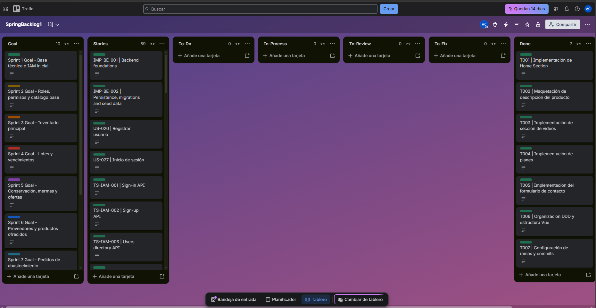
  
<em>Figura: Captura del Product Backlog en la herramienta de gestión del proyecto.</em>

---

# Capítulo IV: Product Design

## 4.1. Styles Guidelines

### 4.1.1. General Style Guidelines
**Branding:** 

El logo pricipal se trata de una representación de capas que representan almacenes y ramificaciones que representan el enlace en el ecosistema digital de proveedores y administradores de minimarkets. Usa colores azules, naranjas y blancos para demostrar seriedad, confianza y dinamismo.

| Logo (Isotipo) | Logotipo / Imagotipo |
| :---: | :---: |
|  |  |
| **Isotipo**: Icono representativo de capas y conexiones para avatares, favicon y accesos directos. | **Logotipo**: Versión principal completa con tipografía para cabeceras, landing page y documentación oficial. |

**Tipografía**

La tipografía elegida para nuestro producto es Arimo, una font de la familia Sans Serif. Esta fuente resalta por ser moderna, legible y usada en contextos de tecnología y modernidad. Se utilizará esta fuente en todos los textos y título para mantener consistencia y armonía visual. 

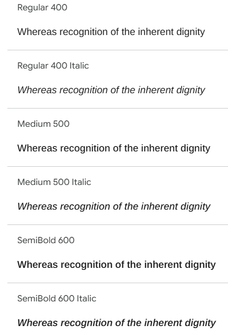

La jerarquía tipografía:

- Títulos principales (H1): Arimo SemiBold, 32 px
- Encabezados de sección (H2): Arimo Medium, 24 px
- Subtítulos (H3): Arimo Medium, 20 px
- Texto de cuerpo: Arimo Regular, 18px
- Botones y elementos interactivos: Arimo Medium, 18 px

**Colores:**

La paleta de colores ha sido seleccionada para demostrar seriedad, confianza y modernidad. Se trata de colores complementarios en la paleta de colores compatibles entre ellos para dar una visión cohesiva y serena. Los colores claros se utilizaran como los colores que ocupan más espacio en la interfaz, y los más oscuros para secciones de importante contraste y botones. 

**Spacing**

## Design Tokens - Spacing

| Token          | Uso                                          | Desktop | Mobile |
|----------------|-----------------------------------------------|---------|--------|
| spacing-xs     | Separación entre encabezados y párrafos       | 16px    | 8px    |
| spacing-sm     | Separación vertical de elementos              | 12px    | 12px*  |
| spacing-sm     | Separación horizontal de elementos            | 16px    | 8px    |
| spacing-md     | Padding de botones (vertical)                 | 12px    | 12px   |
| spacing-md     | Separación entre párrafos o bloques de texto  | 24px    | 16px   |
| spacing-lg     | Padding de tarjetas y contenedores             | 24px    | 16px   |
| spacing-lg     | Separación entre títulos principales y contenido | 24px | 16px   |
| spacing-lg     | Padding de botones (horizontal)               | 24px    | 20px   |
| spacing-xl     | Margen lateral principal de la interfaz       | 40px    | 16px   |

**Tono de comunicación**

El tono de comunicación de MarketGo debe ser sencillo y directo. Los usuarios la utilizan para acciones puntuales, por lo cual la información debe ser presentada con la mayor claridad posible, evitando confusiones de lenguaje o de entendimiento y el usuario pueda completar la acción lo más rápido posible. 

**Lenguage aplicado**

El lenguaje que se aplicará es el lenguaje común de nuestros usuarios en su entorno cotidiano y laboral. Tanto para los usuarios Administradores como los usuarios Proveedores, el lenguaje combina instrucciones directas y claras, e información técnica brindada por el sistema necesaria para toma de decisiones del usuario. 

### 4.1.2. Web Style Guidelines 

En esta sección se detallan las decisiones de diseño que conforman la identidad visual de MarketGo. Estos estándares garantizan una interfaz coherente, profesional y adaptable (responsive), facilitando tanto el desarrollo de software como la experiencia del usuario final.

## a. Paleta de colores
 
La paleta actual está compuesta por seis colores, organizados en dos familias:
 
**Azules (color principal de marca)**

- `#0d8cfb` — Azul primario. Es el tono más vibrante de la paleta y el que aparece en el logo como color dominante. Debe usarse para elementos interactivos principales: botones de acción primaria, enlaces activos, íconos seleccionados.
- `#023192` — Azul secundario, más oscuro. Adecuado para textos sobre fondos claros que requieran énfasis, encabezados de sección, o estados "hover" del azul primario.
- `#021c45` — Azul oscuro/marino. El más oscuro de la paleta, apto para textos de alto contraste, fondos de barra lateral (sidebar) o elementos de navegación que buscan distinguirse del contenido principal.

**Acento y neutros**
- `#fc6910` — Naranja. Es el color de acento que aparece como el punto de conexión en el logo. Debe reservarse para llamadas de atención puntuales: alertas, notificaciones, badges de estado urgente (por ejemplo, productos próximos a vencer), o el botón de acción secundaria más importante de una pantalla.
- `#eff3fa` — Azul muy claro, casi blanco. Funciona como color de fondo general de la interfaz o de tarjetas y contenedores, dado su bajo contraste.
- `#fbdc91` — Amarillo/durazno claro. Color de soporte, útil para estados de advertencia intermedios (ni urgente como el naranja, ni neutro), o como acento decorativo en ilustraciones y estados vacíos.

**Recomendación de uso jerárquico:**
1. Azul primario (`#0d8cfb`) → acciones principales
2. Naranja (`#fc6910`) → alertas y urgencia
3. Azules oscuros (`#023192`, `#021c45`) → texto y navegación
4. Claros (`#eff3fa`, `#fbdc91`) → fondos y estados secundarios
Dado que el sistema maneja alertas de vencimiento y conservación (temperatura/humedad fuera de rango), se recomienda definir explícitamente un color adicional de error/riesgo (rojo) que no está presente en la paleta actual, ya que el naranja por sí solo puede no ser suficiente para diferenciar "advertencia" de "crítico".

## b. Tipografía
 
La tipografía definida es Arimo, una fuente sans-serif de la familia de fuentes web abiertas (métricamente compatible con Arial), lo que garantiza buena legibilidad en pantalla y renderizado consistente entre distintos sistemas operativos y navegadores.
 
Al no haberse especificado pesos ni escala tipográfica en el material original, se sugiere una escala base para mantener consistencia en toda la aplicación:
 
- Títulos principales: Arimo Bold, 24–28px
- Subtítulos / encabezados de sección: Arimo Semibold o Bold, 18–20px
- Cuerpo de texto: Arimo Regular, 14–16px
- Texto secundario / metadatos (fechas, etiquetas): Arimo Regular, 12–13px
- Botones: Arimo Medium o Semibold, 14px
Esta escala es consistente con los espaciados de 40/24/16/12px ya definidos para el sistema, manteniendo proporciones armónicas entre texto y espacio en blanco.

## c. Botones y elementos de interfaz
 
Este punto no está cubierto explícitamente en el material de referencia, por lo que se documentan aquí lineamientos propuestos, derivados de la paleta y la tipografía ya definidas, para mantener coherencia visual:
 
**Botones**

- Botón primario: fondo `#0d8cfb`, texto blanco, esquinas redondeadas (radio sugerido 6–8px)
- Botón secundario: fondo `#eff3fa` o transparente con borde `#023192`, texto `#023192`
- Botón de alerta/peligro: fondo en tono rojo (a definir, ver nota en sección de colores), reservado para acciones destructivas como rechazar un pedido
- Botón deshabilitado: opacidad reducida (40–50%) sobre el color base, sin cambiar de tono

**Elementos de formulario**
- Campos de texto con borde `#eff3fa` o gris neutro en estado normal, y borde en color de error al fallar una validación
- Estados de foco con borde en azul primario (`#0d8cfb`)

**Tarjetas y contenedores**
- Fondo blanco o `#eff3fa`, con bordes sutiles y sombra ligera para diferenciarse del fondo general de la aplicación
- Padding interno siguiendo el estándar de espaciado ya definido para el proyecto (24px en desktop, 16px en mobile)

**Badges de estado**
- Aprovechar la paleta para diferenciar estados: naranja para "pendiente/atención", azul para "informativo", y el color de error propuesto para "riesgo/rechazado".

## d. Iconografía

**1. Librería base**
 
Tabler Icons (estilo outline/línea), por tres razones:
- Es de licencia libre (MIT), por lo que se puede usar sin restricciones en un proyecto académico o comercial
- Tiene una cobertura muy amplia (más de 4,000 íconos), suficiente para cubrir todos los módulos sin tener que mezclar librerías
- Su estilo de línea con grosor uniforme es compatible con el trazo simple que ya se ve en los íconos existentes del style guide (termómetro, papelera, lupa).

**2. Mapa de íconos por módulo**
 
| Módulo | Ícono | Función |
|---|---|---|
| **Global / navegación** | Casa u ojo de panel | Dashboard general |
| | Caja/paquete | Inventario |
| | Etiqueta o código de barras | Gestión de lotes |
| | Termómetro con copo de nieve *(ya existe)* | Conservación |
| | Camión de reparto | Abastecimiento |
| | Apretón de manos o tienda | Proveedores y productos |
| | Persona/usuario *(ya existe)* | Usuarios y seguridad |
| | Gráfico de barras | Análisis |
| **Acciones comunes** | Lupa *(ya existe)* | Buscar |
| | Embudo | Filtrar |
| | Signo + *(ya existe)* | Registrar / crear |
| | Lápiz | Editar |
| | Papelera *(ya existe)* | Eliminar |
| | Ojo | Ver detalle |
| **Alertas y estado** | Campana | Notificaciones generales |
| | Triángulo de alerta | Alerta de vencimiento o conservación |
| | Check dentro de círculo | Confirmación / aceptar |
| | X dentro de círculo | Rechazar / cancelar |
| | Reloj | Pendiente / tiempo transcurrido |
| **Conservación específico** | Gota de agua | Humedad |
| | Termómetro solo | Temperatura (sin el copo, para diferenciarlo del ícono de "congelado") |
| | Enchufe tachado | Sensor desconectado / sin datos |
| **Abastecimiento y proveedores** | Documento con líneas | Pedido / orden |
| | Historial / reloj con flecha circular | Historial de abastecimiento |
| | Insignia con check | Certificación orgánica |
| **Merma y donación** | Caja tachada o cesto | Registrar merma |
| | Corazón o mano ofreciendo | Registrar donación |

 
| Propiedad | Valor |
|---|---|
| Estilo | Outline (línea), no relleno sólido |
| Grosor de trazo | 1.5–2px, constante en todos los íconos |
| Tamaño base | 24×24px |
| Tamaños adicionales | 16×16 (texto en línea, badges), 20×20 (botones compactos, sidebar), 32×32 (estados vacíos, encabezados destacados) |
| Área de seguridad | 2px de margen interno dentro del área de 24×24, para que el trazo no toque el borde del frame |
| Esquinas | Redondeadas (consistente con el radio de 6–8px ya propuesto para botones) |

## e. Rejilla y adaptabilidad
 
Este punto no está documentado en el material de referencia. Se recomienda basarlo en el estándar de espaciado ya definido previamente para el proyecto, extendiéndolo a una rejilla formal:
 
**Desktop**

- Sistema de rejilla de 12 columnas, con márgenes laterales de 40px (consistente con el margen lateral principal ya definido)
- Gutter entre columnas de 16–24px, alineado con la separación horizontal de elementos ya establecida
- Ancho máximo de contenido recomendado: 1280–1440px, con centrado en pantallas más anchas.

**Mobile**

- Rejilla de 4 columnas, con márgenes laterales de 16px (consistente con el margen ya definido para esta versión)
- Gutter reducido a 8px entre columnas
- Los componentes de múltiples columnas en desktop (por ejemplo, tarjetas de resumen o catálogo en grid) deben colapsar a 1 o 2 columnas en mobile

**Puntos de quiebre (breakpoints) sugeridos**

- Mobile: hasta 599px
- Tablet: 600px–1023px
- Desktop: 1024px en adelante

**Adaptabilidad de componentes clave**

- El sidebar de navegación (ya definido en los wireframes del proyecto) debe colapsar a un menú tipo drawer o barra inferior en mobile, dado el espacio lateral limitado
- Las tablas con múltiples columnas (inventario, lotes, pedidos) deben priorizar las columnas más relevantes en mobile y mover el resto a una vista de detalle o acordeón, en vez de forzar scroll horizontal
- Las vistas tipo Kanban (pedidos) deben pasar de columnas lado a lado en desktop a un scroll horizontal por estado, o a una lista con filtro de estado, en mobile.

## 4.1. Styles Guidelines

Esta sección describe la estructura de la información, estilos y sistemas que se utilizarán en la plataforma web de MarketGo. Se consideran los sistemas de organización, etiquetado, búsqueda, navegación y SEO, con el fin de garantizar una experiencia clara y enfocada en la visualización de datos de inventario, lotes, conservación y abastecimiento para minimarkets de productos orgánicos.

### 4.2.1 Organization Systems

**Sistemas de Organización visual de contenido**

**1. Organización Jerárquica (Visual Hierarchy)**

MarketGo organiza su contenido en tres niveles de jerarquía visual, consistentes con la estructura de navegación ya definida para la plataforma:
 
- **Nivel 1 — Categorías de módulo:** agrupan las 7 áreas funcionales del sistema en 4 secciones de mayor nivel según frecuencia de uso: *Operación* (Inventario, Gestión de Lotes, Conservación), *Abastecimiento* (Pedidos, Proveedores y productos), *Análisis* (Dashboard general) y *Administración* (Usuarios y seguridad).
- **Nivel 2 — Pantallas dentro de cada módulo:** por ejemplo, dentro de Inventario existen la vista de listado completo y el detalle de producto; dentro de Lotes, la lista de lotes y el formulario de registro.
- **Nivel 3 — Componentes de detalle:** tarjetas de resumen, tablas de datos, paneles de alertas y modales de acción (registrar, aceptar, rechazar).

**2. Organización Secuencial (Step by Step)**

Se aplica una organización secuencial principalmente en los flujos que representan un proceso con pasos obligatorios y dependientes entre sí.
 
- **Registro de lote:** selección de producto → cantidad y unidad → fechas de ingreso/vencimiento → proveedor → confirmación.
- **Creación de pedido de abastecimiento (rol proveedor):** selección de minimarket destino → selección de productos del catálogo propio → cantidades → confirmación (genera ID único y estado "Pendiente").
- **Rechazo de un pedido (rol administrador):** selección de la acción "Rechazar" → registro obligatorio del motivo → confirmación (no se permite omitir el paso del motivo).
- **Registro de merma:** selección de producto en inventario → cantidad y motivo → validación contra el stock disponible → confirmación.
Estos flujos secuenciales se presentan como formularios de un solo paso con validación en línea (no wizards de múltiples pantallas), dado que la cantidad de campos por flujo es reducida.

**3. Organización Matricial**

Haremos uso de la organización matricial cuando el usuario necesite cruzar dos o más dimensiones de información para tomar una decisión, principalmente en las vistas de estado:
 
- **Pedidos de abastecimiento:** Organizados matricialmente por *estado* (Pendiente / Aceptado / Rechazado) en columnas tipo Kanban, permitiendo comparar volumen y urgencia entre estados de un vistazo.
- **Conservación:** Las zonas de almacenamiento se cruzan con sus condiciones (temperatura, humedad) y su estado (Normal / Riesgoso / Sin datos), mostrando una matriz de tarjetas por zona.
- **Catálogo de proveedores (vista administrador):** Cruce entre producto y proveedor, filtrable por categoría, permitiendo comparar la misma categoría de producto entre distintos proveedores.

**Esquemas de categorización de contenido**

El contenido de MarketGo se categoriza bajo tres esquemas complementarios:
 
- **Por función del módulo:** Operación, Abastecimiento, Análisis, Administración.
- **Por estado del dato:** aplicado transversalmente a productos (Vigente / Próximo a vencer / Vencido), pedidos (Pendiente / Aceptado / Rechazado) y condiciones de conservación (Normal / Riesgoso / Sin datos). Este esquema es el que más se refuerza con color, siguiendo la paleta de la marca.
- **Por rol de usuario:** administrador de minimarket, proveedor y (a nivel de plataforma) usuario con permisos administrativos sobre cuentas. El contenido visible y las acciones disponibles cambian según este esquema, no la estructura general de la información.

### 4.2.2. Labeling Systems
 
 En esta sección se detalla el sistema de etiquetado, diseñado para ofrecer una experiencia de usuario intuitiva mediante términos breves y reconocibles. Estas etiquetas permiten que tanto los visitantes como los usuarios finales comprendan las funciones del software sin ambigüedades.

 **Etiquetas de Navegación (Sidebar & Menu Labels)**

 | Grupo | Etiquetas |
|---|---|
| Operación | Inventario · Gestión de Lotes · Conservación |
| Abastecimiento | Pedidos · Proveedores y productos |
| Análisis | Dashboard general |
| Administración | Usuarios y seguridad |
 
Reglas: sustantivos cortos (1–2 palabras), sin verbos, consistentes con lo ya validado en los wireframes de sidebar. Se evita duplicar la palabra "Gestión" en todas las etiquetas para no saturar el menú (por eso "Inventario" y "Conservación" van sin ese prefijo, mientras "Gestión de Lotes" lo conserva por claridad frente a "Lotes" solo, que podría confundirse con lotes de compra).

**Etiquetas de Acción y Control (Command Labels)**

- Botones primarios: "Registrar lote", "Registrar producto", "Aceptar pedido", "Confirmar rechazo", "Guardar lote"
- Botones secundarios/cancelación: "Cancelar", "Rechazar"
- Acciones en línea (íconos con tooltip): "Ver detalle", "Editar", "Eliminar", "Registrar merma", "Registrar donación"
- Acciones de filtrado y búsqueda: "Buscar producto o código de lote", "Filtrar por estado"

**Etiquetas de Estado y Datos (Informational Labels)**

Etiquetas cortas, en badges de color, siguiendo el esquema de categorización por estado ya definido:
 
- Vencimiento: "Vigente", "Próximo a vencer", "Vencido" (o el conteo de días, ej. "Vence en 2 días")
- Pedidos: "Pendiente", "Aceptado", "Rechazado"
- Conservación: "Normal", "Riesgoso", "Sin registros disponibles"
- Metadatos: "hace 3 días", "hace 4 horas" (tiempos relativos en vez de timestamps completos, para lectura más rápida)

**Etiquetas de Formulario (Field Labels)**

Etiquetas descriptivas ubicadas sobre el campo (no placeholders como único label, para mantener accesibilidad):
 
- "Producto", "Cantidad", "Unidad", "Fecha de ingreso", "Fecha de vencimiento", "Proveedor", "Motivo del rechazo", "Minimarket destino"
- Campos obligatorios marcados con asterisco (`*`) en color de error, consistente con el modal de rechazo ya diseñado
- Mensajes de validación en primera persona desde el sistema, en tono directo: "Este campo es obligatorio para continuar", "La cantidad supera el stock disponible"

### 4.2.3. SEO Tags and Meta Tags

***Landing Page (Sitio Web Estático)**

El objetivo de estas etiquetas es el posicionamiento orgánico para atraer a dueños de negocios o analistas interesados en la solución.
 
- `<title>`: "MarketGo — Gestión de inventario para minimarkets orgánicos"
- `<meta name="description">`: descripción orientada a beneficios de negocio (control de vencimientos, trazabilidad de proveedores, reducción de mermas), con palabras clave como "inventario orgánico", "gestión de minimarket", "control de vencimientos"
- Encabezados `<h1>`–`<h3>` estructurados jerárquicamente reflejando los beneficios del producto (uno por sección de la landing: control de inventario, alertas de conservación, gestión de proveedores)
- URLs amigables y descriptivas (ej. `/funcionalidades`, `/precios`, `/contacto`) en vez de rutas genéricas.

**Web Application (Plataforma de Usuario)**

Aquí las etiquetas están orientadas a la funcionalidad y seguridad, evitando que motores de búsqueda indexen información privada de los usuarios, pero manteniendo la identidad de la marca.
 
- `<meta name="robots" content="noindex, nofollow">` en todas las rutas internas de la aplicación (dashboard, inventario, lotes, pedidos), para evitar que datos de inventario o proveedores de un minimarket específico aparezcan en buscadores.
- `<title>` dinámico pero genérico por pantalla, sin datos sensibles: "MarketGo — Inventario", "MarketGo — Pedidos" (nunca el nombre del minimarket o de un producto específico en el título de la pestaña).
- Favicon e ícono de marca mantenidos en todas las rutas para reforzar identidad visual, incluso sin indexación.

### 4.2.4. Searching Systems

**Mecanismos de búsqueda**

MarketGo utiliza búsqueda por texto libre combinada con filtros estructurados, disponible en los módulos de Inventario, Lotes, Pedidos y Catálogo de proveedores. La búsqueda es del tipo "buscar mientras se escribe" (incremental), sin necesidad de confirmar con Enter, dado que los catálogos manejados no son de gran volumen.
 
#### Búsqueda filtrada (específica)

Las opciones de filtrado (varían según el módulo, pero siguen el mismo patrón de ubicación — barra superior a la tabla o grid):
 
- Inventario: categoría, condición de conservación, proveedor, rango de stock
- Gestión de Lotes: estado de vencimiento (chips rápidos "Todos" / "Por vencer" / "Vencidos"), rango de fechas
- Pedidos: estado (Pendiente/Aceptado/Rechazado), fecha, minimarket (para el rol proveedor, que abastece a varios)
- Catálogo de proveedores: proveedor específico, categoría de producto.

#### Visualización de Resultados
 
- Resultados en tabla (Inventario, Lotes) cuando el usuario necesita comparar muchos registros con múltiples atributos, o en tarjetas/grid (Catálogo de proveedores, Pedidos en vista Kanban) cuando el contenido se explora más que se audita.
- Estado vacío consistente en toda la plataforma cuando la búsqueda o el filtro no arroja resultados: mensaje informativo breve (ej. "No se encontraron productos con estos filtros"), sin ilustraciones que distraigan, siguiendo el patrón ya usado para conservación sin datos
- Contador de resultados visible ("Mostrando 4 de 86 lotes") para dar contexto de escala, especialmente en tablas paginadas.

### 4.2.5. Navigation Systems

#### Navigation strategies

MarketGo combina dos estrategias de navegación según el tipo de sitio:
 
- **Navegación jerárquica con acceso directo (Landing):** estructura simple de una sola página con scroll y anclas, complementada por un menú superior fijo
- **Navegación estructural persistente (Web Application):** sidebar fijo que actúa como mapa completo de la aplicación, con la sección activa siempre resaltada, complementado por accesos rápidos contextuales (badges de alerta, botones de acción directa) que no reemplazan al sidebar sino que aceleran tareas frecuentes.

#### Landing Page Navigation

- Menú superior con anclas a las secciones de la propia landing: Descripción del producto, Videos, Planes, Contacto
- Sección "Videos": agrupa contenido audiovisual de dos tipos — videos institucionales sobre el equipo (presentación, misión, quiénes están detrás de MarketGo) y videos demostrativos del producto (recorrido funcional por los módulos: inventario, lotes, conservación, abastecimiento). Se recomienda separarlos en dos sub-bloques dentro de la misma sección ("Conoce al equipo" / "Cómo funciona MarketGo") en vez de mezclarlos en un solo carrusel, para que el visitante identifique rápido cuál quiere ver primero
- Llamado a la acción (CTA) persistente ("Solicitar demo" o "Iniciar sesión") visible en todo momento en la esquina superior derecha
- Sin navegación lateral ni jerarquía profunda — es una navegación plana con scroll continuo entre Descripción del producto → Videos → Planes → Contacto, ya que el objetivo es informar y convertir, no gestionar datos

#### Web Application Navigation 

- **Sidebar como navegación primaria**, con los 4 grupos ya definidos (Operación, Abastecimiento, Análisis, Administración) y sus etiquetas correspondientes.
- **Ítem activo resaltado** mediante fondo o borde en azul primario, para reforzar la ubicación actual dentro del sistema (relevante para la fase de "Seguimiento y control" del mapa de empatía del usuario).
- **Navegación dinámica por rol:** el sidebar no muestra los mismos ítems a todos los usuarios — un proveedor no ve "Usuarios y seguridad" ni el catálogo interno de conservación de un minimarket, mientras que un administrador ve el set completo según sus permisos
- **Navegación secundaria contextual:** tabs dentro de una sección (ej. "Pendientes" / "Historial" dentro de Pedidos) para separar sub-vistas sin salir del módulo principal.
- **Accesos directos cruzados:** por ejemplo, al aceptar un pedido, un botón "Ver inventario actualizado" lleva directamente al módulo de Inventario, rompiendo la navegación estrictamente jerárquica cuando el flujo de trabajo lo justifica.

## 4.3. Landing Page UI Design

### 4.3.1. Landing Page Wireframe

En esta sección se presenta el desarrollo de los primeros wireframes como primer paso para la producción de interfaz visual de la solución, realizados en la plataforma *Figma*.

<strong>Figura 1</strong> 
  <em>Wireframe de Landing Page sección Home</em> 
  <small><em>Nota.</em> Elaboración propia.</small>
    
  

<strong>Figura 2</strong> 
  <em>Wireframe de Landing Page sección Información</em> 
  <small><em>Nota.</em> Elaboración propia.</small>
    
  

<strong>Figura 3</strong> 
  <em>Wireframe de Landing Page sección Videos</em> 
  <small><em>Nota.</em> Elaboración propia.</small>
    
  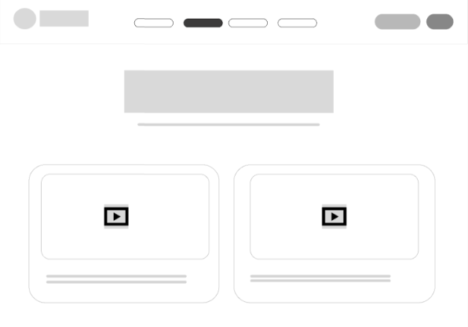

<strong>Figura 4</strong> 
  <em>Wireframe de Landing Page sección Planes</em> 
  <small><em>Nota.</em> Elaboración propia.</small>
    
  

<strong>Figura 5</strong> 
  <em>Wireframe de Landing Page sección Contacto</em> 
  <small><em>Nota.</em> Elaboración propia.</small>
    
  

### 4.3.2 Landing Page Mock Up

<strong>Figura 1</strong> 
  <em>Mock up de Landing Page sección Home</em> 
  <small><em>Nota.</em> Elaboración propia.</small>
    
  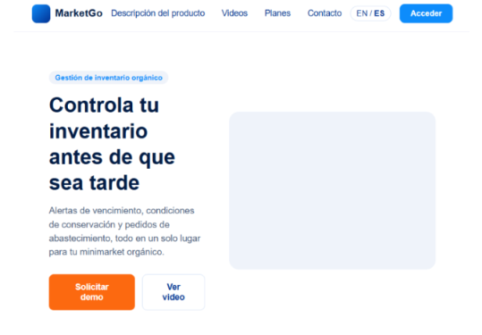

<strong>Figura 2</strong> 
  <em>Mock up de Landing Page sección Información del producto</em> 
  <small><em>Nota.</em> Elaboración propia.</small>
    
  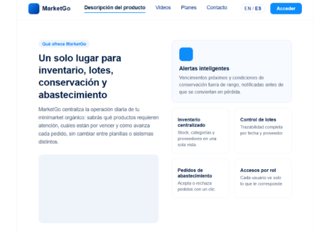

<strong>Figura 3</strong> 
  <em>Mock up de Landing Page sección Videos</em> 
  <small><em>Nota.</em> Elaboración propia.</small>
    
  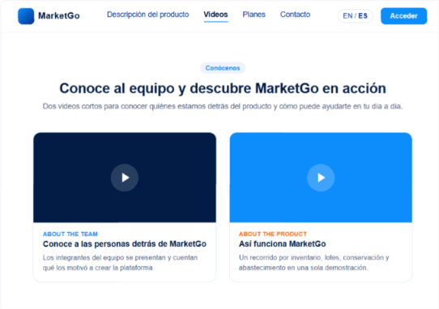

<strong>Figura 4</strong> 
  <em>Mock up de Landing Page sección Planes</em> 
  <small><em>Nota.</em> Elaboración propia.</small>
    
  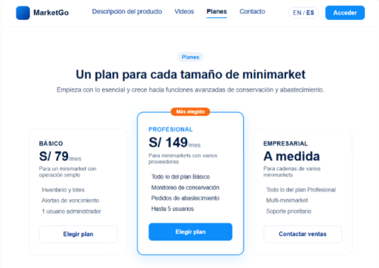

<strong>Figura 5</strong> 
  <em>Mock up de Landing Page sección Contacto</em> 
  <small><em>Nota.</em> Elaboración propia.</small>
    
  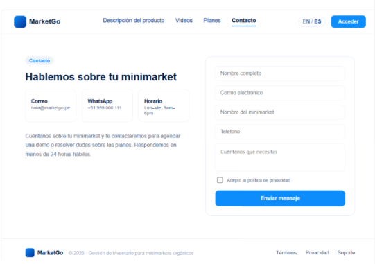

## 4.4. Web Applications UX/UI Design

### 4.4.1. Web Applications Wireframes

<strong>Figura 6</strong> 
  <em>Wireframe Web Application sección Dashboard</em> 
  <small><em>Nota.</em> Elaboración propia.</small>
    
  

<strong>Figura 7</strong> 
  <em>Wireframe Web Application sección Inventario</em> 
  <small><em>Nota.</em> Elaboración propia.</small>
    
  

<strong>Figura 8</strong> 
  <em>Wireframe Web Application sección Gestión de lotes</em> 
  <small><em>Nota.</em> Elaboración propia.</small>
    
  

<strong>Figura 9</strong> 
  <em>Wireframe Web Application sección Conservación</em> 
  <small><em>Nota.</em> Elaboración propia.</small>
    
  

<strong>Figura 10</strong> 
  <em>Wireframe Web Application sección Órdenes de envío</em> 
  <small><em>Nota.</em> Elaboración propia.</small>
    
  

<strong>Figura 11</strong> 
  <em>Wireframe Web Application sección Proveedores y Productos</em> 
  <small><em>Nota.</em> Elaboración propia.</small>
    
  

### 4.4.2. Web Applications Wireflow Diagrams

| Rol: Administrador / Alta y control de inventario |
| :---: |
| 

 |

| Rol: Administrador / Trazabilidad por lote |
| :---: |
| 

 |

| Rol: Administrador / Monitoreo de conservación |
| :---: |
| 

 |

| Rol: Administrador / Registro de pérdidas |
| :---: |
| 

 |

| Rol: Administrador / Solicitud de abastecimiento |
| :---: |
| 

 |

| Rol: Administrador / Recepción de mercadería |
| :---: |
| 

 |

| Rol: Administrador / Gestión de usuarios y permisos |
| :---: |
| 

 |

| Rol: Proveedor / Gestión de oferta propia |
| :---: |
| 

 |

| Rol: Proveedor / Gestión de usuarios y permisos |
| :---: |
| 

 |

| Rol: Proveedor / Gestión de usuarios y permisos |
| :---: |
| 

 |

### 4.4.3. Web Applications Mockups

<strong>Figura 12</strong> 
  <em>Mockup Web Application sección Dashboard</em> 
  <small><em>Nota.</em> Elaboración propia.</small>
    
  

<strong>Figura 13</strong> 
  <em>Mockup Web Application sección Inventario</em> 
  <small><em>Nota.</em> Elaboración propia.</small>
    
  

<strong>Figura 14</strong> 
  <em>Mockup Web Application sección Gestión de lotes</em> 
  <small><em>Nota.</em> Elaboración propia.</small>
    
  

<strong>Figura 15</strong> 
  <em>Mockup Web Application sección Conservación</em> 
  <small><em>Nota.</em> Elaboración propia.</small>
    
  

<strong>Figura 16</strong> 
  <em>Mockup Web Application sección Órdenes de envío</em> 
  <small><em>Nota.</em> Elaboración propia.</small>
    
  

<strong>Figura 17</strong> 
  <em>Mockup Web Application sección Proveedores y Productos</em> 
  <small><em>Nota.</em> Elaboración propia.</small>
    
  

### 4.4.3. Web Applications User Flow Diagrams

| Rol: Administrador / Alta y control de inventario |
| :---: |
| 

 |

| Rol: Administrador / Gestion de Lotes |
| :---: |
| 

 |

| Rol: Administrador / Gestión de pedidos |
| :---: |
| 

 |

| Rol: Administrador / Gestion de Envíos |
| :---: |
| 

 |

## 4.5. Web Applications Prototyping
[Web Application Protoyping link](https://www.figma.com/design/HPzyjpUMoorZ8JsJUYhdqk/MarketGo-Platform?t=HFQ6xMlDHy9YW7Vq-0)

## 4.6. Domain-Driven Software Architecture

La arquitectura de software de MarketGo se construye a partir del análisis del dominio de gestión de productos orgánicos, inventario, conservación, abastecimiento y control operativo para minimarkets y proveedores. A partir de este análisis se aplican los principios de Domain-Driven Design (DDD), permitiendo dividir la solución en bounded contexts coherentes con las responsabilidades principales del negocio.

En las siguientes secciones se presenta cada nivel del modelo arquitectónico, explicando la estructura, responsabilidades y comunicación entre los elementos que conforman la arquitectura de MarketGo.

### 4.6.1. Design-Level Event Storming

Para identificar los eventos de dominio y la lógica de negocio de MarketGo, se realizó un proceso de Event Storming orientado a comprender los flujos principales de la plataforma: registro de productos, control de inventario, monitoreo de conservación, solicitudes de abastecimiento, gestión de proveedores, alertas y análisis operativo.

El desarrollo del proceso de Domain-Driven Design se realizó en LucidChart: [https://lucid.app/lucidspark/d7f4679c-eca6-4e34-a638-733027262712/edit?viewport_loc=-8761%2C-2894%2C1920%2C1532%2C0_0&invitationId=inv_ffb713f0-52eb-4b51-9e5e-1d11e4d93b05](https://lucid.app/lucidspark/d7f4679c-eca6-4e34-a638-733027262712/edit?viewport_loc=-8761%2C-2894%2C1920%2C1532%2C0_0&invitationId=inv_ffb713f0-52eb-4b51-9e5e-1d11e4d93b05)

A continuación, se presenta la leyenda utilizada durante el proceso de Event Storming:

El siguiente diagrama presenta el Event Storming general de MarketGo y permite visualizar los principales eventos, comandos, actores y procesos identificados en el dominio:

A partir de este análisis se identificaron los siguientes bounded contexts:

1. **IAM**

   El bounded context IAM se encarga de la autenticación, autorización y control de acceso dentro de MarketGo. Gestiona usuarios, roles y permisos, asegurando que cada actor, como el administrador de minimarket o el proveedor, acceda únicamente a las funcionalidades correspondientes a su perfil.

   

2. **Profiles**

   El bounded context Profiles administra la información de los usuarios, minimarkets y proveedores registrados en la plataforma. Su propósito es centralizar los datos de perfil necesarios para personalizar la experiencia, controlar responsabilidades y asociar operaciones con el actor correspondiente.

   

3. **Dashboard**

   El bounded context Dashboard presenta una vista general del estado operativo de la plataforma según el rol del usuario. Permite visualizar indicadores relevantes sobre inventario, abastecimiento, conservación, alertas y actividad reciente.

   

4. **Analytics**

   El bounded context Analytics procesa información operativa para generar indicadores, métricas y resúmenes que apoyan la toma de decisiones. Permite analizar el estado del inventario, productos próximos a vencer, alertas de conservación, desempeño de proveedores y movimientos de abastecimiento.

5. **Inventory**

   El bounded context Inventory gestiona los productos registrados en el minimarket, sus cantidades, lotes, fechas de vencimiento, estados y movimientos asociados. Su propósito es mantener trazabilidad sobre las existencias y facilitar el control de productos disponibles, en riesgo o con pérdidas.

   

6. **Products**

   El bounded context Products administra el catálogo de productos orgánicos ofrecidos por proveedores o registrados por minimarkets. Centraliza información como nombre, categoría, descripción, unidad de medida, disponibilidad y datos relevantes para su comercialización o abastecimiento.

   

7. **Requisition**

   El bounded context Requisition gestiona las solicitudes de abastecimiento generadas por los minimarkets hacia los proveedores. Permite registrar productos solicitados, cantidades, estado de la solicitud y trazabilidad del proceso de aceptación o rechazo.

   

8. **Procurements**

   El bounded context Procurements administra las órdenes de envío asociadas a solicitudes de abastecimiento aceptadas. Su responsabilidad es permitir al proveedor registrar los productos y cantidades que serán enviados, mientras que el administrador del minimarket puede revisar, aceptar o rechazar la recepción. Cuando una orden de envío es aceptada, los productos recibidos pueden incorporarse al inventario correspondiente.

   

9. **Suppliers**

   El bounded context Suppliers gestiona el directorio de proveedores de productos orgánicos, así como los productos que ofrecen y su participación dentro de los procesos de abastecimiento.

   

10. **Conservation**

    El bounded context Conservation permite monitorear condiciones de conservación de productos, como temperatura y humedad. Su propósito es identificar riesgos de deterioro y generar alertas cuando las condiciones se encuentren fuera de los rangos aceptables.

    

11. **Communication**

    El bounded context Communication gestiona las alertas y notificaciones generadas por la plataforma. Incluye avisos sobre productos próximos a vencer, condiciones de conservación riesgosas, solicitudes pendientes, órdenes de envío y eventos relevantes para los usuarios.

    

12. **Shared Kernel**

    El bounded context Shared Kernel contiene elementos comunes utilizados por los demás contextos, como utilidades compartidas, contratos base, configuraciones, validaciones comunes y estructuras transversales del sistema.

### 4.6.2. Software Architecture Context Diagram

En este nivel se presenta una vista de alto nivel de la arquitectura, donde el foco está en el sistema MarketGo como una caja negra y en las interacciones que mantiene con sus usuarios y servicios externos.

El context diagram muestra al **MarketGo Software System** como el sistema central, rodeado por los principales actores y sistemas con los que interactúa:

- **Administrador de minimarket**: usuario encargado de registrar productos, controlar inventario, gestionar lotes, revisar fechas de vencimiento, crear solicitudes de abastecimiento y confirmar o rechazar la recepción de órdenes de envío.
- **Proveedor de productos orgánicos**: usuario responsable de registrar productos ofrecidos, revisar solicitudes de abastecimiento, aceptarlas o rechazarlas, y crear órdenes de envío asociadas a solicitudes aceptadas.
- **Administrador del sistema**: usuario encargado de gestionar cuentas, roles, permisos y configuración general de la plataforma.
- **Servicio de notificaciones**: sistema externo utilizado para enviar alertas y comunicaciones relacionadas con vencimientos, conservación, solicitudes y abastecimiento.
- **Servicio de monitoreo de conservación**: fuente externa o módulo de integración encargado de proporcionar información relacionada con temperatura y humedad para evaluar condiciones de conservación.

En el diagrama se representan las relaciones entre estos elementos, destacando que los actores humanos interactúan con MarketGo mediante la aplicación web, mientras que el sistema coordina los procesos internos y las integraciones necesarias para alertas, monitoreo y trazabilidad operativa.

---

### 4.6.3. Software Architecture Container Diagrams

En el nivel de contenedores, la arquitectura de MarketGo se organiza en aplicaciones y fuentes de datos que colaboran para brindar la experiencia completa de la plataforma.

La arquitectura lógica de MarketGo se estructura en los siguientes contenedores:

- **Landing Page**: aplicación web pública orientada a presentar la propuesta de valor de MarketGo, sus beneficios y funcionalidades principales para minimarkets y proveedores de productos orgánicos.
- **Single Page Application (SPA)**: aplicación web principal donde los usuarios interactúan con los módulos de inventario, productos, proveedores, solicitudes de abastecimiento, órdenes de envío, conservación, analítica, dashboard, perfiles, comunicación e IAM.
- **API REST Application**: backend encargado de exponer los servicios de negocio mediante endpoints REST. Centraliza la lógica de aplicación, validaciones, reglas de dominio y coordinación entre bounded contexts.
- **Database**: base de datos donde se persiste la información del sistema, incluyendo usuarios, perfiles, productos, inventario, lotes, solicitudes de abastecimiento, órdenes de envío, proveedores, alertas, métricas y registros de conservación.

En el diagrama se observa que:

- Los usuarios pueden conocer la solución mediante la **Landing Page** y luego acceder a la **SPA**.
- La **SPA** se comunica con la **API REST Application** mediante peticiones HTTP/HTTPS y mensajes JSON.
- La **API REST Application** procesa la lógica del dominio y persiste la información en la **Database**.
- Los módulos de comunicación y conservación pueden integrarse con servicios externos para notificaciones y monitoreo de condiciones ambientales.

---

### 4.6.4. Software Architecture Components Diagrams

En el nivel de componentes se detalla la descomposición interna de la arquitectura de MarketGo, especialmente del contenedor **API REST Application**, donde se agrupan los componentes principales alineados con los bounded contexts del dominio.

La API REST organiza sus responsabilidades en componentes especializados:

- **IAM Component**: gestiona autenticación, autorización, usuarios, roles y permisos.
- **Profiles Component**: administra perfiles de usuarios, minimarkets y proveedores.
- **Dashboard Component**: consolida información relevante para mostrar vistas generales según el rol del usuario.
- **Analytics Component**: procesa indicadores, métricas y reportes operativos.
- **Inventory Component**: gestiona inventario, lotes, cantidades, vencimientos, pérdidas y ofertas.
- **Products Component**: administra el catálogo de productos orgánicos registrados u ofrecidos.
- **Requisition Component**: gestiona solicitudes de abastecimiento entre minimarkets y proveedores.
- **Procurements Component**: administra órdenes de envío, aceptación, rechazo y recepción de productos.
- **Suppliers Component**: gestiona proveedores y sus productos ofrecidos.
- **Conservation Component**: monitorea condiciones de conservación y detecta riesgos.
- **Communication Component**: administra alertas y notificaciones del sistema.
- **Shared Kernel Component**: agrupa elementos transversales reutilizados por los demás componentes.

#### IAM Component Diagram

#### Profiles Component Diagram

#### Dashboard Component Diagram

#### Analytics Component Diagram

#### Inventory Component Diagram

#### Products Component Diagram

#### Procurements Component Diagram

#### Suppliers Component Diagram

#### Conservation Component Diagram

#### Communication Component Diagram

#### Shared Kernel Component Diagram

De esta forma, los component diagrams complementan la visión general de la arquitectura, mostrando cómo MarketGo organiza sus responsabilidades internas en componentes coherentes con el dominio y cómo estos colaboran para implementar la gestión de productos orgánicos, inventario, conservación, abastecimiento, proveedores, comunicación y analítica.

## 4.7. Software Object-Oriented Design

En esta sección se presenta el diseño orientado a objetos de MarketGo, representando la estructura de clases principales del sistema y su organización por bounded contexts. Estos diagramas permiten visualizar las responsabilidades de cada clase, sus atributos, métodos y relaciones dentro de la arquitectura de la aplicación.

### 4.7.7. Class Diagrams

Los diagramas de clases muestran la organización interna de los componentes principales de MarketGo, siguiendo una estructura alineada con los bounded contexts definidos previamente. Cada diagrama representa las clases más relevantes dentro de un módulo específico, permitiendo comprender cómo se modelan los conceptos del dominio y cómo se relacionan con la lógica de aplicación.

A continuación, se presentan los diagramas de clases correspondientes a los principales bounded contexts de MarketGo:

#### Communication Class Diagram

#### Procurements Class Diagram

#### Dashboard Class Diagram

#### Conservation Class Diagram

#### Analytics Class Diagram

#### Inventory Class Diagram

#### Products Class Diagram

#### IAM Class Diagram

#### Profiles Class Diagram

#### Suppliers Class Diagram

#### Requisition Class Diagram

Estos diagramas permiten complementar la arquitectura de software, mostrando una vista más detallada del diseño orientado a objetos de MarketGo. A través de ellos se puede identificar cómo se distribuyen las responsabilidades entre las clases y cómo estas representan los principales conceptos de cada bounded context.

---

## 4.8. Database Design

El diseño de base de datos de MarketGo define la estructura de persistencia necesaria para almacenar y gestionar la información principal de la plataforma. Este diseño considera los datos relacionados con usuarios, perfiles, productos, inventario, proveedores, solicitudes de abastecimiento, órdenes de envío, conservación, comunicación, analítica y auditoría.

La base de datos se encuentra organizada de acuerdo con los bounded contexts definidos en la arquitectura del sistema, permitiendo mantener una separación lógica entre las distintas áreas funcionales. Esta organización facilita la trazabilidad de la información, la consistencia de los datos y la evolución del sistema conforme se incorporen nuevas funcionalidades.

### 4.8.1. Database Diagrams

El diagrama de base de datos muestra las entidades principales de MarketGo, sus atributos, claves primarias, claves foráneas y relaciones. Esta vista permite comprender cómo se estructura la persistencia de los datos y cómo se relacionan las entidades que soportan los procesos principales de la plataforma.

---

# Capítulo V: Product Implementation, Validation & Deployment

## 5.1. Software Configuration Management

En esta sección se describen las decisiones, convenciones y principios adoptados por el equipo de **Market-Labs** para garantizar la coherencia, trazabilidad y control de versiones durante el ciclo de vida del desarrollo de la solución **MarketGo**. Se establecen los lineamientos para la configuración del entorno de desarrollo, gestión del código fuente, convenciones de estilo y configuración de despliegue orientada a la nube.

### 5.1.1. Software Development Environment Configuration

Se especifican los productos de software utilizados durante el ciclo de vida del proyecto, organizados por disciplinas técnicas para asegurar la estandarización del entorno entre los desarrolladores de Buildline.

#### Project Management
* **Trello:** Empleado para la organización visual del flujo de trabajo diario y la priorización rápida de tareas durante el desarrollo de los módulos de requisición.
    * **Ruta:** [https://trello.com/invite/b/6aaf23b3497a9f7b08a946ed/ATTIc6df49d5561e92016f5670f633077371DA4CB5DA/marketgo](https://trello.com/invite/b/6aaf23b3497a9f7b08a946ed/ATTIc6df49d5561e92016f5670f633077371DA4CB5DA/marketgo)
 
#### Product UX/UI Design
1.  **Miro:** Pizarra colaborativa fundamental para el Design-Level Event Storming de Buildline, permitiendo identificar los eventos de dominio entre obra y oficina.
2.  **Figma:** Herramienta principal para el diseño de la interfaz móvil (Field App) y la plataforma web de gestión, incluyendo el diseño del sistema de diseño (Design System).
3.  **Structurizr:** Utilizado para el modelado de la arquitectura de software mediante diagramas C4 y diagramas de base de datos relacional.

#### Software Development
1.  **GitHub:** Hosting de repositorios bajo la organización RQLS. Implementación de GitFlow para separar las funcionalidades de inventario, compras y reportes.
2.  **WebStorm:** IDE especializado para el desarrollo del Frontend de Buildline, optimizando la codificación con Vue.js y la gestión de estilos.
3.  **JetBrains Rider:** IDE principal para el desarrollo del Backend robusto basado en .NET/C#, facilitando la integración con servicios de base de datos y lógica de negocio.
4.  **Vue.js Framework:** Framework progresivo de JavaScript elegido para construir la SPA de Buildline por su ligereza y velocidad de carga en condiciones de baja conectividad en obra.
5.  **ASP.NET Core / C# sobre .NET 10:** Tecnología de backend para garantizar la escalabilidad, seguridad transaccional en las Órdenes de Compra y alto rendimiento.

#### Software Testing
* **Lenguaje Gherkin:** Utilizado para definir los criterios de aceptación en formato Given-When-Then, asegurando que las validaciones de "Way Match" y presupuestos funcionen correctamente.

#### Software Documentation
* **Swagger / OpenAPI:** Generación de documentación interactiva para que el equipo de Frontend pueda consumir los servicios de requisiciones y proveedores de forma eficiente.

---
### 5.1.2. Source Code Management

Se establecen los repositorios oficiales de la solución Buildline para garantizar la integridad del código fuente.

#### Repositorios del Proyecto
<table>
  <thead>
    <tr>
      <th>Producto</th>
      <th>URL del Repositorio</th>
    </tr>
  </thead>
  <tbody>
    <tr>
      <td>Organización Market-Labs</td>
      <td><a href="https://github.com/Market-Labs">https://github.com/Market-Labs</a></td>
    </tr>
    <tr>
      <td>Landing Page</td>
      <td><a href="https://github.com/Market-Labs/landign-page">https://github.com/Market-Labs/landign-page</a></td>
    </tr>
    <tr>
      <td>Frontend Web Application</td>
      <td><a href="https://github.com/Market-Labs/front-end">https://github.com/Market-Labs/front-end</a></td>
    </tr>
    <tr>
      <td>Backend Web Services</td>
      <td><a href="https://github.com/Market-Labs/backend.git">https://github.com/Market-Labs/backend.git</a></td>
    </tr>
  </tbody>
</table>

#### GitFlow Workflow and Collaboration Strategy

Para asegurar una colaboración organizada, evitar conflictos en el código y mantener una integración continua clara, el equipo de **MarketLab** aplica **GitFlow** como flujo de trabajo de ramificación para el desarrollo de la landing page de **MarketGo**.

La estrategia de colaboración se define de la siguiente manera:

- **main:** Rama que contiene la versión estable y lista para producción de la landing page. Solo recibe integraciones finales desde `develop` cuando los cambios han sido revisados, probados y aprobados.

- **develop:** Rama principal de integración. En esta rama se unifican las funcionalidades terminadas antes de ser promovidas a `main`.

- **feature/<section>:** Ramas temporales creadas a partir de `develop` para aislar el desarrollo de cada sección o mejora de la landing page.  
  Ejemplos:
  - `feature/home-section`
  - `feature/product-information-section`
  - `feature/video-section`
  - `feature/pricing-section`
  - `feature/contact-section`

- **hotfix/<issue>:** Ramas creadas desde `main` para corregir errores críticos detectados en la versión estable de la landing page.

El flujo de trabajo establece que cada rama `feature` debe integrarse a `develop` mediante **Pull Request (PR)** en GitHub, permitiendo revisión de código antes de aprobar la integración.

Cada commit debe seguir la convención de **Conventional Commits**, permitiendo una trazabilidad clara de los cambios realizados en el proyecto.

Ejemplos:

- `feat(home): implement hero section`
- `feat(contact): complete contact landing section`
- `fix(contact): polish mobile section layout`
- `refactor(landing): align Vue sections with mockups`
- `docs(readme): update GitFlow workflow`

### 5.1.3. Source Code Style Guide & Conventions

En esta sección se establecen las convenciones de estilo y nomenclatura adoptadas para los lenguajes utilizados en el proyecto Buildline: HTML, CSS, JavaScript, TypeScript (Vue.js), C# (.NET 10) y Gherkin. Se aplica nomenclatura en inglés para todos los elementos del código, siguiendo el Ubiquitous Language definido para el dominio logístico de la construcción.

#### Referencias de Guías de Estilo Adoptadas

| Lenguaje/Tecnología | Guía de Estilo |
| :--- | :--- |
| HTML/CSS | [Google HTML/CSS Style Guide](https://google.github.io/styleguide/htmlcssguide.html) |
| JavaScript | [Google JavaScript Style Guide](https://google.github.io/styleguide/jsguide.html) |
| TypeScript / Vue.js | [Vue.js Priority A Guide](https://vuejs.org/style-guide/rules-essential.html) |
| C# / .NET | [Microsoft C# Coding Conventions](https://learn.microsoft.com/en-us/dotnet/csharp/fundamentals/coding-style/coding-conventions) |
| Gherkin | [Gherkin Reference](https://cucumber.io/docs/gherkin/reference/) |

Se utiliza nomenclatura en inglés relacionada con las entidades del dominio de la landing page y la plataforma MarketGo, manteniendo nombres claros, consistentes y alineados al producto.
| Elemento                     | Convención             | Ejemplo                                             |
| :--------------------------- | :--------------------- | :-------------------------------------------------- |
| Componentes Vue              | PascalCase             | `HomeSection.vue`, `PricingSection.vue`             |
| Archivos de estilos CSS      | kebab-case             | `home-section.css`, `pricing-section.css`           |
| Variables / Métodos TS       | camelCase              | `activeSection`, `scrollToSection()`                |
| Constantes                   | SCREAMING_SNAKE_CASE   | `DEFAULT_LOCALE`, `CONTACT_EMAIL`                   |
| Rutas / IDs de secciones     | kebab-case             | `product-information`, `contact-section`            |
| Claves de i18n               | camelCase / dot.case   | `home.title`, `pricing.professionalPlan`            |
| Ramas Git feature            | kebab-case             | `feature/home-section`, `feature/contact-section`   |
| Commits                      | Conventional Commits   | `feat(home): implement hero section`                |

#### Sangría y Formato
* Se aplica una indentación de dos espacios para archivos web (HTML, CSS, TS) y de cuatro espacios para C# (estándar de Rider/Visual Studio).
* Las llaves de apertura en C# se colocan en una nueva línea (Estilo Allman), mientras que en TS/JS van en la misma línea (Estilo K&R).

---
### 5.1.4. Software Deployment Configuration

Se especifica la configuración de despliegue para los entornos de Buildline, garantizando alta disponibilidad para ingenieros en obra.

#### Landing Page - Azure
Despliegue automático del contenido estático mediante la integración con Vercel tras cada merge a la rama `main`.
* **URL:** https://agreeable-meadow-0a900b010.3.azurestaticapps.net/
## 5.2. Landing Page, Services & Applications Implementation

### 5.2.1. Sprint 1

| **Sprint Planning Sprint 1** |  |
|---|---|
| **Sprint Planning Background** |  |
| Date | 05/04/2026 |
| Time | 10:00 p.m. |
| Location | Discord / WhatsApp |
| Prepared By | Albino Florencio Cáceres Pizarro |
| Attendees | Albino Florencio Cáceres Pizarro Matias Daniel Huaranga Romero Winnie Lisbeth Merino Ordinola Andre Sebastian Quispe Almonacid Alexis Calin Torres Huaman |
| **Sprint Goal & User Stories** |  |
| **Sprint 1 Goal** | Our focus is on delivering the first marketing landing page of MarketGo, a product by MarketLab, that clearly communicates the value proposition regarding inventory management, batch tracking, product conservation alerts, and supplier-minimarket coordination.  We believe it delivers a clear, professional first impression for minimarket owners, administrators, and organic product providers, helping them understand how MarketGo centralizes daily inventory operations and improves operational traceability.  This will be confirmed when users can navigate through all core sections of the landing page, including Home, Product Description, Videos, Plans, and Contact, and can seamlessly request more information or contact the MarketLab team. |
| Sprint 1 Velocity | 14 Story Points |

  <strong>Repositorio:</strong>
  <a href="https://github.com/Market-Labs/landign-page">
    https://github.com/Market-Labs/landign-page
  </a>

#### 5.2.1.2. Aspect Leaders and Collaborators

Esta matriz <strong>LACX</strong> identifica los aspectos principales del sprint y asigna responsabilidades de Líder (L) y Colaborador (C) para organizar al equipo de <strong>MarketLab</strong> durante el desarrollo de la landing page de <strong>MarketGo</strong>.

<table border="1" cellpadding="4" cellspacing="0" align="center">
  <thead>
    <tr>
      <th>Team Member</th>
      <th>Aspect: UI/UX & Visual Design</th>
      <th>Aspect: Vue Structure & Components</th>
      <th>Aspect: Content & i18n</th>
      <th>Aspect: GitFlow & Deployment</th>
    </tr>
  </thead>
  <tbody>
    <tr>
      <td>Cáceres Pizarro, Albino Florencio</td>
      <td>L</td>
      <td>C</td>
      <td>C</td>
      <td>L</td>
    </tr>
    <tr>
      <td>Huaranga Romero, Matias Daniel</td>
      <td>C</td>
      <td>L</td>
      <td>C</td>
      <td>C</td>
    </tr>
    <tr>
      <td>Merino Ordinola, Winnie Lisbeth</td>
      <td>C</td>
      <td>C</td>
      <td>L</td>
      <td>C</td>
    </tr>
    <tr>
      <td>Quispe Almonacid, Andre Sebastian</td>
      <td>C</td>
      <td>C</td>
      <td>C</td>
      <td>C</td>
    </tr>
    <tr>
      <td>Torres Huaman, Alexis Calin</td>
      <td>C</td>
      <td>C</td>
      <td>C</td>
      <td>C</td>
    </tr>
  </tbody>
</table>

### 5.2.1.3. Sprint Backlog 1

El Sprint Backlog agrupa las tareas iniciales correspondientes al diseño, desarrollo y documentación de la landing page de **MarketGo**, producto de **MarketLab** orientado a la gestión de inventario, lotes, conservación y abastecimiento de productos orgánicos para minimarkets.

  
  
<em>Figura: Tablero del Sprint 1 en Jira Software (Proyecto MarketGo)</em>

| User Story Id | Title | Task Id | Title | Description | Estimation (Hours) | Assigned To | Status |
| :--- | :--- | :--- | :--- | :--- | :--- | :--- | :--- |
| **US00** | Landing Page Base | T001 | Implementación de Home Section | Desarrollo de la sección principal de la landing page en Vue, presentando la propuesta de valor de MarketGo para minimarkets. | 4h | Cáceres Pizarro, Albino Florencio | Done |
| **US00** | Product Information | T002 | Maquetación de descripción del producto | Implementación de la sección informativa sobre inventario, lotes, alertas de conservación, pedidos y accesos por rol. | 4h | Huaranga Romero, Matias Daniel | Done |
| **US00** | Videos Section | T003 | Implementación de sección de videos | Desarrollo del apartado visual para presentar al equipo y mostrar el funcionamiento general de MarketGo. | 3h | Merino Ordinola, Winnie Lisbeth | Done |
| **US00** | Pricing Section | T004 | Implementación de planes | Maquetación de los planes Básico, Profesional y Empresarial, incluyendo precios, beneficios y llamadas a la acción. | 3h | Quispe Almonacid, Andre Sebastian | Done |
| **US00** | Contact Section | T005 | Implementación del formulario de contacto | Desarrollo de la sección de contacto con datos del equipo, formulario para minimarkets y aceptación de política de privacidad. | 4h | Torres Huaman, Alexis Calin | Done |
| **US00** | Landing Page Architecture | T006 | Organización DDD y estructura Vue | Refactorización de carpetas siguiendo una arquitectura orientada por secciones, separando componentes, estilos, assets e internacionalización. | 5h | Cáceres Pizarro, Albino Florencio | Done |
| **US00** | GitFlow Setup | T007 | Configuración de ramas y commits | Organización de ramas feature, integración en develop y actualización de main aplicando Conventional Commits. | 3h | Cáceres Pizarro, Albino Florencio | Done |

#### 5.2.1.4. Development Evidence for Sprint Review

  Resumen de los commits más relevantes en el repositorio de la Landing Page de <strong>MarketGo</strong>, producto desarrollado por <strong>MarketLab</strong>.

<table border="1" cellpadding="4" cellspacing="0">
  <thead>
    <tr>
      <th>Branch</th>
      <th>Commit Id</th>
      <th>Commit Message</th>
      <th>Committed on</th>
    </tr>
  </thead>
  <tbody>
    <tr>
      <td>feature/marketgo-landing-page</td>
      <td><code>d49b631</code></td>
      <td>refactor(landing): align Vue sections with mockups</td>
      <td>19-09-2026</td>
    </tr>
    <tr>
      <td>feature/contact-section</td>
      <td><code>a6446e1</code></td>
      <td>feat(contact): complete contact landing section</td>
      <td>19-09-2026</td>
    </tr>
    <tr>
      <td>feature/contact-section</td>
      <td><code>fbf450a</code></td>
      <td>fix(contact): render email outside i18n parser</td>
      <td>19-09-2026</td>
    </tr>
    <tr>
      <td>develop</td>
      <td><code>1f850de</code></td>
      <td>fix(contact): polish mobile section layout</td>
      <td>19-09-2026</td>
    </tr>
    <tr>
      <td>main</td>
      <td><code>1f850de</code></td>
      <td>fix(contact): polish mobile section layout</td>
      <td>19-09-2026</td>
    </tr>
  </tbody>
</table>

#### 5.2.1.5. Execution Evidence for Sprint Review

Durante el Sprint 1, el equipo logró implementar con éxito el diseño, maquetación y despliegue de la Landing Page estática de **MarketGo**. A continuación, se presentan las evidencias visuales de la ejecución del producto de software, demostrando el cumplimiento de los Criterios de Aceptación de las Historias de Usuario planificadas:

**Evidencia 1: Home Section y Propuesta de Valor**

Se desarrolló la pantalla de inicio principal destacando la propuesta de valor de **MarketGo**: controlar el inventario antes de que sea tarde mediante alertas de vencimiento, condiciones de conservación y pedidos de abastecimiento para minimarkets orgánicos. La navegación superior permite acceder a las secciones principales de la landing page y el diseño respeta los lineamientos *responsive* para dispositivos móviles.

  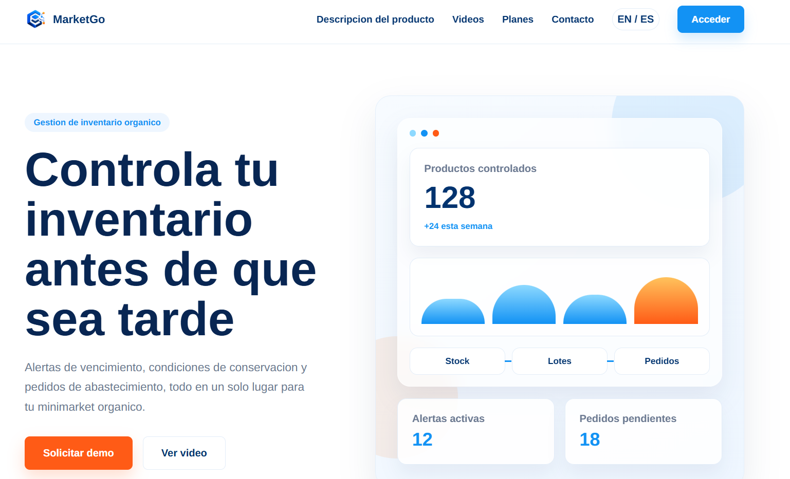
  
<em>Figura: Vista principal de MarketGo desplegada en la Landing Page.</em>

**Evidencia 2: Sección de Descripción del Producto**

Se maquetó la sección informativa donde se presentan las principales capacidades de **MarketGo**, incluyendo inventario centralizado, control de lotes, alertas inteligentes, pedidos de abastecimiento y accesos por rol. Esta sección permite comunicar de forma clara cómo la plataforma ayuda a centralizar la operación diaria de un minimarket orgánico.

  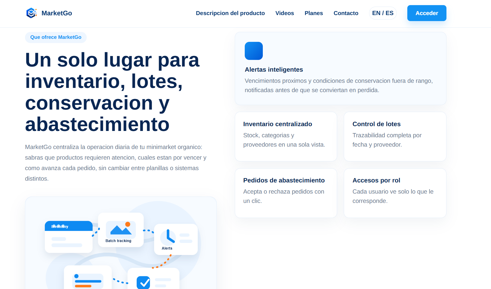
  
<em>Figura: Sección de descripción del producto y funcionalidades principales.</em>

**Evidencia 3: Sección de Videos**

Se implementó una sección dedicada a presentar al equipo y mostrar el funcionamiento general de **MarketGo** mediante contenido audiovisual. Esta sección permite reforzar la confianza del usuario y explicar visualmente el propósito de la solución.

  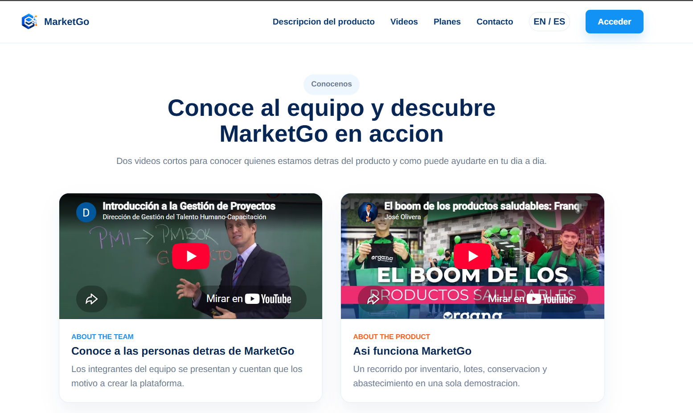
  
<em>Figura: Sección de videos para presentación del equipo y demostración del producto.</em>

**Evidencia 4: Sección de Planes**

Se desarrolló la sección de planes comerciales, presentando las alternativas **Básico**, **Profesional** y **Empresarial**. Cada plan comunica de manera ordenada sus beneficios principales, permitiendo que los minimarkets identifiquen la opción más adecuada según su tamaño y necesidades operativas.

  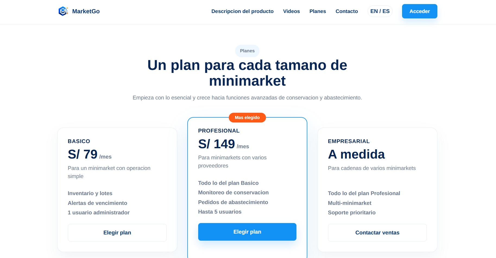
  
<em>Figura: Sección de planes disponibles para los usuarios de MarketGo.</em>

**Evidencia 5: Sección de Contacto**

Se implementó la sección de contacto, incluyendo información de correo, WhatsApp, horario de atención y un formulario para que los minimarkets interesados puedan solicitar más información o agendar una demostración. Esta sección cumple el objetivo de facilitar la comunicación directa con el equipo de **MarketLab**.

  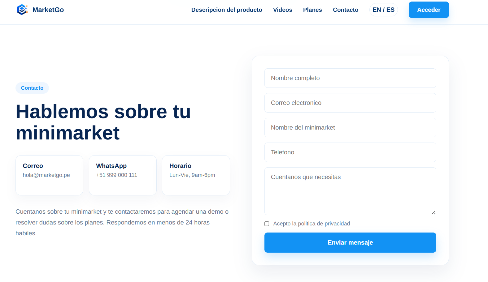
  
<em>Figura: Sección de contacto para solicitar información sobre MarketGo.</em>

#### 5.2.1.6. Services Documentation Evidence

  Dado que el Sprint 1 abarca únicamente contenido estático correspondiente a la Landing Page de marketing de <strong>MarketGo</strong>, la implementación y consumo de servicios backend para la gestión de inventario, lotes, conservación, pedidos y proveedores será abordada en sprints posteriores orientados al desarrollo de la plataforma web.

#### 5.2.1.7. Software Deployment Evidence

  <strong>URL de Producción:</strong>
  <a href="https://agreeable-meadow-0a900b010.3.azurestaticapps.net/">
    https://agreeable-meadow-0a900b010.3.azurestaticapps.net/
  </a>

#### 5.2.1.8. Team Collaboration Insights during Sprint

  Durante este primer sprint, el esfuerzo principal del equipo de <strong>MarketLab</strong> se centró en la estructuración del proyecto, el diseño UX/UI, la implementación de la landing page, la organización de ramas mediante GitFlow y la documentación inicial del producto <strong>MarketGo</strong>. Por lo tanto, las evidencias de colaboración presentadas a continuación corresponden al trabajo realizado para construir la presencia digital inicial del producto.

  En primer lugar, el <strong>Historial de Commits</strong> del repositorio demuestra que el trabajo fue organizado mediante ramas feature y commits siguiendo la convención de <strong>Conventional Commits</strong>. Durante el sprint se realizaron cambios incrementales relacionados con la maquetación de secciones, la adaptación visual basada en los mockups, la internacionalización de contenido y la corrección de detalles responsive.

  
  
<em>Figura: Historial de commits demostrando el avance incremental de la landing page de MarketGo.</em>

  En segundo lugar, el gráfico de <strong>Visitors (Traffic)</strong> proporcionado por los Insights de GitHub permite evidenciar la actividad de consulta del repositorio. Las visitas y usuarios únicos reflejan que el equipo revisó recurrentemente el avance del proyecto, validando la estructura visual, el contenido de las secciones y la coherencia general de la landing page antes del despliegue.

  
  
<em>Figura: Gráfica de visitantes mostrando la revisión constante del repositorio por parte del equipo MarketLab.</em>

<!-- AUTO-DOCS:END -->
