<!-- AUTO-DOCS:START -->

 

  

**UNIVERSIDAD PERUANA DE CIENCIAS APLICADAS**

 

**Facultad de Ingeniería**

**Carrera de Ingeniería de Software**

 

**Ciclo Académico 2026-2**

 

**Código:** 1ASI0730   |   **Curso:** Aplicaciones Web   |   **NRC:** 8130

 

**Docente:** Villafuerte Bazan, Oscar Ivan

 

**Informe de Trabajo Final - TB1**

 

**Nombre de la Startup:**

**MarketLabs**

 

**Nombre del Producto:**

**MarketGo**

 

**Relación de integrantes**

<table align="center" style="margin: 0 auto; font-size: 15px;">
  <tbody>
    <tr>
      <td align="center">U201923820</td>
      <td align="left">Cáceres Pizarro, Albino Florencio</td>
    </tr>
    <tr>
      <td align="center">U202410746</td>
      <td align="left">Huaranga Romero, Matias Daniel</td>
    </tr>
    <tr>
      <td align="center">U20231B504</td>
      <td align="left">Merino Ordinola, Winnie Lisbeth</td>
    </tr>
    <tr>
      <td align="center">u201815005</td>
      <td align="left">Quispe Almonacid, Andre Sebastian </td>
    </tr>
    <tr>
      <td align="center">U20241G152</td>
      <td align="left">Torres Huaman, Alexis Calin</td>
    </tr>
  </tbody>
</table>

  

**Lima, octubre de 2026**

---

# Registro de Versiones del Informe
| Versión | Fecha | Autores | Descripción              |
| :--- | :--- | :--- |:-------------------------|
| 1.0.0 | 20/09/2026 | Cáceres Pizarro, Albino Florencio Huaranga Romero, Matias Daniel Merino Ordinola, Winnie Lisbeth Quispe Almonacid, Andre Sebastian Torres Huaman, Alexis Calin| Carátula Registro de Versiones del Informe Project Report Collaboration Insights Contenido Student Outcome Capítulo I: Introducción Capítulo II: Requirements Elicitation & Analysis. Capítulo III: Requirements Specification. Capítulo IV: Product Design. Capítulo V: Product Implementation, Validation & Deployment. 5.1. Software Configuration Management. 5.1.1. Software Development Environment Configuration. 5.1.2. Source Code Management. 5.1.3. Source Code Style Guide & Conventions. 5.1.4. Software Deployment Configuration. 5.2. Landing Page, Services & Applications Implementation. 5.2.1. Sprint 1 5.2.1.1. Sprint Planning 1. 5.2.1.2. Aspect Leaders and Collaborators. 5.2.1.3. Sprint Backlog 1. 5.2.1.4. Development Evidence for Sprint Review. 5.2.1.5. Execution Evidence for Sprint Review. 5.2.1.6. Services Documentation Evidence for Sprint Review. 5.2.1.7. Software Deployment Evidence for Sprint Review. 5.2.1.8. Team Collaboration Insights during Sprint. Conclusiones Bibliografía Anexos. |
| 1.1.0 | 09/10/2026 | Cáceres Pizarro, Albino Florencio Huaranga Romero, Matias Daniel Merino Ordinola, Winnie Lisbeth Quispe Almonacid, Andre Sebastian Torres Huaman, Alexis Calin | Corrección de observaciones de la entrega AV1: Capítulo I: Lean UX Problem Statement con la plantilla oficial, Feature Assumptions y Hypothesis Statements en relación 1 a 1, Lean UX Canvas alineado con los User Personas y diferenciación frente a competidores. Capítulo II: registro de entrevistas con video consolidado en Microsoft Stream y timing (hh:mm:ss) de inicio y duración; User Persona, Empathy Maps y Journey Maps elaborados en UXPressia; User Task Matrix y Ubiquitous Language alineados con el flujo de pedidos y órdenes de envío. Capítulo III: User Stories del rol Visitante (US031–US033); Impact Mapping BG1 y BG2 elaborado en UXPressia; US032 actualizada a consulta de planes de suscripción. Capítulo IV: leyendas de figuras, Wireflows y User Flows con rutas alternativas, EventStorming y diagrama de clases en SVG; eliminación de referencias a donaciones. |

---

# Project Report Collaboration Insights
El presente apartado tiene como finalidad evidenciar el trabajo colaborativo realizado durante el desarrollo del informe. Para ello, se pone a disposición el repositorio oficial del proyecto, alojado en una organización pública de GitHub:

Repositorio del Project Report: https://github.com/Market-Labs/project-report

A partir de este repositorio, se analiza la participación de los integrantes del equipo mediante indicadores como número de commits, frecuencia de contribuciones y actividad general registrada en la plataforma.

En el contexto de las entregas AV1, TB1, AV2 y TB2, se presenta un análisis de colaboración que permite visualizar el nivel de aporte individual de cada miembro del equipo, sustentado en los registros de GitHub. Este análisis busca demostrar la distribución del trabajo, la constancia en el desarrollo del informe y el cumplimiento de las actividades asignadas.

## AV1

La siguiente figura presenta las estadísticas generales de actividad y contribución registradas en el repositorio.

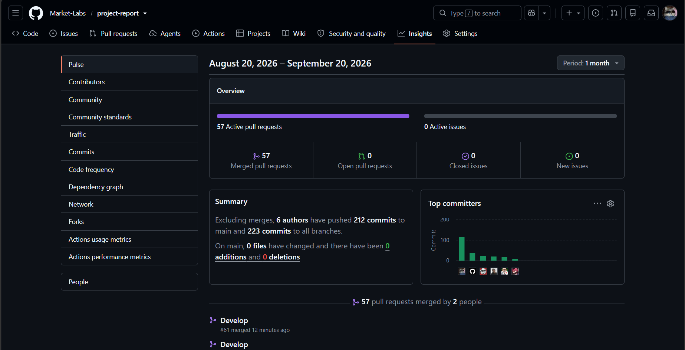

**Figura 1.** Estadísticas generales del repositorio del proyecto.  
**Fuente:** GitHub Insights.

La siguiente figura muestra el tráfico registrado en el repositorio del proyecto durante el periodo de desarrollo.

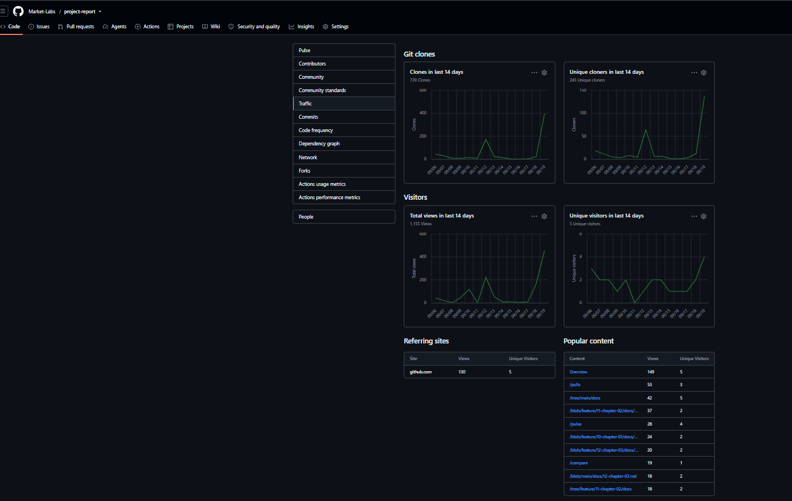

**Figura 2.** Tráfico registrado en el repositorio del proyecto.  
**Fuente:** GitHub Insights.

La siguiente figura presenta la participación de los integrantes del equipo como contribuidores del repositorio.

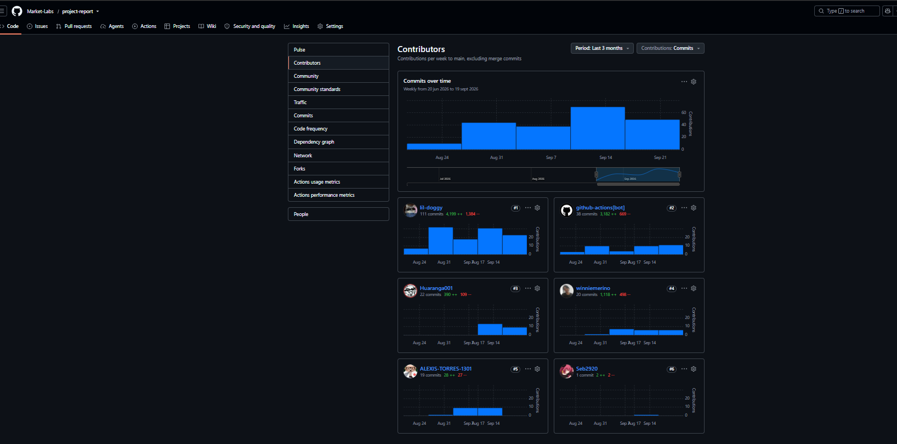

**Figura 3.** Contribuidores del repositorio del proyecto.  
**Fuente:** GitHub Insights.

La siguiente figura muestra el historial de commits realizados por los integrantes del equipo durante el desarrollo del proyecto.

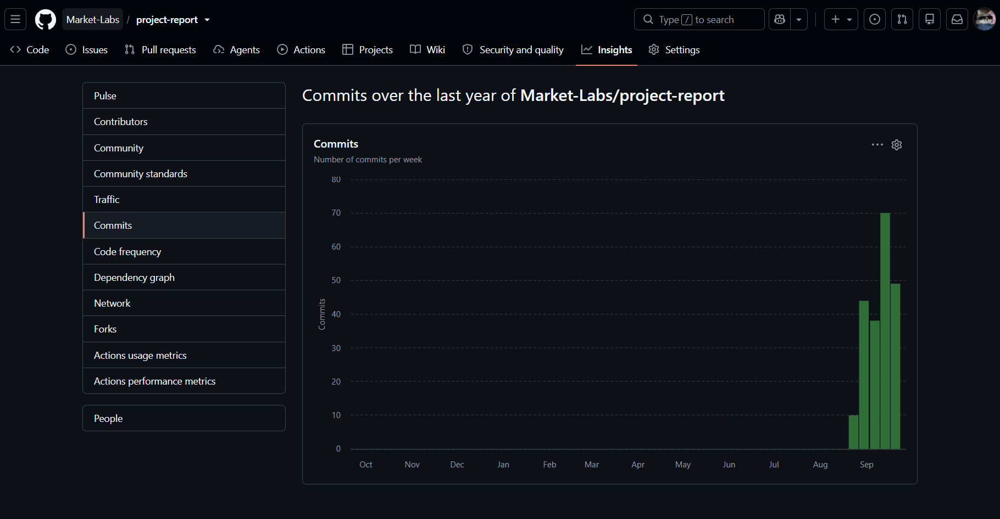

**Figura 4.** Registro de commits realizados por los integrantes del equipo.  
**Fuente:** GitHub.

---

# Contenido

- [Carátula](https://github.com/Market-Labs/project-report/blob/main/report/front-matter/01-title-page.md)
- [Registro de Versiones del Informe](https://github.com/Market-Labs/project-report/blob/main/report/front-matter/02-version-control-log.md)
- [Project Report Collaboration Insights](https://github.com/Market-Labs/project-report/blob/main/report/front-matter/03-collaboration-insights.md)
- [Student Outcome](https://github.com/Market-Labs/project-report/blob/main/report/front-matter/05-student-outcomes.md)

- [Capítulo I: Introducción](https://github.com/Market-Labs/project-report/blob/main/report/10-chapter-01.md#capítulo-i-introducción)
  - [1.1. Startup Profile](https://github.com/Market-Labs/project-report/blob/main/report/10-chapter-01.md#11-startup-profile)
    - [1.1.1. Descripción de la Startup](https://github.com/Market-Labs/project-report/blob/main/report/10-chapter-01.md#111-descripción-de-la-startup)
    - [1.1.2. Perfiles de integrantes del equipo](https://github.com/Market-Labs/project-report/blob/main/report/10-chapter-01.md#112-perfiles-de-integrantes-del-equipo)
  - [1.2. Solution Profile](https://github.com/Market-Labs/project-report/blob/main/report/10-chapter-01.md#12-solution-profile)
    - [1.2.1. Antecedentes y problemática](https://github.com/Market-Labs/project-report/blob/main/report/10-chapter-01.md#121-antecedentes-y-problemática)
    - [1.2.2. Lean UX Process.](https://github.com/Market-Labs/project-report/blob/main/report/10-chapter-01.md#122-lean-ux-process)
      - [1.2.2.1. Lean UX Problem Statements.](https://github.com/Market-Labs/project-report/blob/main/report/10-chapter-01.md#1221-lean-ux-problem-statements)
      - [1.2.2.2. Lean UX Assumptions.](https://github.com/Market-Labs/project-report/blob/main/report/10-chapter-01.md#1222-lean-ux-assumptions)
      - [1.2.2.3. Lean UX Hypothesis Statements.](https://github.com/Market-Labs/project-report/blob/main/report/10-chapter-01.md#1223-lean-ux-hypothesis-statements)
      - [1.2.2.4. Lean UX Canvas.](https://github.com/Market-Labs/project-report/blob/main/report/10-chapter-01.md#1224-lean-ux-canvas)
  - [1.3. Segmentos objetivo.](https://github.com/Market-Labs/project-report/blob/main/report/10-chapter-01.md#13-segmentos-objetivo)
    - [1.3.1. Segmento objetivo 1: Administradores de Minimarkets](https://github.com/Market-Labs/project-report/blob/main/report/10-chapter-01.md#131-segmento-objetivo-1-administradores-de-minimarkets)
    - [1.3.2. Segmento objetivo 2: Proveedores](https://github.com/Market-Labs/project-report/blob/main/report/10-chapter-01.md#132-segmento-objetivo-2-proveedores)

- [Capítulo II: Requirements Elicitation & Analysis](https://github.com/Market-Labs/project-report/blob/main/report/11-chapter-02.md#capítulo-ii-requirements-elicitation--analysis)
  - [2.1. Competidores.](https://github.com/Market-Labs/project-report/blob/main/report/11-chapter-02.md#21-competidores)
    - [2.1.1. Análisis competitivo.](https://github.com/Market-Labs/project-report/blob/main/report/11-chapter-02.md#211-análisis-competitivo)
    - [2.1.2. Estrategias y tácticas frente a competidores.](https://github.com/Market-Labs/project-report/blob/main/report/11-chapter-02.md#212-estrategias-y-tácticas-frente-a-competidores)
  - [2.2. Entrevistas.](https://github.com/Market-Labs/project-report/blob/main/report/11-chapter-02.md#22-entrevistas)
    - [2.2.1. Diseño de entrevistas.](https://github.com/Market-Labs/project-report/blob/main/report/11-chapter-02.md#221-diseño-de-entrevistas)
    - [2.2.2. Registro de entrevistas.](https://github.com/Market-Labs/project-report/blob/main/report/11-chapter-02.md#222-registro-de-entrevistas)
    - [2.2.3. Análisis de entrevistas.](https://github.com/Market-Labs/project-report/blob/main/report/11-chapter-02.md#223-análisis-de-entrevistas)
      - [1. Descripción general del segmento](https://github.com/Market-Labs/project-report/blob/main/report/11-chapter-02.md#1-descripción-general-del-segmento)
      - [2. Características objetivas del segmento](https://github.com/Market-Labs/project-report/blob/main/report/11-chapter-02.md#2-características-objetivas-del-segmento)
      - [3. Características subjetivas del segmento](https://github.com/Market-Labs/project-report/blob/main/report/11-chapter-02.md#3-características-subjetivas-del-segmento)
      - [4. Hallazgos principales](https://github.com/Market-Labs/project-report/blob/main/report/11-chapter-02.md#4-hallazgos-principales)
      - [5. Conclusión del segmento](https://github.com/Market-Labs/project-report/blob/main/report/11-chapter-02.md#5-conclusión-del-segmento)
  - [2.3. Needfinding.](https://github.com/Market-Labs/project-report/blob/main/report/11-chapter-02.md#23-needfinding)
    - [2.3.1. User Personas.](https://github.com/Market-Labs/project-report/blob/main/report/11-chapter-02.md#231-user-personas)
    - [2.3.2. User Task Matrix.](https://github.com/Market-Labs/project-report/blob/main/report/11-chapter-02.md#232-user-task-matrix)
    - [2.3.3. User Journey Mapping.](https://github.com/Market-Labs/project-report/blob/main/report/11-chapter-02.md#233-user-journey-mapping)
    - [2.3.4. Empathy Mapping.](https://github.com/Market-Labs/project-report/blob/main/report/11-chapter-02.md#234-empathy-mapping)
  - [2.4. Big Picture EventStorming.](https://github.com/Market-Labs/project-report/blob/main/report/11-chapter-02.md#24-big-picture-eventstorming)
  - [2.5. Ubiquitous Language.](https://github.com/Market-Labs/project-report/blob/main/report/11-chapter-02.md#25-ubiquitous-language)

- [Capítulo III: Requirements Specification](https://github.com/Market-Labs/project-report/blob/main/report/12-chapter-03.md#capítulo-iii-requirements-specification)
  - [3.1. User Stories.](https://github.com/Market-Labs/project-report/blob/main/report/12-chapter-03.md#31-user-stories)
  - [3.2. Impact Mapping.](https://github.com/Market-Labs/project-report/blob/main/report/12-chapter-03.md#32-impact-mapping)
  - [3.3. Product Backlog.](https://github.com/Market-Labs/project-report/blob/main/report/12-chapter-03.md#33-product-backlog)

- [Capítulo IV: Product Design](https://github.com/Market-Labs/project-report/blob/main/report/13-chapter-04.md#capítulo-iv-product-design)
  - [4.1. Style Guidelines.](https://github.com/Market-Labs/project-report/blob/main/report/13-chapter-04.md#41-style-guidelines)
    - [4.1.1. General Style Guidelines.](https://github.com/Market-Labs/project-report/blob/main/report/13-chapter-04.md#411-general-style-guidelines)
    - [4.1.2. Web Style Guidelines.](https://github.com/Market-Labs/project-report/blob/main/report/13-chapter-04.md#412-web-style-guidelines)
  - [4.2. Information Architecture.](https://github.com/Market-Labs/project-report/blob/main/report/13-chapter-04.md#42-information-architecture)
    - [4.2.1. Organization Systems.](https://github.com/Market-Labs/project-report/blob/main/report/13-chapter-04.md#421-organization-systems)
    - [4.2.2. Labeling Systems.](https://github.com/Market-Labs/project-report/blob/main/report/13-chapter-04.md#422-labeling-systems)
    - [4.2.3. SEO Tags and Meta Tags.](https://github.com/Market-Labs/project-report/blob/main/report/13-chapter-04.md#423-seo-tags-and-meta-tags)
    - [4.2.4. Searching Systems.](https://github.com/Market-Labs/project-report/blob/main/report/13-chapter-04.md#424-searching-systems)
    - [4.2.5. Navigation Systems.](https://github.com/Market-Labs/project-report/blob/main/report/13-chapter-04.md#425-navigation-systems)
  - [4.3. Landing Page UI Design.](https://github.com/Market-Labs/project-report/blob/main/report/13-chapter-04.md#43-landing-page-ui-design)
    - [4.3.1. Landing Page Wireframe.](https://github.com/Market-Labs/project-report/blob/main/report/13-chapter-04.md#431-landing-page-wireframe)
    - [4.3.2. Landing Page Mock-up.](https://github.com/Market-Labs/project-report/blob/main/report/13-chapter-04.md#432-landing-page-mock-up)
  - [4.4. Web Applications UX/UI Design.](https://github.com/Market-Labs/project-report/blob/main/report/13-chapter-04.md#44-web-applications-uxui-design)
    - [4.4.1. Web Applications Wireframes.](https://github.com/Market-Labs/project-report/blob/main/report/13-chapter-04.md#441-web-applications-wireframes)
    - [4.4.2. Web Applications Wireflow Diagrams.](https://github.com/Market-Labs/project-report/blob/main/report/13-chapter-04.md#442-web-applications-wireflow-diagrams)
    - [4.4.3. Web Applications Mock-ups.](https://github.com/Market-Labs/project-report/blob/main/report/13-chapter-04.md#443-web-applications-mock-ups)
    - [4.4.4. Web Applications User Flow Diagrams.](https://github.com/Market-Labs/project-report/blob/main/report/13-chapter-04.md#444-web-applications-user-flow-diagrams)
  - [4.5. Web Applications Prototyping.](https://github.com/Market-Labs/project-report/blob/main/report/13-chapter-04.md#45-web-applications-prototyping)
  - [4.6. Domain-Driven Software Architecture.](https://github.com/Market-Labs/project-report/blob/main/report/13-chapter-04.md#46-domain-driven-software-architecture)
    - [4.6.1. Design-Level EventStorming.](https://github.com/Market-Labs/project-report/blob/main/report/13-chapter-04.md#461-design-level-eventstorming)
    - [4.6.2. Software Architecture Context Diagram](https://github.com/Market-Labs/project-report/blob/main/report/13-chapter-04.md#462-software-architecture-context-diagram)
    - [4.6.3. Software Architecture Container Diagrams](https://github.com/Market-Labs/project-report/blob/main/report/13-chapter-04.md#463-software-architecture-container-diagrams)
    - [4.6.4. Software Architecture Components Diagrams](https://github.com/Market-Labs/project-report/blob/main/report/13-chapter-04.md#464-software-architecture-components-diagrams)
  - [4.7. Software Object-Oriented Design.](https://github.com/Market-Labs/project-report/blob/main/report/13-chapter-04.md#47-software-object-oriented-design)
    - [4.7.1. Class Diagrams.](https://github.com/Market-Labs/project-report/blob/main/report/13-chapter-04.md#471-class-diagrams)
  - [4.8. Database Design.](https://github.com/Market-Labs/project-report/blob/main/report/13-chapter-04.md#48-database-design)
    - [4.8.1. Database Diagrams.](https://github.com/Market-Labs/project-report/blob/main/report/13-chapter-04.md#481-database-diagrams)

- [Capítulo V: Product Implementation, Validation & Deployment](https://github.com/Market-Labs/project-report/blob/main/report/14-chapter-05.md#capítulo-v-product-implementation-validation--deployment)
  - [5.1. Software Configuration Management.](https://github.com/Market-Labs/project-report/blob/main/report/14-chapter-05.md#51-software-configuration-management)
    - [5.1.1. Software Development Environment Configuration.](https://github.com/Market-Labs/project-report/blob/main/report/14-chapter-05.md#511-software-development-environment-configuration)
    - [5.1.2. Source Code Management.](https://github.com/Market-Labs/project-report/blob/main/report/14-chapter-05.md#512-source-code-management)
    - [5.1.3. Source Code Style Guide & Conventions.](https://github.com/Market-Labs/project-report/blob/main/report/14-chapter-05.md#513-source-code-style-guide--conventions)
    - [5.1.4. Software Deployment Configuration.](https://github.com/Market-Labs/project-report/blob/main/report/14-chapter-05.md#514-software-deployment-configuration)
  - [5.2. Landing Page, Services & Applications Implementation.](https://github.com/Market-Labs/project-report/blob/main/report/14-chapter-05.md#52-landing-page-services--applications-implementation)
    - [5.2.1. Sprint 1.](https://github.com/Market-Labs/project-report/blob/main/report/14-chapter-05.md#521-sprint-1)
      - [5.2.1.1. Sprint Planning 1.](https://github.com/Market-Labs/project-report/blob/main/report/14-chapter-05.md#5211-sprint-planning-1)
      - [5.2.1.2. Aspect Leaders and Collaborators.](https://github.com/Market-Labs/project-report/blob/main/report/14-chapter-05.md#5212-aspect-leaders-and-collaborators)
      - [5.2.1.3. Sprint Backlog 1.](https://github.com/Market-Labs/project-report/blob/main/report/14-chapter-05.md#5213-sprint-backlog-1)
      - [5.2.1.4. Development Evidence for Sprint Review.](https://github.com/Market-Labs/project-report/blob/main/report/14-chapter-05.md#5214-development-evidence-for-sprint-review)
      - [5.2.1.5. Execution Evidence for Sprint Review.](https://github.com/Market-Labs/project-report/blob/main/report/14-chapter-05.md#5215-execution-evidence-for-sprint-review)
      - [5.2.1.6. Services Documentation Evidence for Sprint Review.](https://github.com/Market-Labs/project-report/blob/main/report/14-chapter-05.md#5216-services-documentation-evidence-for-sprint-review)
      - [5.2.1.7. Software Deployment Evidence for Sprint Review.](https://github.com/Market-Labs/project-report/blob/main/report/14-chapter-05.md#5217-software-deployment-evidence-for-sprint-review)
      - [5.2.1.8. Team Collaboration Insights during Sprint.](https://github.com/Market-Labs/project-report/blob/main/report/14-chapter-05.md#5218-team-collaboration-insights-during-sprint)

- [Conclusiones](https://github.com/Market-Labs/project-report/blob/main/report/15-chapter-06.md#conclusiones)
  - [Conclusiones y recomendaciones.](https://github.com/Market-Labs/project-report/blob/main/report/15-chapter-06.md#conclusiones-y-recomendaciones)

- [Bibliografía](https://github.com/Market-Labs/project-report/blob/main/report/front-matter/99-bibliography.md)
- [Anexos](https://github.com/Market-Labs/project-report/blob/main/report/annexes/anex-a-raw-data.md)

---

# Student Outcome

El curso contribuye al cumplimiento del Student Outcome ABET:

**ABET – EAC - Student Outcome 5**  
**Criterio:** La capacidad de funcionar efectivamente en un equipo cuyos miembros juntos proporcionan liderazgo, crean un entorno de colaboración e inclusivo, establecen objetivos, planifican tareas y cumplen objetivos.

En el siguiente cuadro se describe las acciones realizadas y enunciados de conclusiones por parte del grupo, que permiten sustentar el haber alcanzado el logro del ABET – EAC - Student Outcome 5.

| Criterio específico | Acciones realizadas | Conclusiones |
|:---|:---|:---|
| Trabaja en equipo para proporcionar liderazgo en forma conjunta | **Cáceres Pizarro, Albino Florencio** **AV1:** Asumió el liderazgo de UI/UX y GitFlow/despliegue en la matriz LACX; el Sprint Backlog le asigna la sección Home, la estructura Vue y la configuración de ramas (T001, T006 y T007).  **Huaranga Romero, Matias Daniel** **AV1:** Asumió el liderazgo de la estructura y componentes Vue en la matriz LACX; el Sprint Backlog le asigna la sección de información del producto (T002).  **Merino Ordinola, Winnie Lisbeth** **AV1:** Asumió el liderazgo de contenido e internacionalización en la matriz LACX; el Sprint Backlog le asigna la sección de videos (T003).  **Quispe Almonacid, Andre Sebastian** **AV1:** Participó como colaborador en la matriz LACX y tuvo a cargo la maquetación de planes de la landing page (T004).  **Torres Huaman, Alexis Calin** **AV1:** Participó como colaborador en la matriz LACX y tuvo a cargo la sección de contacto (T005). | **AV1:** La matriz LACX distribuyó el liderazgo entre UI/UX y GitFlow, estructura Vue, y contenido e internacionalización. El Sprint Backlog asignó tareas concretas a los cinco integrantes para entregar la primera versión de la landing page. |
| Crea un entorno colaborativo e inclusivo, establece metas, planifica tareas y cumple objetivos. | **Cáceres Pizarro, Albino Florencio** **AV1:** Preparó el Sprint Planning 1 y registró la organización de ramas y commits como tarea T007 del Sprint Backlog.  **Huaranga Romero, Matias Daniel** **AV1:** Desarrolló la sección de información del producto prevista en T002 y participó como colaborador en los demás aspectos de la matriz LACX.  **Merino Ordinola, Winnie Lisbeth** **AV1:** Desarrolló la sección de videos prevista en T003 y participó como colaboradora en los demás aspectos de la matriz LACX.  **Quispe Almonacid, Andre Sebastian** **AV1:** Desarrolló la sección de planes prevista en T004 y participó como colaborador en los aspectos registrados en la matriz LACX.  **Torres Huaman, Alexis Calin** **AV1:** Desarrolló la sección de contacto prevista en T005 y participó como colaborador en los aspectos registrados en la matriz LACX. | **AV1:** El Sprint Planning 1 fijó la meta de entregar la landing page inicial. La matriz LACX y el Sprint Backlog registran responsabilidades, tareas y estado de las actividades, lo que permite relacionar la planificación con la ejecución documentada del Sprint 1. |

---

# Capítulo I: Introducción

## 1.1. Startup Profile

### 1.1.1. Descripción de la Startup

Market-Labs es una startup tecnológica peruana de reciente creación, orientada al desarrollo de iniciativas empresariales basadas en tecnología e innovación. La organización nace con el propósito de identificar oportunidades de mejora en actividades comerciales y operativas, transformándolas en propuestas de valor que puedan generar beneficios económicos, sociales y ambientales.

Como empresa emergente, Market-Labs adopta un enfoque de innovación continua, característico de las startups, buscando validar sus ideas de negocio de manera progresiva y adaptarse a las necesidades de su mercado objetivo. Su modelo de desarrollo se basa en la identificación de problemas reales, la experimentación y la mejora constante de sus propuestas, priorizando la generación de valor antes que el crecimiento basado únicamente en estructuras empresariales tradicionales. En este sentido, Market-Labs aspira a consolidarse progresivamente como una empresa tecnológica capaz de identificar nuevas oportunidades de negocio y desarrollar propuestas innovadoras que respondan a necesidades concretas del mercado. Su crecimiento se plantea mediante la generación de productos y servicios digitales escalables, procurando establecer relaciones sostenibles con sus clientes y demás actores relacionados con sus actividades empresariales.

**Misión:** Desarrollar iniciativas tecnológicas innovadoras que permitan atender necesidades reales del mercado, generando valor para los usuarios y contribuyendo al desarrollo de actividades empresariales más eficientes y sostenibles.

**Visión:** Consolidarse como una startup tecnológica peruana reconocida por su capacidad de innovación, adaptación y generación de propuestas digitales escalables que respondan a los nuevos desafíos del mercado.

**Valores:** Innovación, eficiencia, sostenibilidad, transparencia, adaptabilidad y orientación al usuario.

### 1.1.2. Perfiles de integrantes del equipo

| Imagen | Apellidos y nombres | Código | Carrera | Perfil |
|:---:|:---|:---:|:---|:---|
|  | **Cáceres Pizarro, Albino Florencio** | U201923820 | Ingeniería de Software | Me considero una persona responsable y proactiva que le gusta trabajar en equipo. Además, siempre estoy abierto a ayudar, en lo posible, a cualquier integrante del equipo. Además, busco adaptarme rápidamente a los diversos retos que se presentan en el ciclo. |
| | **Merino Ordinola, Winnie Lisbeth** | U20231E504 | Ingeniería de Software | Estudiante de la carrera de Ingeniería de Software. Mis principales destrezas son las habilidades para trabajar en equipo, la creatividad y la investigación. Mi mayor interés es tanto proponer ideas innovadoras que solucionen problemas cercanos en nuestra realidad, como llevarlas a cabo a través del software. |
|  | **Quispe Almonacid, Andre Sebastian** | U201815005 | Ingeniería de Software | Me considero una persona analítica, constante y apasionada por la tecnología. Tengo un fuerte interés en la gestión de bases de datos, la estructura de los sistemas y el desarrollo de software. Disfruto entendiendo cómo funcionan las cosas desde la raíz y transformando la lógica en soluciones limpias y eficientes. Mi meta es seguir creciendo en el campo tecnológico y consolidarme como una profesional capaz de conectar bases de datos sólidas con el desarrollo moderno. |
|  | **Huaranga Romero, Matias Daniel** | U202410746 | Ingeniería de Software | Estudiante de Ingeniería de Software, responsable, proactivo y orientado al trabajo en equipo. Me destaco por mi creatividad, capacidad de investigación y disposición constante para apoyar a mis compañeros. Apasionado por transformar problemas reales en soluciones innovadoras a través del software, con una rápida adaptación frente a nuevos retos académicos y profesionales. |
|  | **Torres Huaman, Alexis Calín** | U20241G152 | Ingeniería de Software | Estudiante de Ingeniería de Software. Me considero una persona comprometida, analítica y apasionada por la resolución de problemas mediante el uso de la tecnología. Destaco por mi habilidad para trabajar en equipo, investigar nuevas herramientas y proponer ideas innovadoras que optimicen el desarrollo de software dentro del proyecto. |

---

## 1.2. Solution Profile

Nuestra solución MarketGo, es una plataforma web para la gestión de inventarios, abastecimiento y monitoreo de productos orgánicos, que conecta a administradores de minimarkets y proveedores mediante un ecosistema digital centralizado.

Para los administradores de minimarkets, permite gestionar productos, inventario, lotes, vencimientos, ubicaciones, mermas y ofertas, además de monitorear temperatura y humedad para detectar posibles riesgos de conservación. Asimismo, permite consultar el catálogo de los proveedores y crear pedidos de abastecimiento dirigidos a ellos.

Para los proveedores, permite gestionar su catálogo de productos, disponibilidad y lotes, aceptar o rechazar los pedidos recibidos de los minimarkets y generar órdenes de envío para los pedidos aceptados. Los proveedores no pueden modificar directamente el inventario del minimarket.

Cuando el proveedor genera una orden de envío, el administrador la revisa y puede aceptarla o rechazarla. Si la orden es aceptada, los productos y lotes recibidos se incorporan automáticamente al inventario; si es rechazada, el inventario permanece sin cambios.

La plataforma integra inventario, abastecimiento, trazabilidad y monitoreo IoT. Durante la implementación, los datos de los sensores podrán ser simulados para validar los flujos de monitoreo y alertas sin depender de dispositivos físicos.

De esta manera, MarketGo busca mejorar la gestión y abastecimiento de productos orgánicos mediante información centralizada y permisos diferenciados, bajo el principio de que **el proveedor atiende y despacha los pedidos, pero solamente el administrador del minimarket puede modificar su inventario**.

**Propuesta de valor por segmento:** Para el administrador de minimarket (persona Russell Estrada), MarketGo reúne el control de stock, lotes, vencimientos y condiciones de conservación con el abastecimiento, de modo que pueda detectar productos en riesgo, reponer a tiempo y recibir mercadería que actualiza su inventario sin transcribir datos de WhatsApp a Excel. Para el proveedor (persona Marco Antonio Ríos), MarketGo ofrece un catálogo con disponibilidad real y pedidos estructurados que puede responder y despachar sin errores de transcripción ni llamadas de confirmación. Frente a FreshTracker (solo conservación), ShelfLife (solo inventario y vencimientos) y Peru Marketplace (solo conexión B2B), el diferencial de MarketGo es **conectar el abastecimiento con el inventario y la conservación**: lo que el proveedor despacha y el minimarket acepta entra directamente al control de lotes, vencimientos y alertas.

### 1.2.1. Antecedentes y problemática

El sistema alimentario peruano enfrenta importantes pérdidas de productos a lo largo de su cadena de suministro. Se estima que en el Perú se pierden aproximadamente 12,8 millones de toneladas de alimentos al año, equivalente al 47,6% de la oferta anual de alimentos. Dentro de estas pérdidas, una proporción importante corresponde a frutas y hortalizas, productos particularmente sensibles a factores como la temperatura, humedad, manipulación y tiempo de almacenamiento (OECD, 2025; Bedoya-Perales & Dal’ Magro, 2021). Esta situación evidencia la necesidad de mejorar los mecanismos de gestión y conservación de productos perecibles.

En los minimarkets, esta problemática se relaciona con las dificultades para mantener un control adecuado sobre el inventario, lotes, fechas de vencimiento y condiciones de almacenamiento. La utilización de registros manuales, hojas de cálculo y herramientas independientes puede dificultar la identificación oportuna de productos próximos a vencer, niveles bajos de stock o condiciones ambientales inadecuadas, incrementando el riesgo de deterioro, desperdicio y desabastecimiento. Además, estudios aplicados a tiendas de conveniencia en Lima evidencian que la optimización del inventario puede mejorar indicadores operativos como la reposición, el nivel de servicio, la reducción de quiebres de stock y la rentabilidad del negocio (Zavaleta-Zarate et al., 2026).

Asimismo, el abastecimiento requiere una coordinación constante entre los administradores de minimarkets y los proveedores. Mientras los administradores necesitan gestionar sus necesidades de reposición, los proveedores requieren controlar la disponibilidad de sus productos, responder los pedidos recibidos y despachar los productos solicitados. La ausencia de un flujo centralizado puede generar errores, retrasos y poca trazabilidad de las operaciones. En este contexto, **MarketGo** propone una plataforma especializada que integra la gestión de inventarios, lotes, vencimientos, abastecimiento y monitoreo de condiciones de almacenamiento, permitiendo que los administradores creen pedidos, que los proveedores los atiendan mediante órdenes de envío y que los administradores mantengan el control sobre la recepción y la actualización del inventario.

**Objetivos de la solución:**

- Centralizar la gestión de productos, inventario, lotes, vencimientos y condiciones de almacenamiento de productos orgánicos.
- Facilitar la coordinación de abastecimiento entre administradores de minimarkets y proveedores mediante un flujo de pedidos controlado.
- Anticipar riesgos operativos asociados a stock bajo, vencimientos próximos y condiciones ambientales inadecuadas.
- Mejorar la trazabilidad de las operaciones de inventario y abastecimiento.

**Técnica "The 5W's y 2H's" aplicada al problema:**

| The 5W's y 2H's | Pregunta | Descripción |
|:---|:---|:---|
| **Who** | ¿Quiénes están involucrados? | Administradores de minimarkets responsables de gestionar inventarios, conservación y abastecimiento, y proveedores encargados de gestionar la disponibilidad de productos, atender pedidos y despachar órdenes de envío. |
| **What** | ¿Cuál es el problema? | Dificultad para gestionar de manera integrada inventarios, niveles de stock, lotes, vencimientos, condiciones de almacenamiento y operaciones de abastecimiento de productos orgánicos. |
| **Where** | ¿Dónde ocurre? | En los procesos de almacenamiento, gestión de inventarios y abastecimiento de productos orgánicos en minimarkets, así como en la gestión de productos, disponibilidad, pedidos y órdenes de envío de los proveedores. |
| **When** | ¿Cuándo sucede? | Durante el almacenamiento, control de inventarios, seguimiento de lotes y vencimientos, identificación de necesidades de reposición, creación y respuesta de pedidos, generación de órdenes de envío y recepción de la mercadería. |
| **Why** | ¿Por qué sucede? | Debido a la fragmentación de la información, el uso de procesos manuales y la ausencia de una plataforma especializada que integre inventario, abastecimiento y monitoreo de las condiciones de almacenamiento. |
| **How** | ¿Cómo se manifiesta? | Mediante dificultades para identificar productos con stock bajo, controlar lotes y vencimientos, detectar condiciones ambientales anómalas, consultar disponibilidad, crear y responder pedidos y realizar seguimiento de las órdenes de envío. |
| **How Much** | ¿Cuánto impacto tiene? | En el Perú se pierden aproximadamente **12,8 millones de toneladas de alimentos al año**, equivalentes al **47,6% de la oferta anual de alimentos**. Además, alrededor del **44% de estas pérdidas corresponde a frutas y hortalizas**, productos especialmente sensibles a las condiciones de almacenamiento (OECD, 2025; Bedoya-Perales & Dal’ Magro, 2021). A nivel operativo, estas pérdidas pueden traducirse en productos deteriorados o vencidos, desabastecimiento y mayores costos de gestión. |

---

### 1.2.2. Lean UX Process.

#### 1.2.2.1. Lean UX Problem Statements.

En el mercado peruano, los administradores de minimarkets que comercializan productos orgánicos necesitan controlar inventarios, lotes, vencimientos y condiciones de almacenamiento para evitar mermas y reponer a tiempo. Las entrevistas muestran el uso combinado de POS, hojas de cálculo, libretas y mensajería; esa dispersión dificulta detectar productos en riesgo y conocer el stock disponible. Los proveedores, por su parte, necesitan mantener actualizados su catálogo, lotes y disponibilidad, y dar seguimiento a los pedidos de los minimarkets, pero la coordinación mediante archivos y conversaciones separadas dificulta confirmar cantidades, cambios y estados de pedido.

Existen soluciones de gestión comercial e inventario revisadas en el análisis competitivo, pero cada una cubre solo una parte del proceso. La oportunidad de **MarketLabs** es atender de forma integrada la conservación de productos orgánicos, la trazabilidad por lotes y la coordinación de pedidos entre ambos segmentos. A partir de estos hallazgos y del análisis 5W+2H, el Problem Statement se redactó con la plantilla oficial de Lean UX para una iniciativa nueva (*brand new initiative*):

> **The current state of** organic product retail in Lima's minimarkets has focused primarily on manual and fragmented control: minimarket administrators track inventory, batches, expiration dates and storage conditions through physical checks, notebooks, POS systems and spreadsheets, while organic product suppliers receive and confirm replenishment orders through WhatsApp messages and phone calls. As a result, products expire or spoil before they are detected, stock records become inaccurate after orders are transcribed manually, and both parties lose time confirming the status of each delivery. In Peru, about 12.8 million tons of food are lost every year, 47.6% of the annual food supply (OECD, 2025).
>
> **What existing products/services fail to address is** the connection between replenishment and the minimarket's internal control. FreshTracker covers storage monitoring, ShelfLife covers inventory and expiration tracking, and Peru Marketplace connects buyers and suppliers, but none of them links a supplier's shipment to the minimarket's inventory, batches and storage alerts in a single flow with role-based permissions for both parties.
>
> **Our product/service will address this gap by** offering MarketGo, a responsive SaaS web platform where minimarket administrators manage inventory, batches, expirations and storage conditions with automatic alerts, and create replenishment orders that suppliers accept and fulfill through shipping orders. Once the administrator accepts a shipping order, the received products and batches are automatically added to the minimarket's inventory, and both parties follow the status of each operation from role-based dashboards.
>
> **Our initial focus will be** small and medium organic minimarkets in Metropolitan Lima, represented by the persona Russell Estrada, and the organic product suppliers and distributors that serve them, represented by the persona Marco Antonio Ríos.
>
> **We'll know we are successful when we see:**
> - A 30% reduction in products written off due to expiration or spoilage in subscribed minimarkets within the first 6 months.
> - The average time between the creation of a replenishment order and the generation of its shipping order reduced from 24 hours to less than 4 hours in 80% of orders during the first semester.
> - 100% of accepted shipping orders updating the minimarket's inventory without manual entry.
> - At least 20 active minimarkets and 5 active suppliers using the platform weekly by the end of the first semester.

**Restricciones (constraints) consideradas:**

- El MVP se desarrolla como aplicación web responsive (Landing Page, Web Application y RESTful API), sin aplicación móvil nativa.
- El monitoreo de temperatura y humedad utiliza datos simulados en la etapa inicial; la integración con sensores físicos queda fuera del alcance inicial.
- La plataforma no procesa pagos ni facturación electrónica; las condiciones comerciales se acuerdan fuera de MarketGo.
- El proveedor no puede modificar el inventario del minimarket: toda incorporación de productos depende de que el administrador acepte la orden de envío.
- El alcance geográfico inicial es Lima Metropolitana.

**Relación del Problem Statement con el análisis 5W+2H:**

| Elemento de la plantilla | Resultado 5W+2H que lo sustenta |
|---|---|
| The current state of… | **Who**, **Where** y **When**: administradores y proveedores, durante el almacenamiento, el control de lotes y el abastecimiento. |
| What existing products/services fail to address… | **Why**: fragmentación de la información y ausencia de una plataforma que integre inventario, abastecimiento y monitoreo. |
| Our product/service will address this gap by… | **What** y **How**: gestión integrada de inventario, lotes, vencimientos, conservación, pedidos y órdenes de envío. |
| Our initial focus will be… | **Who** y **Where**: minimarkets orgánicos y proveedores de Lima Metropolitana. |
| We'll know we are successful when we see… | **How Much**: pérdidas por mermas, desabastecimiento y costos operativos, convertidos en métricas cuantitativas. |

1. **Domain:** Gestión logística, abastecimiento y monitoreo de productos orgánicos.

2. **Customer Segments:** Administradores de minimarkets y proveedores de productos orgánicos.

3. **Pain Points:** Pérdidas por deterioro o vencimiento, falta de visibilidad sobre las condiciones de almacenamiento, dificultades para controlar niveles de stock, lotes y vencimientos, problemas para consultar disponibilidad de productos y coordinar pedidos de abastecimiento.

4. **Gap:** Las soluciones comerciales comparadas cubren por separado la conservación, el inventario o la conexión B2B; la oportunidad identificada es integrar la conservación de productos orgánicos, la trazabilidad por lotes y el flujo de pedidos y órdenes de envío entre minimarket y proveedor, con permisos diferenciados para modificar el inventario.

5. **Vision/Strategy:** Centralizar la información operativa para identificar riesgos, anticipar necesidades de reposición, gestionar inventarios y facilitar el abastecimiento mediante un flujo en el que el administrador crea el pedido, el proveedor lo atiende con una orden de envío y el administrador acepta la recepción antes de actualizar el inventario.

6. **Initial Segment:** Administradores de minimarkets orgánicos de Lima Metropolitana y los proveedores de productos orgánicos que los abastecen.

---

#### 1.2.2.2. Lean UX Assumptions.

**Business Assumptions:**

1. Se considera que los administradores de minimarkets necesitan mejorar el control de sus productos orgánicos para reducir pérdidas asociadas al deterioro y vencimiento.

2. Se plantea que una plataforma centralizada puede mejorar la visibilidad sobre inventarios, niveles de stock, lotes, vencimientos y condiciones de almacenamiento.

3. Se considera que los proveedores necesitan una herramienta especializada para gestionar productos, disponibilidad, lotes y pedidos de abastecimiento dirigidos a diferentes minimarkets.

4. Se asume que la integración entre minimarkets y proveedores permitirá mejorar la eficiencia del proceso de abastecimiento.

5. Se considera que las alertas de temperatura y humedad permitirán identificar oportunamente condiciones que puedan afectar la conservación de los productos.

6. Se plantea que la centralización de los pedidos permitirá mejorar la trazabilidad de las operaciones de abastecimiento.

7. Se estima que un modelo SaaS puede facilitar el acceso de pequeñas y medianas empresas a las funcionalidades de la plataforma sin requerir infraestructura tecnológica propia.

8. Se considera que la principal diferenciación de la solución será integrar la gestión de inventarios, abastecimiento y monitoreo de las condiciones de almacenamiento de productos orgánicos.

9. Se asume que los datos de monitoreo IoT pueden ser simulados durante la etapa inicial para validar los flujos funcionales sin depender de dispositivos físicos.

10. Se asume que la plataforma podrá evolucionar posteriormente para incorporar sensores IoT reales y capacidades analíticas más avanzadas.

11. Se presume que uno de los principales riesgos de adopción será la resistencia de los usuarios a reemplazar procesos manuales y herramientas informales.

12. Se plantea que una interfaz sencilla y dashboards diferenciados permitirán reducir la complejidad para cada tipo de usuario.

13. Se considera que la viabilidad del producto dependerá de que los beneficios obtenidos mediante la reducción de pérdidas y mejora del abastecimiento sean percibidos como superiores al costo de la solución.

**Business Outcome Assumptions**

1. Reducir la cantidad de productos dados de baja como consecuencia de condiciones inadecuadas de almacenamiento o vencimiento.

2. Incrementar la trazabilidad de los productos, lotes y fechas de vencimiento gestionados por los minimarkets.

3. Reducir el tiempo necesario para identificar productos o lotes que puedan encontrarse en condiciones de riesgo.

4. Mejorar la capacidad de los administradores para anticipar necesidades de reposición mediante información sobre niveles de stock.

5. Mejorar la disponibilidad de información para la toma de decisiones relacionadas con el abastecimiento.

6. Incrementar la trazabilidad de los pedidos desde su creación por parte del administrador hasta la recepción de la orden de envío y la actualización del inventario.

7. Incrementar la captación de nuevos minimarkets y proveedores que se registran en la plataforma a partir de la Landing Page.

Estos resultados se evaluarán, respectivamente, mediante la cantidad de productos dados de baja por vencimiento o deterioro; el porcentaje de productos con lote y vencimiento registrados; el tiempo para identificar productos en riesgo; el tiempo entre la detección de stock bajo y la decisión de reposición; la disponibilidad de información vigente sobre productos y pedidos; el porcentaje de pedidos con estado e historial de decisiones consultables; y la cantidad de minimarkets y proveedores registrados desde la Landing Page. Se compararán con una línea base levantada durante las pruebas con usuarios.

**User Assumptions**

1. Los administradores de minimarkets necesitan visualizar rápidamente el estado de su inventario y los productos próximos a vencer.

2. Los administradores de minimarkets necesitan identificar productos con niveles de stock que requieran reposición.

3. Los administradores de minimarkets valoran recibir alertas cuando las condiciones de almacenamiento puedan afectar determinados productos.

4. Los administradores de minimarkets necesitan consultar la disponibilidad de productos ofrecidos por proveedores conectados.

5. Los proveedores necesitan visualizar y gestionar sus productos, disponibilidad y lotes desde un único sistema.

6. Los proveedores requieren recibir pedidos estructurados de los minimarkets, responderlos, generar órdenes de envío y consultar el estado de sus operaciones.

7. Ambos segmentos necesitan consultar el estado de un pedido y mantener información actualizada sobre el proceso de abastecimiento.

**User Outcome Assumptions**

1. Los administradores de minimarkets tendrán mayor confianza en la información de su inventario al disponer de un registro centralizado de productos, stock, lotes y vencimientos.

2. Los administradores de minimarkets podrán identificar oportunamente productos con niveles de stock bajos y necesidades de reposición.

3. Los administradores de minimarkets podrán identificar condiciones ambientales anómalas que puedan representar un riesgo para los productos almacenados.

4. Los administradores de minimarkets podrán revisar las órdenes de envío generadas por los proveedores y decidir si aceptarlas o rechazarlas antes de modificar su inventario.

5. Los proveedores podrán consultar sus productos y disponibilidad, responder pedidos, generar órdenes de envío y realizar seguimiento de su estado.

6. Los usuarios experimentarán una reducción de la incertidumbre respecto al estado de los pedidos de abastecimiento.

7. Los usuarios de ambos segmentos podrán tomar decisiones operativas con mayor rapidez al contar con información centralizada y actualizada.

8. Los visitantes de la Landing Page podrán comprender rápidamente la propuesta de valor de MarketGo para su segmento y decidir si registrarse.

Los resultados de usuario se comprobarán con tareas de consulta de inventario y vencimientos, detección de alertas, identificación de stock bajo, creación y revisión de pedidos, consulta de su estado y navegación de la Landing Page hasta el registro. Se observarán el tiempo de ejecución, la finalización de la tarea y los errores; las entrevistas y pruebas permitirán contrastar estos resultados con las prácticas actuales de cada segmento.

**Feature Assumptions**

Cada Feature Assumption (FA) da origen a un Hypothesis Statement, de modo que existe una relación 1 a 1 entre ambas listas.

1. Se considera que permitir registrar, consultar, buscar, filtrar y actualizar productos, cantidades, lotes y vencimientos, priorizando la salida de los lotes más próximos a vencer (criterio FEFO), facilitará el control centralizado del inventario del minimarket.

2. Se plantea que las alertas configurables sobre productos próximos a vencer y condiciones inadecuadas de temperatura o humedad permitirán identificar oportunamente productos en riesgo.

3. Se considera que visualizar registros de temperatura y humedad permitirá al administrador supervisar las condiciones de conservación de los productos.

4. Se plantea que permitir a los proveedores mantener actualizados sus productos, lotes y disponibilidad facilitará que los minimarkets consulten alternativas de abastecimiento desde la plataforma.

5. Se considera que permitir al administrador crear pedidos dirigidos a un proveedor, y al proveedor aceptarlos o rechazarlos y generar la orden de envío correspondiente, permitirá centralizar la coordinación del abastecimiento.

6. Se plantea que reservar al administrador la decisión de aceptar o rechazar las órdenes de envío, actualizando el inventario automáticamente solo cuando se acepten, permitirá mantener el control y la trazabilidad de las entradas de productos.

7. Se considera que ofrecer dashboards diferenciados, indicadores, alertas e historial de operaciones permitirá a cada segmento consultar rápidamente el estado de sus actividades y tomar decisiones con información centralizada.

8. Se plantea que un sistema de autenticación, roles y permisos permitirá que administradores y proveedores accedan únicamente a las funcionalidades y datos correspondientes a su negocio.

9. Se considera que una Landing Page con llamadas a la acción diferenciadas para minimarkets y proveedores, video del producto, planes y formulario de contacto convertirá a los visitantes en usuarios registrados.

---

#### 1.2.2.3. Lean UX Hypothesis Statements.

Las hipótesis se redactaron con la plantilla oficial *"We believe we will achieve [business outcome] if [personas] attain [user outcome] with [feature]"*. Se formuló una hipótesis por cada Feature Assumption, y las columnas BO, UO y FA indican el número del Business Outcome, User Outcome y Feature Assumption enumerados en la sección anterior.

| # | Hypothesis Statement | BO | UO | FA |
|---|---|:---:|:---:|:---:|
| H1 | *We believe we will achieve* greater traceability of products, batches and expiration dates *if* minimarket administrators like Russell Estrada *attain* higher confidence in their inventory information *with* a centralized inventory module to register, search, filter and update products, batches and expirations. | 2 | 1 | 1 |
| H2 | *We believe we will achieve* fewer products written off due to expiration or spoilage *if* minimarket administrators like Russell Estrada *attain* timely detection of near-expiry products and risky storage conditions *with* configurable expiration and storage condition alerts. | 1 | 3 | 2 |
| H3 | *We believe we will achieve* a reduction in the time required to identify products or batches at risk *if* minimarket administrators like Russell Estrada *attain* continuous visibility of the conditions in which their products are stored *with* temperature and humidity records for each storage area. | 3 | 3 | 3 |
| H4 | *We believe we will achieve* better information for replenishment decisions *if* suppliers like Marco Antonio Ríos *attain* a single, up-to-date view of their products, batches and availability that minimarkets can consult *with* a supplier product catalog. | 5 | 5 | 4 |
| H5 | *We believe we will achieve* increased traceability of orders from their creation to their shipment *if* suppliers like Marco Antonio Ríos *attain* less uncertainty about the orders they must fulfill, without transcribing WhatsApp messages *with* a structured workflow in which administrators create orders and suppliers accept them and generate shipping orders. | 6 | 6 | 5 |
| H6 | *We believe we will achieve* complete traceability of product entries into the inventory *if* minimarket administrators like Russell Estrada *attain* the ability to review shipping orders and accept or reject them before their inventory is modified *with* shipping order reception that automatically updates the inventory only when accepted. | 6 | 4 | 6 |
| H7 | *We believe we will achieve* a better capacity to anticipate replenishment needs *if* minimarket administrators like Russell Estrada and suppliers like Marco Antonio Ríos *attain* faster operational decisions and early identification of low-stock products *with* role-based dashboards with indicators, alerts and an operations history. | 4 | 2 | 7 |
| H8 | *We believe we will achieve* trustworthy order and inventory traceability across both segments *if* minimarket administrators like Russell Estrada and suppliers like Marco Antonio Ríos *attain* the confidence that each party can only see and modify the data of its own business *with* authentication, roles and permissions per segment. | 6 | 7 | 8 |
| H9 | *We believe we will achieve* a growing base of registered minimarkets and suppliers *if* visitors of the Landing Page *attain* a quick understanding of how MarketGo solves the problems of their segment *with* a responsive Landing Page with segment-specific calls to action, product video, plans and a contact form. | 7 | 8 | 9 |

Estas hipótesis se validarán mediante pruebas con usuarios sobre el prototipo y, posteriormente, con métricas de uso de la plataforma, comparándolas con la línea base de las herramientas actuales de cada segmento (tiempo de ejecución, finalización de la tarea y errores).

---

#### 1.2.2.4. Lean UX Canvas.

El Canvas sintetiza la propuesta de valor de MarketGo a partir de los User Personas de la sección 2.3.1, **Russell Estrada** (administrador de minimarket orgánico) y **Marco Antonio Ríos** (coordinador comercial de una distribuidora orgánica B2B), y de los competidores analizados en la sección 2.1.

<table>
  <tr>
    <td valign="top" width="33%">
      <strong>1. Business problem</strong>
        
      Los minimarkets de productos orgánicos en Lima controlan inventario, lotes, vencimientos y conservación con revisiones físicas, libretas y hojas de cálculo, y coordinan su abastecimiento por WhatsApp (100% de los administradores entrevistados).
        
      Esto provoca mermas por vencimiento o pérdida de cadena de frío, errores de stock al transcribir pedidos y llamadas constantes para confirmar despachos.
        
      FreshTracker, ShelfLife y Peru Marketplace resuelven solo una parte (conservación, inventario o conexión B2B) y ninguna conecta el abastecimiento con el inventario y la conservación.
    </td>
    <td rowspan="2" valign="top" width="34%">
      <strong>5. Solution ideas</strong>
        
      - Inventario centralizado con lotes y vencimientos (FA1).
        
      - Alertas de vencimiento y de condiciones de conservación (FA2).
        
      - Registros de temperatura y humedad con datos inicialmente simulados (FA3).
        
      - Catálogo del proveedor con disponibilidad real (FA4).
        
      - Pedido creado por el administrador → aceptado por el proveedor → orden de envío (FA5).
        
      - Recepción de la orden de envío que actualiza automáticamente el inventario (FA6).
        
      - Dashboards por rol con indicadores, alertas e historial (FA7).
        
      - Autenticación, roles y permisos por segmento (FA8).
        
      - Landing Page con llamadas a la acción por segmento (FA9).
    </td>
    <td valign="top" width="33%">
      <strong>2. Business outcomes</strong>
        
      - Reducir en 30% las bajas por vencimiento o deterioro de los minimarkets suscritos en 6 meses.
        
      - Reducir de 24 h a menos de 4 h el tiempo entre la creación de un pedido y su orden de envío en el 80% de los pedidos.
        
      - Lograr que el 100% de las órdenes de envío aceptadas actualicen el inventario sin registro manual.
        
      - Alcanzar 20 minimarkets y 5 proveedores activos al cierre del primer semestre.
    </td>
  </tr>
  <tr>
    <td valign="top">
      <strong>3. Users &amp; customers</strong>
        
      - <strong>Russell Estrada</strong> (28 años, Lima): administrador de minimarket orgánico, opera desde el celular, usa Excel y WhatsApp y tiene baja adopción de nuevas herramientas.
        
      - <strong>Marco Antonio Ríos</strong> (32 años, Lurín): coordinador comercial de una distribuidora que atiende 30 minimarkets con un catálogo de 120 productos; coordina pedidos por WhatsApp y Excel.
    </td>
    <td valign="top">
      <strong>4. User outcomes &amp; benefits</strong>
        
      - Russell: dejar de perder dinero por mermas al enterarse a tiempo de vencimientos y fallas de refrigeración, sin revisar físicamente el almacén.
        
      - Russell: mantener el stock real al aceptar una orden de envío, sin transcribir datos de WhatsApp a Excel.
        
      - Marco: recibir pedidos estructurados y despachar sin errores de transcripción.
        
      - Marco: dejar de atender llamadas de confirmación, porque el minimarket ve el estado de su pedido.
        
      - Ambos: una herramienta sencilla, usable desde el celular y con una curva de aprendizaje corta.
    </td>
  </tr>
  <tr>
    <td valign="top">
      <strong>6. Hypotheses</strong>
        
      - H1: más trazabilidad si Russell confía en su inventario gracias al módulo de inventario y lotes.
        
      - H2 y H3: menos mermas si Russell detecta a tiempo vencimientos y condiciones riesgosas gracias a alertas y registros de conservación.
        
      - H4: mejores decisiones de reposición si Marco mantiene un catálogo con disponibilidad real.
        
      - H5 y H6: pedidos trazables de inicio a fin si Marco despacha con órdenes de envío y Russell las acepta antes de actualizar su inventario.
        
      - H7 y H8: reposición anticipada y datos confiables gracias a dashboards por rol con permisos.
        
      - H9: más minimarkets y proveedores registrados gracias a una Landing Page orientada a cada segmento.
    </td>
    <td valign="top">
      <strong>7. What's the most important thing we need to learn first?</strong>
        
      - Si Russell confía en las alertas y en la actualización automática del inventario lo suficiente como para abandonar su control en Excel.
        
      - Si Marco está dispuesto a recibir y responder pedidos en MarketGo en lugar de WhatsApp.
        
      - Si la separación de funciones (el administrador crea el pedido y acepta la recepción; el proveedor responde y despacha) es clara para ambos segmentos.
        
      - Si el valor percibido de centralizar inventario, conservación y abastecimiento es suficiente para que ambos segmentos adopten MarketGo.
    </td>
    <td valign="top">
      <strong>8. What's the least amount of work we need to do to learn the next most important thing?</strong>
        
      - Crear un prototipo navegable con datos ficticios realistas de inventario, lotes, vencimientos, temperatura, humedad y alertas.
        
      - Probar con 3 administradores y 3 proveedores el flujo completo: crear pedido → aceptarlo → generar orden de envío → aceptar la recepción y ver el inventario actualizado.
        
      - Mostrar alertas simuladas de stock bajo, vencimiento y conservación para observar si el usuario reconoce su prioridad y realiza una acción adecuada.
        
      - Medir finalización de tareas, tiempo, errores y comprensión frente a su proceso actual con WhatsApp y Excel, y cerrar con una breve entrevista sobre confianza, intención de adopción y disposición de pago.
    </td>
  </tr>
</table>

**Diferenciación frente a la competencia**

| Capacidad | MarketGo | FreshTracker | ShelfLife | Peru Marketplace |
|---|:---:|:---:|:---:|:---:|
| Inventario, lotes y vencimientos | ✔ | ✘ | ✔ | ✘ |
| Monitoreo de temperatura y humedad con alertas | ✔ | ✔ | ✘ | ✘ |
| Pedidos y órdenes de envío entre minimarket y proveedor | ✔ | ✘ | ✘ | ✔ |
| Recepción que actualiza automáticamente el inventario | ✔ | ✘ | ✘ | ✘ |
| Dashboards con permisos por rol (minimarket / proveedor) | ✔ | ✘ | ✘ | ✘ |
| Enfoque especializado en productos orgánicos | ✔ | ✘ | ✘ | ✘ |

La propuesta de valor diferencial de MarketGo es **conectar el abastecimiento con el inventario y la conservación**: un pedido aceptado por el proveedor se convierte en una orden de envío que, al ser aceptada por el minimarket, actualiza su inventario y sus lotes, los cuales quedan inmediatamente bajo control de vencimientos y alertas de conservación.

---

## 1.3. Segmentos objetivo.

La solución está dirigida a **dos segmentos objetivos principales** que participan directamente en la cadena de abastecimiento de productos orgánicos: **administradores de minimarkets y proveedores**.

Estos segmentos presentan necesidades de negocio diferentes. Por ello, la plataforma utiliza una infraestructura tecnológica compartida, pero ofrece dashboards, funcionalidades y permisos específicos para cada segmento.

Los roles operativos que puedan existir dentro de cada empresa forman parte de la estructura interna de cada segmento y no constituyen segmentos objetivos independientes.

### 1.3.1. Segmento objetivo 1: Administradores de Minimarkets

| Dimensión | Detalle del perfil |
|---|---|
| **Perfil Demográfico** | Propietarios, administradores o responsables de pequeños y medianos minimarkets dedicados a la comercialización de productos orgánicos y alimentos frescos. Son responsables de supervisar las operaciones del establecimiento y tomar decisiones relacionadas con inventario, conservación y abastecimiento. |
| **Perfil Geográfico** | Negocios ubicados principalmente en zonas urbanas con demanda de productos orgánicos y necesidad de mantener un abastecimiento constante. El segmento inicial puede concentrarse en Lima Metropolitana. |
| **Perfil Psicográfico** | Personas orientadas a mantener la calidad y disponibilidad de sus productos, reducir pérdidas y mejorar la eficiencia de sus operaciones. Valoran soluciones sencillas que permitan controlar el inventario, anticipar necesidades de reposición y tomar decisiones basadas en información actualizada. |
| **Puntos de Dolor** | Pérdidas ocasionadas por deterioro o vencimiento, dificultad para controlar niveles de stock, lotes y fechas de vencimiento, falta de visibilidad sobre las condiciones de almacenamiento, situaciones de desabastecimiento y dificultad para coordinar pedidos con proveedores y validar la mercadería recibida. |
| **Uso de Tecnología** | Utilizan herramientas digitales para administrar ventas, inventarios y comunicación con proveedores, aunque pueden depender de hojas de cálculo, aplicaciones de mensajería y sistemas independientes que no integran toda la información operativa. |

### 1.3.2. Segmento objetivo 2: Proveedores

| Dimensión | Detalle del perfil |
|---|---|
| **Perfil Demográfico** | Empresas, productores, distribuidores o comerciantes mayoristas de productos orgánicos que abastecen a minimarkets. Sus representantes son responsables de gestionar el catálogo, productos, disponibilidad y lotes, y de atender y despachar los pedidos de abastecimiento. |
| **Perfil Geográfico** | Proveedores ubicados en zonas productoras, centros de distribución o áreas comerciales que atienden a minimarkets y otros negocios comercializadores de productos orgánicos. |
| **Perfil Psicográfico** | Negocios orientados a mantener una disponibilidad eficiente de sus productos, atender oportunamente los pedidos de abastecimiento y establecer relaciones comerciales duraderas con sus clientes. Valoran la organización, trazabilidad y visibilidad de sus operaciones de abastecimiento. |
| **Puntos de Dolor** | Dificultad para administrar productos y disponibilidad, atender pedidos de diferentes minimarkets que llegan por canales dispersos, falta de visibilidad sobre el estado de las operaciones, gestión fragmentada de productos y lotes, y dificultades para coordinar el abastecimiento y mantener actualizada la información de sus productos. |
| **Uso de Tecnología** | Utilizan herramientas digitales, hojas de cálculo y aplicaciones de comunicación para gestionar productos, clientes y pedidos, pero pueden carecer de una plataforma especializada que conecte directamente su disponibilidad de productos con las necesidades de los minimarkets y permita realizar seguimiento de los pedidos y órdenes de envío. |

---

# Capítulo II: Requirements Elicitation & Analysis

## 2.1. Competidores.

### 2.1.1. Análisis competitivo.

Este análisis permite identificar cómo se posiciona **MarketGo** frente a soluciones especializadas en la gestión y conservación de productos perecibles, así como frente a plataformas digitales orientadas a la conexión entre compradores y proveedores. A partir de ello, se busca definir una ventaja competitiva basada en la integración de la gestión de inventarios, conservación y abastecimiento de productos orgánicos dentro de una misma plataforma.

<table style="text-align: center; width: 100%;">
  <tbody>
    <tr>
      <td colspan="5"><strong>Competitive Analysis Landscape</strong></td>
    </tr>
    <tr>
      <td colspan="2"><strong>¿Por qué llevar a cabo este análisis?</strong></td>
      <td colspan="3">
        Este análisis permite identificar las principales soluciones existentes relacionadas con la gestión de productos perecibles,
        conservación de inventarios y conexión entre compradores y proveedores, diferenciando la propuesta de MarketGo frente a
        plataformas especializadas en una sola parte del proceso.
      </td>
    </tr>
    <tr>
      <td colspan="2"><strong>Logotipos</strong></td>
      <td>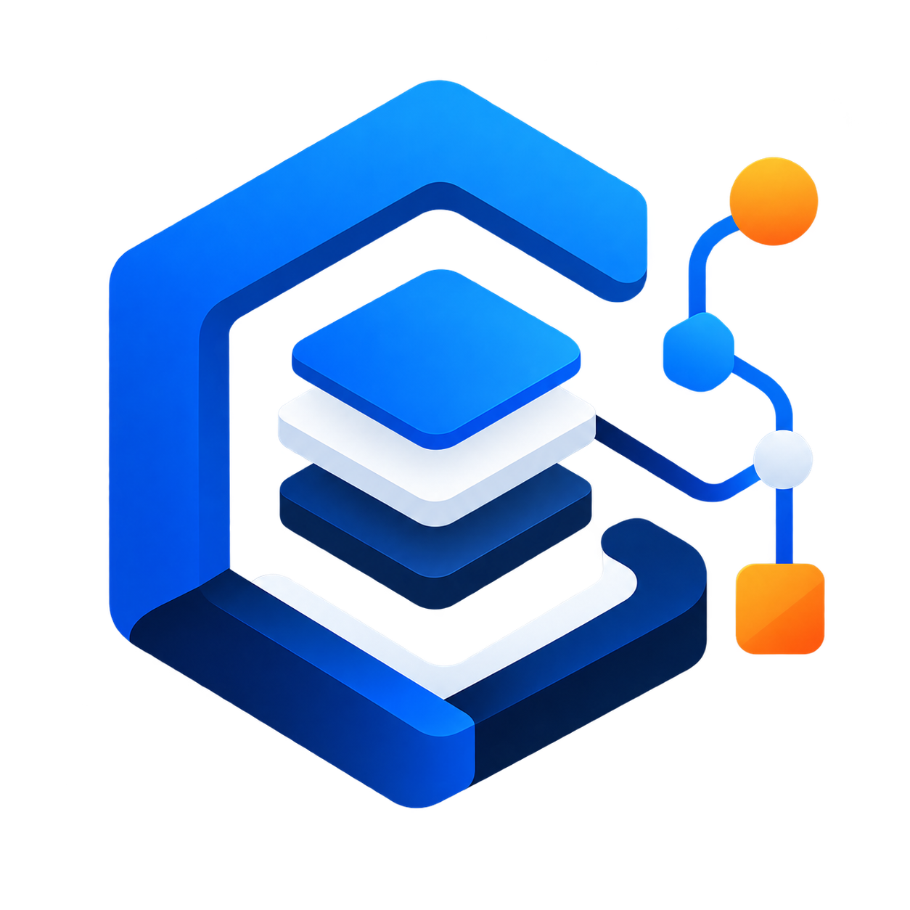</td>
      <td></td>
      <td></td>
      <td></td>
    </tr>
    <tr>
      <td colspan="2"><strong>Software</strong></td>
      <td><strong>MarketGo</strong></td>
      <td><strong>FreshTracker</strong></td>
      <td><strong>ShelfLife</strong></td>
      <td><strong>Peru Marketplace</strong></td>
    </tr>
    <tr>
      <td rowspan="2"><strong>Perfil</strong></td>
      <td>Overview</td>
      <td>Startup SaaS orientada a centralizar la gestión, conservación y abastecimiento de productos orgánicos para minimarkets y proveedores.</td>
      <td>Plataforma orientada al monitoreo y conservación de productos frescos mediante control de temperatura, humedad, vencimientos y alertas.</td>
      <td>Plataforma especializada en la gestión de inventarios de productos perecibles, lotes, fechas de vencimiento y reducción de desperdicios.</td>
      <td>Marketplace B2B que conecta compradores y proveedores, facilitando la búsqueda de productos, solicitudes y operaciones comerciales.</td>
    </tr>
    <tr>
      <td>Ventaja competitiva, ¿Qué valor ofrece a los clientes?</td>
      <td>Integra inventario, lotes, conservación y abastecimiento en una sola plataforma, utilizando un dashboard común con permisos según el rol del usuario.</td>
      <td>Monitoreo de condiciones ambientales y generación de alertas para prevenir pérdidas relacionadas con la conservación.</td>
      <td>Control especializado de inventario y vencimientos para reducir mermas de productos perecibles.</td>
      <td>Conexión entre compradores y proveedores mediante un ecosistema digital orientado a operaciones B2B.</td>
    </tr>
    <tr>
      <td rowspan="2"><strong>Perfil de Marketing</strong></td>
      <td>Mercado objetivo</td>
      <td>Minimarkets y proveedores de productos orgánicos que buscan centralizar sus procesos de inventario, conservación y abastecimiento.</td>
      <td>Comercios y negocios que manejan productos frescos y requieren controlar sus condiciones de almacenamiento.</td>
      <td>Negocios que comercializan productos perecibles y necesitan mejorar el control de inventarios y vencimientos.</td>
      <td>Empresas y compradores que buscan proveedores y productos mediante una plataforma digital B2B en Perú.</td>
    </tr>
    <tr>
      <td>Estrategias de marketing</td>
      <td>Propuesta B2B enfocada en reducción de pérdidas, trazabilidad y centralización de procesos para pequeños y medianos negocios.</td>
      <td>Posicionamiento basado en reducción del desperdicio mediante monitoreo y automatización de la conservación.</td>
      <td>Enfoque en reducción de desperdicio y optimización de inventarios de productos perecibles.</td>
      <td>Construcción de un ecosistema digital que facilite la interacción entre compradores y proveedores.</td>
    </tr>
    <tr>
      <td rowspan="3"><strong>Perfil de Producto</strong></td>
      <td>Productos &amp; Servicios</td>
      <td>Gestión de inventarios, lotes, vencimientos, conservación, alertas, mermas, productos de proveedores y pedidos de abastecimiento.</td>
      <td>Monitoreo de temperatura y humedad, seguimiento de productos frescos, alertas y herramientas para control de conservación.</td>
      <td>Gestión de inventario, seguimiento de lotes, fechas de vencimiento y herramientas para reducir pérdidas.</td>
      <td>Marketplace B2B, búsqueda de proveedores, productos, solicitudes, cotizaciones y pedidos.</td>
    </tr>
    <tr>
      <td>Precios &amp; Costos</td>
      <td>Modelo SaaS proyectado para pequeños y medianos negocios, con acceso según el plan contratado.</td>
      <td>Servicio basado en funcionalidades de monitoreo y gestión de conservación.</td>
      <td>Servicio orientado a negocios que requieren herramientas especializadas de control de inventario.</td>
      <td>Modelo comercial asociado a servicios de intermediación y operaciones B2B.</td>
    </tr>
    <tr>
      <td>Canales de distribución (Web y/o Móvil)</td>
      <td>Plataforma web con dashboard común y permisos diferenciados para administradores de minimarkets y proveedores.</td>
      <td>Plataforma digital orientada a monitoreo y gestión de productos frescos.</td>
      <td>Plataforma digital orientada a la gestión de inventarios perecibles.</td>
      <td>Plataforma web orientada a operaciones comerciales B2B.</td>
    </tr>
    <tr>
      <td rowspan="4"><strong>Análisis SWOT</strong></td>
      <td>Fortalezas</td>
      <td>
        <ul style="text-align: left; margin: 0; padding-left: 18px;">
          <li>Integra inventario y conservación.</li>
          <li>Conecta minimarkets y proveedores.</li>
          <li>Dashboard común con permisos por rol.</li>
          <li>Automatización de incorporación al inventario.</li>
        </ul>
      </td>
      <td>
        <ul style="text-align: left; margin: 0; padding-left: 18px;">
          <li>Monitoreo de temperatura y humedad.</li>
          <li>Alertas de conservación.</li>
          <li>Enfoque en productos frescos.</li>
          <li>Prevención de pérdidas.</li>
        </ul>
      </td>
      <td>
        <ul style="text-align: left; margin: 0; padding-left: 18px;">
          <li>Especialización en productos perecibles.</li>
          <li>Control de inventario.</li>
          <li>Seguimiento de vencimientos.</li>
          <li>Reducción de desperdicio.</li>
        </ul>
      </td>
      <td>
        <ul style="text-align: left; margin: 0; padding-left: 18px;">
          <li>Conexión entre compradores y proveedores.</li>
          <li>Catálogo de productos.</li>
          <li>Operaciones B2B.</li>
          <li>Presencia en el mercado peruano.</li>
        </ul>
      </td>
    </tr>
    <tr>
      <td>Debilidades</td>
      <td>
        <ul style="text-align: left; margin: 0; padding-left: 18px;">
          <li>Marca nueva.</li>
          <li>Menor reconocimiento inicial.</li>
          <li>Red de usuarios limitada durante la etapa inicial.</li>
          <li>Dependencia de la adopción de minimarkets y proveedores.</li>
        </ul>
      </td>
      <td>
        <ul style="text-align: left; margin: 0; padding-left: 18px;">
          <li>Mayor especialización en conservación.</li>
          <li>Menor enfoque en abastecimiento B2B.</li>
          <li>Dependencia de datos de monitoreo.</li>
          <li>No integra todo el ciclo de abastecimiento.</li>
        </ul>
      </td>
      <td>
        <ul style="text-align: left; margin: 0; padding-left: 18px;">
          <li>Enfoque principalmente interno.</li>
          <li>Menor interacción con proveedores.</li>
          <li>No integra monitoreo ambiental completo.</li>
          <li>Menor enfoque en abastecimiento.</li>
        </ul>
      </td>
      <td>
        <ul style="text-align: left; margin: 0; padding-left: 18px;">
          <li>Menor especialización en conservación.</li>
          <li>No está orientado específicamente a productos orgánicos.</li>
          <li>No centraliza el control interno del inventario.</li>
          <li>Menor integración con monitoreo ambiental.</li>
        </ul>
      </td>
    </tr>
    <tr>
      <td>Oportunidades</td>
      <td>
        <ul style="text-align: left; margin: 0; padding-left: 18px;">
          <li>Crecimiento de la digitalización de pequeños negocios.</li>
          <li>Necesidad de reducir desperdicio.</li>
          <li>Mayor demanda de trazabilidad.</li>
          <li>Integración futura con IoT y Machine Learning.</li>
        </ul>
      </td>
      <td>
        <ul style="text-align: left; margin: 0; padding-left: 18px;">
          <li>Creciente interés en reducción de desperdicios.</li>
          <li>Mayor adopción de monitoreo digital.</li>
          <li>Expansión hacia nuevos comercios.</li>
          <li>Integración con sistemas de inventario.</li>
        </ul>
      </td>
      <td>
        <ul style="text-align: left; margin: 0; padding-left: 18px;">
          <li>Crecimiento del comercio de alimentos frescos.</li>
          <li>Digitalización del control de inventarios.</li>
          <li>Mayor preocupación por el desperdicio.</li>
          <li>Expansión a nuevos mercados.</li>
        </ul>
      </td>
      <td>
        <ul style="text-align: left; margin: 0; padding-left: 18px;">
          <li>Crecimiento del comercio digital B2B.</li>
          <li>Mayor conexión entre compradores y proveedores.</li>
          <li>Digitalización de pequeñas empresas.</li>
          <li>Expansión de categorías de productos.</li>
        </ul>
      </td>
    </tr>
    <tr>
      <td>Amenazas</td>
      <td>
        <ul style="text-align: left; margin: 0; padding-left: 18px;">
          <li>Resistencia al cambio.</li>
          <li>Uso persistente de Excel y aplicaciones de mensajería.</li>
          <li>Competidores especializados.</li>
          <li>Dificultad inicial para construir una red de usuarios.</li>
        </ul>
      </td>
      <td>
        <ul style="text-align: left; margin: 0; padding-left: 18px;">
          <li>Mayor adopción de soluciones IoT.</li>
          <li>Entrada de nuevos competidores.</li>
          <li>Reducción de costos de sensores.</li>
          <li>Integración de monitoreo en ERPs.</li>
        </ul>
      </td>
      <td>
        <ul style="text-align: left; margin: 0; padding-left: 18px;">
          <li>Competencia de sistemas de inventario generales.</li>
          <li>Uso de herramientas tradicionales.</li>
          <li>Mayor oferta de soluciones especializadas.</li>
          <li>Preferencia por soluciones integrales.</li>
        </ul>
      </td>
      <td>
        <ul style="text-align: left; margin: 0; padding-left: 18px;">
          <li>Competencia de marketplaces generales.</li>
          <li>Negociación directa entre compradores y proveedores.</li>
          <li>Dependencia de la cantidad de usuarios registrados.</li>
          <li>Mayor competencia digital B2B.</li>
        </ul>
      </td>
    </tr>
  </tbody>
</table>

### 2.1.2. Estrategias y tácticas frente a competidores.

A partir de la identificación de fortalezas y debilidades competitivas, la startup **Market-Labs** aplicará el siguiente conjunto de estrategias y tácticas preliminares para posicionar a **MarketGo** como una solución integral para la gestión y abastecimiento de productos orgánicos en minimarkets.

#### Estrategia ofensiva: integración de capacidades frente a FreshTracker y ShelfLife

FreshTracker y ShelfLife presentan una especialización en aspectos concretos relacionados con la conservación e inventario de productos perecibles. MarketGo aprovechará esta brecha para integrar dichas necesidades con el proceso de abastecimiento entre minimarkets y proveedores.

- **Gestión integral:** centralizar en una misma plataforma el inventario, lotes, vencimientos, conservación y abastecimiento.
- **Trazabilidad completa:** permitir relacionar los productos recibidos desde proveedores con los lotes registrados en el inventario del minimarket.
- **Automatización del inventario:** incorporar automáticamente los productos correspondientes al inventario cuando el administrador acepte un pedido.

#### Estrategia defensiva: diferenciación frente a Peru Marketplace

Peru Marketplace facilita la conexión entre compradores y proveedores, pero MarketGo buscará diferenciarse mediante la integración de la operación comercial con el control interno del inventario y conservación de los productos.

- **Abastecimiento conectado al inventario:** permitir que los pedidos no sean únicamente operaciones comerciales, sino que formen parte del flujo de actualización del inventario del minimarket.
- **Control de productos perecibles:** complementar el proceso de abastecimiento con información de lotes, vencimientos y condiciones de conservación.
- **Enfoque especializado:** orientar la propuesta específicamente a minimarkets y proveedores relacionados con productos orgánicos.

#### Estrategia adaptativa: reducción de la resistencia al cambio

Para afrontar la dependencia de herramientas tradicionales como Excel y aplicaciones de mensajería, MarketGo buscará simplificar las principales operaciones de sus usuarios.

- **Dashboard común:** utilizar una misma interfaz para ambos segmentos, reduciendo la complejidad de aprendizaje.
- **Permisos según rol:** permitir que los administradores de minimarkets cuenten con permisos de lectura y escritura, mientras que los proveedores dispongan de permisos de consulta y acciones específicas como responder pedidos y generar órdenes de envío.
- **Flujo simplificado:** reducir la cantidad de pasos necesarios para consultar productos, generar pedidos y actualizar el inventario.

#### Estrategia de innovación y escalabilidad

MarketGo buscará construir una base tecnológica que permita ampliar progresivamente sus capacidades de acuerdo con las necesidades del mercado.

- **Monitoreo inteligente:** utilizar datos simulados de temperatura y humedad durante la etapa inicial, con posibilidad de integrar sensores IoT reales posteriormente.
- **Analítica futura:** incorporar progresivamente herramientas de analítica y Machine Learning para identificar patrones de deterioro y apoyar la toma de decisiones.
- **Escalabilidad:** extender la solución hacia otros negocios que gestionen productos perecibles manteniendo el enfoque inicial en minimarkets y proveedores de productos orgánicos.

## 2.2. Entrevistas.

En esta sección se aborda la investigación tomando como base la recolección de información mediante entrevistas a representantes de los segmentos objetivo. Las entrevistas serán registradas en video como evidencia del proceso de obtención de requisitos.

### 2.2.1. Diseño de entrevistas.

Para el desarrollo de las entrevistas de los segmentos objetivo, se redactaron las siguientes preguntas siguiendo las buenas prácticas para el diseño de recolección de información:

**Segmento objetivo: Administradores de Minimarkets**

#### Preguntas Demográficas

1. ¿Cuál es su nombre completo y qué edad tiene?
2. ¿Cuál es su cargo dentro del minimarket y cuántos años de experiencia tiene en la gestión del negocio?
3. ¿En qué distrito o provincia se encuentra ubicado el minimarket?

#### Preguntas de Hábitos Digitales

4. ¿Qué dispositivo utiliza con mayor frecuencia durante su jornada laboral para gestionar las actividades del minimarket?
5. ¿Qué herramientas utiliza actualmente para registrar o consultar información del inventario?
6. ¿Qué medios utiliza con mayor frecuencia para comunicarse con sus proveedores?

#### Preguntas Principales

7. ¿Cómo registra y controla actualmente los productos disponibles en el minimarket?
8. ¿Podría describir el proceso desde que identifica la necesidad de abastecer un producto hasta que este queda registrado en el inventario?
9. ¿Cómo controla actualmente los lotes y las fechas de vencimiento de los productos?
10. ¿Cómo determina qué productos necesitan ser repuestos o retirados por encontrarse próximos a vencer?
11. ¿Cómo controla actualmente las condiciones de almacenamiento de los productos, como temperatura y humedad?
12. ¿Cómo consulta actualmente la disponibilidad de productos ofrecidos por sus proveedores?
13. ¿Cómo realiza el seguimiento de los pedidos o solicitudes de abastecimiento realizados a sus proveedores?
14. ¿Qué dificultades encuentra actualmente al gestionar inventario, lotes, vencimientos y abastecimiento?
15. ¿Ha experimentado pérdidas por productos deteriorados, vencidos, falta de stock o condiciones inadecuadas de almacenamiento? ¿Cómo las gestiona?
16. ¿Considera que una plataforma que centralice el inventario, lotes, vencimientos, condiciones de almacenamiento, proveedores y pedidos de abastecimiento facilitaría su gestión? ¿Por qué?

---

**Segmento objetivo: Proveedores de Productos Orgánicos**

#### Preguntas Demográficas

1. ¿Cuál es su nombre completo y qué edad tiene?
2. ¿Cuál es su cargo dentro de la empresa y cuántos años de experiencia tiene en la comercialización o distribución de productos?
3. ¿En qué distrito o provincia se encuentra ubicado su negocio o centro de operaciones?

#### Preguntas de Hábitos Digitales

4. ¿Qué dispositivo utiliza con mayor frecuencia durante su jornada laboral para gestionar productos y pedidos?
5. ¿Qué herramientas utiliza actualmente para registrar o consultar información de los productos que ofrece?
6. ¿Qué medios utiliza con mayor frecuencia para comunicarse con sus clientes?

#### Preguntas Principales

7. ¿Cómo registra y administra actualmente el catálogo de productos que ofrece?
8. ¿Cómo controla actualmente la disponibilidad y los lotes de los productos que tiene para ofrecer?
9. ¿Podría describir el proceso desde que un minimarket solicita productos hasta que el pedido es preparado y despachado?
10. ¿Cómo gestiona actualmente los pedidos o solicitudes provenientes de diferentes minimarkets?
11. ¿Cómo comunica actualmente a sus clientes la disponibilidad, precios y características de los productos?
12. ¿Cómo realiza el seguimiento del estado de los pedidos realizados por sus clientes?
13. ¿Qué dificultades encuentra para mantener actualizada la información sobre sus productos, disponibilidad y lotes?
14. ¿Qué problemas ha experimentado relacionados con errores de comunicación, pérdida de información, retrasos o falta de disponibilidad? ¿Cómo los resuelve?
15. ¿Cómo coordina actualmente con los minimarkets las confirmaciones, cambios o rechazos relacionados con los pedidos?
16. ¿Considera que una plataforma que permita gestionar productos, disponibilidad, lotes y pedidos de abastecimiento, además de consultar el estado de cada operación, facilitaría su gestión? ¿Por qué?

### 2.2.2. Registro de entrevistas.

**Segmento objetivo: Administradores de Minimarkets**

**Video consolidado de entrevistas (Microsoft Stream):** `upc-pre-202620-1asi0730-8130-MarketLabs-needfinding-sprint-1.mp4` (duración total 00:41:46) – <a href="https://upcedupe-my.sharepoint.com/:v:/g/personal/u20241g152_upc_edu_pe/IQBnGMEhlvAHSY3MOhumatkyATjXF_ceF332mD2498BVd9w?e=J6S7rd" target="_blank">Ver video consolidado</a>

El video consolida las seis entrevistas de ambos segmentos. En cada registro se indica el *timing* (hh:mm:ss) en el que inicia la entrevista dentro del video y su duración.
<table style="width:100%; border-collapse:collapse;" border="1">
  <tbody>
    <tr>
      <td colspan="4" align="center"><strong>Entrevista N.° 1</strong></td>
    </tr>
    <tr>
      <td colspan="4" align="center">
        
      </td>
    </tr>
    <tr>
      <td colspan="2" align="center"><strong>Información del entrevistado</strong></td>
      <td colspan="2" align="center"><strong>Contexto tecnológico</strong></td>
    </tr>
    <tr>
      <td><strong>Nombre completo</strong></td>
      <td>Rodrigo Guevara</td>
      <td><strong>Dispositivo de mayor frecuencia</strong></td>
      <td>Celular (movilidad) y laptop (en caja)</td>
    </tr>
    <tr>
      <td><strong>Edad</strong></td>
      <td>26 años</td>
      <td><strong>Sistema operativo/browser</strong></td>
      <td>No especificado</td>
    </tr>
    <tr>
      <td><strong>Definición profesional / cargo</strong></td>
      <td>Administrador general (3 años de experiencia)</td>
      <td><strong>Canales digitales de comunicación</strong></td>
      <td>WhatsApp Business y correo electrónico</td>
    </tr>
    <tr>
      <td><strong>Residencia / ubicación</strong></td>
      <td>José Leonardo Ortíz, Chiclayo, Lambayeque</td>
      <td><strong>Software especializado utilizado</strong></td>
      <td>Excel (Google Drive) y sistema POS básico</td>
    </tr>
    <tr>
      <td colspan="2"><strong>Inicio en el video (timing):</strong> 00:00:00</td>
      <td colspan="2"><strong>Fin en el video:</strong> 00:05:05</td>
    </tr>
    <tr>
      <td colspan="2"><strong>Duración</strong>: 00:05:05</td>
      <td colspan="2"><strong>URL de grabación: </strong><a href="https://upcedupe-my.sharepoint.com/:v:/g/personal/u20241g152_upc_edu_pe/IQBnGMEhlvAHSY3MOhumatkyATjXF_ceF332mD2498BVd9w?e=J6S7rd" target="_blank">Ver video consolidado (desde 00:00:00)</a></td>
    </tr>
    <tr>
      <td colspan="4">
        <strong>Resumen de la entrevista</strong>  
        Rodrigo Guevara es el administrador general de un minimarket en JLO, Chiclayo. Gestiona el negocio apoyándose principalmente en su celular y una laptop, utilizando un sistema POS básico integrado con Excel en Drive para el registro de inventario. La comunicación, consulta de catálogos y seguimiento de pedidos con sus proveedores se realiza de forma casi exclusiva a través de WhatsApp Business.  
        Actualmente, sus procesos de control de calidad son manuales: el registro de lotes y fechas de vencimiento se lleva en una libreta física, y la revisión de stock y condiciones de almacenamiento (temperatura) se hace de manera visual en los anaqueles y congeladoras. Rodrigo identifica que su principal problema es el tiempo excesivo que demanda este control manual, el desorden al coordinar por chats y las pérdidas económicas generadas por productos vencidos o malogrados que no se detectan a tiempo. Concluye que una plataforma centralizada para inventarios, vencimientos y proveedores solucionaría estos puntos críticos al ahorrar tiempo y evitar mermas.
      </td>
    </tr>
  </tbody>
</table>

<table style="width:100%; border-collapse:collapse;">
  <tbody>
    <tr>
      <td colspan="4" align="center"><strong>Entrevista N.° 2</strong></td>
    </tr>
    <tr>
      <td colspan="4" align="center">
        
      </td>
    </tr>
    <tr>
      <td colspan="2" align="center"><strong>Información del entrevistado</strong></td>
      <td colspan="2" align="center"><strong>Contexto tecnológico</strong></td>
    </tr>
    <tr>
      <td><strong>Nombre completo</strong></td>
      <td>Roly Hans Luna</td>
      <td><strong>Dispositivo de mayor frecuencia</strong></td>
      <td>Teléfono celular(Smartphone)</td>
    </tr>
    <tr>
      <td><strong>Edad</strong></td>
      <td>28 años</td>
      <td><strong>Sistema operativo/browser</strong></td>
      <td>iOS / Android (Mobile Browser)</td>
    </tr>
    <tr>
      <td><strong>Definición profesional / cargo</strong></td>
      <td>Administrador de Minimarket Orgánico</td>
      <td><strong>Canales digitales de comunicación</strong></td>
      <td>WhatsApp</td>
    </tr>
    <tr>
      <td><strong>Residencia / ubicación</strong></td>
      <td>San Isidro, Lima</td>
      <td><strong>Software especializado utilizado</strong></td>
      <td>Microsoft Excel (Google Drive)</td>
    </tr>
    <tr>
      <td colspan="2"><strong>Inicio en el video (timing):</strong> 00:05:05</td>
      <td colspan="2"><strong>Fin en el video:</strong> 00:18:43</td>
    </tr>
    <tr>
      <td colspan="2"><strong>Duración</strong>: 00:13:38</td>
      <td colspan="2"><strong>URL de grabación: </strong><a href="https://upcedupe-my.sharepoint.com/:v:/g/personal/u20241g152_upc_edu_pe/IQBnGMEhlvAHSY3MOhumatkyATjXF_ceF332mD2498BVd9w?e=J6S7rd" target="_blank">Ver video consolidado (desde 00:05:05)</a></td>
    </tr>
    <tr>
      <td colspan="4">
        <strong>Resumen de la entrevista</strong>  
        Roly es un administrador con 4 años de experiencia, enfocado en el crecimiento de su minimarket de productos orgánicos. Muestra una personalidad proactiva, pero con altos niveles de frustración operativa y estrés debido a la carga de trabajo manual. A nivel tecnológico, su comportamiento es puramente <em>mobile-first</em>; utiliza su teléfono celular durante el 90% de su jornada laboral debido al constante dinamismo en los pasillos, relegando el uso de la laptop únicamente para cierres administrativos.  Sus canales de interacción digital son limitados y fragmentados: utiliza hojas de cálculo de Google Drive (Excel) combinadas con cuadernos de apuntes para el inventario, y depende 100% de WhatsApp como canal de comunicación oficial para cotizar y solicitar pedidos a sus proveedores.  Durante la entrevista, expresó que sus principales problemas (<em>Pains</em>) son las mermas de productos perecibles (hortalizas y lácteos) por falta de control. Actualmente, monitorea las fechas de vencimiento mediante revisiones visuales semanales y verifica la temperatura de las vitrinas con termómetros físicos, lo cual lo deja expuesto a fallas mecánicas durante la madrugada. Se mostró altamente entusiasta (<em>Gains</em>) ante la propuesta de una solución tecnológica centralizada, indicando que un sistema que le envíe alertas al celular sobre el clima o los vencimientos, y que actualice su stock automáticamente al aprobar un pedido, le ahorraría tiempo y reduciría sus pérdidas económicas a cero.
      </td>
    </tr>
  </tbody>
</table>

<table style="width:100%; border-collapse:collapse;">
  <tbody>
    <tr>
      <td colspan="4" align="center"><strong>Entrevista N.° 3</strong></td>
    </tr>
    <tr>
      <td colspan="4" align="center">
        
      </td>
    </tr>
    <tr>
      <td colspan="2" align="center"><strong>Información del entrevistado</strong></td>
      <td colspan="2" align="center"><strong>Contexto tecnológico</strong></td>
    </tr>
    <tr>
      <td><strong>Nombre completo</strong></td>
      <td>María Fernanda Rojas Castillo</td>
      <td><strong>Dispositivo de mayor frecuencia</strong></td>
      <td>Teléfono celular y laptop</td>
    </tr>
    <tr>
      <td><strong>Edad</strong></td>
      <td>38 años</td>
      <td><strong>Sistema operativo/browser</strong></td>
      <td>Sistema operativo y navegador</td>
    </tr>
    <tr>
      <td><strong>Definición profesional / cargo</strong></td>
      <td>Administradora de minimarket con 7 años de experiencia en la gestión del negocio</td>
      <td><strong>Canales digitales de comunicación</strong></td>
      <td>WhatsApp y llamadas telefónicas</td>
    </tr>
    <tr>
      <td><strong>Residencia / ubicación</strong></td>
      <td>Santiago de Surco, Lima</td>
      <td><strong>Software especializado utilizado</strong></td>
      <td>Microsoft Excel</td>
    </tr>
    <tr>
      <td colspan="2"><strong>Inicio en el video (timing):</strong> 00:18:43</td>
      <td colspan="2"><strong>Fin en el video:</strong> 00:26:19</td>
    </tr>
    <tr>
      <td colspan="2"><strong>Duración</strong>: 00:07:36</td>
      <td colspan="2"><strong>URL de grabación: </strong><a href="https://upcedupe-my.sharepoint.com/:v:/g/personal/u20241g152_upc_edu_pe/IQBnGMEhlvAHSY3MOhumatkyATjXF_ceF332mD2498BVd9w?e=J6S7rd" target="_blank">Ver video consolidado (desde 00:18:43)</a></td>
    </tr>
    <tr>
      <td colspan="4">
        <strong>Resumen de la entrevista</strong>  
        La entrevista realizada a una administradora de minimarket de 38 años, con aproximadamente 7 años de experiencia en la gestión del negocio, permitió identificar que actualmente utiliza principalmente Excel, WhatsApp y registros manuales para gestionar el inventario y coordinar con sus proveedores. El control de productos, lotes y fechas de vencimiento requiere revisiones físicas periódicas, mientras que los pedidos de abastecimiento se coordinan principalmente mediante WhatsApp y llamadas telefónicas.  
        Entre las principales dificultades identificadas se encuentran la información distribuida en diferentes medios, la actualización tardía del inventario, el tiempo requerido para revisar fechas de vencimiento y la dificultad para realizar el seguimiento de varios pedidos simultáneamente. Asimismo, se han presentado pérdidas por productos vencidos o deteriorados y situaciones de falta de stock.  
        Finalmente, la entrevistada considera útil contar con una plataforma que permita consultar en un solo lugar el inventario, los lotes, las fechas de vencimiento, las condiciones de almacenamiento, la información de los proveedores y los pedidos de abastecimiento. También valora la posibilidad de recibir alertas sobre productos con bajo stock o próximos a vencer, ya que facilitaría la organización y permitiría tomar acciones con anticipación.
      </td>
    </tr>
  </tbody>
</table>

**Segmento objetivo: Proveedores**
Las entrevistas de este segmento continúan en el mismo video consolidado (`upc-pre-202620-1asi0730-8130-MarketLabs-needfinding-sprint-1.mp4`), a partir de 00:26:19.
<table style="width:100%; border-collapse:collapse;">
  <tbody>
    <tr>
      <td colspan="4" align="center"><strong>Entrevista N.° 4</strong></td>
    </tr>
    <tr>
      <td colspan="4" align="center">
        
      </td>
    </tr>
    <tr>
      <td colspan="2" align="center"><strong>Información del entrevistado</strong></td>
      <td colspan="2" align="center"><strong>Contexto tecnológico</strong></td>
    </tr>
    <tr>
      <td><strong>Nombre completo</strong></td>
      <td>Álvaro Chojaga</td>
      <td><strong>Dispositivo de mayor frecuencia</strong></td>
      <td>Laptop</td>
    </tr>
    <tr>
      <td><strong>Edad</strong></td>
      <td>54 años</td>
      <td><strong>Sistema operativo/browser</strong></td>
      <td>Chrome</td>
    </tr>
    <tr>
      <td><strong>Definición profesional / cargo</strong></td>
      <td>Administrador / Jefe de Operaciones y Ventas</td>
      <td><strong>Canales digitales de comunicación</strong></td>
      <td>Whatsapp</td>
    </tr>
    <tr>
      <td><strong>Residencia / ubicación</strong></td>
      <td>Lima, Miraflores</td>
      <td><strong>Software especializado utilizado</strong></td>
      <td>Excel</td>
    </tr>
    <tr>
      <td colspan="2"><strong>Inicio en el video (timing):</strong> 00:26:19</td>
      <td colspan="2"><strong>Fin en el video:</strong> 00:30:40</td>
    </tr>
    <tr>
      <td colspan="2"><strong>Duración</strong>: 00:04:21</td>
      <td colspan="2"><strong>URL de grabación: </strong><a href="https://upcedupe-my.sharepoint.com/:v:/g/personal/u20241g152_upc_edu_pe/IQBnGMEhlvAHSY3MOhumatkyATjXF_ceF332mD2498BVd9w?e=J6S7rd" target="_blank">Ver video consolidado (desde 00:26:19)</a></td>
    </tr>
    <tr>
      <td colspan="4">
        <strong>Resumen de la entrevista</strong>  
        El video presenta una entrevista con Álvaro Chojaga, un proveedor de productos orgánicos, donde se introduce una plataforma web diseñada para mejorar la gestión y comercialización de productos orgánicos. La plataforma ofrece funciones como publicidad de productos, control de stock, gestión sanitaria, pedidos, y seguimiento de entregas. El contenido está orientado a proveedores y distribuidores que buscan optimizar su manejo de inventarios, pedidos y precios, aprendiendo mejores prácticas para evitar errores comunes y mejorar la comunicación con sus clientes.
      </td>
    </tr>
  </tbody>
</table>

<table style="width:100%; border-collapse:collapse;">
  <tbody>
    <tr>
      <td colspan="4" align="center"><strong>Entrevista N.° 5</strong></td>
    </tr>
    <tr>
      <td colspan="4" align="center">
        
      </td>
    </tr>
    <tr>
      <td colspan="2" align="center"><strong>Información del entrevistado</strong></td>
      <td colspan="2" align="center"><strong>Contexto tecnológico</strong></td>
    </tr>
    <tr>
      <td><strong>Nombre completo</strong></td>
      <td>Luz Rojas</td>
      <td><strong>Dispositivo de mayor frecuencia</strong></td>
      <td>Telefono</td>
    </tr>
    <tr>
      <td><strong>Edad</strong></td>
      <td>47 años</td>
      <td><strong>Sistema operativo/browser</strong></td>
      <td>Chrome</td>
    </tr>
    <tr>
      <td><strong>Definición profesional / cargo</strong></td>
      <td>Comerciante / Mayorista de Productos Orgánicos</td>
      <td><strong>Canales digitales de comunicación</strong></td>
      <td>Whatsapp</td>
    </tr>
    <tr>
      <td><strong>Residencia / ubicación</strong></td>
      <td>Lima, Miraflores</td>
      <td><strong>Software especializado utilizado</strong></td>
      <td>Excel</td>
    </tr>
    <tr>
      <td colspan="2"><strong>Inicio en el video (timing):</strong> 00:30:40</td>
      <td colspan="2"><strong>Fin en el video:</strong> 00:33:57</td>
    </tr>
    <tr>
      <td colspan="2"><strong>Duración</strong>: 00:03:17</td>
      <td colspan="2"><strong>URL de grabación: </strong><a href="https://upcedupe-my.sharepoint.com/:v:/g/personal/u20241g152_upc_edu_pe/IQBnGMEhlvAHSY3MOhumatkyATjXF_ceF332mD2498BVd9w?e=J6S7rd" target="_blank">Ver video consolidado (desde 00:30:40)</a></td>
    </tr>
    <tr>
      <td colspan="4">
        <strong>Resumen de la entrevista</strong>  
        Este video presenta una entrevista con Luz Rojas sobre el uso y desafíos en la gestión y comercialización de productos orgánicos a través de una plataforma digital llamada Market-Labs. El objetivo central es mostrar cómo esta plataforma puede facilitar la gestión de inventarios, precios, pedidos y seguimiento de entregas para productores y proveedores. Está especialmente dirigido a pequeños y medianos productores o comerciantes de productos orgánicos que buscan optimizar su operación y evitar errores comunes en stock, precios y logística. El espectador aprenderá las dificultades habituales en la administración manual y el potencial beneficio de digitalizar estos procesos con herramientas tecnológicas.
      </td>
    </tr>
  </tbody>
</table>

<table style="width:100%; border-collapse:collapse;">
  <tbody>
    <tr>
      <td colspan="4" align="center"><strong>Entrevista N.° 6</strong></td>
    </tr>
    <tr>
      <td colspan="4" align="center">
        
      </td>
    </tr>
    <tr>
      <td colspan="2" align="center"><strong>Información del entrevistado</strong></td>
      <td colspan="2" align="center"><strong>Contexto tecnológico</strong></td>
    </tr>
    <tr>
      <td><strong>Nombre completo</strong></td>
      <td>Anita Gamboa</td>
      <td><strong>Dispositivo de mayor frecuencia</strong></td>
      <td> celular / laptop </td>
    </tr>
    <tr>
      <td><strong>Edad</strong></td>
      <td>32 años</td>
      <td><strong>Sistema operativo/browser</strong></td>
      <td>Windows/Chrome</td>
    </tr>
    <tr>
      <td><strong>Definición profesional / cargo</strong></td>
      <td>Proveedor de productos orgánicos</td>
      <td><strong>Canales digitales de comunicación</strong></td>
      <td>Whatsapp</td>
    </tr>
    <tr>
      <td><strong>Residencia / ubicación</strong></td>
      <td>Cerro Colorado - Arequipa</td>
      <td><strong>Software especializado utilizado</strong></td>
      <td>Excel</td>
    </tr>
    <tr>
      <td colspan="2"><strong>Inicio en el video (timing):</strong> 00:33:57</td>
      <td colspan="2"><strong>Fin en el video:</strong> 00:41:46</td>
    </tr>
    <tr>
      <td colspan="2"><strong>Duración</strong>: 00:07:49</td>
      <td colspan="2"><strong>URL de grabación: </strong><a href="https://upcedupe-my.sharepoint.com/:v:/g/personal/u20241g152_upc_edu_pe/IQBnGMEhlvAHSY3MOhumatkyATjXF_ceF332mD2498BVd9w?e=J6S7rd" target="_blank">Ver video consolidado (desde 00:33:57)</a></td>
    </tr>
    <tr>
      <td colspan="4">
        <strong>Resumen de la entrevista</strong>  
        La entrevista evidencia que la gestión actual depende principalmente de herramientas separadas como Excel, WhatsApp, llamadas y registros internos. Aunque estas permiten administrar productos y pedidos, la actualización manual de la información genera dificultades para mantener sincronizados el catálogo, la disponibilidad, los lotes y el estado de los pedidos.

El proceso de abastecimiento comienza con la recepción de solicitudes de los minimarkets, seguida de la verificación de disponibilidad, confirmación, preparación de productos, revisión de lotes y coordinación del despacho. Cuando existen varios pedidos o modificaciones simultáneas, el seguimiento se vuelve más complejo y pueden producirse inconsistencias, como informar disponibilidad desactualizada o perder cambios realizados mediante conversaciones.

En conclusión, se identifica la necesidad de centralizar la información de productos, lotes, disponibilidad y pedidos. Una plataforma que permita consultar y actualizar estos datos, además de visualizar el estado de cada operación, podría reducir la dependencia de archivos y conversaciones dispersas y facilitar la coordinación entre el proveedor y los minimarkets.
</td>
</tr>
  </tbody>
</table>

### 2.2.3. Análisis de entrevistas.

**Análisis por segmento objetivo**

**Segmento objetivo: Administradores de Minimarkets**

#### 1. Descripción general del segmento

Este segmento agrupa a administradores responsables de supervisar las operaciones de minimarkets, incluyendo actividades relacionadas con el control de inventario, gestión de productos, lotes, fechas de vencimiento, condiciones de almacenamiento y coordinación del abastecimiento con proveedores. A partir de las entrevistas realizadas a los administradores, se identificaron patrones comunes relacionados con el uso de herramientas digitales, la dependencia de procesos manuales y las dificultades para mantener actualizada y centralizada la información del negocio. Estos hallazgos sirven como base para la construcción del arquetipo correspondiente.

#### 2. Características objetivas del segmento

| Característica | Sustento estadístico | Evidencia en entrevistas | Relación con el arquetipo |
|:---|:---|:---|:---|
| **Uso de hojas de cálculo para la gestión** | 100% (3/3) | **Entrevistas 1, 2 y 3:** Los administradores utilizan Excel o Google Drive para registrar, consultar o actualizar información relacionada con el inventario y las operaciones del minimarket. | El arquetipo posee experiencia utilizando herramientas digitales básicas, pero requiere una alternativa especializada que permita organizar la información de manera integrada. |
| **Uso frecuente del teléfono celular durante la jornada laboral** | 100% (3/3) | **Entrevistas 1, 2 y 3:** El celular forma parte de las herramientas utilizadas diariamente. En particular, se emplea por su facilidad de acceso y movilidad durante las actividades del minimarket. | El arquetipo necesita acceder a información y realizar consultas desde dispositivos móviles durante sus actividades diarias. |
| **Uso de WhatsApp para la comunicación con proveedores** | 100% (3/3) | **Entrevistas 1, 2 y 3:** WhatsApp o WhatsApp Business es utilizado para consultar productos, coordinar pedidos y mantener comunicación con proveedores. | El arquetipo está acostumbrado a canales digitales rápidos, pero actualmente la información de abastecimiento permanece distribuida en conversaciones independientes. |
| **Control manual de inventario, lotes o vencimientos** | 100% (3/3) | **Entrevistas 1, 2 y 3:** Se realizan revisiones físicas de productos, stock, lotes o fechas de vencimiento, complementadas con cuadernos, Excel o sistemas básicos. | El arquetipo combina herramientas digitales con procedimientos manuales, generando una necesidad de simplificar y organizar sus actividades de control. |

#### 3. Características subjetivas del segmento

| Característica | Sustento estadístico | Evidencia en entrevistas | Relación con el arquetipo |
|:---|:---|:---|:---|
| **Preocupación por productos vencidos o deteriorados** | 100% (3/3) | **Entrevistas 1, 2 y 3:** Los administradores identifican los vencimientos y el deterioro de productos como situaciones que pueden generar pérdidas económicas y requieren revisiones constantes. | El arquetipo busca anticiparse a vencimientos y deterioros para reducir mermas y tomar acciones oportunamente. |
| **Necesidad de reducir el tiempo dedicado al control manual** | 100% (3/3) | **Entrevistas 1, 2 y 3:** La revisión de stock, vencimientos y registros requiere tiempo debido a que parte de la información debe verificarse manualmente o consultarse en diferentes medios. | El arquetipo valora herramientas que agilicen las consultas y reduzcan el esfuerzo necesario para mantener actualizada la información. |
| **Necesidad de centralizar la información operativa** | 100% (3/3) | **Entrevistas 1, 2 y 3:** La información se encuentra distribuida entre Excel, cuadernos, sistemas básicos y conversaciones de WhatsApp, dificultando su seguimiento. | El arquetipo necesita disponer de inventario, lotes, vencimientos, proveedores y pedidos desde un mismo entorno. |
| **Valoración de alertas para anticipar problemas** | 67% (2/3) | **Entrevistas 2 y 3:** Los entrevistados muestran interés en recibir alertas relacionadas con vencimientos, stock o condiciones que requieren atención. | El arquetipo valora mecanismos preventivos que le permitan identificar situaciones importantes antes de que generen pérdidas o problemas de abastecimiento. |

#### 4. Hallazgos principales

- **Fragmentación de la información (100% de coincidencia):** Los tres administradores utilizan diferentes herramientas y medios para gestionar sus operaciones, principalmente Excel, registros manuales y WhatsApp. Esto dificulta mantener una visión integrada y actualizada del inventario, los vencimientos y el abastecimiento.

- **Dependencia de controles manuales (100% de coincidencia):** Los tres entrevistados realizan revisiones físicas o manuales para controlar aspectos como stock, lotes, fechas de vencimiento o condiciones de almacenamiento. Estas actividades demandan tiempo y pueden ocasionar que determinados problemas no sean detectados oportunamente.

- **Necesidad de mejorar la prevención y organización operativa (100% de coincidencia):** Los entrevistados evidencian dificultades relacionadas con productos vencidos o deteriorados, falta de stock, actualización de información y seguimiento de pedidos. Una gestión más organizada permitiría detectar estas situaciones con anticipación y facilitar la toma de decisiones.

#### 5. Conclusión del segmento

Las entrevistas realizadas a los administradores de minimarkets evidencian un patrón común de gestión basado en la combinación de herramientas digitales básicas, principalmente Excel y WhatsApp, con procedimientos manuales para controlar inventario, lotes, vencimientos y abastecimiento. Aunque estas herramientas permiten desarrollar las actividades diarias, la información permanece distribuida en diferentes medios y requiere constantes revisiones y actualizaciones.

Los principales problemas identificados se relacionan con el tiempo empleado en los controles manuales, la dificultad para mantener actualizada la información, el seguimiento de fechas de vencimiento, las pérdidas ocasionadas por productos vencidos o deteriorados y la coordinación de pedidos con proveedores. Asimismo, los entrevistados muestran interés en disponer de información organizada y mecanismos que permitan anticipar situaciones como bajo stock o próximos vencimientos.

A partir de estos patrones, el arquetipo del segmento puede representarse como un administrador que participa activamente en las operaciones del minimarket, utiliza dispositivos móviles y herramientas digitales durante su jornada y necesita consultar información de manera rápida y confiable. Sus principales necesidades se concentran en organizar el inventario, controlar lotes y vencimientos, supervisar las condiciones de almacenamiento y facilitar la coordinación del abastecimiento con proveedores, aspectos que deberán ser considerados en el diseño de MarketGo.

**Segmento objetivo: Proveedores de Productos Orgánicos**

#### 1. Descripción general del segmento

Este segmento agrupa a proveedores, distribuidores y comerciantes mayoristas responsables de comercializar alimentos y productos orgánicos a minimarkets y pequeños comercios. Sus actividades incluyen la gestión de catálogos, control de disponibilidad, seguimiento de lotes, recepción y preparación de pedidos de abastecimiento, así como la coordinación logística de entregas. A partir de las entrevistas realizadas a los proveedores (Álvaro Chojaga, Luz Rojas y Anita Gamboa), se identificaron patrones operativos alineados al uso de herramientas digitales desarticuladas, la alta carga de trabajo manual y los cuellos de botella generados por la falta de un canal comercial unificado. Estos hallazgos sirven como fundamento para la construcción del arquetipo representativo.

#### 2. Características objetivas del segmento

| Característica | Sustento estadístico | Evidencia en entrevistas | Relación con el arquetipo |
| :--- | :---: | :--- | :--- |
| **Uso de hojas de cálculo (Excel) para el catálogo y control interno** | **100% (3/3)** | **Entrevistas 4, 5 y 6:** Todos los proveedores emplean Microsoft Excel como herramienta principal para registrar sus listas de productos, precios y control de lotes. | El arquetipo domina herramientas de escritorio tradicionales, pero sufre de desactualización constante al no estar conectadas en tiempo real con sus clientes. |
| **Uso intensivo de WhatsApp para la gestión comercial y pedidos** | **100% (3/3)** | **Entrevistas 4, 5 y 6:** La recepción de solicitudes, confirmación de precios, coordinación de despachos y cambios se realiza de manera casi exclusiva por WhatsApp. | El arquetipo depende de la mensajería instantánea para vender, lo que provoca dispersión de la información y pérdida de histórico de pedidos. |
| **Atención dispersa entre múltiples dispositivos (Celular y Laptop)** | **100% (3/3)** | **Entrevistas 4, 5 y 6:** Utilizan el celular para responder rápidamente a clientes en movimiento y la laptop para revisar inventarios y cotizaciones. | El arquetipo requiere una plataforma web con alta accesibilidad responsive para operar en oficina o en almacén/campo. |
| **Proceso manual de verificación y actualización de disponibilidad** | **100% (3/3)** | **Entrevistas 4, 5 y 6:** Al recibir un pedido, deben validar manualmente contra su stock o cuadernos si cuentan con los productos antes de confirmar al minimarket. | El arquetipo pierde tiempo operativo en revisiones manuales, expuesto a ofrecer disponibilidad de stock desactualizada. |

#### 3. Características subjetivas del segmento

| Característica | Sustento estadístico | Evidencia en entrevistas | Relación con el arquetipo |
| :--- | :---: | :--- | :--- |
| **Frustración por errores de comunicación y modificaciones por chat** | **100% (3/3)** | **Entrevistas 4, 5 y 6:** Expresan que los cambios de último momento o malentendidos en conversaciones de WhatsApp generan despachos erróneos o inconsistencias. | El arquetipo busca estandarizar la toma de pedidos para evitar reprocesos y pérdidas económicas por devoluciones. |
| **Necesidad de visibilidad y trazabilidad en el estado de los pedidos** | **100% (3/3)** | **Entrevistas 4, 5 y 6:** Identifican como un problema la falta de seguimiento claro desde que el pedido es solicitado, preparado, despachado hasta que es recibido por el minimarket. | El arquetipo valora contar con un flujo de estados transparente que reduzca las constantes llamadas y mensajes de consulta de los clientes. |
| **Deseo de proyectar una imagen más profesional y digital** | **67% (2/3)** | **Entrevistas 4 y 5:** Destacan que una plataforma digital les permite publicitar sus productos orgánicos, resaltar certificaciones/calidad sanitaria y diferenciarse de competidores informales. | El arquetipo busca herramientas de cara al cliente que eleven su valor percibido y faciliten la captura de nuevos minimarkets. |
| **Preocupación por la gestión y vencimiento de lotes orgánicos** | **100% (3/3)** | **Entrevistas 4, 5 y 6:** Al comercializar productos perecibles u orgánicos, la rotación adecuada de lotes para evitar que expiren en almacén es una prioridad constante. | El arquetipo necesita vincular los lotes de salida directamente a las solicitudes para garantizar frescura en la entrega. |

#### 4. Hallazgos principales

- **Silos de información y reproceso por canales informales (100% de coincidencia):** Los tres proveedores operan triangulando información entre hojas de Excel locales y chats de WhatsApp. La falta de un canal unificado provoca transcripciones manuales de pedidos, errores en cantidades/lotes e inconsistencias al comunicar la disponibilidad a los minimarkets.
- **Vulnerabilidad en la cadena de abastecimiento perecible (100% de coincidencia):** La naturaleza de los productos orgánicos exige un control estricto de rotación y tiempos de despacho. Las demoras generadas por la confirmación manual de stock y la falta de seguimiento de entrega impactan directamente en la calidad del producto entregado.
- **Aceptación hacia la centralización B2B (100% de coincidencia):** Todos los entrevistados coinciden en que contar con una plataforma que centralice su catálogo, controle su stock/lotes disponible y automatice la recepción y seguimiento de pedidos agilizaría drásticamente su logística.

#### 5. Conclusión del segmento

Las entrevistas realizadas a los proveedores de productos orgánicos revelan una dinámica comercial fuertemente atada a la combinación de hojas de cálculo de Excel y aplicaciones de mensajería instantánea (WhatsApp). Si bien este esquema les ha permitido operar de forma empírica, genera cuellos de botella severos cuando el volumen de minimarkets o solicitudes aumenta. Los dolores operativos clave se concentran en la transcripción manual de pedidos, la actualización tardía de stock disponible, la falta de trazabilidad en las etapas del despacho y el riesgo constante de vencimiento de lotes perecibles. Además, la coordinación informal provoca malentendidos sobre precios o cantidades que deterioran la relación comercial con los administradores de minimarkets. A partir de estos patrones, el arquetipo del proveedor puede definirse como un comerciante o gestor B2B proactivo, adaptable al entorno móvil y web, que necesita optimizar sus tiempos de atención. Sus expectativas respecto a MarketGo se orientan a disponer de un canal profesional para exponer su catálogo orgánico, automatizar la entrada de solicitudes conectadas al stock de lotes, proyectar trazabilidad en los despachos y reducir los errores de comunicación a cero.

## 2.3. Needfinding.

### 2.3.1. User Personas.

A partir de los hallazgos obtenidos en las entrevistas de validación, se construyeron los arquetipos representativos de nuestros segmentos objetivos utilizando la plataforma UXPressia. Estos perfiles estructuran la información demográfica, las motivaciones principales (Gains), los puntos de dolor operativos (Pains) y el nivel de dominio tecnológico de cada usuario, garantizando que la arquitectura y experiencia de la plataforma **MarketGo** se diseñen centradas en sus necesidades reales.

**Segmento 1: Administrador de Minimarket (Arquetipo: Russell Estrada)**

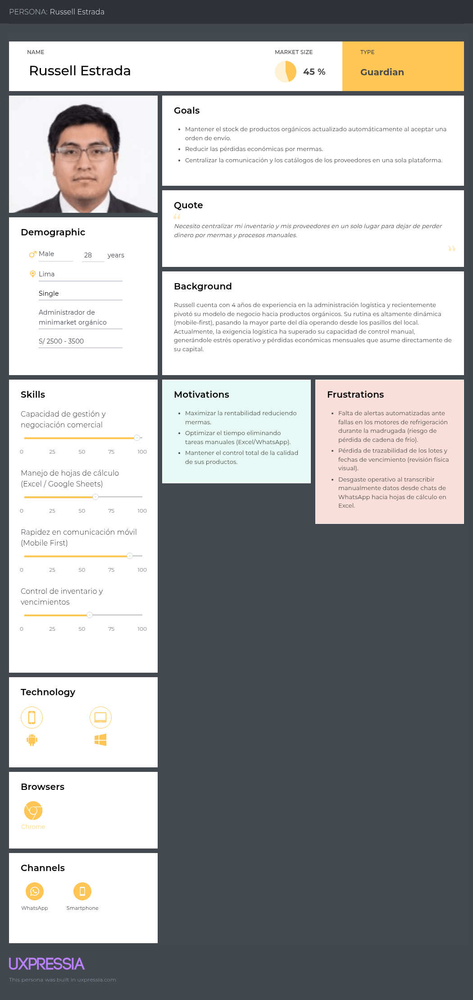

**Segmento 2: Proveedor y Distribuidor B2B (Arquetipo: Marco Antonio Ríos)**

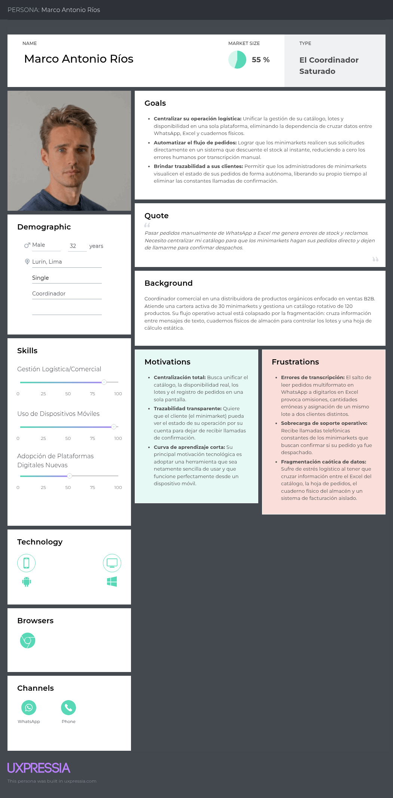

### 2.3.2. User Task Matrix.

Para diseñar una solución que optimice la gestión logística, el abastecimiento y la conservación de productos orgánicos, se identificaron dos tipos de usuarios clave: los administradores de minimarkets, responsables del control de inventarios, prevención de mermas y aprobación de compras; y los proveedores, encargados de gestionar su catálogo comercial, actualizar disponibilidad y responder los pedidos de abastecimiento generando órdenes de envío. El diseño de la plataforma MarketGo se enfoca en facilitar la interacción entre estos dos actores mediante un flujo controlado, asegurando que la coordinación comercial fluya de manera eficiente mientras el minimarket mantiene autoridad exclusiva sobre las modificaciones de sus existencias.

**Tasks vs User Personas**

| Tasks | Administradores de Minimarkets (Frecuencia) | Administradores de Minimarkets (Importancia) | Proveedores B2B (Frecuencia) | Proveedores B2B (Importancia) |
| :--- | :---: | :---: | :---: | :---: |
| Controlar inventario y niveles de stock | Muy frecuente | Alta | No aplica | No aplica |
| Gestionar catálogo propio y disponibilidad | No aplica | No aplica | Muy frecuente | Alta |
| Monitorear temperatura y humedad (IoT) | Muy frecuente | Alta | No aplica | No aplica |
| Controlar lotes y fechas de vencimiento | Muy frecuente | Alta | Frecuente | Alta |
| Consultar catálogo de proveedores conectados | Frecuente | Alta | No aplica | No aplica |
| Crear pedidos de abastecimiento | Frecuente | Alta | No aplica | No aplica |
| Responder pedidos y generar órdenes de envío | No aplica | No aplica | Muy frecuente | Alta |
| Aceptar o rechazar órdenes de envío | Frecuente | Alta | No aplica | No aplica |
| Actualizar inventario tras operaciones | Frecuente | Alta | No aplica | No aplica |
| Realizar seguimiento de pedidos activos | Frecuente | Alta | Muy frecuente | Alta |
| Visualizar dashboard de métricas operativas | Muy frecuente | Alta | Muy frecuente | Alta |
| Gestionar mermas y ofertas de productos en riesgo | Ocasional | Media | No aplica | No aplica |
| Comunicarse y resolver incidencias de logística | Ocasional | Alta | Frecuente | Alta |

La tabla muestra que ambos segmentos coinciden en considerar de alta importancia las tareas relacionadas con el seguimiento de los pedidos, el control de lotes y la visualización de métricas en sus respectivos dashboards. Sin embargo, las responsabilidades operativas están claramente delimitadas por sus roles de negocio. Las tareas más relevantes para los administradores de minimarkets se centran en el control interno del establecimiento, destacando el monitoreo de factores ambientales (temperatura y humedad), la prevención de vencimientos y la decisión final sobre la recepción de mercadería. Por su parte, los proveedores concentran su actividad en la gestión de su oferta y en la respuesta oportuna a los pedidos recibidos. Estas diferencias reflejan el flujo central de MarketGo: el administrador crea el pedido de abastecimiento; el proveedor lo acepta o rechaza y, si lo acepta, genera la orden de envío; finalmente, el administrador acepta o rechaza esa orden, y solo al aceptarla el inventario del minimarket se actualiza automáticamente.
### 2.3.3. User Journey Mapping.

El User Journey Mapping es una herramienta que permite visualizar de forma estructurada la experiencia del usuario a lo largo de su interacción con un producto o servicio. En el caso de MarketGo, realizamos los User Journey Maps en su versión As-Is para los dos segmentos objetivos, identificando los puntos de dolor actuales causados por la dependencia de procesos manuales y canales informales.

**User Journey Map del 1er segmento objetivo – Administradores de Minimarkets**

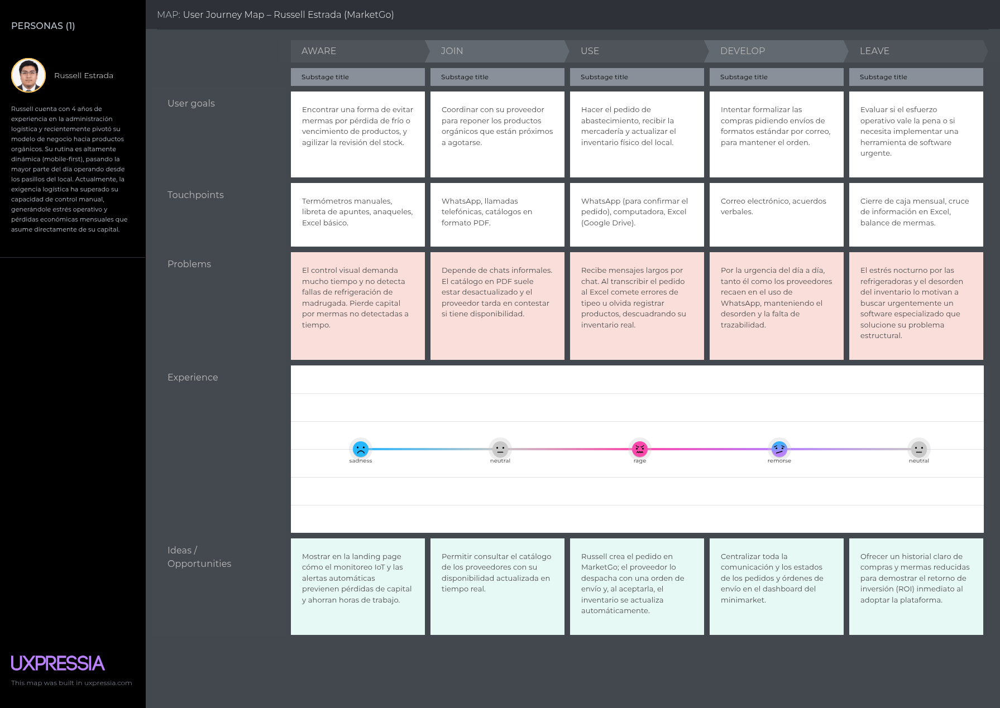

El User Journey Map de Russell Estrada ilustra la experiencia actual del segmento de administradores de minimarkets a lo largo de las cinco etapas. En Aware, Russell busca una forma de evitar mermas por pérdida de frío o vencimiento, pero el control visual le demanda mucho tiempo y lo deja expuesto a fallas mecánicas de madrugada, evidenciando la necesidad de un sistema de alertas automatizado. En Join, comienza a coordinar con proveedores a través de WhatsApp y catálogos en PDF desactualizados, lo que refleja la dependencia de canales informales. Durante el Use, experimenta su mayor punto de frustración al recibir propuestas por chat y tener que transcribirlas manualmente a Excel para actualizar su inventario, un proceso propenso a errores humanos que descuadra su stock real. En Develop, sus intentos por formalizar las compras mediante correos electrónicos no prosperan por la urgencia del día a día, recayendo en el desorden de WhatsApp. Finalmente en Leave, el estrés operativo y las pérdidas de capital acumuladas lo motivan a buscar una solución de software centralizada que automatice su control de calidad y abastecimiento, siendo este el punto de entrada directo para MarketGo.

**User Journey Map del 2do segmento objetivo – Proveedores de Productos Orgánicos**

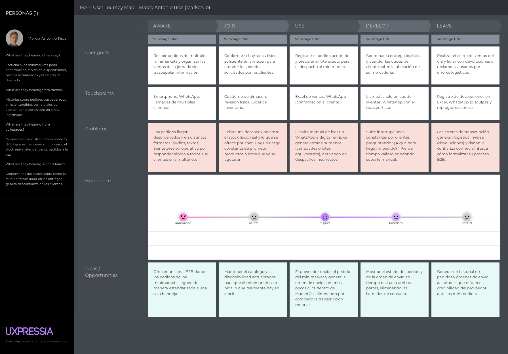

El User Journey Map de Marco Antonio Ríos representa la experiencia actual del segmento de proveedores B2B a lo largo de sus cinco etapas. En la etapa Aware, Marco recibe múltiples solicitudes de abastecimiento desordenadas mediante WhatsApp, sintiéndose abrumado por la presión operativa de responder en simultáneo. En la etapa Join, experimenta tensión al tener que verificar el stock en cuadernos físicos, existiendo una desconexión riesgosa entre lo que ofrece por chat y su disponibilidad real. Durante el Use, alcanza su punto más bajo de experiencia al transcribir los pedidos confirmados de WhatsApp a su Excel de ventas; este salto manual es el causante de errores en cantidades y lotes que derivan en despachos incorrectos. En Develop, la falta de trazabilidad genera que pierda tiempo valioso atendiendo llamadas de clientes que buscan conocer el estado de su entrega. Finalmente en Leave, la logística inversa (devoluciones) generada por errores de transcripción y la necesidad de proyectar mayor profesionalismo comercial lo motivan a buscar una plataforma B2B especializada que estandarice la recepción de pedidos y la generación de órdenes de envío, y brinde seguimiento en tiempo real.

### 2.3.4. Empathy Mapping.

El **Empathy Mapping (Mapa de Empatía)**, desarrollado originalmente por Dave Gray, es una herramienta colaborativa de *Needfinding* que permite profundizar en los aspectos emocionales, cognitivos y de comportamiento de los usuarios. A diferencia del perfil demográfico de un *User Persona*, el mapa de empatía sintetiza los hallazgos cualitativos obteniendo una perspectiva desde "dentro de la cabeza" del cliente.

A partir de las entrevistas de validación realizadas, se estructuraron dos mapas de empatía bajo el lienzo **Empathy Map Canvas de 7 preguntas**, representando a un personaje ficticio clave para cada segmento objetivo de **MarketGo**:

---

##### **Segmento 1: Administrador de Minimarket Orgánico**

* **Personaje:** Russell Estrada
* **Edad / Rol:** 28 años, administrador de un minimarket de productos orgánicos en Lima (arquetipo *Guardian*).

**Mapa de Empatía - Russell Estrada**

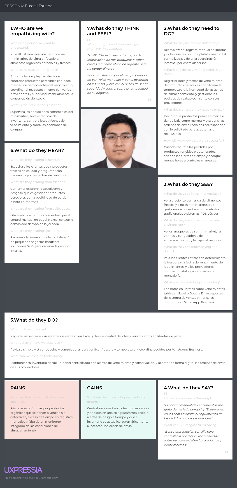

---

##### **Segmento 2: Proveedor y Distribuidor B2B**

* **Personaje:** Marco Antonio Ríos
* **Edad / Rol:** 32 años, coordinador comercial de una distribuidora de productos orgánicos en Lurín que abastece a 30 minimarkets.

**Mapa de Empatía - Marco Antonio Ríos**

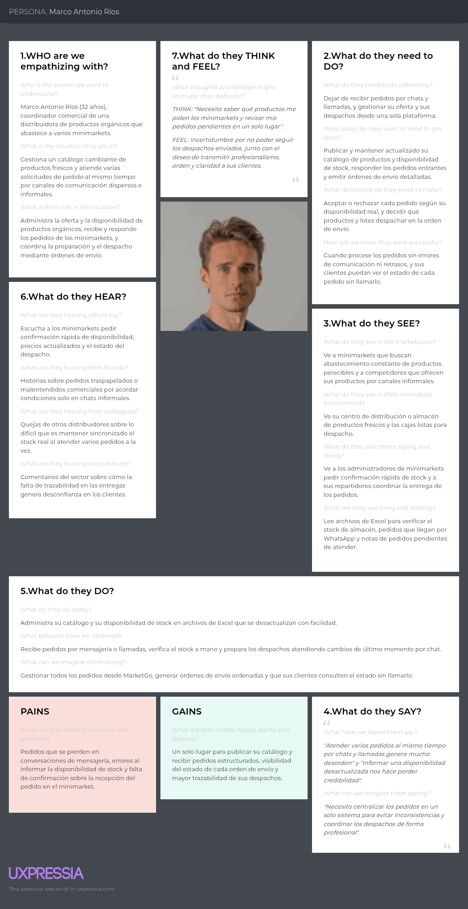

## 2.4. Big Picture EventStorming.
El Big Picture Event Storming nos ayuda a explorar los eventos relacionados al negocio de los minimarkets y sus proveedores de productos orgánicos. Se empezó colocando eventos de dominio relacionados sin importar el orden. Luego, se formaron líneas de tiempo que ayuden a denotar una secuencia de eventos de dominio que posea coherencia con el negocio y sus relaciones con otros eventos. Finalmente, se identificaron los actores que interactúan en el negocio y los puntos de dolor. A continuación, se adjuntan las capturas de pantalla de cada paso realizado para diagramar el Big Picture Event Storming del proyecto:

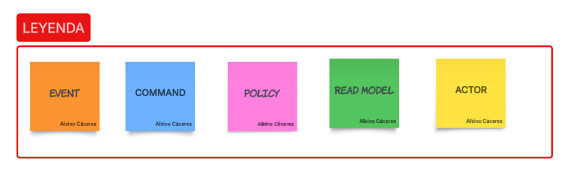

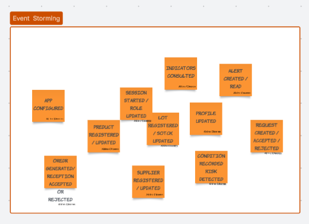

## 2.5. Ubiquitous Language.

A partir del Big Picture Event Storming se identificaron los términos y conceptos que forman el lenguaje ubicuo del dominio de MarketGo. Este glosario asegura que el equipo de desarrollo, los stakeholders y la documentación utilicen exactamente el mismo significado para cada concepto de negocio a lo largo de todo el proyecto.

| Término | Definición |
| :--- | :--- |
| **Administrador (de minimarket)** | Actor responsable de gestionar el inventario, crear pedidos de abastecimiento, aceptar o rechazar órdenes de envío y consultar los indicadores de su negocio dentro de MarketGo. |
| **Proveedor** | Actor B2B que gestiona su catálogo de productos orgánicos, acepta o rechaza los pedidos de abastecimiento y genera órdenes de envío hacia los minimarkets. |
| **Perfil de negocio** | Conjunto de datos que identifican a un administrador o proveedor dentro de la plataforma (razón social, RUC, cobertura, datos de contacto). |
| **Rol** | Nivel de acceso asignado a un usuario (administrador o proveedor) que determina las acciones y vistas disponibles para él dentro del sistema. |
| **Catálogo orgánico** | Read model que consolida todos los productos orgánicos registrados por un proveedor, con su categoría, precio y fecha de expiración validados. |
| **Lote** | Unidad de stock de un producto orgánico registrada con fecha de ingreso, cantidad y fecha de expiración, utilizada para el control de vencimientos. |
| **Stock mínimo** | Umbral configurado por producto que, al ser alcanzado, dispara el evento de stock bajo detectado y genera una alerta automática. |
| **Inventario actual** | Read model que muestra en tiempo real la cantidad disponible de cada producto y lote dentro del almacén del minimarket o proveedor. |
| **Alerta de stock bajo** | Notificación generada automáticamente cuando el inventario de un producto cae por debajo del stock mínimo configurado. |
| **Solicitud / Pedido de abastecimiento (Requisition)** | Petición de abastecimiento creada únicamente por el administrador del minimarket y dirigida a un proveedor, que este puede aceptar o rechazar; su estado se notifica a ambas partes. |
| **Orden de envío (Shipping Order)** | Documento que el proveedor genera a partir de un pedido aceptado, con los productos, cantidades y lotes que serán despachados al minimarket. |
| **Recepción** | Aceptación o rechazo de una orden de envío por parte del administrador; solo si es aceptada se actualiza automáticamente el inventario del minimarket. |
| **Directorio de proveedores** | Read model que agrupa a todos los proveedores registrados y validados (RUC y cobertura) disponibles para un minimarket. |
| **Dashboard** | Vista consolidada de indicadores operativos, distinta según el rol del usuario (administrador o proveedor), que resume el estado general del negocio. |
| **Indicador / KPI** | Métrica operativa calculada por el sistema (por ejemplo, mermas, nivel de stock o pedidos pendientes) y mostrada en el dashboard. |
| **Reporte operativo** | Documento generado por el módulo de Analytics que resume métricas y variaciones de un periodo determinado. |
| **Conservación (Conservation)** | Contexto vinculado al monitoreo de condiciones ambientales (temperatura y humedad) que afectan la calidad de los productos orgánicos almacenados. |
| **Comunicación (Communication)** | Contexto encargado de las notificaciones entre actores (por ejemplo, cambios de estado de un pedido, de una orden de envío o una alerta de inventario). |

---

# Capítulo III: Requirements Specification

## 3.1. User Stories.

### TO-BE Scenario Mapping

#### Administradores de Minimarkets

| Fase | Doing (Qué hace) | Thinking (Qué piensa) | Feeling (Qué siente) |
|------|------------------|-----------------------|----------------------|
| Consulta y revisión de información | Consulta el dashboard común para revisar el inventario, productos, lotes, fechas de vencimiento, condiciones de conservación, pedidos y órdenes de envío del minimarket. | “Necesito encontrar rápidamente la información de mis productos y conocer cuáles requieren atención.” | Organizado y con mayor sensación de control. |
| Gestión y abastecimiento | Identifica necesidades de abastecimiento, consulta los productos ofrecidos por los proveedores y genera pedidos indicando los productos y cantidades requeridas. | “Necesito solicitar los productos adecuados para mantener abastecido el minimarket.” | Atento y enfocado en mantener la disponibilidad de productos. |
| Toma de decisión | Consulta las órdenes de envío generadas por los proveedores y decide aceptarlas o rechazarlas después de revisar los productos y cantidades enviados. | “Necesito verificar que los productos recibidos correspondan con lo solicitado antes de incorporarlos al inventario.” | Responsable y seguro al contar con información centralizada. |
| Seguimiento y control | Consulta el estado de sus pedidos y órdenes de envío. Cuando acepta una orden de envío, los productos recibidos se incorporan automáticamente al inventario del minimarket. | “Necesito conocer cómo avanzan mis pedidos y asegurar que solo los productos recibidos ingresen al inventario.” | Vigilante, con mayor sensación de control y seguridad. |

#### Proveedores de Productos Orgánicos

| Fase | Doing (Qué hace) | Thinking (Qué piensa) | Feeling (Qué siente) |
|------|------------------|-----------------------|----------------------|
| Consulta y revisión de información | Consulta el dashboard común para revisar los productos que ofrece, los pedidos recibidos de los minimarkets y las órdenes de envío relacionadas con sus operaciones. | “Necesito conocer qué productos solicitan los minimarkets y revisar rápidamente mis operaciones pendientes.” | Organizado y con mayor claridad sobre sus operaciones. |
| Gestión de pedidos | Consulta los pedidos recibidos de los minimarkets y decide aceptarlos o rechazarlos según su disponibilidad de productos. | “Necesito verificar si puedo atender correctamente los productos y cantidades solicitadas.” | Atento y responsable al evaluar las solicitudes recibidas. |
| Gestión de órdenes de envío | Para los pedidos aceptados, genera una orden de envío indicando los productos, cantidades y demás información correspondiente al despacho. | “Necesito registrar correctamente lo que voy a enviar para que el minimarket pueda verificarlo al recibirlo.” | Enfocado y seguro al mantener trazabilidad del envío. |
| Seguimiento y control | Consulta el estado de las órdenes de envío generadas y verifica si fueron aceptadas o rechazadas por los administradores de los minimarkets. | “Necesito saber si los productos enviados fueron aceptados y mantener un registro de mis operaciones.” | Tranquilo y con mayor sensación de control y trazabilidad. |

### Epics

| EPIC ID | Titulo | Descripcion |
|--------|--------|-------------|
| EP-01 | Gestión de inventario | Permite registrar, visualizar, buscar y actualizar la información de los productos disponibles en el inventario del minimarket, incluyendo cantidades y datos asociados. |
| EP-02 | Gestión de lotes y vencimientos | Permite controlar los lotes, fechas de vencimiento y trazabilidad de los productos registrados en el inventario. |
| EP-03 | Gestión de conservación | Permite registrar y visualizar las condiciones de conservación de los productos, así como generar alertas cuando se detecten condiciones de riesgo. |
| EP-04 | Gestión de abastecimiento | Permite gestionar el flujo de abastecimiento mediante pedidos generados por los administradores de minimarkets y órdenes de envío generadas por los proveedores, incluyendo su aceptación, rechazo y seguimiento. |
| EP-05 | Gestión de proveedores y productos | Permite consultar y administrar la información relacionada con proveedores y los productos que ofrecen dentro de la plataforma. |
| EP-06 | Gestión de usuarios y seguridad | Permite registrar usuarios, gestionar roles y controlar el acceso a las funcionalidades mediante permisos según el segmento. |
| EP-07 | Análisis y control de gestión | Permite visualizar indicadores, historial de operaciones, alertas e información consolidada para facilitar la toma de decisiones. |
| EP-08 | Navegación e Información Pública | Permite a los usuarios no autenticados (visitantes) explorar la propuesta de valor de la plataforma, consultar información pública de proveedores/catálogos de demostración y solicitar registro o información comercial. |

### User Stories

| US ID | Título | Descripción | Criterio de Aceptación | Relacionado con (EPIC ID) |
|------|--------|-------------|------------------------|--------------------------|
| US 001 | Registrar producto en inventario | **Como** administrador de minimarket, **Quiero** registrar productos en el inventario, **Para** mantener actualizada la información de los productos disponibles. | **Escenario 1: Registro correcto** **Dado** que el administrador completa los campos obligatorios del producto, **Cuando** guarda el registro, **Entonces** el sistema registra el producto con un identificador único y estado activo.  **Escenario 2: Datos incompletos** **Dado** que faltan campos obligatorios, **Cuando** intenta guardar el producto, **Entonces** el sistema bloquea el registro y muestra las validaciones correspondientes. | EP-01 |
| US 002 | Visualizar inventario | **Como** administrador de minimarket, **Quiero** visualizar los productos registrados, **Para** conocer el estado actual de mi inventario. | **Escenario 1: Inventario con datos** **Dado** que existen productos registrados, **Cuando** accede al inventario, **Entonces** el sistema muestra los productos con cantidad, lote, vencimiento y estado correspondiente.  **Escenario 2: Inventario vacío** **Dado** que no existen productos registrados, **Cuando** accede al inventario, **Entonces** el sistema muestra un mensaje indicando que no existen productos registrados. | EP-01 |
| US 003 | Buscar productos en inventario | **Como** administrador de minimarket, **Quiero** buscar productos dentro del inventario, **Para** encontrarlos rápidamente. | **Escenario 1: Coincidencia encontrada** **Dado** que existen productos relacionados con el término de búsqueda, **Cuando** realiza la búsqueda, **Entonces** el sistema muestra los productos coincidentes.  **Escenario 2: Sin coincidencias** **Dado** que no existen productos coincidentes, **Cuando** realiza la búsqueda, **Entonces** el sistema muestra un mensaje informativo. | EP-01 |
| US 004 | Filtrar inventario | **Como** administrador de minimarket, **Quiero** filtrar productos por categoría, estado o vencimiento, **Para** identificar rápidamente productos que requieren atención. | **Escenario 1: Filtro aplicado** **Dado** que selecciona uno o más criterios, **Cuando** aplica el filtro, **Entonces** el sistema muestra únicamente los productos que cumplen los criterios.  **Escenario 2: Sin resultados** **Dado** que no existen productos que cumplan los criterios, **Cuando** aplica el filtro, **Entonces** el sistema muestra un mensaje indicando que no existen coincidencias. | EP-01 / EP-02 |
| US 005 | Actualizar inventario | **Como** administrador de minimarket, **Quiero** actualizar la información de los productos, **Para** mantener el inventario correctamente registrado. | **Escenario 1: Actualización correcta** **Dado** que el producto existe y el administrador tiene permisos de escritura, **Cuando** modifica información permitida, **Entonces** el sistema guarda los cambios correctamente.  **Escenario 2: Información inválida** **Dado** que los datos ingresados no cumplen las validaciones, **Cuando** intenta guardar los cambios, **Entonces** el sistema bloquea la actualización y muestra el error correspondiente. | EP-01 |
| US 006 | Registrar lote | **Como** administrador de minimarket, **Quiero** registrar lotes de productos, **Para** mantener la trazabilidad de los productos almacenados. | **Escenario 1: Registro correcto** **Dado** que existe un producto registrado, **Cuando** registra un lote con los datos obligatorios, **Entonces** el sistema crea el lote y lo relaciona con el producto correspondiente.  **Escenario 2: Datos incompletos** **Dado** que falta información del lote, **Cuando** intenta registrarlo, **Entonces** el sistema solicita completar los campos obligatorios. | EP-02 |
| US 007 | Consultar lotes | **Como** administrador de minimarket, **Quiero** consultar los lotes registrados, **Para** conocer el origen y estado de los productos. | **Escenario 1: Lotes disponibles** **Dado** que existen lotes registrados, **Cuando** consulta la información del producto, **Entonces** el sistema muestra sus lotes asociados y datos relevantes.  **Escenario 2: Sin lotes** **Dado** que el producto no tiene lotes registrados, **Cuando** consulta la información, **Entonces** el sistema muestra un mensaje indicando que no existen lotes asociados. | EP-02 |
| US 008 | Controlar fechas de vencimiento | **Como** administrador de minimarket, **Quiero** visualizar las fechas de vencimiento de los productos, **Para** identificar productos próximos a vencer. | **Escenario 1: Productos próximos a vencer** **Dado** que existen productos cuya fecha de vencimiento se encuentra dentro del periodo de alerta, **Cuando** consulta el inventario, **Entonces** el sistema los identifica como próximos a vencer.  **Escenario 2: Productos sin riesgo** **Dado** que las fechas de vencimiento se encuentran fuera del periodo de alerta, **Cuando** consulta el inventario, **Entonces** el sistema los muestra sin alerta de vencimiento. | EP-02 |
| US 009 | Generar alertas de vencimiento | **Como** administrador de minimarket, **Quiero** recibir alertas sobre productos próximos a vencer, **Para** tomar acciones antes de que se generen pérdidas. | **Escenario 1: Producto en riesgo** **Dado** que un producto se encuentra dentro del umbral de vencimiento configurado, **Cuando** el sistema procesa la información, **Entonces** genera una alerta asociada al producto o lote.  **Escenario 2: Sin productos en riesgo** **Dado** que ningún producto se encuentra dentro del umbral, **Cuando** se ejecuta la validación, **Entonces** el sistema no genera nuevas alertas. | EP-02 |
| US 010 | Consultar condiciones de conservación | **Como** administrador de minimarket, **Quiero** consultar las condiciones de conservación de los productos, **Para** identificar posibles riesgos de deterioro. | **Escenario 1: Datos disponibles** **Dado** que existen registros de temperatura y humedad, **Cuando** consulta el módulo de conservación, **Entonces** el sistema muestra los valores registrados y el estado correspondiente.  **Escenario 2: Sin registros** **Dado** que no existen datos disponibles, **Cuando** consulta el módulo, **Entonces** el sistema muestra un mensaje informativo. | EP-03 |
| US 011 | Monitorear temperatura y humedad | **Como** administrador de minimarket, **Quiero** visualizar registros de temperatura y humedad, **Para** conocer las condiciones de almacenamiento de los productos. | **Escenario 1: Valores dentro del rango** **Dado** que existen datos de monitoreo, **Cuando** el sistema procesa los valores, **Entonces** muestra los registros y los identifica como normales cuando se encuentran dentro del rango establecido.  **Escenario 2: Valores fuera del rango** **Dado** que los valores superan los rangos establecidos, **Cuando** el sistema procesa los datos, **Entonces** identifica la condición como riesgosa. | EP-03 |
| US 012 | Generar alertas de conservación | **Como** administrador de minimarket, **Quiero** recibir alertas cuando las condiciones de conservación sean inadecuadas, **Para** reaccionar oportunamente ante posibles riesgos de deterioro. | **Escenario 1: Condición riesgosa** **Dado** que la temperatura o humedad se encuentra fuera del rango permitido, **Cuando** el sistema detecta la condición, **Entonces** genera una alerta asociada al producto o zona correspondiente.  **Escenario 2: Condición normal** **Dado** que los valores se encuentran dentro del rango, **Cuando** el sistema realiza la validación, **Entonces** no genera una alerta de riesgo. | EP-03 |
| US 013 | Registrar merma | **Como** administrador de minimarket, **Quiero** registrar productos que hayan sufrido merma, **Para** mantener un historial de pérdidas de inventario. | **Escenario 1: Registro correcto** **Dado** que existe un producto registrado en inventario, **Cuando** registra la cantidad y motivo de la merma, **Entonces** el sistema guarda el registro y actualiza la información correspondiente.  **Escenario 2: Cantidad inválida** **Dado** que la cantidad de merma supera la cantidad disponible, **Cuando** intenta registrarla, **Entonces** el sistema bloquea la operación y muestra una validación. | EP-01 / EP-07 |
| US 014 | Registrar oferta de productos | **Como** administrador de minimarket, **Quiero** registrar productos disponibles como oferta, **Para** promocionar productos con stock disponible y mantener trazabilidad sobre su salida comercial del inventario. | **Escenario 1: Registro correcto** **Dado** que existen productos disponibles para oferta, **Cuando** registra el producto como oferta, **Entonces** el sistema guarda la oferta y actualiza el inventario.  **Escenario 2: Cantidad insuficiente** **Dado** que la cantidad solicitada supera el stock disponible, **Cuando** intenta registrar la oferta, **Entonces** el sistema impide la operación. | EP-01 / EP-07 |
| US 015 | Consultar productos de proveedores | **Como** administrador de minimarket, **Quiero** consultar los productos ofrecidos por los proveedores, **Para** identificar opciones disponibles para abastecer el minimarket. | **Escenario 1: Productos disponibles** **Dado** que existen productos ofrecidos por proveedores, **Cuando** accede al catálogo, **Entonces** el sistema muestra los productos y la información disponible para la operación.  **Escenario 2: Sin productos** **Dado** que no existen productos disponibles, **Cuando** accede al catálogo, **Entonces** el sistema muestra un mensaje informativo. | EP-05 |
| US 016 | Registrar productos ofrecidos | **Como** proveedor de productos orgánicos, **Quiero** registrar los productos que ofrezco, **Para** ponerlos a disposición de los minimarkets. | **Escenario 1: Registro correcto** **Dado** que el proveedor completa los datos obligatorios del producto, **Cuando** guarda el registro, **Entonces** el producto queda disponible para consulta según las reglas de la plataforma.  **Escenario 2: Datos incompletos** **Dado** que faltan datos obligatorios, **Cuando** intenta guardar el producto, **Entonces** el sistema bloquea el registro y muestra las validaciones. | EP-05 |
| US 017 | Consultar productos ofrecidos | **Como** proveedor de productos orgánicos, **Quiero** consultar los productos que tengo registrados, **Para** mantener control sobre mi oferta dentro de la plataforma. | **Escenario 1: Productos registrados** **Dado** que existen productos asociados al proveedor, **Cuando** consulta su catálogo, **Entonces** el sistema muestra los productos correspondientes.  **Escenario 2: Sin productos** **Dado** que no existen productos registrados, **Cuando** consulta el catálogo, **Entonces** el sistema muestra un mensaje informativo. | EP-05 |
| US 018 | Crear pedido de abastecimiento | **Como** administrador de minimarket, **Quiero** crear un pedido de abastecimiento dirigido a un proveedor, **Para** solicitar los productos que necesita el minimarket. | **Escenario 1: Pedido creado** **Dado** que el administrador selecciona un proveedor, productos y cantidades válidas, **Cuando** confirma el pedido, **Entonces** el sistema crea el pedido con un identificador único y estado “Pendiente”.  **Escenario 2: Datos inválidos** **Dado** que faltan productos, cantidades o proveedor destino, **Cuando** intenta confirmar el pedido, **Entonces** el sistema bloquea la operación y muestra las validaciones correspondientes. | EP-04 |
| US 019 | Consultar pedidos de abastecimiento | **Como** usuario autorizado, **Quiero** consultar los pedidos de abastecimiento, **Para** conocer las solicitudes realizadas o recibidas y su estado actual. | **Escenario 1: Pedidos disponibles** **Dado** que existen pedidos registrados, **Cuando** accede al módulo de pedidos, **Entonces** el sistema muestra los pedidos correspondientes según su rol y permisos.  **Escenario 2: Sin pedidos** **Dado** que no existen pedidos registrados, **Cuando** accede al módulo, **Entonces** el sistema muestra un mensaje informativo. | EP-04 |
| US 020 | Aceptar o rechazar pedido | **Como** proveedor de productos orgánicos, **Quiero** aceptar o rechazar los pedidos recibidos de los minimarkets, **Para** indicar si puedo atender los productos y cantidades solicitadas. | **Escenario 1: Pedido aceptado** **Dado** que existe un pedido pendiente dirigido al proveedor, **Cuando** el proveedor acepta el pedido, **Entonces** el sistema cambia su estado a “Aceptado” y permite generar una orden de envío asociada.  **Escenario 2: Pedido rechazado** **Dado** que el proveedor no puede atender el pedido, **Cuando** registra el rechazo y su motivo, **Entonces** el sistema cambia el estado a “Rechazado” y conserva el motivo. | EP-04 |
| US 021 | Crear orden de envío | **Como** proveedor de productos orgánicos, **Quiero** generar una orden de envío asociada a un pedido aceptado, **Para** registrar los productos y cantidades que serán enviados al minimarket. | **Escenario 1: Orden creada** **Dado** que existe un pedido aceptado, **Cuando** el proveedor registra los productos, cantidades y datos requeridos del envío, **Entonces** el sistema crea la orden de envío con un identificador único y estado “Pendiente de recepción”.  **Escenario 2: Pedido no aceptado** **Dado** que el pedido se encuentra pendiente o rechazado, **Cuando** intenta generar una orden de envío, **Entonces** el sistema bloquea la operación. | EP-04 |
| US 022 | Consultar órdenes de envío | **Como** usuario autorizado, **Quiero** consultar las órdenes de envío, **Para** conocer los envíos generados y su estado actual. | **Escenario 1: Órdenes disponibles** **Dado** que existen órdenes de envío asociadas al usuario, **Cuando** accede al módulo de órdenes de envío, **Entonces** el sistema muestra las órdenes correspondientes según su rol y permisos.  **Escenario 2: Sin órdenes** **Dado** que no existen órdenes de envío disponibles, **Cuando** accede al módulo, **Entonces** el sistema muestra un mensaje informativo. | EP-04 |
| US 023 | Aceptar orden de envío | **Como** administrador de minimarket, **Quiero** aceptar una orden de envío recibida, **Para** confirmar la recepción e incorporar los productos recibidos al inventario. | **Escenario 1: Orden aceptada** **Dado** que existe una orden de envío pendiente de recepción, **Cuando** el administrador verifica los productos y acepta la orden, **Entonces** el sistema cambia su estado a “Aceptada” e incorpora automáticamente los productos y cantidades correspondientes al inventario del minimarket.  **Escenario 2: Orden ya procesada** **Dado** que la orden ya fue aceptada o rechazada, **Cuando** intenta aceptarla nuevamente, **Entonces** el sistema bloquea la operación para evitar duplicidades en el inventario. | EP-01 / EP-04 |
| US 024 | Rechazar orden de envío | **Como** administrador de minimarket, **Quiero** rechazar una orden de envío, **Para** evitar incorporar al inventario productos que no correspondan con el envío esperado. | **Escenario 1: Rechazo correcto** **Dado** que existe una orden pendiente de recepción, **Cuando** el administrador registra el rechazo y su motivo, **Entonces** el sistema cambia el estado de la orden a “Rechazada” sin modificar el inventario.  **Escenario 2: Sin motivo** **Dado** que el administrador intenta rechazar la orden sin indicar un motivo, **Cuando** confirma la acción, **Entonces** el sistema solicita completar el motivo antes de procesar el rechazo. | EP-04 |
| US 025 | Consultar historial de abastecimiento | **Como** usuario autorizado, **Quiero** consultar el historial de pedidos y órdenes de envío, **Para** mantener trazabilidad de las operaciones de abastecimiento realizadas. | **Escenario 1: Historial disponible** **Dado** que existen pedidos y órdenes de envío procesados, **Cuando** accede al historial, **Entonces** el sistema muestra las operaciones correspondientes según su rol, incluyendo fecha, participantes, productos y estados.  **Escenario 2: Historial vacío** **Dado** que no existen operaciones procesadas, **Cuando** accede al historial, **Entonces** el sistema muestra un mensaje informativo. | EP-04 / EP-07 |
| US 026 | Registrar usuario | **Como** usuario administrador autorizado, **Quiero** registrar usuarios en el sistema, **Para** permitir el acceso controlado a MarketGo. | **Escenario 1: Registro válido** **Dado** que el formulario contiene información válida, **Cuando** registra al usuario, **Entonces** el sistema crea la cuenta y asigna el rol correspondiente.  **Escenario 2: Datos inválidos** **Dado** que existen datos incompletos o duplicados, **Cuando** intenta registrar al usuario, **Entonces** el sistema bloquea el registro y muestra las validaciones correspondientes. | EP-06 |
| US 027 | Inicio de sesión | **Como** usuario, **Quiero** iniciar sesión, **Para** acceder al dashboard de MarketGo según mis permisos. | **Escenario 1: Credenciales correctas** **Dado** que el usuario ingresa credenciales válidas, **Cuando** inicia sesión, **Entonces** el sistema autentica al usuario y muestra el dashboard común con las funcionalidades correspondientes a su rol.  **Escenario 2: Credenciales incorrectas** **Dado** que las credenciales ingresadas no son válidas, **Cuando** intenta iniciar sesión, **Entonces** el sistema rechaza el acceso y muestra un mensaje de error. | EP-06 |
| US 028 | Gestionar permisos por rol | **Como** usuario administrador autorizado, **Quiero** gestionar los permisos asociados a los roles, **Para** controlar las acciones que cada segmento puede realizar. | **Escenario 1: Permisos aplicados** **Dado** que existe un usuario con un rol asignado, **Cuando** accede al sistema, **Entonces** únicamente puede ejecutar las funcionalidades permitidas para su rol.  **Escenario 2: Acción no permitida** **Dado** que el usuario intenta ejecutar una acción fuera de sus permisos, **Cuando** realiza la acción, **Entonces** el sistema bloquea la operación. | EP-06 |
| US 029 | Controlar acceso según operación | **Como** usuario de MarketGo, **Quiero** que las acciones disponibles en pedidos, órdenes de envío e inventario dependan de mi rol, **Para** evitar modificaciones no autorizadas. | **Escenario 1: Administrador de minimarket** **Dado** que el usuario tiene rol de administrador de minimarket, **Cuando** accede a MarketGo, **Entonces** puede gestionar sus pedidos e inventario y aceptar o rechazar órdenes de envío, pero no modificar directamente las órdenes creadas por el proveedor.  **Escenario 2: Proveedor** **Dado** que el usuario tiene rol de proveedor, **Cuando** accede a MarketGo, **Entonces** puede consultar y aceptar o rechazar pedidos recibidos y gestionar sus órdenes de envío, pero no modificar directamente el inventario del minimarket. | EP-01 / EP-04 / EP-06 |
| US 030 | Dashboard general | **Como** usuario de MarketGo, **Quiero** visualizar un dashboard común con información relevante según mi rol, **Para** consultar rápidamente el estado de mis operaciones. | **Escenario 1: Administrador de minimarket** **Dado** que el usuario tiene rol de administrador de minimarket, **Cuando** accede al dashboard, **Entonces** el sistema muestra información relevante de inventario, conservación, pedidos, órdenes de envío y alertas correspondientes a su operación.  **Escenario 2: Proveedor** **Dado** que el usuario tiene rol de proveedor, **Cuando** accede al mismo dashboard, **Entonces** el sistema muestra información relevante de productos ofrecidos, pedidos recibidos y órdenes de envío según sus permisos. | EP-07 |
| US 031 | Explorar propuesta de valor en landing page | **Como** visitante, **Quiero** visualizar la página principal e informativa de MarketGo, **Para** entender la propuesta de valor y los beneficios del sistema antes de registrarme. | **Escenario 1: Navegación pública** **Dado** que un usuario sin sesión activa accede a la URL principal, **Cuando** navega por el sitio, **Entonces** el sistema le despliega la información del servicio, beneficios para minimarkets y proveedores, y accesos visibles para iniciar sesión o registrarse.  **Escenario 2: Redirección de autenticado** **Dado** que un usuario ya ha iniciado sesión, **Cuando** ingresa a la landing page, **Entonces** el sistema le ofrece un acceso directo al Dashboard. | EP-08 |
| US 032 | Consultar planes de suscripción | **Como** visitante, **Quiero** visualizar los planes de suscripción de MarketGo (Básico, Profesional y Empresarial) con sus precios y funcionalidades incluidas, **Para** elegir el plan que mejor se adapte al tamaño de mi minimarket o distribuidora antes de registrarme. | **Escenario 1: Consulta de planes** **Dado** que el visitante se encuentra en la landing page, **Cuando** accede a la sección de planes, **Entonces** el sistema muestra los planes Básico, Profesional y Empresarial con su precio mensual, las funcionalidades incluidas y el segmento recomendado.  **Escenario 2: Selección de un plan** **Dado** que el visitante está revisando los planes, **Cuando** presiona el botón de suscripción de un plan, **Entonces** el sistema lo redirige a la pantalla de registro con el plan seleccionado. | EP-08 |
| US 033 | Solicitar información de registro o demo | **Como** visitante, **Quiero** enviar un formulario de contacto o solicitud de demo, **Para** recibir atención personalizada y evaluar la adopción de MarketGo en mi negocio. | **Escenario 1: Envío con datos válidos** **Dado** que el visitante completa el formulario público (nombre, correo, tipo de negocio y teléfono), **Cuando** confirma el envío, **Entonces** el sistema guarda la solicitud y muestra un mensaje de confirmación.  **Escenario 2: Formulario incompleto** **Dado** que faltan campos obligatorios, **Cuando** intenta enviar el formulario, **Entonces** el sistema bloquea el envío y resalta los campos requeridos. | EP-06 / EP-08 |

### Technical Stories

| TS ID | Título | Descripción | Criterios de Aceptación | Relacionado con (EPIC ID) |
|------|--------|-------------|------------------------|--------------------------|
| TS-IAM-001 | Sign-in API | **Como** frontend developer, **Quiero** autenticar usuarios mediante una API de inicio de sesión, **Para** obtener las credenciales de sesión y permisos correspondientes. | **Escenario 1: Credenciales válidas** **Dado** que el usuario proporciona credenciales válidas, **Cuando** la API procesa la solicitud, **Entonces** responde `200 OK` con la información básica del usuario, rol y token de autenticación.  **Escenario 2: Credenciales inválidas** **Dado** que las credenciales no son válidas, **Cuando** se solicita el inicio de sesión, **Entonces** la API responde con un error controlado sin emitir un token. | EP-06 |
| TS-IAM-002 | Sign-up API | **Como** frontend developer, **Quiero** registrar usuarios mediante una API, **Para** habilitar el acceso controlado a MarketGo. | **Escenario 1: Registro válido** **Dado** un payload con los datos obligatorios, **Cuando** la API crea el usuario, **Entonces** responde `201 Created` con los datos básicos del usuario.  **Escenario 2: Registro inválido** **Dado** que existen datos incompletos o duplicados, **Cuando** la API valida la solicitud, **Entonces** responde `400 Bad Request` con información de la validación. | EP-06 |
| TS-IAM-003 | Users directory API | **Como** frontend developer, **Quiero** consultar y registrar usuarios mediante la API, **Para** administrar los usuarios autorizados de MarketGo. | **Escenario 1: Listado** **Dado** que existen usuarios registrados, **Cuando** se consulta el recurso de usuarios, **Entonces** la API responde una colección de usuarios con sus roles y estados.  **Escenario 2: Creación** **Dado** un payload válido, **Cuando** se registra el usuario, **Entonces** la API responde con el recurso creado. | EP-06 |
| TS-IAM-004 | User detail and update API | **Como** frontend developer, **Quiero** consultar y actualizar usuarios mediante la API, **Para** mostrar su información y mantener sus roles o estados actualizados. | **Escenario 1: Usuario encontrado** **Dado** un identificador existente, **Cuando** se consulta el detalle, **Entonces** la API responde `200 OK`.  **Escenario 2: Actualización** **Dado** cambios válidos, **Cuando** se ejecuta la actualización, **Entonces** persiste los campos permitidos y devuelve el usuario actualizado. | EP-06 |
| TS-PROF-001 | Profile read and update API | **Como** frontend developer, **Quiero** consultar y actualizar el perfil del usuario o negocio, **Para** mostrar información actualizada dentro de MarketGo. | **Escenario 1: Perfil disponible** **Dado** un perfil existente, **Cuando** se consulta el recurso, **Entonces** la API responde la información del perfil.  **Escenario 2: Perfil actualizado** **Dado** datos válidos, **Cuando** se actualiza el perfil, **Entonces** la API devuelve el perfil actualizado. | EP-06 |
| TS-PROD-001 | Products catalog API | **Como** frontend developer, **Quiero** consultar y registrar productos mediante la API, **Para** alimentar el inventario y el catálogo de productos ofrecidos. | **Escenario 1: Listado** **Dado** que existen productos registrados, **Cuando** se consulta el catálogo, **Entonces** la API responde nombre, categoría, unidad e información disponible.  **Escenario 2: Creación** **Dado** datos válidos, **Cuando** se registra un producto, **Entonces** la API responde `201 Created`. | EP-01 / EP-05 |
| TS-PROD-002 | Product detail and update API | **Como** frontend developer, **Quiero** consultar y actualizar productos, **Para** mantener la información del catálogo y del inventario actualizada. | **Escenario 1: Producto encontrado** **Dado** un identificador existente, **Cuando** se consulta el detalle, **Entonces** responde la información del producto.  **Escenario 2: Actualización** **Dado** datos válidos, **Cuando** se actualiza el producto, **Entonces** persiste los cambios permitidos. | EP-01 / EP-05 |
| TS-INV-001 | Inventory list and create API | **Como** frontend developer, **Quiero** consultar y registrar elementos del inventario, **Para** mostrar y mantener actualizado el stock del minimarket. | **Escenario 1: Listado de inventario** **Dado** que existen productos en inventario, **Cuando** se consulta el recurso, **Entonces** responde cantidad, producto, lote, vencimiento y estado.  **Escenario 2: Registro** **Dado** datos válidos, **Cuando** se crea un registro de inventario, **Entonces** la API responde el recurso creado. | EP-01 |
| TS-INV-002 | Inventory update API | **Como** frontend developer, **Quiero** actualizar los registros de inventario, **Para** reflejar cambios en las cantidades y datos de los productos. | **Escenario 1: Actualización válida** **Dado** un producto existente y un usuario autorizado, **Cuando** se ejecuta la actualización, **Entonces** la API modifica el registro y devuelve la información actualizada.  **Escenario 2: Usuario no autorizado** **Dado** que el usuario no tiene permisos de escritura, **Cuando** intenta actualizar el inventario, **Entonces** la API rechaza la operación. | EP-01 / EP-06 |
| TS-INV-003 | Inventory search and filter API | **Como** frontend developer, **Quiero** consultar el inventario utilizando filtros, **Para** implementar búsquedas por producto, categoría, estado o vencimiento. | **Escenario 1: Resultados encontrados** **Dado** que existen registros que cumplen los criterios, **Cuando** se ejecuta la consulta, **Entonces** la API responde únicamente los registros coincidentes.  **Escenario 2: Sin resultados** **Dado** que no existen coincidencias, **Cuando** se ejecuta la consulta, **Entonces** responde una colección vacía sin generar errores. | EP-01 / EP-02 |
| TS-LOT-001 | Lots API | **Como** frontend developer, **Quiero** consultar y registrar lotes, **Para** implementar la trazabilidad de los productos. | **Escenario 1: Lote creado** **Dado** un producto y datos válidos del lote, **Cuando** se envía la solicitud, **Entonces** la API responde `201 Created` con el lote asociado al producto.  **Escenario 2: Consulta** **Dado** que existen lotes registrados, **Cuando** se consulta el recurso, **Entonces** responde los lotes relacionados con el producto correspondiente. | EP-02 |
| TS-LOT-002 | Lot detail and update API | **Como** frontend developer, **Quiero** consultar y actualizar información de lotes, **Para** mantener actualizada la trazabilidad de los productos. | **Escenario 1: Lote encontrado** **Dado** un identificador válido, **Cuando** se consulta el lote, **Entonces** responde la información correspondiente.  **Escenario 2: Actualización** **Dado** datos válidos, **Cuando** se actualiza el lote, **Entonces** la API devuelve la información actualizada. | EP-02 |
| TS-EXP-001 | Expiration tracking API | **Como** frontend developer, **Quiero** consultar productos y lotes próximos a vencer, **Para** alimentar las alertas de vencimiento. | **Escenario 1: Productos en riesgo** **Dado** que existen productos dentro del umbral de vencimiento, **Cuando** se consulta el recurso, **Entonces** la API devuelve los productos y lotes correspondientes.  **Escenario 2: Sin riesgos** **Dado** que no existen productos próximos a vencer, **Cuando** se consulta el recurso, **Entonces** devuelve una colección vacía. | EP-02 |
| TS-CON-001 | Conservation monitoring API | **Como** frontend developer, **Quiero** consultar registros de temperatura y humedad, **Para** mostrar las condiciones de conservación de los productos. | **Escenario 1: Datos disponibles** **Dado** que existen registros de monitoreo, **Cuando** se consulta la API, **Entonces** responde los valores registrados con fecha y estado.  **Escenario 2: Sin datos** **Dado** que no existen registros, **Cuando** se realiza la consulta, **Entonces** responde una colección vacía. | EP-03 |
| TS-CON-002 | Conservation alerts API | **Como** frontend developer, **Quiero** consultar las alertas generadas por condiciones de conservación, **Para** mostrarlas al administrador del minimarket. | **Escenario 1: Condición riesgosa** **Dado** que existen valores fuera del rango establecido, **Cuando** el sistema procesa los datos, **Entonces** genera y expone una alerta asociada.  **Escenario 2: Condición normal** **Dado** que los valores están dentro del rango, **Cuando** se procesa la información, **Entonces** no se genera una alerta de riesgo. | EP-03 |
| TS-SUP-001 | Supplier directory API | **Como** frontend developer, **Quiero** consultar y registrar proveedores, **Para** mantener disponible la información necesaria para el abastecimiento. | **Escenario 1: Proveedor creado** **Dado** que se envían datos válidos, **Cuando** se registra el proveedor, **Entonces** la API responde `201 Created`.  **Escenario 2: Listado** **Dado** que existen proveedores registrados, **Cuando** se consulta el recurso, **Entonces** responde la colección correspondiente. | EP-05 |
| TS-SUP-002 | Supplier products API | **Como** frontend developer, **Quiero** consultar los productos ofrecidos por cada proveedor, **Para** mostrar el catálogo disponible para los minimarkets. | **Escenario 1: Productos disponibles** **Dado** que el proveedor tiene productos registrados, **Cuando** se consulta su catálogo, **Entonces** la API responde los productos disponibles.  **Escenario 2: Sin productos** **Dado** que no existen productos registrados, **Cuando** se consulta el catálogo, **Entonces** responde una colección vacía. | EP-05 |
| TS-ORD-001 | Supply requests API | **Como** frontend developer, **Quiero** consultar y crear pedidos de abastecimiento mediante la API, **Para** permitir que los administradores soliciten productos a los proveedores. | **Escenario 1: Pedido creado** **Dado** un administrador, proveedor, productos y cantidades válidas, **Cuando** se registra el pedido, **Entonces** la API responde `201 Created` con un identificador único y estado “Pendiente”.  **Escenario 2: Consulta según rol** **Dado** que existen pedidos, **Cuando** se consulta el recurso, **Entonces** responde los pedidos realizados por el administrador o recibidos por el proveedor según el usuario autenticado. | EP-04 |
| TS-ORD-002 | Supply request response API | **Como** frontend developer, **Quiero** procesar la aceptación o rechazo de pedidos, **Para** permitir que los proveedores respondan a las solicitudes de los minimarkets. | **Escenario 1: Aceptación** **Dado** un pedido pendiente y un proveedor autorizado, **Cuando** acepta el pedido, **Entonces** la API cambia su estado a “Aceptado”.  **Escenario 2: Rechazo** **Dado** un pedido pendiente, **Cuando** el proveedor registra el rechazo y su motivo, **Entonces** la API cambia su estado a “Rechazado” y conserva el motivo. | EP-04 |
| TS-ORD-003 | Shipping orders API | **Como** frontend developer, **Quiero** consultar y crear órdenes de envío, **Para** registrar los envíos generados por los proveedores a partir de pedidos aceptados. | **Escenario 1: Orden creada** **Dado** un pedido aceptado y un proveedor autorizado, **Cuando** registra los datos del envío, **Entonces** la API crea una orden asociada al pedido con estado “Pendiente de recepción”.  **Escenario 2: Pedido no válido** **Dado** un pedido pendiente o rechazado, **Cuando** intenta crear una orden de envío, **Entonces** la API rechaza la operación. | EP-04 |
| TS-ORD-004 | Shipping order reception API | **Como** frontend developer, **Quiero** procesar la aceptación o rechazo de órdenes de envío, **Para** confirmar la recepción de productos y actualizar el inventario cuando corresponda. | **Escenario 1: Orden aceptada** **Dado** una orden pendiente y un administrador autorizado, **Cuando** acepta la orden, **Entonces** la API cambia su estado a “Aceptada” e incorpora automáticamente los productos y cantidades correspondientes al inventario.  **Escenario 2: Orden rechazada** **Dado** una orden pendiente, **Cuando** el administrador la rechaza indicando un motivo, **Entonces** la API cambia su estado a “Rechazada” sin modificar el inventario. | EP-01 / EP-04 |
| TS-MER-001 | Waste and offer API | **Como** frontend developer, **Quiero** registrar mermas y ofertas de productos, **Para** mantener trazabilidad sobre las operaciones que afectan el inventario. | **Escenario 1: Registro válido** **Dado** un producto disponible y una cantidad válida, **Cuando** se registra la operación, **Entonces** la API guarda la información y actualiza la cantidad correspondiente cuando aplique.  **Escenario 2: Cantidad inválida** **Dado** que la cantidad supera el stock disponible, **Cuando** se registra la operación, **Entonces** la API rechaza la solicitud. | EP-01 / EP-07 |
| TS-DASH-001 | Dashboard API | **Como** frontend developer, **Quiero** consultar indicadores generales de MarketGo, **Para** alimentar el dashboard común con información relevante según el rol. | **Escenario 1: Administrador** **Dado** que el usuario es administrador de minimarket, **Cuando** consulta el dashboard, **Entonces** la API responde información de inventario, conservación, pedidos, órdenes de envío y alertas correspondiente a su operación.  **Escenario 2: Proveedor** **Dado** que el usuario es proveedor, **Cuando** consulta el mismo dashboard, **Entonces** la API responde información de productos ofrecidos, pedidos recibidos y órdenes de envío correspondiente a sus permisos. | EP-07 |
| TS-DASH-002 | Alerts and notifications API | **Como** frontend developer, **Quiero** consultar las alertas y notificaciones del usuario, **Para** informar oportunamente sobre eventos relevantes. | **Escenario 1: Alertas disponibles** **Dado** que existen eventos relevantes, **Cuando** se consulta el recurso, **Entonces** la API devuelve las alertas correspondientes al usuario.  **Escenario 2: Sin alertas** **Dado** que no existen eventos pendientes, **Cuando** se consulta el recurso, **Entonces** devuelve una colección vacía. | EP-03 / EP-07 |
| TS-AUD-001 | Activity history API | **Como** frontend developer, **Quiero** consultar el historial de operaciones, **Para** mantener trazabilidad de las acciones realizadas en MarketGo. | **Escenario 1: Historial disponible** **Dado** que existen acciones registradas, **Cuando** se consulta el historial, **Entonces** la API devuelve usuario, fecha, acción y recurso afectado.  **Escenario 2: Sin registros** **Dado** que no existen acciones registradas, **Cuando** se consulta el historial, **Entonces** devuelve una colección vacía. | EP-06 / EP-07 |

#### Functional Stories

| FS ID | Título | Descripción | Criterios de Aceptación | Relacionado con (EPIC ID) |
|------|--------|-------------|--------------------------|---------------------------|
| FS-001 | Permisos de pedidos según rol | **Como** sistema, **Quiero** aplicar permisos diferenciados sobre el módulo de pedidos, **Para** que el administrador pueda crear y gestionar sus pedidos mientras el proveedor únicamente pueda consultarlos y aceptar o rechazar los que recibe. | **Escenario 1: Administrador** **Dado** que el usuario es administrador de minimarket, **Cuando** accede al módulo de pedidos, **Entonces** puede crear y gestionar sus pedidos.  **Escenario 2: Proveedor** **Dado** que el usuario es proveedor, **Cuando** accede al módulo de pedidos, **Entonces** puede consultar los pedidos recibidos y aceptar o rechazar cada solicitud, pero no modificar su contenido. | EP-04 / EP-06 |
| FS-002 | Permisos de órdenes de envío según rol | **Como** sistema, **Quiero** aplicar permisos diferenciados sobre las órdenes de envío, **Para** que el proveedor pueda gestionar sus órdenes mientras el administrador únicamente pueda consultarlas y aceptar o rechazar su recepción. | **Escenario 1: Proveedor** **Dado** que el usuario es proveedor, **Cuando** accede al módulo de órdenes de envío, **Entonces** puede crear y gestionar las órdenes asociadas a pedidos aceptados.  **Escenario 2: Administrador** **Dado** que el usuario es administrador de minimarket, **Cuando** accede a una orden de envío recibida, **Entonces** puede consultar su contenido y aceptar o rechazar la recepción, pero no modificar directamente la orden. | EP-04 / EP-06 |

#### Backend Technical Improvements

| ID | Título | Descripción | Evidencia esperada |
|------|--------|-------------|-------------------|
| IMP-BE-001 | Backend foundations | Configurar el backend de MarketGo con autenticación, autorización basada en roles, manejo de errores, CORS, documentación de API y versionado de los servicios REST. | Rama `feature/backend-foundations`, documentación Swagger/OpenAPI, autenticación configurada y endpoint de health check disponible. |
| IMP-BE-002 | Persistence, migrations and seed data | Modelar la persistencia de usuarios, roles, minimarkets, proveedores, productos, inventario, lotes, pedidos, órdenes de envío, alertas y registros de conservación, incluyendo migraciones y datos iniciales para pruebas. | Rama `feature/backend-persistence-migrations`, migraciones versionadas, modelo de datos y seed data funcional. |
| IMP-BE-003 | Business rules and integration readiness | Implementar las reglas de negocio relacionadas con permisos por rol, pedidos de abastecimiento, aceptación o rechazo por parte del proveedor, generación de órdenes de envío, aceptación o rechazo de la recepción por parte del administrador y actualización automática del inventario después de aceptar una orden de envío. | Rama `feature/backend-business-rules`, endpoints funcionales, validaciones de roles y evidencia del flujo completo `Pedido → Aceptación del proveedor → Orden de envío → Aceptación del administrador → Inventario`. |

#### API Endpoint Coverage for Backend Web Services

La siguiente matriz consolida los contratos REST utilizados para la primera versión de los Web Services de **MarketGo**. Los endpoints se encuentran alineados con la configuración actual definida en `api-endpoint.js` y `routes.json`, considerando recursos globales y recursos asociados a un minimarket mediante `minimarketId`.

| Endpoint | Métodos esperados | Fuente de requisito | Contexto frontend / backend |
|------|-------------------|---------------------|-----------------------------|
| `/api/v1/health` | GET | IMP-BE-001 | shared / platform |
| `/api/v1/auth/sign-in` | POST | TS-IAM-001 / US-027 | iam |
| `/api/v1/auth/sign-up` | POST | TS-IAM-002 / US-026 | iam |
| `/api/v1/users` | GET, POST | TS-IAM-003 / US-026 | iam |
| `/api/v1/users/{id}` | GET, PATCH | TS-IAM-004 / US-026 / US-028 | iam |
| `/api/v1/profiles` | GET | TS-PROF-001 | profiles |
| `/api/v1/profiles/{id}` | GET, PUT/PATCH | TS-PROF-001 | profiles |
| `/api/v1/products` | GET, POST | TS-PROD-001 / US-001 / US-016 | products |
| `/api/v1/products/{id}` | GET, PATCH, DELETE | TS-PROD-002 / US-005 / US-016 / US-017 | products |
| `/api/v1/inventory` | GET, POST | TS-INV-001 / US-001 / US-002 | inventory |
| `/api/v1/inventory/{id}` | GET, PATCH | TS-INV-002 / US-005 / US-029 | inventory |
| `/api/v1/inventory/search` | GET | TS-INV-003 / US-003 / US-004 | inventory |
| `/api/v1/lots` | GET, POST | TS-LOT-001 / US-006 / US-007 | lots |
| `/api/v1/lots/{id}` | GET, PATCH | TS-LOT-002 / US-007 | lots |
| `/api/v1/expirations` | GET | TS-EXP-001 / US-008 / US-009 | lots / expirations |
| `/api/v1/conservation/monitoring` | GET | TS-CON-001 / US-010 / US-011 | conservation |
| `/api/v1/conservation/alerts` | GET | TS-CON-002 / US-012 | conservation |
| `/api/v1/suppliers` | GET, POST | TS-SUP-001 / US-015 / US-016 / US-017 | suppliers |
| `/api/v1/suppliers/{id}` | GET, PATCH | TS-SUP-001 / US-017 | suppliers |
| `/api/v1/suppliers/{id}/products` | GET, POST | TS-SUP-002 / US-015 / US-016 / US-017 | suppliers / products |
| `/api/v1/requisitions` | GET, POST | TS-ORD-001 / US-018 / US-019 | requisitions |
| `/api/v1/requisitions/{id}` | GET | TS-ORD-001 / US-019 | requisitions |
| `/api/v1/requisitions/{id}/accept` | POST | TS-ORD-002 / US-020 | requisitions |
| `/api/v1/requisitions/{id}/reject` | POST | TS-ORD-002 / US-020 | requisitions |
| `/api/v1/purchase-orders` | GET, POST | TS-ORD-003 / US-021 / US-022 | purchase-orders |
| `/api/v1/purchase-orders/{id}` | GET | TS-ORD-003 / US-022 | purchase-orders |
| `/api/v1/purchase-orders/{id}/accept` | POST | TS-ORD-004 / US-023 | purchase-orders / inventory |
| `/api/v1/purchase-orders/{id}/reject` | POST | TS-ORD-004 / US-024 | purchase-orders |
| `/api/v1/waste` | GET, POST | TS-MER-001 / US-013 | waste |
| `/api/v1/offers` | GET, POST | TS-MER-001 / US-014 | offers |
| `/api/v1/dashboard` | GET | TS-DASH-001 / US-030 | dashboard |
| `/api/v1/notifications` | GET, PATCH | TS-DASH-002 / US-009 / US-012 | notifications |
| `/api/v1/activity-history` | GET | TS-AUD-001 / US-025 | audit |

**Consideraciones de cobertura**

- Los recursos `users`, `dashboard`, `analytics`, `inventory`, `lots`, `expirations`, `requisitions`, `purchase-orders`, `conservation`, `communication`, `activity-history` y `waste` se encuentran asociados al contexto de un minimarket mediante `/api/v1/minimarkets/{minimarketId}/...`.
- Los recursos `products`, `suppliers`, `profiles` y `auth` se mantienen como recursos globales de la plataforma.
- `requisitions` representa los **pedidos de abastecimiento creados por los administradores de minimarkets**. El proveedor puede consultarlos y aceptar o rechazar la solicitud según sus permisos.
- `purchase-orders` representa las **órdenes de envío gestionadas por los proveedores** a partir de pedidos aceptados. El administrador del minimarket puede consultar la orden y aceptar o rechazar la recepción.
- La aceptación de una orden de envío es la operación que permite posteriormente incorporar los productos y cantidades recibidas al inventario del minimarket.
- El dashboard es común para ambos segmentos; la información y las acciones disponibles dependen del rol y sus permisos.
- El recurso `waste` se utiliza para registrar las **mermas** del inventario.
- Los productos próximos al vencimiento pueden ser identificados mediante `expirations` y posteriormente registrados como **oferta** según la lógica funcional de MarketGo.
- El endpoint de `donations` deja de formar parte de la cobertura funcional esperada, debido a que las donaciones ya no pertenecen al alcance actual de MarketGo.

## 3.2. Impact Mapping.
El Impact Mapping permite conectar los objetivos de negocio de MarketLabs con el comportamiento esperado de los User Personas y con las funcionalidades que MarketGo debe entregar. Se definieron dos Business Goals bajo el criterio SMART (específicos, medibles, alcanzables, relevantes y con plazo), uno orientado a la reducción de mermas en el minimarket y otro a la agilización del abastecimiento entre minimarkets y proveedores. Para cada objetivo se identifican los actores (User Personas construidos en la sección 2.3.1), los impactos o cambios de comportamiento que se buscan en ellos, los entregables (deliverables) que los hacen posibles y las User Stories del Product Backlog que los implementan.

Ambos Impact Maps fueron elaborados en UXPressia y vinculan directamente las fichas de User Persona de Russell Estrada y Marco Antonio Ríos.

**Business Goal 1 – Reducción de mermas (Persona: Russell Estrada, administrador de minimarket orgánico)**

  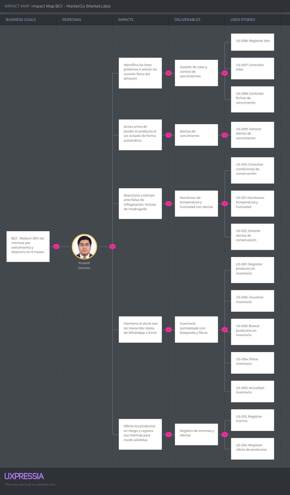

<em>Figura: Impact Map BG1 – Reducción de mermas (UXPressia).</em>

| Business Goal (SMART) | Persona | Impact | Deliverable | User Stories |
|---|---|---|---|---|
| Reducir en 30% las mermas por vencimiento y deterioro de productos orgánicos en los minimarkets que usan MarketGo, durante los primeros 6 meses desde su lanzamiento. | Russell Estrada | Identifica los lotes próximos a vencer sin revisión física del almacén. | Gestión de lotes y control de vencimientos | US006, US007, US008 |
| | | Actúa antes de perder el producto al ser avisado de forma automática. | Alertas de vencimiento | US009 |
| | | Reacciona a tiempo ante fallas de refrigeración (pérdida de cadena de frío), incluso de madrugada. | Monitoreo de temperatura y humedad con alertas | US010, US011, US012 |
| | | Mantiene el stock real sin transcribir datos de WhatsApp a Excel. | Inventario centralizado con búsqueda y filtros | US001, US002, US003, US004, US005 |
| | | Convierte productos en riesgo en oferta y registra la merma para medir sus pérdidas. | Registro de mermas y ofertas | US013, US014 |

**Business Goal 2 – Agilización del abastecimiento (Personas: Russell Estrada y Marco Antonio Ríos, proveedor B2B)**

  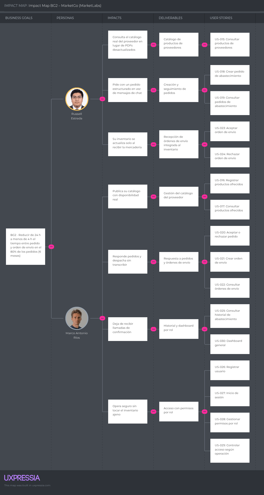

<em>Figura: Impact Map BG2 – Agilización del abastecimiento (UXPressia).</em>

| Business Goal (SMART) | Persona | Impact | Deliverable | User Stories |
|---|---|---|---|---|
| Reducir de 24 h a menos de 4 h el tiempo promedio entre la creación de un pedido de abastecimiento y la generación de su orden de envío, en el 80% de los pedidos gestionados en MarketGo durante el primer semestre de operación. | Russell Estrada | Consulta el catálogo real de sus proveedores en lugar de PDFs desactualizados. | Catálogo de productos de proveedores | US015 |
| | | Solicita abastecimiento con un pedido estructurado en vez de mensajes de chat. | Creación y seguimiento de pedidos | US018, US019 |
| | | Confirma la recepción y su inventario se actualiza automáticamente, sin errores manuales. | Recepción de órdenes de envío integrada al inventario | US023, US024 |
| | Marco Antonio Ríos | Publica su catálogo con disponibilidad real en una sola plataforma. | Gestión del catálogo del proveedor | US016, US017 |
| | | Responde pedidos en minutos y despacha sin transcribir a Excel. | Respuesta a pedidos y órdenes de envío | US020, US021, US022 |
| | | Deja de recibir llamadas de confirmación porque el minimarket ve el estado por sí mismo. | Historial y dashboard común por rol | US025, US030 |
| | | Opera con confianza sabiendo que no puede alterar el inventario ajeno ni otros acceden a su información. | Acceso seguro con permisos por rol | US026, US027, US028, US029 |
| | Visitante | Conoce la propuesta de valor y los planes de suscripción antes de registrarse, sin necesidad de contactar a un vendedor. | Landing page con planes y formulario de contacto | US031, US032, US033 |

El actor Visitante complementa el BG2 desde la landing page: no corresponde a un User Persona, por lo que se registra en la tabla y no en el mapa de UXPressia. De esta forma, las 33 User Stories del Product Backlog quedan trazadas a al menos un impacto y a un Business Goal medible, lo que justifica su priorización en la sección 3.3.

## 3.3. Product Backlog.

| Orden | User Story ID | Título | Descripción | Story Points |
|------|--------------|--------|-------------|--------------|
| 1 | US-001 | Registrar producto en inventario | Como administrador de minimarket, quiero registrar productos en el inventario para mantener un control estructurado de los productos disponibles. | 5 |
| 2 | US-002 | Visualizar inventario | Como administrador de minimarket, quiero visualizar el inventario para conocer los productos disponibles y su información actual. | 5 |
| 3 | US-003 | Buscar productos en inventario | Como administrador de minimarket, quiero buscar productos en el inventario para encontrarlos rápidamente. | 3 |
| 4 | US-004 | Filtrar inventario | Como administrador de minimarket, quiero filtrar el inventario por diferentes criterios para consultar productos de manera eficiente. | 3 |
| 5 | US-005 | Actualizar inventario | Como administrador de minimarket, quiero actualizar la información del inventario para mantener los datos de los productos actualizados. | 5 |
| 6 | US-006 | Registrar lote | Como administrador de minimarket, quiero registrar lotes de productos para mantener la trazabilidad de los productos almacenados. | 5 |
| 7 | US-007 | Consultar lotes | Como administrador de minimarket, quiero consultar los lotes registrados para conocer la información asociada a cada grupo de productos. | 3 |
| 8 | US-008 | Controlar fechas de vencimiento | Como administrador de minimarket, quiero consultar las fechas de vencimiento de los productos para identificar aquellos que requieren atención. | 5 |
| 9 | US-009 | Generar alertas de vencimiento | Como administrador de minimarket, quiero recibir alertas sobre productos próximos a vencer para tomar acciones oportunamente. | 3 |
| 10 | US-010 | Consultar condiciones de conservación | Como administrador de minimarket, quiero consultar las condiciones de conservación de los productos para verificar que se mantengan adecuadamente almacenados. | 3 |
| 11 | US-011 | Monitorear temperatura y humedad | Como administrador de minimarket, quiero visualizar los datos de temperatura y humedad de las áreas de almacenamiento para identificar condiciones que puedan afectar los productos. | 5 |
| 12 | US-012 | Generar alertas de conservación | Como administrador de minimarket, quiero recibir alertas cuando las condiciones de conservación representen un riesgo para los productos. | 5 |
| 13 | US-013 | Registrar merma | Como administrador de minimarket, quiero registrar productos que hayan sufrido merma para mantener un control de las pérdidas. | 3 |
| 14 | US-014 | Registrar oferta de productos | Como administrador de minimarket, quiero registrar productos disponibles como oferta para promocionar aquellos que requieran una salida comercial, especialmente los próximos a vencer. | 3 |
| 15 | US-015 | Consultar productos de proveedores | Como administrador de minimarket, quiero consultar los productos ofrecidos por los proveedores para identificar opciones de abastecimiento. | 5 |
| 16 | US-016 | Registrar productos ofrecidos | Como proveedor, quiero registrar los productos que ofrezco para ponerlos a disposición de los minimarkets. | 5 |
| 17 | US-017 | Consultar productos ofrecidos | Como proveedor, quiero consultar los productos que ofrezco para verificar su información y disponibilidad. | 3 |
| 18 | US-018 | Crear pedido de abastecimiento | Como administrador de minimarket, quiero crear pedidos de abastecimiento dirigidos a los proveedores para solicitar los productos que necesita el minimarket. | 5 |
| 19 | US-019 | Consultar pedidos de abastecimiento | Como usuario autorizado, quiero consultar los pedidos de abastecimiento para conocer las solicitudes realizadas o recibidas y su estado actual. | 3 |
| 20 | US-020 | Aceptar o rechazar pedido | Como proveedor, quiero aceptar o rechazar los pedidos recibidos de los minimarkets para indicar si puedo atender los productos y cantidades solicitadas. | 3 |
| 21 | US-021 | Crear orden de envío | Como proveedor, quiero crear una orden de envío asociada a un pedido aceptado para registrar los productos y cantidades que serán enviados al minimarket. | 5 |
| 22 | US-022 | Consultar órdenes de envío | Como usuario autorizado, quiero consultar las órdenes de envío para conocer los envíos generados y su estado actual. | 3 |
| 23 | US-023 | Aceptar orden de envío | Como administrador de minimarket, quiero aceptar una orden de envío para confirmar la recepción de los productos e incorporarlos automáticamente al inventario. | 5 |
| 24 | US-024 | Rechazar orden de envío | Como administrador de minimarket, quiero rechazar una orden de envío para evitar incorporar al inventario productos que no correspondan con el envío esperado. | 3 |
| 25 | US-025 | Consultar historial de abastecimiento | Como usuario autorizado, quiero consultar el historial de pedidos y órdenes de envío para mantener trazabilidad de las operaciones de abastecimiento realizadas. | 3 |
| 26 | US-026 | Registrar usuario | Como administrador, quiero registrar usuarios en el sistema para permitir el acceso controlado a MarketGo. | 3 |
| 27 | US-027 | Inicio de sesión | Como usuario, quiero iniciar sesión para acceder al sistema según los permisos correspondientes a mi rol. | 3 |
| 28 | US-028 | Gestionar permisos por rol | Como administrador, quiero gestionar los permisos de los usuarios según su rol para controlar las acciones disponibles dentro del sistema. | 5 |
| 29 | US-029 | Controlar acceso según operación | Como usuario de MarketGo, quiero que las acciones disponibles en pedidos, órdenes de envío e inventario dependan de mi rol para evitar modificaciones no autorizadas. | 5 |
| 30 | US-030 | Dashboard general | Como usuario, quiero visualizar un dashboard común con la información correspondiente a mi rol para consultar rápidamente el estado de mis operaciones. | 5 |
| 31 | IMP-BE-001 | Backend foundations | Como desarrollador, quiero configurar ASP.NET Core/C# con seguridad, health check, Swagger y XML docs para sostener los Web Services de MarketGo. | 3 |
| 32 | IMP-BE-002 | Persistence, migrations and seed data | Como desarrollador, quiero configurar EF Core, persistencia, migraciones y datos iniciales para reemplazar los datos simulados con persistencia real. | 5 |
| 33 | TS-IAM-001 | Sign-in API | Como frontend developer, quiero autenticar usuarios mediante `POST /api/v1/auth/sign-in` para obtener una sesión segura. | 2 |
| 34 | TS-IAM-002 | Sign-up API | Como frontend developer, quiero registrar usuarios mediante `POST /api/v1/auth/sign-up` para habilitar el registro de nuevos usuarios. | 2 |
| 35 | TS-IAM-003 | Users directory API | Como frontend developer, quiero listar y crear usuarios mediante `/api/v1/minimarkets/{minimarketId}/users` para administrar los accesos al sistema. | 3 |
| 36 | TS-IAM-004 | User detail and update API | Como frontend developer, quiero consultar y actualizar usuarios asociados al minimarket para gestionar su información, rol y estado. | 3 |
| 37 | TS-PROF-001 | Profile read and update API | Como frontend developer, quiero consumir `/api/v1/profiles` para mostrar y actualizar la información del perfil del usuario. | 3 |
| 38 | TS-PROD-001 | Products catalog API | Como frontend developer, quiero consumir `/api/v1/products` para consultar y gestionar el catálogo de productos orgánicos. | 3 |
| 39 | TS-PROD-002 | Product detail and update API | Como frontend developer, quiero consultar y actualizar productos mediante `/api/v1/products` para mantener su información vigente. | 3 |
| 40 | TS-INV-001 | Inventory list and create API | Como frontend developer, quiero listar y registrar productos mediante `/api/v1/minimarkets/{minimarketId}/inventory` para controlar el inventario del minimarket. | 3 |
| 41 | TS-INV-002 | Inventory update API | Como frontend developer, quiero actualizar los registros del inventario del minimarket para reflejar cambios en los productos disponibles. | 2 |
| 42 | TS-INV-003 | Inventory search and filter API | Como frontend developer, quiero buscar y filtrar el inventario mediante `/api/v1/minimarkets/{minimarketId}/inventory/search` para facilitar la consulta de productos. | 2 |
| 43 | TS-LOT-001 | Lots list and create API | Como frontend developer, quiero listar y registrar lotes mediante `/api/v1/minimarkets/{minimarketId}/lots` para mantener la trazabilidad de los productos. | 3 |
| 44 | TS-LOT-002 | Lot detail and update API | Como frontend developer, quiero consultar y actualizar lotes asociados al minimarket para mantener su información actualizada. | 2 |
| 45 | TS-EXP-001 | Expiration tracking API | Como frontend developer, quiero consultar las fechas de vencimiento mediante `/api/v1/minimarkets/{minimarketId}/expirations` para identificar productos próximos a vencer y facilitar su incorporación a ofertas. | 3 |
| 46 | TS-CON-001 | Conservation monitoring API | Como frontend developer, quiero consultar los datos de conservación mediante `/api/v1/minimarkets/{minimarketId}/conservation/monitoring` para visualizar las condiciones de almacenamiento. | 3 |
| 47 | TS-CON-002 | Conservation alerts API | Como frontend developer, quiero consultar las alertas mediante `/api/v1/minimarkets/{minimarketId}/communication/alerts` para identificar condiciones que representen riesgos para los productos. | 3 |
| 48 | TS-SUP-001 | Suppliers directory API | Como frontend developer, quiero listar y registrar proveedores mediante `/api/v1/suppliers` para mantener un directorio organizado. | 3 |
| 49 | TS-SUP-002 | Supplier products API | Como frontend developer, quiero consultar los productos ofrecidos por los proveedores mediante `/api/v1/suppliers` y `/api/v1/products` para mostrar las opciones de abastecimiento disponibles. | 3 |
| 50 | TS-ORD-001 | Supply requests API | Como frontend developer, quiero listar y crear pedidos mediante `/api/v1/minimarkets/{minimarketId}/requisitions` para permitir que los administradores soliciten productos a los proveedores. | 3 |
| 51 | TS-ORD-002 | Supply request response API | Como frontend developer, quiero gestionar la aceptación o rechazo de pedidos mediante `/api/v1/minimarkets/{minimarketId}/requisitions` para permitir que los proveedores respondan a las solicitudes recibidas. | 3 |
| 52 | TS-ORD-003 | Shipping orders API | Como frontend developer, quiero listar y crear órdenes de envío mediante `/api/v1/minimarkets/{minimarketId}/purchase-orders` para registrar los envíos realizados por los proveedores a partir de pedidos aceptados. | 3 |
| 53 | TS-ORD-004 | Shipping order reception API | Como frontend developer, quiero procesar la aceptación o rechazo de órdenes de envío mediante `/api/v1/minimarkets/{minimarketId}/purchase-orders` para confirmar la recepción e incorporar los productos al inventario cuando corresponda. | 3 |
| 54 | TS-MER-001 | Waste and offer management | Como frontend developer, quiero registrar las mermas y gestionar la información relacionada con productos en oferta para mantener trazabilidad sobre los productos que requieren una salida del inventario. | 3 |
| 55 | TS-DASH-001 | Dashboard API | Como frontend developer, quiero consultar `/api/v1/minimarkets/{minimarketId}/dashboard` para alimentar el dashboard común con indicadores correspondientes al rol del usuario. | 3 |
| 56 | TS-DASH-002 | Alerts and notifications API | Como frontend developer, quiero consultar `/api/v1/minimarkets/{minimarketId}/communication/messages` y `/api/v1/minimarkets/{minimarketId}/communication/alerts` para mostrar alertas y notificaciones relevantes al usuario. | 2 |
| 57 | TS-AUD-001 | Activity history API | Como frontend developer, quiero consultar `/api/v1/minimarkets/{minimarketId}/activity-history` para mostrar el historial de acciones y mantener trazabilidad de las operaciones. | 3 |
| 58 | IMP-BE-003 | Business rules and integration readiness | Como desarrollador, quiero implementar las reglas de negocio relacionadas con roles, permisos, pedidos de abastecimiento, órdenes de envío y actualización automática del inventario para garantizar el funcionamiento correcto de MarketGo. | 3 |
| 59 | FS-001 | Permisos de pedidos según rol | Como sistema, quiero aplicar permisos diferenciados sobre los pedidos para que el administrador pueda crearlos y gestionarlos mientras el proveedor pueda consultarlos y aceptar o rechazar las solicitudes recibidas. | 3 |
| 60 | FS-002 | Permisos de órdenes de envío según rol | Como sistema, quiero aplicar permisos diferenciados sobre las órdenes de envío para que el proveedor pueda crearlas y gestionarlas mientras el administrador pueda consultarlas y aceptar o rechazar su recepción. | 3 |
| 61 | US-031 | Explorar propuesta de valor | Como visitante, quiero visualizar la información general de MarketGo para entender sus beneficios. | 2 |
| 62 | US-032 | Consultar planes de suscripción | Como visitante, quiero visualizar los planes de suscripción con sus precios y funcionalidades para elegir el que se adapte a mi negocio antes de registrarme. | 3 |
| 63 | US-033 | Solicitar información o demo | Como visitante, quiero enviar un formulario de contacto para solicitar información comercial o una prueba del sistema. | 2 |

**Enlace directo al tablero:**
**Tablero Sprint 1: Trello**
[Tablero Sprint 1 en Trello](https://trello.com/b/AyBgUYcT/springbacklog1)

  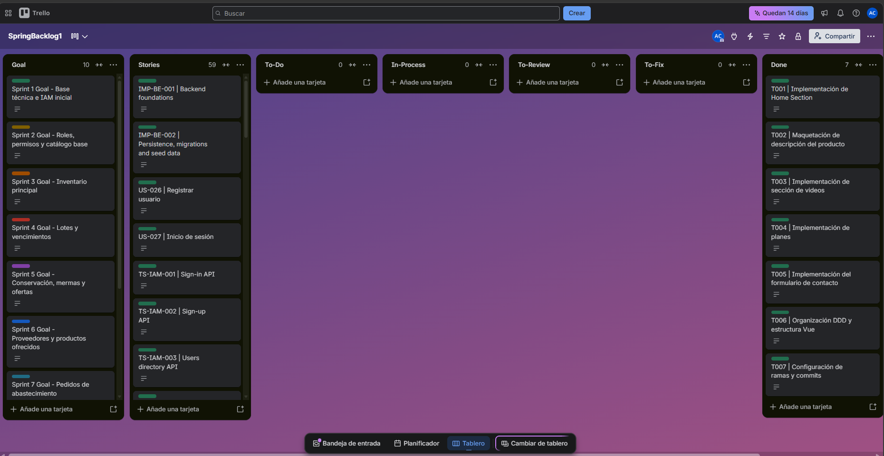
  
<em>Figura: Captura del Product Backlog en la herramienta de gestión del proyecto.</em>

---

# Capítulo IV: Product Design

## 4.1. Style Guidelines.

### 4.1.1. General Style Guidelines.
**Branding:** 

El logo pricipal se trata de una representación de capas que representan almacenes y ramificaciones que representan el enlace en el ecosistema digital de proveedores y administradores de minimarkets. Usa colores azules, naranjas y blancos para demostrar seriedad, confianza y dinamismo.

| Logo (Isotipo) | Logotipo / Imagotipo |
| :---: | :---: |
|  <strong>Figura 1</strong> <em>Isotipo de MarketGo</em> <small><em>Nota.</em> Elaboración propia.</small> |  <strong>Figura 2</strong> <em>Logotipo de MarketGo</em> <small><em>Nota.</em> Elaboración propia.</small> |
| **Isotipo**: Icono representativo de capas y conexiones para avatares, favicon y accesos directos. | **Logotipo**: Versión principal completa con tipografía para cabeceras, landing page y documentación oficial. |

**Tipografía**

La tipografía elegida para nuestro producto es Arimo, una font de la familia Sans Serif. Esta fuente resalta por ser moderna, legible y usada en contextos de tecnología y modernidad. Se utilizará esta fuente en todos los textos y título para mantener consistencia y armonía visual. 

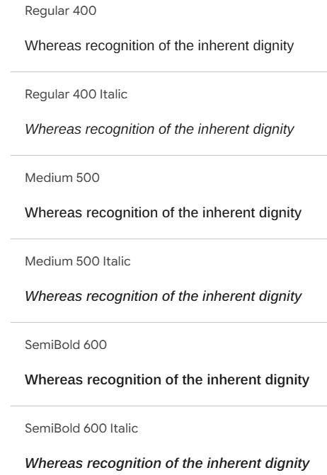 
<strong>Figura 3</strong> 
<em>Tipografía de MarketGo</em> 
<small><em>Nota.</em> Elaboración propia.</small>

La jerarquía tipografía:

- Títulos principales (H1): Arimo SemiBold, 32 px
- Encabezados de sección (H2): Arimo Medium, 24 px
- Subtítulos (H3): Arimo Medium, 20 px
- Texto de cuerpo: Arimo Regular, 18px
- Botones y elementos interactivos: Arimo Medium, 18 px

**Colores:**

La paleta de colores ha sido seleccionada para demostrar seriedad, confianza y modernidad. Se trata de colores complementarios en la paleta de colores compatibles entre ellos para dar una visión cohesiva y serena. Los colores claros se utilizaran como los colores que ocupan más espacio en la interfaz, y los más oscuros para secciones de importante contraste y botones. 

 
<strong>Figura 4</strong> 
<em>Paleta de colores de MarketGo</em> 
<small><em>Nota.</em> Elaboración propia.</small>

**Spacing**

#### Design Tokens - Spacing

| Token          | Uso                                          | Desktop | Mobile |
|----------------|-----------------------------------------------|---------|--------|
| spacing-xs     | Separación entre encabezados y párrafos       | 16px    | 8px    |
| spacing-sm     | Separación vertical de elementos              | 12px    | 12px*  |
| spacing-sm     | Separación horizontal de elementos            | 16px    | 8px    |
| spacing-md     | Padding de botones (vertical)                 | 12px    | 12px   |
| spacing-md     | Separación entre párrafos o bloques de texto  | 24px    | 16px   |
| spacing-lg     | Padding de tarjetas y contenedores             | 24px    | 16px   |
| spacing-lg     | Separación entre títulos principales y contenido | 24px | 16px   |
| spacing-lg     | Padding de botones (horizontal)               | 24px    | 20px   |
| spacing-xl     | Margen lateral principal de la interfaz       | 40px    | 16px   |

**Tono de comunicación**

El tono de comunicación de MarketGo debe ser sencillo y directo. Los usuarios la utilizan para acciones puntuales, por lo cual la información debe ser presentada con la mayor claridad posible, evitando confusiones de lenguaje o de entendimiento y el usuario pueda completar la acción lo más rápido posible. 

**Lenguage aplicado**

El lenguaje que se aplicará es el lenguaje común de nuestros usuarios en su entorno cotidiano y laboral. Tanto para los usuarios Administradores como los usuarios Proveedores, el lenguaje combina instrucciones directas y claras, e información técnica brindada por el sistema necesaria para toma de decisiones del usuario. 

### 4.1.2. Web Style Guidelines.

En esta sección se detallan las decisiones de diseño que conforman la identidad visual de MarketGo. Estos estándares garantizan una interfaz coherente, profesional y adaptable (responsive), facilitando tanto el desarrollo de software como la experiencia del usuario final.

#### a. Paleta de colores
 
La paleta actual está compuesta por seis colores, organizados en dos familias:
 
**Azules (color principal de marca)**

- `#0d8cfb` — Azul primario. Es el tono más vibrante de la paleta y el que aparece en el logo como color dominante. Debe usarse para elementos interactivos principales: botones de acción primaria, enlaces activos, íconos seleccionados.
- `#023192` — Azul secundario, más oscuro. Adecuado para textos sobre fondos claros que requieran énfasis, encabezados de sección, o estados "hover" del azul primario.
- `#021c45` — Azul oscuro/marino. El más oscuro de la paleta, apto para textos de alto contraste, fondos de barra lateral (sidebar) o elementos de navegación que buscan distinguirse del contenido principal.

**Acento y neutros**
- `#fc6910` — Naranja. Es el color de acento que aparece como el punto de conexión en el logo. Debe reservarse para llamadas de atención puntuales: alertas, notificaciones, badges de estado urgente (por ejemplo, productos próximos a vencer), o el botón de acción secundaria más importante de una pantalla.
- `#eff3fa` — Azul muy claro, casi blanco. Funciona como color de fondo general de la interfaz o de tarjetas y contenedores, dado su bajo contraste.
- `#fbdc91` — Amarillo/durazno claro. Color de soporte, útil para estados de advertencia intermedios (ni urgente como el naranja, ni neutro), o como acento decorativo en ilustraciones y estados vacíos.

**Recomendación de uso jerárquico:**
1. Azul primario (`#0d8cfb`) → acciones principales
2. Naranja (`#fc6910`) → alertas y urgencia
3. Azules oscuros (`#023192`, `#021c45`) → texto y navegación
4. Claros (`#eff3fa`, `#fbdc91`) → fondos y estados secundarios
Dado que el sistema maneja alertas de vencimiento y conservación (temperatura/humedad fuera de rango), se recomienda definir explícitamente un color adicional de error/riesgo (rojo) que no está presente en la paleta actual, ya que el naranja por sí solo puede no ser suficiente para diferenciar "advertencia" de "crítico".

#### b. Tipografía
 
La tipografía definida es Arimo, una fuente sans-serif de la familia de fuentes web abiertas (métricamente compatible con Arial), lo que garantiza buena legibilidad en pantalla y renderizado consistente entre distintos sistemas operativos y navegadores.
 
Al no haberse especificado pesos ni escala tipográfica en el material original, se sugiere una escala base para mantener consistencia en toda la aplicación:
 
- Títulos principales: Arimo Bold, 24–28px
- Subtítulos / encabezados de sección: Arimo Semibold o Bold, 18–20px
- Cuerpo de texto: Arimo Regular, 14–16px
- Texto secundario / metadatos (fechas, etiquetas): Arimo Regular, 12–13px
- Botones: Arimo Medium o Semibold, 14px
Esta escala es consistente con los espaciados de 40/24/16/12px ya definidos para el sistema, manteniendo proporciones armónicas entre texto y espacio en blanco.

#### c. Botones y elementos de interfaz
 
Este punto no está cubierto explícitamente en el material de referencia, por lo que se documentan aquí lineamientos propuestos, derivados de la paleta y la tipografía ya definidas, para mantener coherencia visual:
 
**Botones**

- Botón primario: fondo `#0d8cfb`, texto blanco, esquinas redondeadas (radio sugerido 6–8px)
- Botón secundario: fondo `#eff3fa` o transparente con borde `#023192`, texto `#023192`
- Botón de alerta/peligro: fondo en tono rojo (a definir, ver nota en sección de colores), reservado para acciones destructivas como rechazar un pedido
- Botón deshabilitado: opacidad reducida (40–50%) sobre el color base, sin cambiar de tono

**Elementos de formulario**
- Campos de texto con borde `#eff3fa` o gris neutro en estado normal, y borde en color de error al fallar una validación
- Estados de foco con borde en azul primario (`#0d8cfb`)

**Tarjetas y contenedores**
- Fondo blanco o `#eff3fa`, con bordes sutiles y sombra ligera para diferenciarse del fondo general de la aplicación
- Padding interno siguiendo el estándar de espaciado ya definido para el proyecto (24px en desktop, 16px en mobile)

**Badges de estado**
- Aprovechar la paleta para diferenciar estados: naranja para "pendiente/atención", azul para "informativo", y el color de error propuesto para "riesgo/rechazado".

#### d. Iconografía

**1. Librería base**
 
Tabler Icons (estilo outline/línea), por tres razones:
- Es de licencia libre (MIT), por lo que se puede usar sin restricciones en un proyecto académico o comercial
- Tiene una cobertura muy amplia (más de 4,000 íconos), suficiente para cubrir todos los módulos sin tener que mezclar librerías
- Su estilo de línea con grosor uniforme es compatible con el trazo simple que ya se ve en los íconos existentes del style guide (termómetro, papelera, lupa).

**2. Mapa de íconos por módulo**
 
| Módulo | Ícono | Función |
|---|---|---|
| **Global / navegación** | Casa u ojo de panel | Dashboard general |
| | Caja/paquete | Inventario |
| | Etiqueta o código de barras | Gestión de lotes |
| | Termómetro con copo de nieve *(ya existe)* | Conservación |
| | Camión de reparto | Abastecimiento |
| | Apretón de manos o tienda | Proveedores y productos |
| | Persona/usuario *(ya existe)* | Usuarios y seguridad |
| | Gráfico de barras | Análisis |
| **Acciones comunes** | Lupa *(ya existe)* | Buscar |
| | Embudo | Filtrar |
| | Signo + *(ya existe)* | Registrar / crear |
| | Lápiz | Editar |
| | Papelera *(ya existe)* | Eliminar |
| | Ojo | Ver detalle |
| **Alertas y estado** | Campana | Notificaciones generales |
| | Triángulo de alerta | Alerta de vencimiento o conservación |
| | Check dentro de círculo | Confirmación / aceptar |
| | X dentro de círculo | Rechazar / cancelar |
| | Reloj | Pendiente / tiempo transcurrido |
| **Conservación específico** | Gota de agua | Humedad |
| | Termómetro solo | Temperatura (sin el copo, para diferenciarlo del ícono de "congelado") |
| | Enchufe tachado | Sensor desconectado / sin datos |
| **Abastecimiento y proveedores** | Documento con líneas | Pedido / orden |
| | Historial / reloj con flecha circular | Historial de abastecimiento |
| | Insignia con check | Certificación orgánica |
| **Merma y ofertas** | Caja tachada o cesto | Registrar merma |
| | Etiqueta de precio con signo de porcentaje | Registrar oferta |

 
| Propiedad | Valor |
|---|---|
| Estilo | Outline (línea), no relleno sólido |
| Grosor de trazo | 1.5–2px, constante en todos los íconos |
| Tamaño base | 24×24px |
| Tamaños adicionales | 16×16 (texto en línea, badges), 20×20 (botones compactos, sidebar), 32×32 (estados vacíos, encabezados destacados) |
| Área de seguridad | 2px de margen interno dentro del área de 24×24, para que el trazo no toque el borde del frame |
| Esquinas | Redondeadas (consistente con el radio de 6–8px ya propuesto para botones) |

#### e. Rejilla y adaptabilidad
 
Este punto no está documentado en el material de referencia. Se recomienda basarlo en el estándar de espaciado ya definido previamente para el proyecto, extendiéndolo a una rejilla formal:
 
**Desktop**

- Sistema de rejilla de 12 columnas, con márgenes laterales de 40px (consistente con el margen lateral principal ya definido)
- Gutter entre columnas de 16–24px, alineado con la separación horizontal de elementos ya establecida
- Ancho máximo de contenido recomendado: 1280–1440px, con centrado en pantallas más anchas.

**Mobile**

- Rejilla de 4 columnas, con márgenes laterales de 16px (consistente con el margen ya definido para esta versión)
- Gutter reducido a 8px entre columnas
- Los componentes de múltiples columnas en desktop (por ejemplo, tarjetas de resumen o catálogo en grid) deben colapsar a 1 o 2 columnas en mobile

**Puntos de quiebre (breakpoints) sugeridos**

- Mobile: hasta 599px
- Tablet: 600px–1023px
- Desktop: 1024px en adelante

**Adaptabilidad de componentes clave**

- El sidebar de navegación (ya definido en los wireframes del proyecto) debe colapsar a un menú tipo drawer o barra inferior en mobile, dado el espacio lateral limitado
- Las tablas con múltiples columnas (inventario, lotes, pedidos) deben priorizar las columnas más relevantes en mobile y mover el resto a una vista de detalle o acordeón, en vez de forzar scroll horizontal
- Las vistas tipo Kanban (pedidos) deben pasar de columnas lado a lado en desktop a un scroll horizontal por estado, o a una lista con filtro de estado, en mobile.

## 4.2. Information Architecture.

Esta sección describe la estructura de la información, estilos y sistemas que se utilizarán en la plataforma web de MarketGo. Se consideran los sistemas de organización, etiquetado, búsqueda, navegación y SEO, con el fin de garantizar una experiencia clara y enfocada en la visualización de datos de inventario, lotes, conservación y abastecimiento para minimarkets de productos orgánicos.

### 4.2.1. Organization Systems.

**Sistemas de Organización visual de contenido**

**1. Organización Jerárquica (Visual Hierarchy)**

MarketGo organiza su contenido en tres niveles de jerarquía visual, consistentes con la estructura de navegación ya definida para la plataforma:
 
- **Nivel 1 — Categorías de módulo:** agrupan las 7 áreas funcionales del sistema en 4 secciones de mayor nivel según frecuencia de uso: *Operación* (Inventario, Gestión de Lotes, Conservación), *Abastecimiento* (Pedidos, Proveedores y productos), *Análisis* (Dashboard general) y *Administración* (Usuarios y seguridad).
- **Nivel 2 — Pantallas dentro de cada módulo:** por ejemplo, dentro de Inventario existen la vista de listado completo y el detalle de producto; dentro de Lotes, la lista de lotes y el formulario de registro.
- **Nivel 3 — Componentes de detalle:** tarjetas de resumen, tablas de datos, paneles de alertas y modales de acción (registrar, aceptar, rechazar).

**2. Organización Secuencial (Step by Step)**

Se aplica una organización secuencial principalmente en los flujos que representan un proceso con pasos obligatorios y dependientes entre sí.
 
- **Registro de lote:** selección de producto → cantidad y unidad → fechas de ingreso/vencimiento → proveedor → confirmación.
- **Creación de pedido de abastecimiento (rol administrador):** selección de minimarket destino → selección de productos del catálogo propio → cantidades → confirmación (genera ID único y estado "Pendiente").
- **Rechazo de un pedido (rol administrador):** selección de la acción "Rechazar" → registro obligatorio del motivo → confirmación (no se permite omitir el paso del motivo).
- **Registro de merma:** selección de producto en inventario → cantidad y motivo → validación contra el stock disponible → confirmación.
Estos flujos secuenciales se presentan como formularios de un solo paso con validación en línea (no wizards de múltiples pantallas), dado que la cantidad de campos por flujo es reducida.

**3. Organización Matricial**

Haremos uso de la organización matricial cuando el usuario necesite cruzar dos o más dimensiones de información para tomar una decisión, principalmente en las vistas de estado:
 
- **Pedidos de abastecimiento:** Organizados matricialmente por *estado* (Pendiente / Aceptado / Rechazado) en columnas tipo Kanban, permitiendo comparar volumen y urgencia entre estados de un vistazo.
- **Conservación:** Las zonas de almacenamiento se cruzan con sus condiciones (temperatura, humedad) y su estado (Normal / Riesgoso / Sin datos), mostrando una matriz de tarjetas por zona.
- **Catálogo de proveedores (vista administrador):** Cruce entre producto y proveedor, filtrable por categoría, permitiendo comparar la misma categoría de producto entre distintos proveedores.

**Esquemas de categorización de contenido**

El contenido de MarketGo se categoriza bajo tres esquemas complementarios:
 
- **Por función del módulo:** Operación, Abastecimiento, Análisis, Administración.
- **Por estado del dato:** aplicado transversalmente a productos (Vigente / Próximo a vencer / Vencido), pedidos (Pendiente / Aceptado / Rechazado) y condiciones de conservación (Normal / Riesgoso / Sin datos). Este esquema es el que más se refuerza con color, siguiendo la paleta de la marca.
- **Por rol de usuario:** administrador de minimarket, proveedor y (a nivel de plataforma) usuario con permisos administrativos sobre cuentas. El contenido visible y las acciones disponibles cambian según este esquema, no la estructura general de la información.

### 4.2.2. Labeling Systems.
 
 En esta sección se detalla el sistema de etiquetado, diseñado para ofrecer una experiencia de usuario intuitiva mediante términos breves y reconocibles. Estas etiquetas permiten que tanto los visitantes como los usuarios finales comprendan las funciones del software sin ambigüedades.

 **Etiquetas de Navegación (Sidebar & Menu Labels)**

 | Grupo | Etiquetas |
|---|---|
| Operación | Inventario · Gestión de Lotes · Conservación |
| Abastecimiento | Pedidos · Proveedores y productos |
| Análisis | Dashboard general |
| Administración | Usuarios y seguridad |
 
Reglas: sustantivos cortos (1–2 palabras), sin verbos, consistentes con lo ya validado en los wireframes de sidebar. Se evita duplicar la palabra "Gestión" en todas las etiquetas para no saturar el menú (por eso "Inventario" y "Conservación" van sin ese prefijo, mientras "Gestión de Lotes" lo conserva por claridad frente a "Lotes" solo, que podría confundirse con lotes de compra).

**Etiquetas de Acción y Control (Command Labels)**

- Botones primarios: "Registrar lote", "Registrar producto", "Aceptar pedido", "Confirmar rechazo", "Guardar lote"
- Botones secundarios/cancelación: "Cancelar", "Rechazar"
- Acciones en línea (íconos con tooltip): "Ver detalle", "Editar", "Eliminar", "Registrar merma", "Registrar oferta"
- Acciones de filtrado y búsqueda: "Buscar producto o código de lote", "Filtrar por estado"

**Etiquetas de Estado y Datos (Informational Labels)**

Etiquetas cortas, en badges de color, siguiendo el esquema de categorización por estado ya definido:
 
- Vencimiento: "Vigente", "Próximo a vencer", "Vencido" (o el conteo de días, ej. "Vence en 2 días")
- Pedidos: "Pendiente", "Aceptado", "Rechazado"
- Conservación: "Normal", "Riesgoso", "Sin registros disponibles"
- Metadatos: "hace 3 días", "hace 4 horas" (tiempos relativos en vez de timestamps completos, para lectura más rápida)

**Etiquetas de Formulario (Field Labels)**

Etiquetas descriptivas ubicadas sobre el campo (no placeholders como único label, para mantener accesibilidad):
 
- "Producto", "Cantidad", "Unidad", "Fecha de ingreso", "Fecha de vencimiento", "Proveedor", "Motivo del rechazo", "Minimarket destino"
- Campos obligatorios marcados con asterisco (`*`) en color de error, consistente con el modal de rechazo ya diseñado
- Mensajes de validación en primera persona desde el sistema, en tono directo: "Este campo es obligatorio para continuar", "La cantidad supera el stock disponible"

### 4.2.3. SEO Tags and Meta Tags.

***Landing Page (Sitio Web Estático)**

El objetivo de estas etiquetas es el posicionamiento orgánico para atraer a dueños de negocios o analistas interesados en la solución.
 
- `<title>`: "MarketGo — Gestión de inventario para minimarkets orgánicos"
- `<meta name="description">`: descripción orientada a beneficios de negocio (control de vencimientos, trazabilidad de proveedores, reducción de mermas), con palabras clave como "inventario orgánico", "gestión de minimarket", "control de vencimientos"
- Encabezados `<h1>`–`<h3>` estructurados jerárquicamente reflejando los beneficios del producto (uno por sección de la landing: control de inventario, alertas de conservación, gestión de proveedores)
- URLs amigables y descriptivas (ej. `/funcionalidades`, `/precios`, `/contacto`) en vez de rutas genéricas.

**Web Application (Plataforma de Usuario)**

Aquí las etiquetas están orientadas a la funcionalidad y seguridad, evitando que motores de búsqueda indexen información privada de los usuarios, pero manteniendo la identidad de la marca.
 
- `<meta name="robots" content="noindex, nofollow">` en todas las rutas internas de la aplicación (dashboard, inventario, lotes, pedidos), para evitar que datos de inventario o proveedores de un minimarket específico aparezcan en buscadores.
- `<title>` dinámico pero genérico por pantalla, sin datos sensibles: "MarketGo — Inventario", "MarketGo — Pedidos" (nunca el nombre del minimarket o de un producto específico en el título de la pestaña).
- Favicon e ícono de marca mantenidos en todas las rutas para reforzar identidad visual, incluso sin indexación.

### 4.2.4. Searching Systems.

**Mecanismos de búsqueda**

MarketGo utiliza búsqueda por texto libre combinada con filtros estructurados, disponible en los módulos de Inventario, Lotes, Pedidos y Catálogo de proveedores. La búsqueda es del tipo "buscar mientras se escribe" (incremental), sin necesidad de confirmar con Enter, dado que los catálogos manejados no son de gran volumen.
 
#### Búsqueda filtrada (específica)

Las opciones de filtrado (varían según el módulo, pero siguen el mismo patrón de ubicación — barra superior a la tabla o grid):
 
- Inventario: categoría, condición de conservación, proveedor, rango de stock
- Gestión de Lotes: estado de vencimiento (chips rápidos "Todos" / "Por vencer" / "Vencidos"), rango de fechas
- Pedidos: estado (Pendiente/Aceptado/Rechazado), fecha, minimarket (para el rol proveedor, que abastece a varios)
- Catálogo de proveedores: proveedor específico, categoría de producto.

#### Visualización de Resultados
 
- Resultados en tabla (Inventario, Lotes) cuando el usuario necesita comparar muchos registros con múltiples atributos, o en tarjetas/grid (Catálogo de proveedores, Pedidos en vista Kanban) cuando el contenido se explora más que se audita.
- Estado vacío consistente en toda la plataforma cuando la búsqueda o el filtro no arroja resultados: mensaje informativo breve (ej. "No se encontraron productos con estos filtros"), sin ilustraciones que distraigan, siguiendo el patrón ya usado para conservación sin datos
- Contador de resultados visible ("Mostrando 4 de 86 lotes") para dar contexto de escala, especialmente en tablas paginadas.

### 4.2.5. Navigation Systems.

#### Navigation strategies

MarketGo combina dos estrategias de navegación según el tipo de sitio:
 
- **Navegación jerárquica con acceso directo (Landing):** estructura simple de una sola página con scroll y anclas, complementada por un menú superior fijo
- **Navegación estructural persistente (Web Application):** sidebar fijo que actúa como mapa completo de la aplicación, con la sección activa siempre resaltada, complementado por accesos rápidos contextuales (badges de alerta, botones de acción directa) que no reemplazan al sidebar sino que aceleran tareas frecuentes.

#### Landing Page Navigation

- Menú superior con anclas a las secciones de la propia landing: Descripción del producto, Videos, Planes, Contacto
- Sección "Videos": agrupa contenido audiovisual de dos tipos — videos institucionales sobre el equipo (presentación, misión, quiénes están detrás de MarketGo) y videos demostrativos del producto (recorrido funcional por los módulos: inventario, lotes, conservación, abastecimiento). Se recomienda separarlos en dos sub-bloques dentro de la misma sección ("Conoce al equipo" / "Cómo funciona MarketGo") en vez de mezclarlos en un solo carrusel, para que el visitante identifique rápido cuál quiere ver primero
- Llamado a la acción (CTA) persistente ("Solicitar demo" o "Iniciar sesión") visible en todo momento en la esquina superior derecha
- Sin navegación lateral ni jerarquía profunda — es una navegación plana con scroll continuo entre Descripción del producto → Videos → Planes → Contacto, ya que el objetivo es informar y convertir, no gestionar datos

#### Web Application Navigation 

- **Sidebar como navegación primaria**, con los 4 grupos ya definidos (Operación, Abastecimiento, Análisis, Administración) y sus etiquetas correspondientes.
- **Ítem activo resaltado** mediante fondo o borde en azul primario, para reforzar la ubicación actual dentro del sistema (relevante para la fase de "Seguimiento y control" del mapa de empatía del usuario).
- **Navegación dinámica por rol:** el sidebar no muestra los mismos ítems a todos los usuarios — un proveedor no ve "Usuarios y seguridad" ni el catálogo interno de conservación de un minimarket, mientras que un administrador ve el set completo según sus permisos
- **Navegación secundaria contextual:** tabs dentro de una sección (ej. "Pendientes" / "Historial" dentro de Pedidos) para separar sub-vistas sin salir del módulo principal.
- **Accesos directos cruzados:** por ejemplo, al aceptar un pedido, un botón "Ver inventario actualizado" lleva directamente al módulo de Inventario, rompiendo la navegación estrictamente jerárquica cuando el flujo de trabajo lo justifica.

## 4.3. Landing Page UI Design.

### 4.3.1. Landing Page Wireframe.

En esta sección se presenta el desarrollo de los primeros wireframes como primer paso para la producción de interfaz visual de la solución, realizados en la plataforma *Figma*.

 
<strong>Figura 5</strong> 
<em>Wireframe de Landing Page sección Home</em> 
<small><em>Nota.</em> Elaboración propia.</small>

 
<strong>Figura 6</strong> 
<em>Wireframe de Landing Page sección Información</em> 
<small><em>Nota.</em> Elaboración propia.</small>

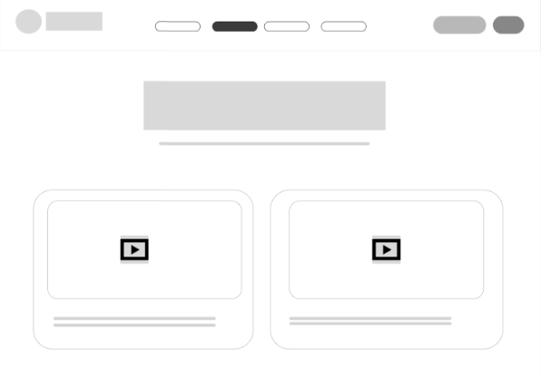 
<strong>Figura 7</strong> 
<em>Wireframe de Landing Page sección Videos</em> 
<small><em>Nota.</em> Elaboración propia.</small>

 
<strong>Figura 8</strong> 
<em>Wireframe de Landing Page sección Planes</em> 
<small><em>Nota.</em> Elaboración propia.</small>

 
<strong>Figura 9</strong> 
<em>Wireframe de Landing Page sección Contacto</em> 
<small><em>Nota.</em> Elaboración propia.</small>

### 4.3.2. Landing Page Mock-up.

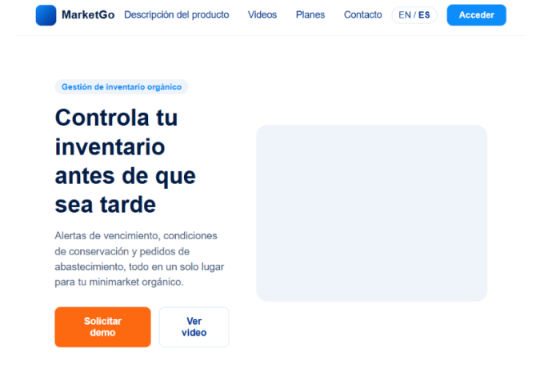 
<strong>Figura 10</strong> 
<em>Mock up de Landing Page sección Home</em> 
<small><em>Nota.</em> Elaboración propia.</small>

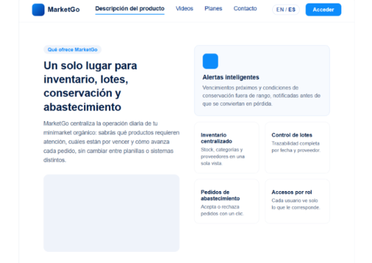 
<strong>Figura 11</strong> 
<em>Mock up de Landing Page sección Información del producto</em> 
<small><em>Nota.</em> Elaboración propia.</small>

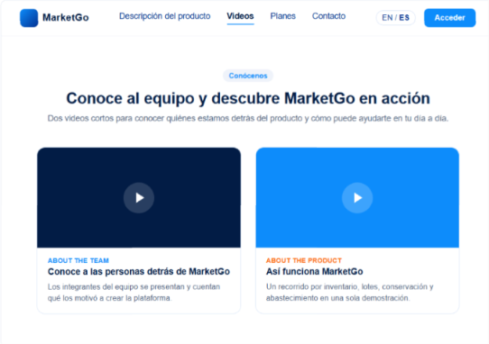 
<strong>Figura 12</strong> 
<em>Mock up de Landing Page sección Videos</em> 
<small><em>Nota.</em> Elaboración propia.</small>

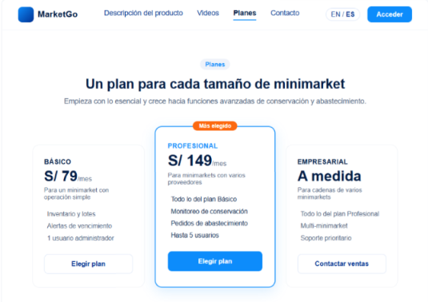 
<strong>Figura 13</strong> 
<em>Mock up de Landing Page sección Planes</em> 
<small><em>Nota.</em> Elaboración propia.</small>

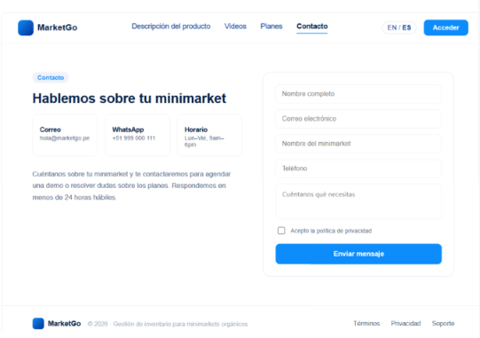 
<strong>Figura 14</strong> 
<em>Mock up de Landing Page sección Contacto</em> 
<small><em>Nota.</em> Elaboración propia.</small>

## 4.4. Web Applications UX/UI Design.

### 4.4.1. Web Applications Wireframes.

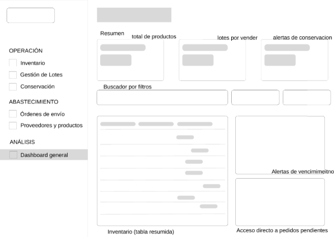 
<strong>Figura 15</strong> 
<em>Wireframe Web Application sección Dashboard</em> 
<small><em>Nota.</em> Elaboración propia.</small>

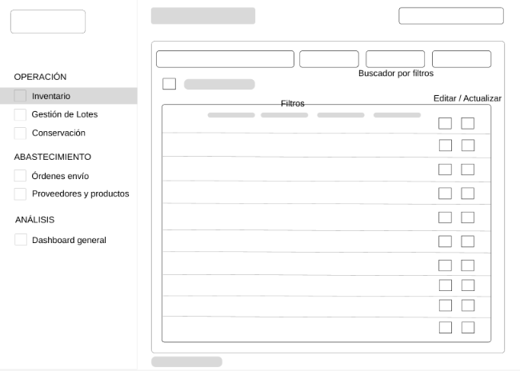 
<strong>Figura 16</strong> 
<em>Wireframe Web Application sección Inventario</em> 
<small><em>Nota.</em> Elaboración propia.</small>

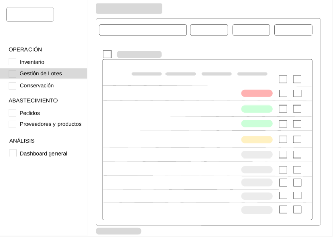 
<strong>Figura 17</strong> 
<em>Wireframe Web Application sección Gestión de lotes</em> 
<small><em>Nota.</em> Elaboración propia.</small>

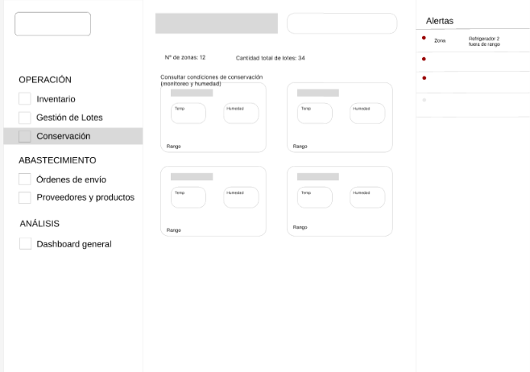 
<strong>Figura 18</strong> 
<em>Wireframe Web Application sección Conservación</em> 
<small><em>Nota.</em> Elaboración propia.</small>

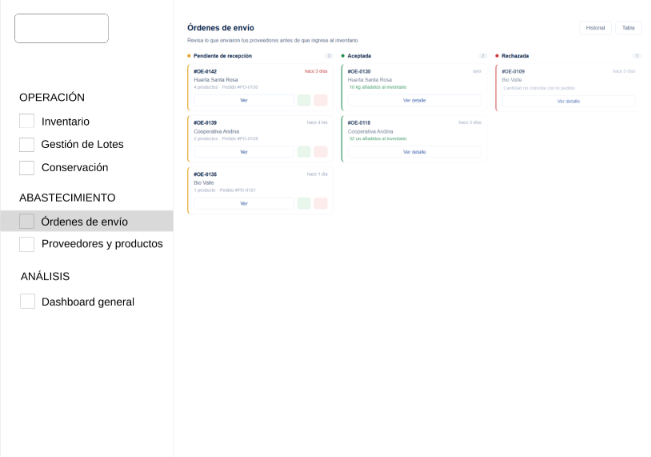 
<strong>Figura 19</strong> 
<em>Wireframe Web Application sección Órdenes de envío</em> 
<small><em>Nota.</em> Elaboración propia.</small>

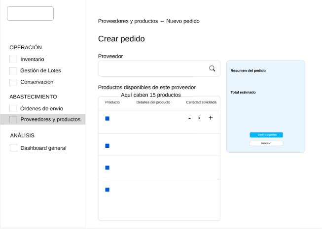 
<strong>Figura 20</strong> 
<em>Wireframe Web Application sección Proveedores y Productos</em> 
<small><em>Nota.</em> Elaboración propia.</small>

### 4.4.2. Web Applications Wireflow Diagrams.

Los wireflows muestran la secuencia de pantallas y acciones para seis recorridos de MarketGo. Cada figura identifica el objetivo del usuario y los pasos principales de navegación.

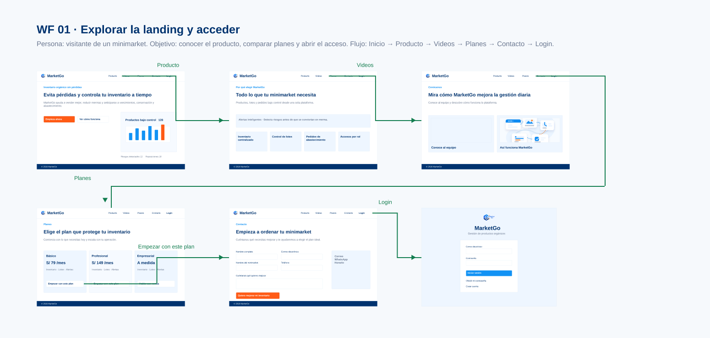 
<strong>Figura 21</strong> 
<em>Exploración de la landing page y acceso a MarketGo</em> 
<small><em>Nota.</em> Elaboración propia.</small>

**Descripción.** El visitante de un minimarket recorre Inicio, Producto, Videos, Planes y Contacto antes de abrir el acceso a la aplicación.

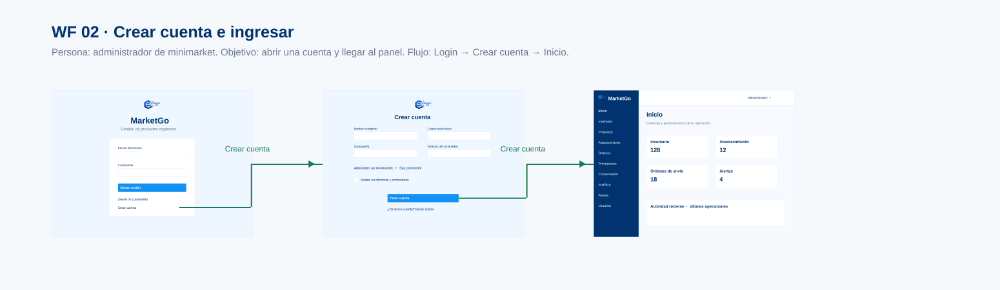 
<strong>Figura 22</strong> 
<em>Creación de cuenta e ingreso al panel</em> 
<small><em>Nota.</em> Elaboración propia.</small>

**Descripción.** El administrador pasa del formulario de inicio de sesión al registro de cuenta y, al completarlo, llega al panel principal.

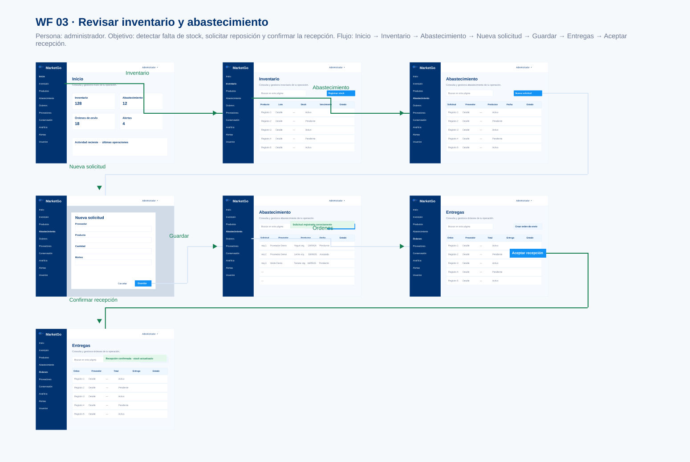 
<strong>Figura 23</strong> 
<em>Revisión de inventario y solicitud de abastecimiento</em> 
<small><em>Nota.</em> Elaboración propia.</small>

**Descripción.** El administrador detecta falta de stock, registra una solicitud de reposición y confirma la recepción desde Entregas.

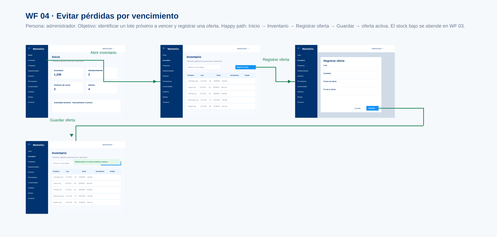 
<strong>Figura 24</strong> 
<em>Prevención de pérdidas por vencimiento</em> 
<small><em>Nota.</em> Elaboración propia.</small>

**Descripción.** El administrador identifica un lote próximo a vencer en Inventario, registra una oferta y comprueba que quede activa.

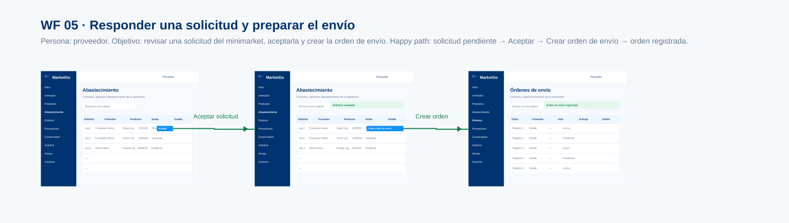 
<strong>Figura 25</strong> 
<em>Respuesta del proveedor y preparación del envío</em> 
<small><em>Nota.</em> Elaboración propia.</small>

**Descripción.** El proveedor revisa una solicitud pendiente, la acepta y crea una orden de envío para registrar la entrega.

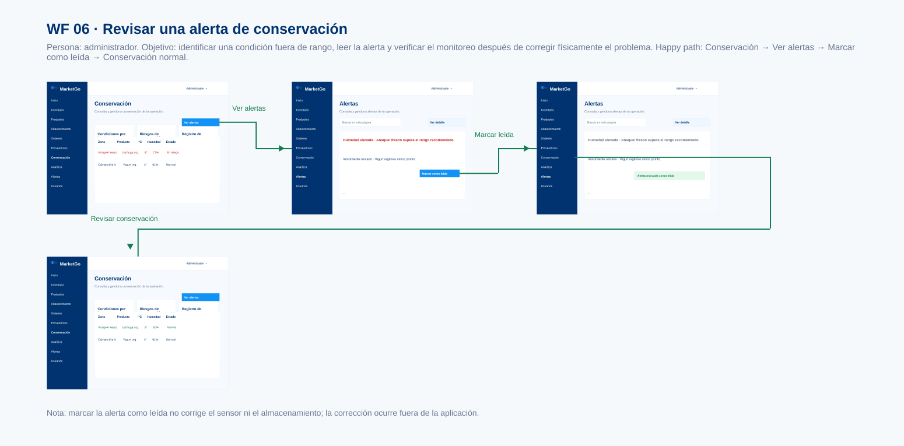 
<strong>Figura 26</strong> 
<em>Revisión de una alerta de conservación</em> 
<small><em>Nota.</em> Elaboración propia.</small>

**Descripción.** El administrador consulta una condición fuera de rango, marca la alerta como leída y verifica nuevamente el monitoreo después de corregir físicamente el problema.

### 4.4.3. Web Applications Mock-ups.

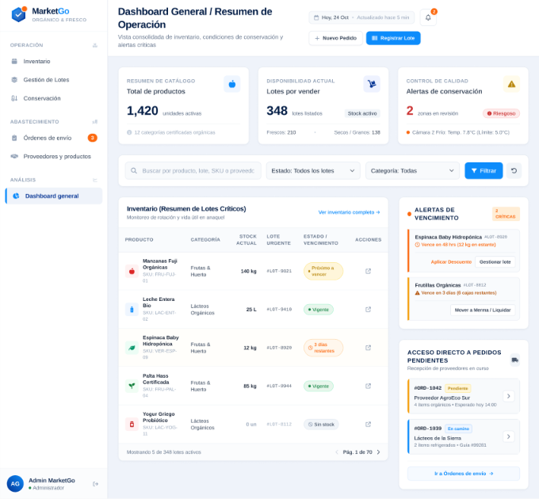 
<strong>Figura 27</strong> 
<em>Mockup Web Application sección Dashboard</em> 
<small><em>Nota.</em> Elaboración propia.</small>

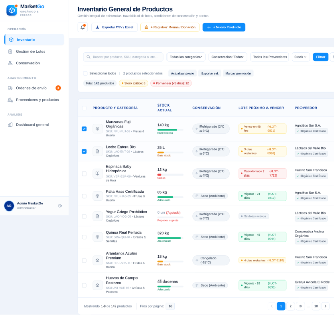 
<strong>Figura 28</strong> 
<em>Mockup Web Application sección Inventario</em> 
<small><em>Nota.</em> Elaboración propia.</small>

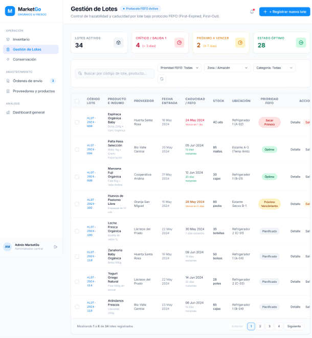 
<strong>Figura 29</strong> 
<em>Mockup Web Application sección Gestión de lotes</em> 
<small><em>Nota.</em> Elaboración propia.</small>

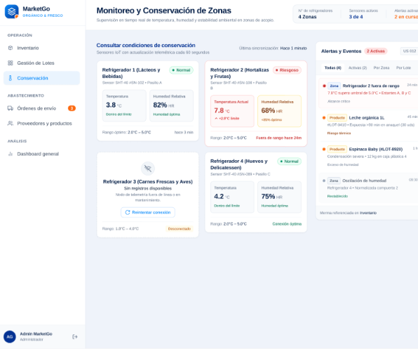 
<strong>Figura 30</strong> 
<em>Mockup Web Application sección Conservación</em> 
<small><em>Nota.</em> Elaboración propia.</small>

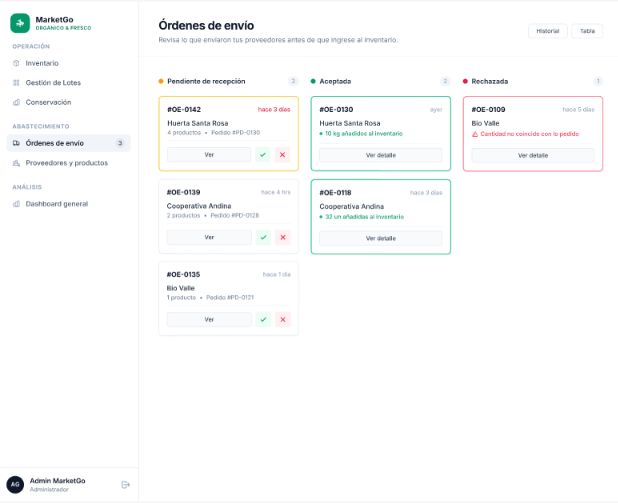 
<strong>Figura 31</strong> 
<em>Mockup Web Application sección Órdenes de envío</em> 
<small><em>Nota.</em> Elaboración propia.</small>

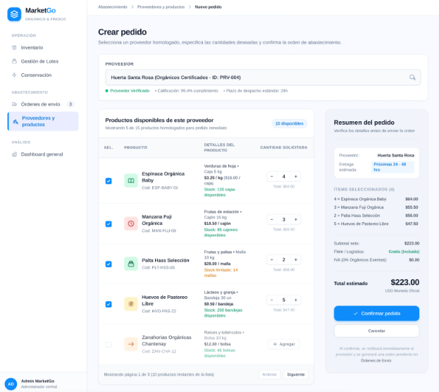 
<strong>Figura 32</strong> 
<em>Mockup Web Application sección Proveedores y Productos</em> 
<small><em>Nota.</em> Elaboración propia.</small>

### 4.4.4. Web Applications User Flow Diagrams.

Los User Flows detallan los objetivos del visitante, el administrador y el proveedor. Además de la ruta principal, las figuras muestran decisiones y resultados alternativos cuando corresponde.

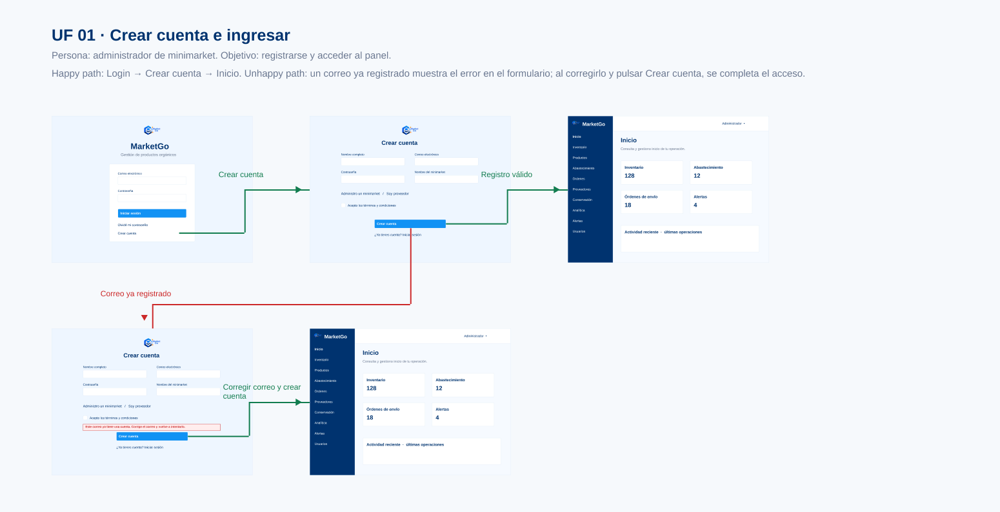 
<strong>Figura 33</strong> 
<em>Registro de cuenta e ingreso al sistema</em> 
<small><em>Nota.</em> Elaboración propia.</small>

**Descripción.** El camino principal registra la cuenta y abre Inicio; la ruta alternativa muestra un correo ya registrado y permite corregirlo antes de continuar.

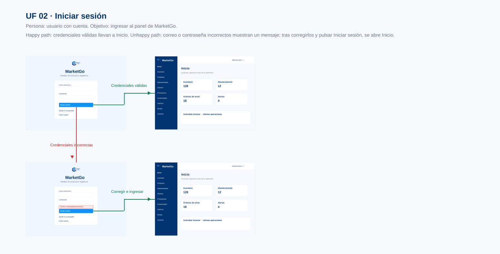 
<strong>Figura 34</strong> 
<em>Inicio de sesión con validación de credenciales</em> 
<small><em>Nota.</em> Elaboración propia.</small>

**Descripción.** Las credenciales válidas conducen al panel de Inicio. Si son incorrectas, el formulario muestra el error y permite volver a intentar.

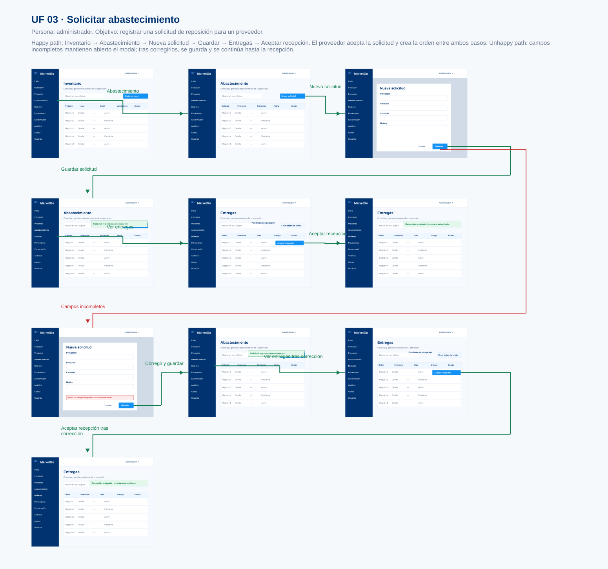 
<strong>Figura 35</strong> 
<em>Solicitud de abastecimiento y confirmación de recepción</em> 
<small><em>Nota.</em> Elaboración propia.</small>

**Descripción.** El administrador registra la solicitud y confirma la recepción. Si faltan campos, el formulario permanece abierto hasta que se corrijan.

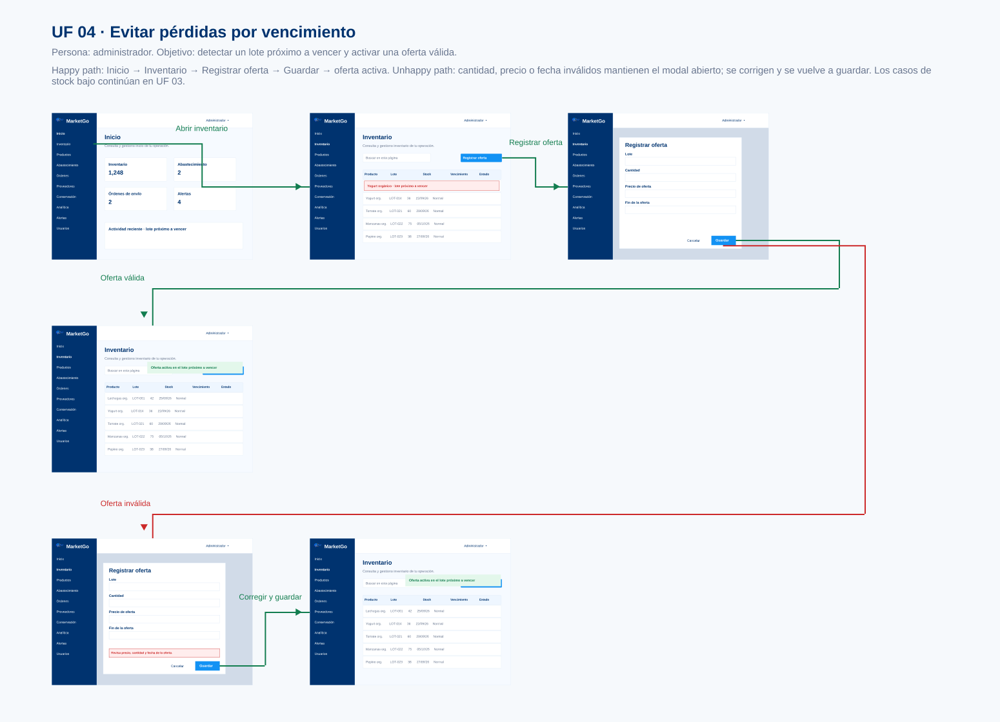 
<strong>Figura 36</strong> 
<em>Registro de oferta para un lote próximo a vencer</em> 
<small><em>Nota.</em> Elaboración propia.</small>

**Descripción.** El administrador activa una oferta válida; cantidades, precios o fechas incorrectos abren la ruta de corrección antes de guardar.

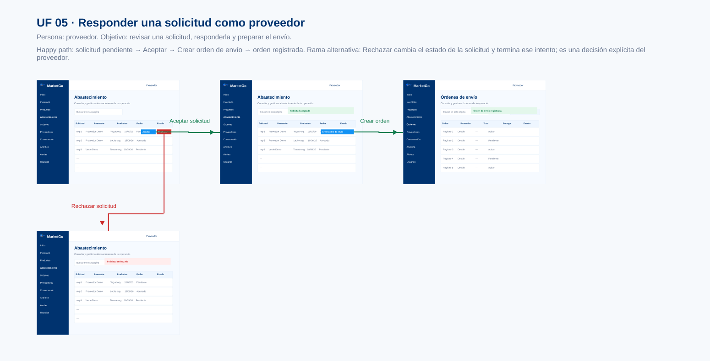 
<strong>Figura 37</strong> 
<em>Respuesta del proveedor a una solicitud</em> 
<small><em>Nota.</em> Elaboración propia.</small>

**Descripción.** El proveedor puede aceptar la solicitud y crear la orden de envío o rechazarla, dejando constancia de ambos resultados.

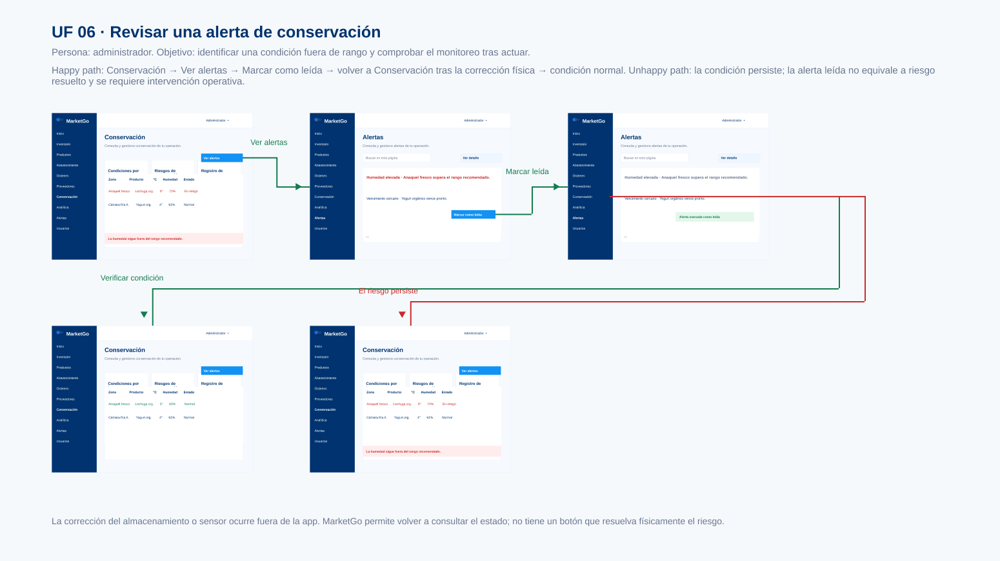 
<strong>Figura 38</strong> 
<em>Seguimiento de una alerta de conservación</em> 
<small><em>Nota.</em> Elaboración propia.</small>

**Descripción.** El administrador revisa y marca la alerta como leída; después verifica si la condición volvió al rango normal o si el riesgo persiste y requiere intervención.

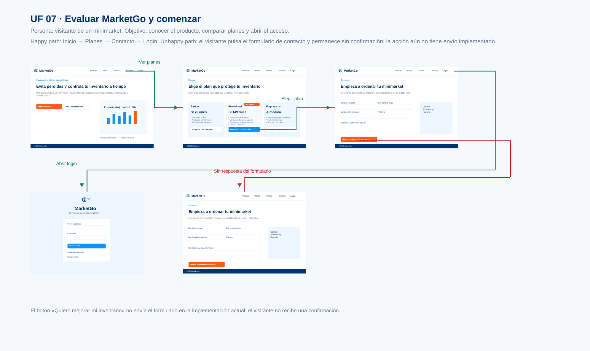 
<strong>Figura 39</strong> 
<em>Evaluación de MarketGo desde la landing page</em> 
<small><em>Nota.</em> Elaboración propia.</small>

**Descripción.** El visitante compara planes, consulta Contacto y abre el acceso. El flujo también señala que el formulario de contacto todavía no confirma el envío.

## 4.5. Web Applications Prototyping.
[Web Application Protoyping link](https://www.figma.com/design/HPzyjpUMoorZ8JsJUYhdqk/MarketGo-Platform?t=HFQ6xMlDHy9YW7Vq-0)

## 4.6. Domain-Driven Software Architecture.

La arquitectura de software de MarketGo se construye a partir del análisis del dominio de gestión de productos orgánicos, inventario, conservación, abastecimiento y control operativo para minimarkets y proveedores. A partir de este análisis se aplican los principios de Domain-Driven Design (DDD), permitiendo dividir la solución en bounded contexts coherentes con las responsabilidades principales del negocio.

En las siguientes secciones se presenta cada nivel del modelo arquitectónico, explicando la estructura, responsabilidades y comunicación entre los elementos que conforman la arquitectura de MarketGo.

### 4.6.1. Design-Level EventStorming.

Para identificar los eventos de dominio y la lógica de negocio de MarketGo, se realizó un proceso de Event Storming orientado a comprender los flujos principales de la plataforma: registro de productos, control de inventario, monitoreo de conservación, solicitudes de abastecimiento, gestión de proveedores, alertas y análisis operativo.

El desarrollo del proceso de Domain-Driven Design se realizó en LucidChart: [https://lucid.app/lucidspark/d7f4679c-eca6-4e34-a638-733027262712/edit?viewport_loc=-8761%2C-2894%2C1920%2C1532%2C0_0&invitationId=inv_ffb713f0-52eb-4b51-9e5e-1d11e4d93b05](https://lucid.app/lucidspark/d7f4679c-eca6-4e34-a638-733027262712/edit?viewport_loc=-8761%2C-2894%2C1920%2C1532%2C0_0&invitationId=inv_ffb713f0-52eb-4b51-9e5e-1d11e4d93b05)

A continuación, se presenta la leyenda utilizada durante el proceso de Event Storming:

 
<strong>Figura 40</strong> 
<em>Leyenda del Design-Level EventStorming de MarketGo</em> 
<small><em>Nota.</em> Elaboración propia.</small>

El siguiente diagrama presenta el Event Storming general de MarketGo y permite visualizar los principales eventos, comandos, actores y procesos identificados en el dominio:

 
<strong>Figura 41</strong> 
<em>Design-Level EventStorming general de MarketGo</em> 
<small><em>Nota.</em> Elaboración propia.</small>

A partir de este análisis se identificaron los siguientes bounded contexts:

1. **IAM**

   El bounded context IAM se encarga de la autenticación, autorización y control de acceso dentro de MarketGo. Gestiona usuarios, roles y permisos, asegurando que cada actor, como el administrador de minimarket o el proveedor, acceda únicamente a las funcionalidades correspondientes a su perfil.

   

   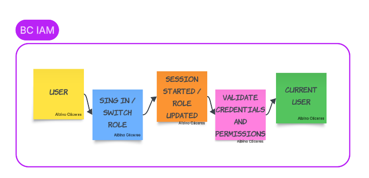 
   <strong>Figura 42</strong> 
   <em>Design-Level EventStorming del bounded context IAM</em> 
   <small><em>Nota.</em> Elaboración propia.</small>
   

2. **Profiles**

   El bounded context Profiles administra la información de los usuarios, minimarkets y proveedores registrados en la plataforma. Su propósito es centralizar los datos de perfil necesarios para personalizar la experiencia, controlar responsabilidades y asociar operaciones con el actor correspondiente.

   

   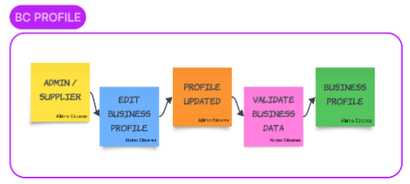 
   <strong>Figura 43</strong> 
   <em>Design-Level EventStorming del bounded context Profiles</em> 
   <small><em>Nota.</em> Elaboración propia.</small>
   

3. **Dashboard**

   El bounded context Dashboard presenta una vista general del estado operativo de la plataforma según el rol del usuario. Permite visualizar indicadores relevantes sobre inventario, abastecimiento, conservación, alertas y actividad reciente.

   

   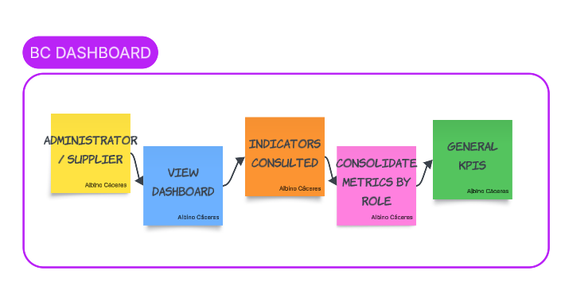 
   <strong>Figura 44</strong> 
   <em>Design-Level EventStorming del bounded context Dashboard</em> 
   <small><em>Nota.</em> Elaboración propia.</small>
   

4. **Analytics**

   El bounded context Analytics procesa información operativa para generar indicadores, métricas y resúmenes que apoyan la toma de decisiones. Permite analizar el estado del inventario, productos próximos a vencer, alertas de conservación, desempeño de proveedores y movimientos de abastecimiento.

   

   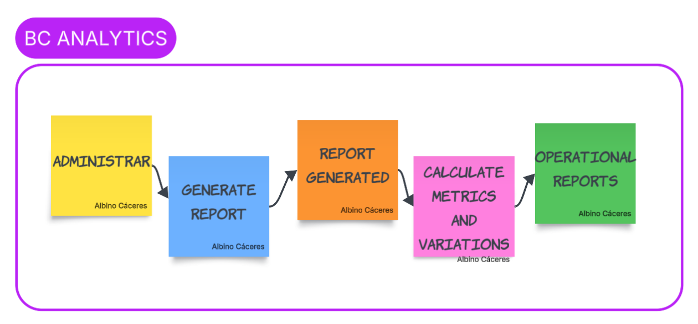 
   <strong>Figura 45</strong> 
   <em>Design-Level EventStorming del bounded context Analytics</em> 
   <small><em>Nota.</em> Elaboración propia.</small>
   

5. **Inventory**

   El bounded context Inventory gestiona los productos registrados en el minimarket, sus cantidades, lotes, fechas de vencimiento, estados y movimientos asociados. Su propósito es mantener trazabilidad sobre las existencias y facilitar el control de productos disponibles, en riesgo o con pérdidas.

   

   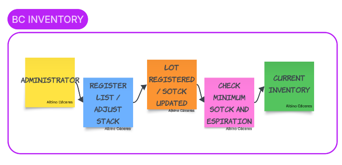 
   <strong>Figura 46</strong> 
   <em>Design-Level EventStorming del bounded context Inventory</em> 
   <small><em>Nota.</em> Elaboración propia.</small>
   

6. **Products**

   El bounded context Products administra el catálogo de productos orgánicos ofrecidos por proveedores o registrados por minimarkets. Centraliza información como nombre, categoría, descripción, unidad de medida, disponibilidad y datos relevantes para su comercialización o abastecimiento.

   

   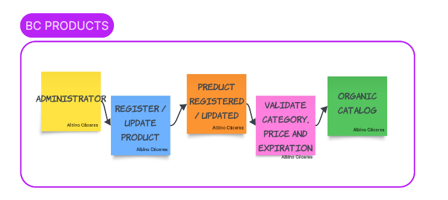 
   <strong>Figura 47</strong> 
   <em>Design-Level EventStorming del bounded context Products</em> 
   <small><em>Nota.</em> Elaboración propia.</small>
   

7. **Requisition**

   El bounded context Requisition gestiona las solicitudes de abastecimiento generadas por los minimarkets hacia los proveedores. Permite registrar productos solicitados, cantidades, estado de la solicitud y trazabilidad del proceso de aceptación o rechazo.

   

   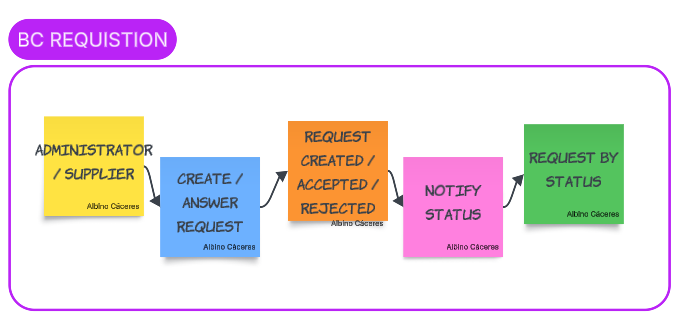 
   <strong>Figura 48</strong> 
   <em>Design-Level EventStorming del bounded context Requisition</em> 
   <small><em>Nota.</em> Elaboración propia.</small>
   

8. **Procurements**

   El bounded context Procurements administra las órdenes de envío asociadas a solicitudes de abastecimiento aceptadas. Su responsabilidad es permitir al proveedor registrar los productos y cantidades que serán enviados, mientras que el administrador del minimarket puede revisar, aceptar o rechazar la recepción. Cuando una orden de envío es aceptada, los productos recibidos pueden incorporarse al inventario correspondiente.

   

   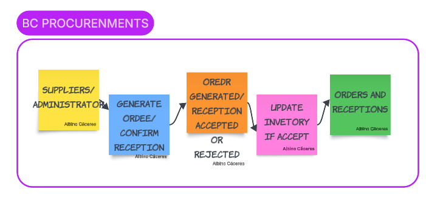 
   <strong>Figura 49</strong> 
   <em>Design-Level EventStorming del bounded context Procurements</em> 
   <small><em>Nota.</em> Elaboración propia.</small>
   

9. **Suppliers**

   El bounded context Suppliers gestiona el directorio de proveedores de productos orgánicos, así como los productos que ofrecen y su participación dentro de los procesos de abastecimiento.

   

   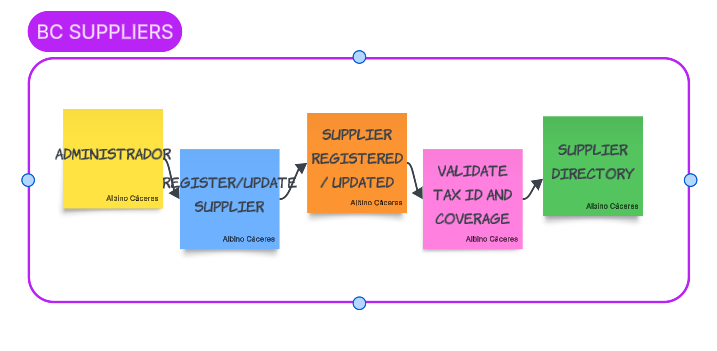 
   <strong>Figura 50</strong> 
   <em>Design-Level EventStorming del bounded context Suppliers</em> 
   <small><em>Nota.</em> Elaboración propia.</small>
   

10. **Conservation**

    El bounded context Conservation permite monitorear condiciones de conservación de productos, como temperatura y humedad. Su propósito es identificar riesgos de deterioro y generar alertas cuando las condiciones se encuentren fuera de los rangos aceptables.

    

    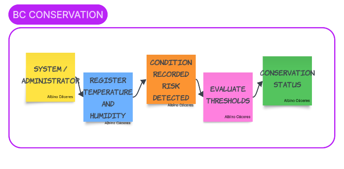 
    <strong>Figura 51</strong> 
    <em>Design-Level EventStorming del bounded context Conservation</em> 
    <small><em>Nota.</em> Elaboración propia.</small>
    

11. **Communication**

    El bounded context Communication gestiona las alertas y notificaciones generadas por la plataforma. Incluye avisos sobre productos próximos a vencer, condiciones de conservación riesgosas, solicitudes pendientes, órdenes de envío y eventos relevantes para los usuarios.

    

    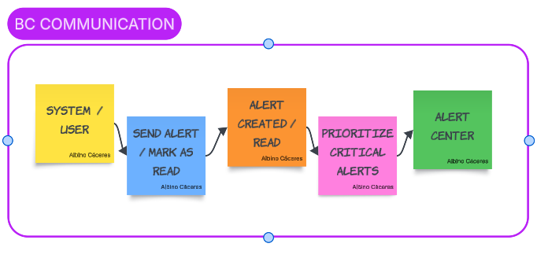 
    <strong>Figura 52</strong> 
    <em>Design-Level EventStorming del bounded context Communication</em> 
    <small><em>Nota.</em> Elaboración propia.</small>
    

12. **Shared Kernel**

    El bounded context Shared Kernel contiene elementos comunes utilizados por los demás contextos, como utilidades compartidas, contratos base, configuraciones, validaciones comunes y estructuras transversales del sistema.

    

    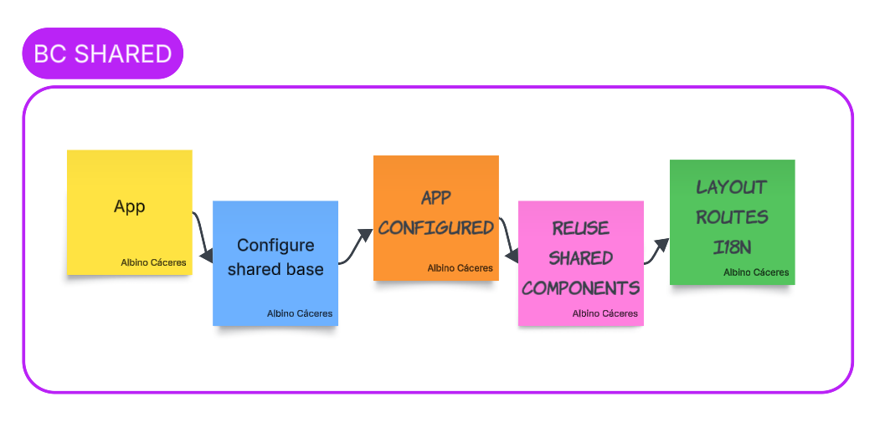 
    <strong>Figura 53</strong> 
    <em>Design-Level EventStorming del Shared Kernel</em> 
    <small><em>Nota.</em> Elaboración propia.</small>
    

### 4.6.2. Software Architecture Context Diagram

En este nivel se presenta una vista de alto nivel de la arquitectura, donde el foco está en el sistema MarketGo como una caja negra y en las interacciones que mantiene con sus usuarios y servicios externos.

El context diagram muestra al **MarketGo Software System** como el sistema central, rodeado por los principales actores y sistemas con los que interactúa:

- **Administrador de minimarket**: usuario encargado de registrar productos, controlar inventario, gestionar lotes, revisar fechas de vencimiento, crear solicitudes de abastecimiento y confirmar o rechazar la recepción de órdenes de envío.
- **Proveedor de productos orgánicos**: usuario responsable de registrar productos ofrecidos, revisar solicitudes de abastecimiento, aceptarlas o rechazarlas, y crear órdenes de envío asociadas a solicitudes aceptadas.
- **Administrador del sistema**: usuario encargado de gestionar cuentas, roles, permisos y configuración general de la plataforma.
- **Servicio de notificaciones**: sistema externo utilizado para enviar alertas y comunicaciones relacionadas con vencimientos, conservación, solicitudes y abastecimiento.
- **Servicio de monitoreo de conservación**: fuente externa o módulo de integración encargado de proporcionar información relacionada con temperatura y humedad para evaluar condiciones de conservación.

En el diagrama se representan las relaciones entre estos elementos, destacando que los actores humanos interactúan con MarketGo mediante la aplicación web, mientras que el sistema coordina los procesos internos y las integraciones necesarias para alertas, monitoreo y trazabilidad operativa.

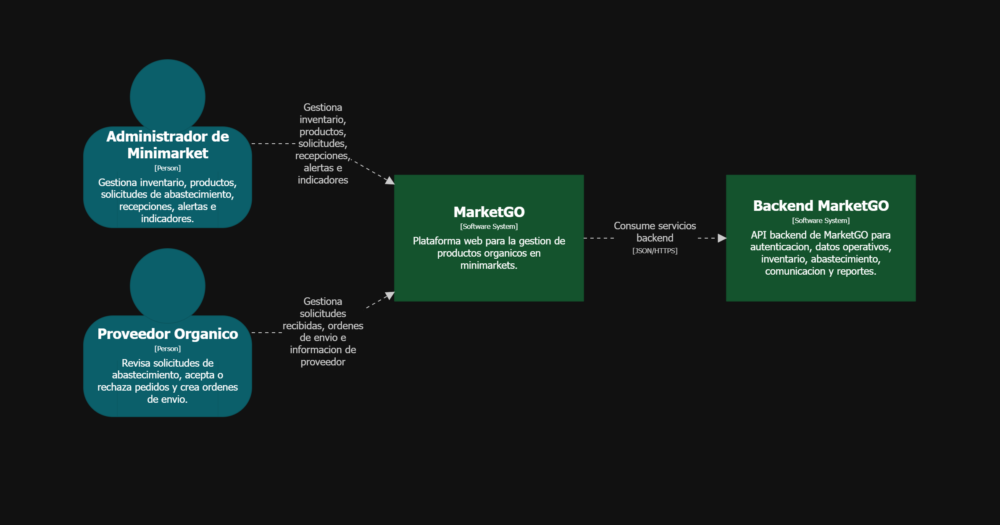 
<strong>Figura 54</strong> 
<em>Diagrama de contexto de la arquitectura de MarketGo</em> 
<small><em>Nota.</em> Elaboración propia.</small>

---

### 4.6.3. Software Architecture Container Diagrams

En el nivel de contenedores, la arquitectura de MarketGo se organiza en aplicaciones y fuentes de datos que colaboran para brindar la experiencia completa de la plataforma.

La arquitectura lógica de MarketGo se estructura en los siguientes contenedores:

- **Landing Page**: aplicación web pública orientada a presentar la propuesta de valor de MarketGo, sus beneficios y funcionalidades principales para minimarkets y proveedores de productos orgánicos.
- **Single Page Application (SPA)**: aplicación web principal donde los usuarios interactúan con los módulos de inventario, productos, proveedores, solicitudes de abastecimiento, órdenes de envío, conservación, analítica, dashboard, perfiles, comunicación e IAM.
- **API REST Application**: backend encargado de exponer los servicios de negocio mediante endpoints REST. Centraliza la lógica de aplicación, validaciones, reglas de dominio y coordinación entre bounded contexts.
- **Database**: base de datos donde se persiste la información del sistema, incluyendo usuarios, perfiles, productos, inventario, lotes, solicitudes de abastecimiento, órdenes de envío, proveedores, alertas, métricas y registros de conservación.

En el diagrama se observa que:

- Los usuarios pueden conocer la solución mediante la **Landing Page** y luego acceder a la **SPA**.
- La **SPA** se comunica con la **API REST Application** mediante peticiones HTTP/HTTPS y mensajes JSON.
- La **API REST Application** procesa la lógica del dominio y persiste la información en la **Database**.
- Los módulos de comunicación y conservación pueden integrarse con servicios externos para notificaciones y monitoreo de condiciones ambientales.

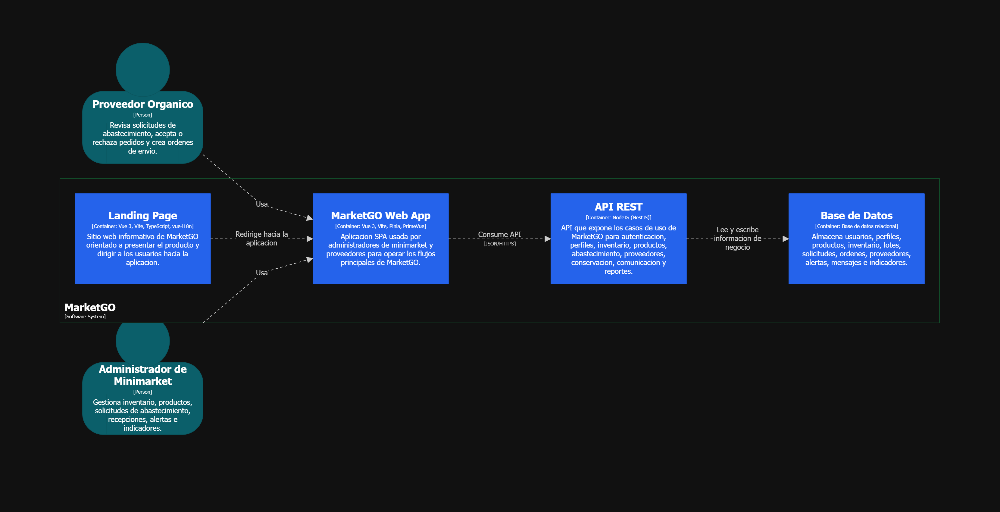 
<strong>Figura 55</strong> 
<em>Diagrama de contenedores de la arquitectura de MarketGo</em> 
<small><em>Nota.</em> Elaboración propia.</small>

---

### 4.6.4. Software Architecture Components Diagrams

En el nivel de componentes se detalla la descomposición interna de la arquitectura de MarketGo, especialmente del contenedor **API REST Application**, donde se agrupan los componentes principales alineados con los bounded contexts del dominio.

La API REST organiza sus responsabilidades en componentes especializados:

- **IAM Component**: gestiona autenticación, autorización, usuarios, roles y permisos.
- **Profiles Component**: administra perfiles de usuarios, minimarkets y proveedores.
- **Dashboard Component**: consolida información relevante para mostrar vistas generales según el rol del usuario.
- **Analytics Component**: procesa indicadores, métricas y reportes operativos.
- **Inventory Component**: gestiona inventario, lotes, cantidades, vencimientos, pérdidas y ofertas.
- **Products Component**: administra el catálogo de productos orgánicos registrados u ofrecidos.
- **Requisition Component**: gestiona solicitudes de abastecimiento entre minimarkets y proveedores.
- **Procurements Component**: administra órdenes de envío, aceptación, rechazo y recepción de productos.
- **Suppliers Component**: gestiona proveedores y sus productos ofrecidos.
- **Conservation Component**: monitorea condiciones de conservación y detecta riesgos.
- **Communication Component**: administra alertas y notificaciones del sistema.
- **Shared Kernel Component**: agrupa elementos transversales reutilizados por los demás componentes.

#### IAM Component Diagram

 
<strong>Figura 56</strong> 
<em>Diagrama de componentes de IAM</em> 
<small><em>Nota.</em> Elaboración propia.</small>

#### Profiles Component Diagram

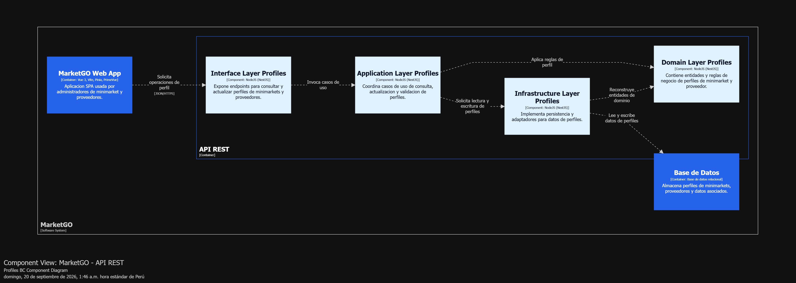 
<strong>Figura 57</strong> 
<em>Diagrama de componentes de Profiles</em> 
<small><em>Nota.</em> Elaboración propia.</small>

#### Dashboard Component Diagram

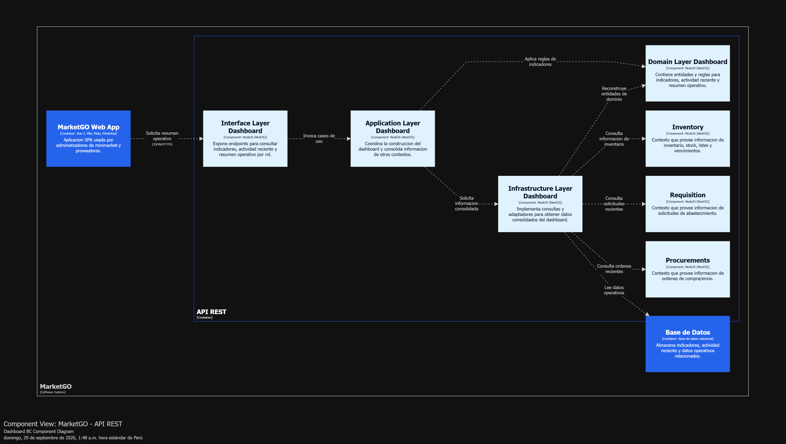 
<strong>Figura 58</strong> 
<em>Diagrama de componentes de Dashboard</em> 
<small><em>Nota.</em> Elaboración propia.</small>

#### Analytics Component Diagram

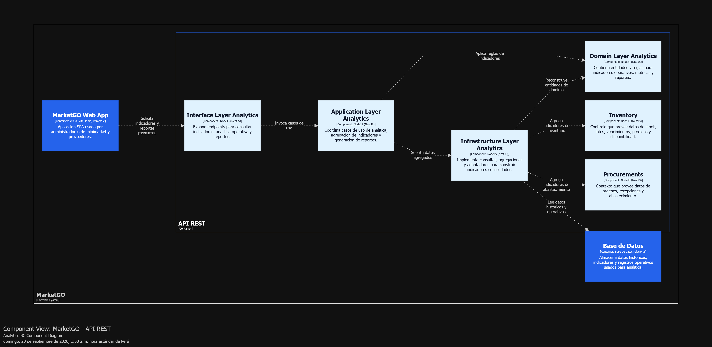 
<strong>Figura 59</strong> 
<em>Diagrama de componentes de Analytics</em> 
<small><em>Nota.</em> Elaboración propia.</small>

#### Inventory Component Diagram

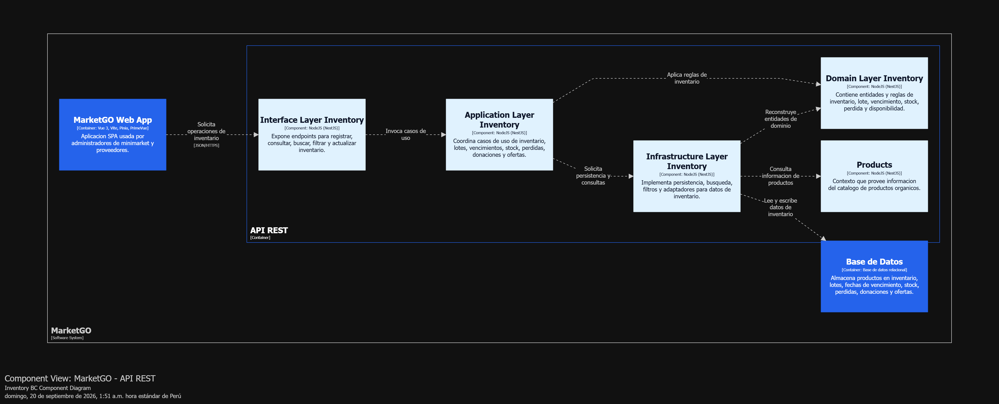 
<strong>Figura 60</strong> 
<em>Diagrama de componentes de Inventory</em> 
<small><em>Nota.</em> Elaboración propia.</small>

#### Products Component Diagram

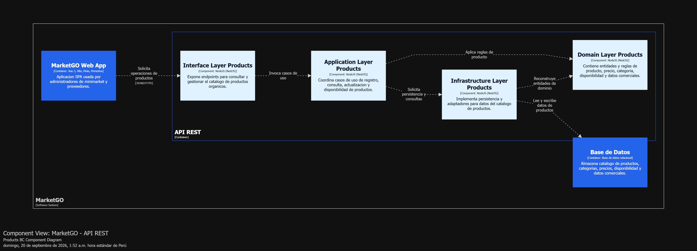 
<strong>Figura 61</strong> 
<em>Diagrama de componentes de Products</em> 
<small><em>Nota.</em> Elaboración propia.</small>

#### Procurements Component Diagram

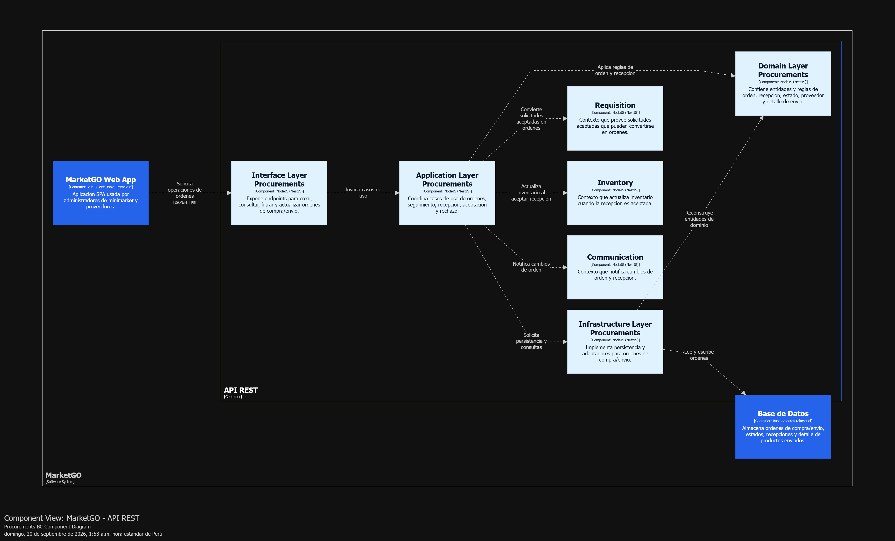 
<strong>Figura 62</strong> 
<em>Diagrama de componentes de Procurements</em> 
<small><em>Nota.</em> Elaboración propia.</small>

#### Suppliers Component Diagram

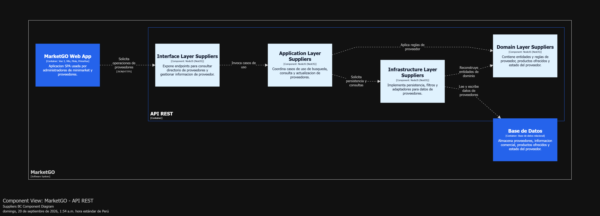 
<strong>Figura 63</strong> 
<em>Diagrama de componentes de Suppliers</em> 
<small><em>Nota.</em> Elaboración propia.</small>

#### Conservation Component Diagram

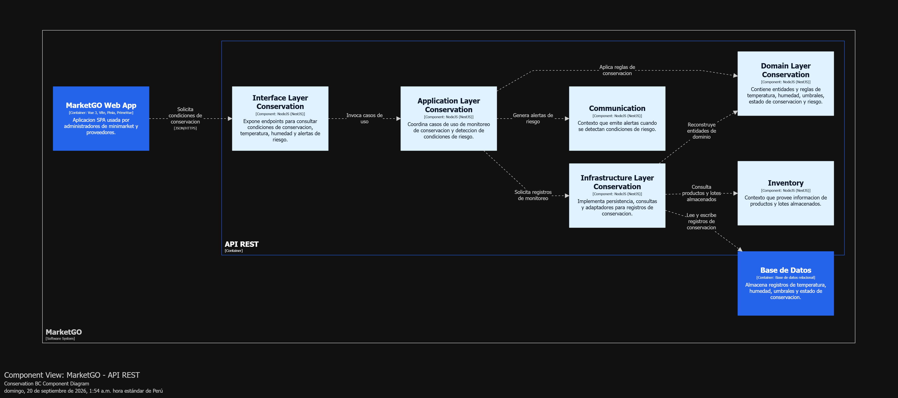 
<strong>Figura 64</strong> 
<em>Diagrama de componentes de Conservation</em> 
<small><em>Nota.</em> Elaboración propia.</small>

#### Communication Component Diagram

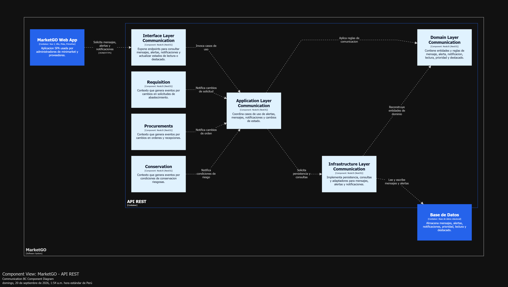 
<strong>Figura 65</strong> 
<em>Diagrama de componentes de Communication</em> 
<small><em>Nota.</em> Elaboración propia.</small>

#### Shared Kernel Component Diagram

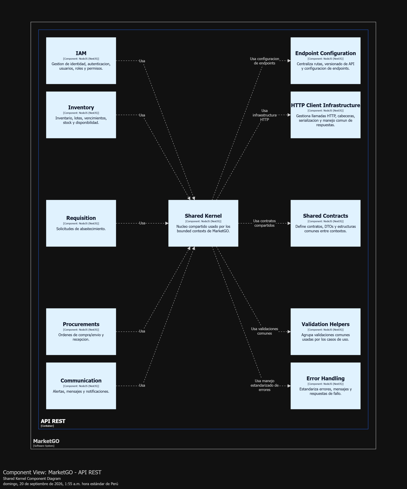 
<strong>Figura 66</strong> 
<em>Diagrama de componentes de Shared Kernel</em> 
<small><em>Nota.</em> Elaboración propia.</small>

De esta forma, los component diagrams complementan la visión general de la arquitectura, mostrando cómo MarketGo organiza sus responsabilidades internas en componentes coherentes con el dominio y cómo estos colaboran para implementar la gestión de productos orgánicos, inventario, conservación, abastecimiento, proveedores, comunicación y analítica.

## 4.7. Software Object-Oriented Design.

En esta sección se presenta el diseño orientado a objetos de MarketGo, representando la estructura de clases principales del sistema y su organización por bounded contexts. Estos diagramas permiten visualizar las responsabilidades de cada clase, sus atributos, métodos y relaciones dentro de la arquitectura de la aplicación.

### 4.7.1. Class Diagrams.

Los diagramas de clases muestran la organización interna de los componentes principales de MarketGo, siguiendo una estructura alineada con los bounded contexts definidos previamente. Cada diagrama representa las clases más relevantes dentro de un módulo específico, permitiendo comprender cómo se modelan los conceptos del dominio y cómo se relacionan con la lógica de aplicación.

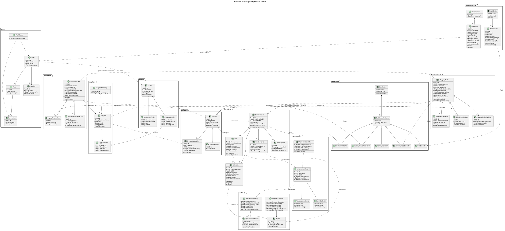 
<strong>Figura 67</strong> 
<em>Diagrama de clases de MarketGo por bounded context</em> 
<small><em>Nota.</em> Elaboración propia.</small>

A continuación, se presentan los diagramas de clases correspondientes a los principales bounded contexts de MarketGo:

#### Communication Class Diagram

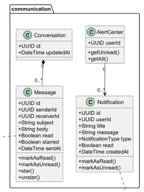 
<strong>Figura 68</strong> 
<em>Diagrama de clases de Communication</em> 
<small><em>Nota.</em> Elaboración propia.</small>

#### Procurements Class Diagram

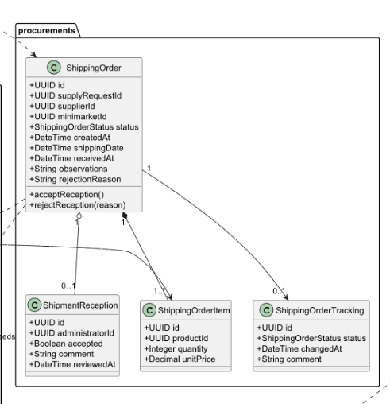 
<strong>Figura 69</strong> 
<em>Diagrama de clases de Procurements</em> 
<small><em>Nota.</em> Elaboración propia.</small>

#### Dashboard Class Diagram

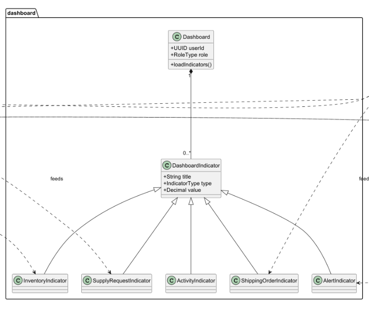 
<strong>Figura 70</strong> 
<em>Diagrama de clases de Dashboard</em> 
<small><em>Nota.</em> Elaboración propia.</small>

#### Conservation Class Diagram

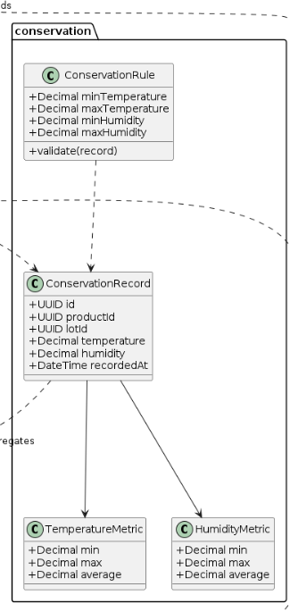 
<strong>Figura 71</strong> 
<em>Diagrama de clases de Conservation</em> 
<small><em>Nota.</em> Elaboración propia.</small>

#### Analytics Class Diagram

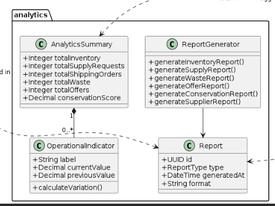 
<strong>Figura 72</strong> 
<em>Diagrama de clases de Analytics</em> 
<small><em>Nota.</em> Elaboración propia.</small>

#### Inventory Class Diagram

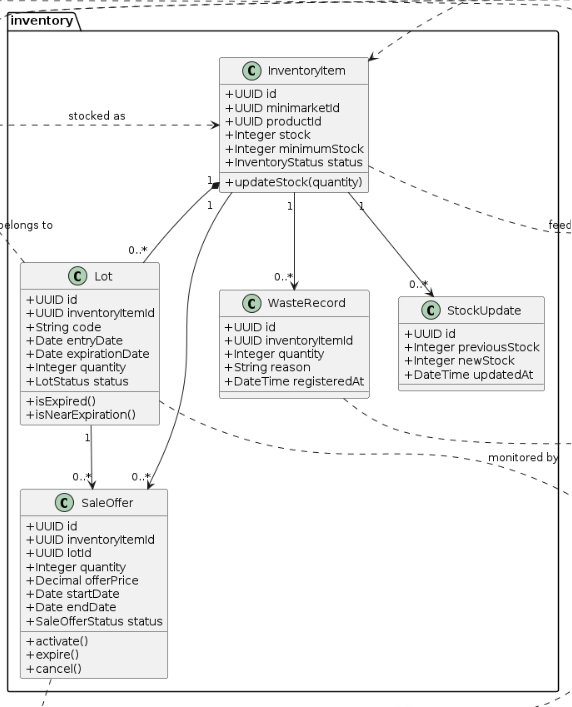 
<strong>Figura 73</strong> 
<em>Diagrama de clases de Inventory</em> 
<small><em>Nota.</em> Elaboración propia.</small>

#### Products Class Diagram

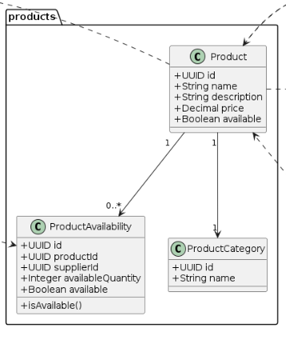 
<strong>Figura 74</strong> 
<em>Diagrama de clases de Products</em> 
<small><em>Nota.</em> Elaboración propia.</small>

#### IAM Class Diagram

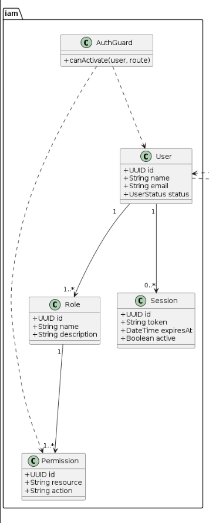 
<strong>Figura 75</strong> 
<em>Diagrama de clases de IAM</em> 
<small><em>Nota.</em> Elaboración propia.</small>

#### Profiles Class Diagram

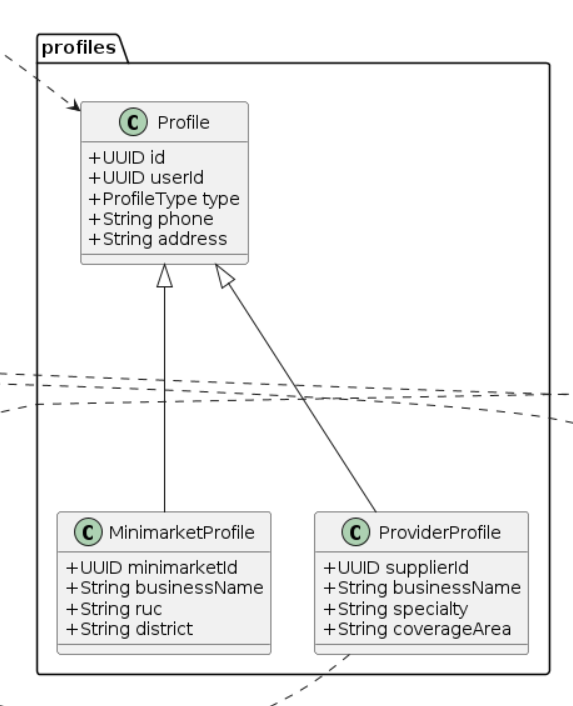 
<strong>Figura 76</strong> 
<em>Diagrama de clases de Profiles</em> 
<small><em>Nota.</em> Elaboración propia.</small>

#### Suppliers Class Diagram

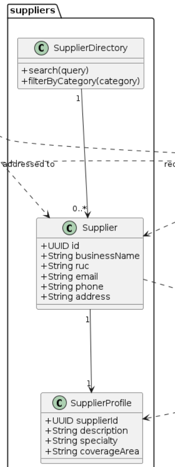 
<strong>Figura 77</strong> 
<em>Diagrama de clases de Suppliers</em> 
<small><em>Nota.</em> Elaboración propia.</small>

#### Requisition Class Diagram

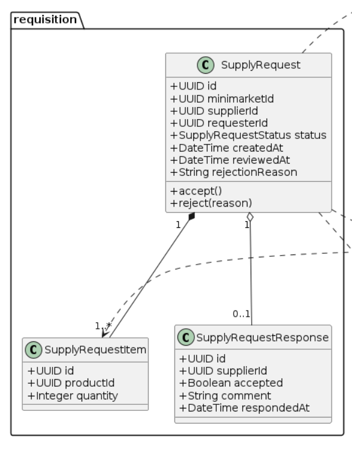 
<strong>Figura 78</strong> 
<em>Diagrama de clases de Requisition</em> 
<small><em>Nota.</em> Elaboración propia.</small>

Estos diagramas permiten complementar la arquitectura de software, mostrando una vista más detallada del diseño orientado a objetos de MarketGo. A través de ellos se puede identificar cómo se distribuyen las responsabilidades entre las clases y cómo estas representan los principales conceptos de cada bounded context.

---

## 4.8. Database Design.

El diseño de base de datos de MarketGo define la estructura de persistencia necesaria para almacenar y gestionar la información principal de la plataforma. Este diseño considera los datos relacionados con usuarios, perfiles, productos, inventario, proveedores, solicitudes de abastecimiento, órdenes de envío, conservación, comunicación, analítica y auditoría.

La base de datos se encuentra organizada de acuerdo con los bounded contexts definidos en la arquitectura del sistema, permitiendo mantener una separación lógica entre las distintas áreas funcionales. Esta organización facilita la trazabilidad de la información, la consistencia de los datos y la evolución del sistema conforme se incorporen nuevas funcionalidades.

### 4.8.1. Database Diagrams.

El diagrama de base de datos muestra las entidades principales de MarketGo, sus atributos, claves primarias, claves foráneas y relaciones. Esta vista permite comprender cómo se estructura la persistencia de los datos y cómo se relacionan las entidades que soportan los procesos principales de la plataforma.

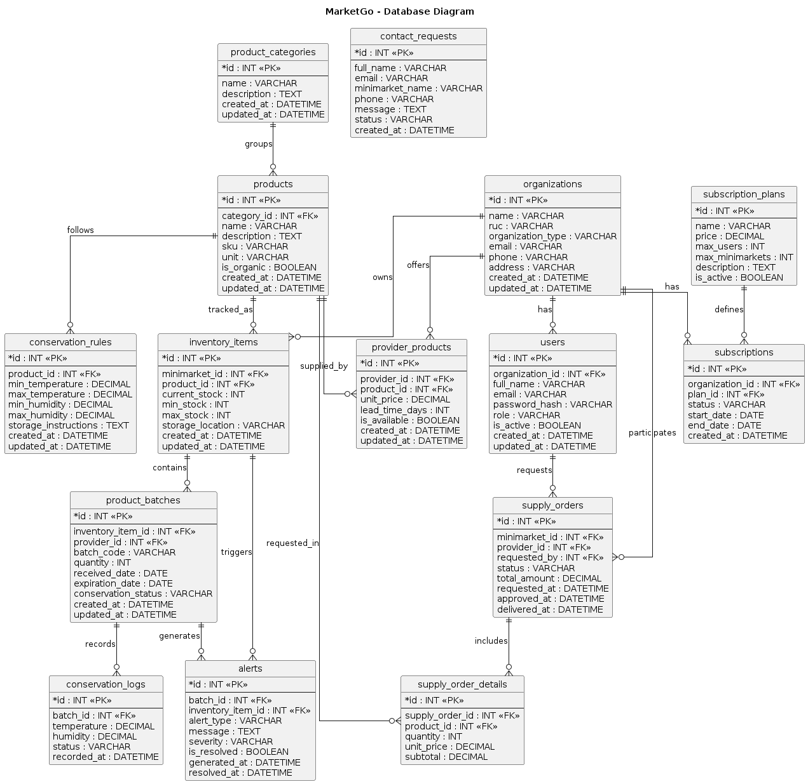 
<strong>Figura 79</strong> 
<em>Diagrama de base de datos de MarketGo</em> 
<small><em>Nota.</em> Elaboración propia.</small>

---

# Capítulo V: Product Implementation, Validation & Deployment

## 5.1. Software Configuration Management.

En esta sección se describen las decisiones, convenciones y principios adoptados por el equipo de **Market-Labs** para garantizar la coherencia, trazabilidad y control de versiones durante el ciclo de vida del desarrollo de la solución **MarketGo**. Se establecen los lineamientos para la configuración del entorno de desarrollo, gestión del código fuente, convenciones de estilo y configuración de despliegue orientada a la nube.

### 5.1.1. Software Development Environment Configuration.

Se especifican los productos de software utilizados durante el ciclo de vida del proyecto, organizados por disciplinas técnicas para asegurar la estandarización del entorno entre los desarrolladores de MarketGo.

#### Project Management
* **Jira:** Empleado para la organización visual del flujo de trabajo diario y la priorización rápida de tareas durante el desarrollo de los módulos de inventario y pedidos (Atlassian, s. f.).
    * **Ruta:** [https://trello.com/invite/b/6aaf23b3497a9f7b08a946ed/ATTIc6df49d5561e92016f5670f633077371DA4CB5DA/marketgo](https://trello.com/invite/b/6aaf23b3497a9f7b08a946ed/ATTIc6df49d5561e92016f5670f633077371DA4CB5DA/marketgo)
 
#### Product UX/UI Design
1.  **LucidChart:** Pizarra colaborativa usada para el Design-Level EventStorming de MarketGo y la identificación de eventos de inventario y abastecimiento.
2.  **Figma:** Herramienta principal para el diseño de la landing page y la plataforma web de gestión, incluyendo el diseño del sistema de diseño (Design System).
3.  **Structurizr:** Utilizado para el modelado de la arquitectura de software mediante diagramas C4 y diagramas de base de datos relacional.

#### Software Development
1.  **GitHub:** Hosting de repositorios bajo la organización Market-Labs. Implementación de GitFlow para separar las funcionalidades de inventario, compras y reportes (GitHub, s. f.).
2.  **WebStorm:** IDE especializado para el desarrollo del Frontend de MarketGo, optimizando la codificación con Vue.js y la gestión de estilos.
3.  **JetBrains Rider:** IDE principal para el desarrollo del Backend robusto basado en .NET/C#, facilitando la integración con servicios de base de datos y lógica de negocio.
4.  **Vue.js Framework:** Framework de JavaScript elegido para construir la interfaz de la aplicación web de MarketGo (Vue.js, s. f.-a).
5.  **ASP.NET Core / C# sobre .NET 10:** Tecnología de backend para garantizar la escalabilidad, seguridad transaccional en las órdenes de pedido y alto rendimiento.

#### Software Testing
* **Lenguaje Gherkin:** Utilizado para definir los criterios de aceptación en formato Given-When-Then de pedidos e inventario (Cucumber, s. f.).

#### Software Documentation
* **Swagger / OpenAPI:** Generación de documentación interactiva para que el equipo de Frontend pueda consumir los servicios de pedidos y proveedores de forma eficiente.

---
### 5.1.2. Source Code Management.

Se establecen los repositorios oficiales de la solución MarketGo para garantizar la integridad del código fuente.

#### Repositorios del Proyecto
<table>
  <thead>
    <tr>
      <th>Producto</th>
      <th>URL del Repositorio</th>
    </tr>
  </thead>
  <tbody>
    <tr>
      <td>Organización Market-Labs</td>
      <td><a href="https://github.com/Market-Labs">https://github.com/Market-Labs</a></td>
    </tr>
    <tr>
      <td>Landing Page</td>
      <td><a href="https://github.com/Market-Labs/landign-page">https://github.com/Market-Labs/landign-page</a></td>
    </tr>
    <tr>
      <td>Frontend Web Application</td>
      <td><a href="https://github.com/Market-Labs/front-end">https://github.com/Market-Labs/front-end</a></td>
    </tr>
    <tr>
      <td>Backend Web Services</td>
      <td><a href="https://github.com/Market-Labs/backend.git">https://github.com/Market-Labs/backend.git</a></td>
    </tr>
  </tbody>
</table>

#### GitFlow Workflow and Collaboration Strategy

Para asegurar una colaboración organizada, evitar conflictos en el código y mantener una integración continua clara, el equipo de **MarketLab** aplica **GitFlow** como flujo de trabajo de ramificación para el desarrollo de la landing page de **MarketGo**.

La estrategia de colaboración se define de la siguiente manera:

- **main:** Rama que contiene la versión estable y lista para producción de la landing page. Solo recibe integraciones finales desde `develop` cuando los cambios han sido revisados, probados y aprobados.

- **develop:** Rama principal de integración. En esta rama se unifican las funcionalidades terminadas antes de ser promovidas a `main`.

- **feature/<section>:** Ramas temporales creadas a partir de `develop` para aislar el desarrollo de cada sección o mejora de la landing page.  
  Ejemplos:
  - `feature/home-section`
  - `feature/product-information-section`
  - `feature/video-section`
  - `feature/pricing-section`
  - `feature/contact-section`

- **hotfix/<issue>:** Ramas creadas desde `main` para corregir errores críticos detectados en la versión estable de la landing page.

El flujo de trabajo establece que cada rama `feature` debe integrarse a `develop` mediante **Pull Request (PR)** en GitHub, permitiendo revisión de código antes de aprobar la integración.

Cada commit debe seguir la convención de **Conventional Commits**, permitiendo una trazabilidad clara de los cambios realizados en el proyecto.

Ejemplos:

- `feat(home): implement hero section`
- `feat(contact): complete contact landing section`
- `fix(contact): polish mobile section layout`
- `refactor(landing): align Vue sections with mockups`
- `docs(readme): update GitFlow workflow`

### 5.1.3. Source Code Style Guide & Conventions.

En esta sección se establecen las convenciones de estilo y nomenclatura adoptadas para los lenguajes utilizados en el proyecto MarketGo: HTML, CSS, JavaScript, TypeScript (Vue.js), C# (.NET 10) y Gherkin. Se aplica nomenclatura en inglés para todos los elementos del código, siguiendo el Ubiquitous Language definido para el dominio de inventario y abastecimiento.

#### Referencias de Guías de Estilo Adoptadas

| Lenguaje/Tecnología | Guía de Estilo |
| :--- | :--- |
| HTML/CSS | [Google HTML/CSS Style Guide](https://google.github.io/styleguide/htmlcssguide.html) (Google, s. f.-a) |
| JavaScript | [Google JavaScript Style Guide](https://google.github.io/styleguide/jsguide.html) (Google, s. f.-b) |
| TypeScript / Vue.js | [Vue.js Priority A Guide](https://vuejs.org/style-guide/rules-essential.html) (Vue.js, s. f.-b) |
| C# / .NET | [Microsoft C# Coding Conventions](https://learn.microsoft.com/en-us/dotnet/csharp/fundamentals/coding-style/coding-conventions) (Microsoft, s. f.) |
| Gherkin | [Gherkin Reference](https://cucumber.io/docs/gherkin/reference/) (Cucumber, s. f.) |

Se utiliza nomenclatura en inglés relacionada con las entidades del dominio de la landing page y la plataforma MarketGo, manteniendo nombres claros, consistentes y alineados al producto.
| Elemento                     | Convención             | Ejemplo                                             |
| :--------------------------- | :--------------------- | :-------------------------------------------------- |
| Componentes Vue              | PascalCase             | `HomeSection.vue`, `PricingSection.vue`             |
| Archivos de estilos CSS      | kebab-case             | `home-section.css`, `pricing-section.css`           |
| Variables / Métodos TS       | camelCase              | `activeSection`, `scrollToSection()`                |
| Constantes                   | SCREAMING_SNAKE_CASE   | `DEFAULT_LOCALE`, `CONTACT_EMAIL`                   |
| Rutas / IDs de secciones     | kebab-case             | `product-information`, `contact-section`            |
| Claves de i18n               | camelCase / dot.case   | `home.title`, `pricing.professionalPlan`            |
| Ramas Git feature            | kebab-case             | `feature/home-section`, `feature/contact-section`   |
| Commits                      | Conventional Commits   | `feat(home): implement hero section`                |

#### Sangría y Formato
* Se aplica una indentación de dos espacios para archivos web (HTML, CSS, TS) y de cuatro espacios para C# (estándar de Rider/Visual Studio).
* Las llaves de apertura en C# se colocan en una nueva línea (Estilo Allman), mientras que en TS/JS van en la misma línea (Estilo K&R).

---
### 5.1.4. Software Deployment Configuration.

Se especifica la configuración de despliegue para los entornos de MarketGo, garantizando alta disponibilidad para usuarios de la plataforma.

#### Landing Page - Azure
El despliegue de la landing page se documenta mediante la siguiente URL de Azure Static Web Apps (Microsoft, 2024).
* **URL:** https://agreeable-meadow-0a900b010.3.azurestaticapps.net/
## 5.2. Landing Page, Services & Applications Implementation.

### 5.2.1. Sprint 1.

#### 5.2.1.1. Sprint Planning 1.

| **Sprint Planning Sprint 1** |  |
|---|---|
| **Sprint Planning Background** |  |
| Date | 05/04/2026 |
| Time | 10:00 p.m. |
| Location | Discord / WhatsApp |
| Prepared By | Albino Florencio Cáceres Pizarro |
| Attendees | Albino Florencio Cáceres Pizarro Matias Daniel Huaranga Romero Winnie Lisbeth Merino Ordinola Andre Sebastian Quispe Almonacid Alexis Calin Torres Huaman |
| **Sprint Goal & User Stories** |  |
| **Sprint 1 Goal** | Our focus is on delivering the first marketing landing page of MarketGo, a product by MarketLab, that clearly communicates the value proposition regarding inventory management, batch tracking, product conservation alerts, and supplier-minimarket coordination.  We believe it delivers a clear, professional first impression for minimarket owners, administrators, and organic product providers, helping them understand how MarketGo centralizes daily inventory operations and improves operational traceability.  This will be confirmed when users can navigate through all core sections of the landing page, including Home, Product Description, Videos, Plans, and Contact, and can seamlessly request more information or contact the MarketLab team. |
| Sprint 1 Velocity | 14 Story Points |

  <strong>Repositorio:</strong>
  <a href="https://github.com/Market-Labs/landign-page">
    https://github.com/Market-Labs/landign-page
  </a>

#### 5.2.1.2. Aspect Leaders and Collaborators.

Esta matriz <strong>LACX</strong> identifica los aspectos principales del sprint y asigna responsabilidades de Líder (L) y Colaborador (C) para organizar al equipo de <strong>MarketLab</strong> durante el desarrollo de la landing page de <strong>MarketGo</strong>.

<table border="1" cellpadding="4" cellspacing="0" align="center">
  <thead>
    <tr>
      <th>Team Member</th>
      <th>Aspect: UI/UX & Visual Design</th>
      <th>Aspect: Vue Structure & Components</th>
      <th>Aspect: Content & i18n</th>
      <th>Aspect: GitFlow & Deployment</th>
    </tr>
  </thead>
  <tbody>
    <tr>
      <td>Cáceres Pizarro, Albino Florencio</td>
      <td>L</td>
      <td>C</td>
      <td>C</td>
      <td>L</td>
    </tr>
    <tr>
      <td>Huaranga Romero, Matias Daniel</td>
      <td>C</td>
      <td>L</td>
      <td>C</td>
      <td>C</td>
    </tr>
    <tr>
      <td>Merino Ordinola, Winnie Lisbeth</td>
      <td>C</td>
      <td>C</td>
      <td>L</td>
      <td>C</td>
    </tr>
    <tr>
      <td>Quispe Almonacid, Andre Sebastian</td>
      <td>C</td>
      <td>C</td>
      <td>C</td>
      <td>C</td>
    </tr>
    <tr>
      <td>Torres Huaman, Alexis Calin</td>
      <td>C</td>
      <td>C</td>
      <td>C</td>
      <td>C</td>
    </tr>
  </tbody>
</table>

#### 5.2.1.3. Sprint Backlog 1.

El Sprint Backlog agrupa las tareas iniciales correspondientes al diseño, desarrollo y documentación de la landing page de **MarketGo**, producto de **MarketLab** orientado a la gestión de inventario, lotes, conservación y abastecimiento de productos orgánicos para minimarkets.

  
  
<em>Figura: Tablero del Sprint 1 en Jira Software (Proyecto MarketGo)</em>

| User Story Id | Title | Task Id | Title | Description | Estimation (Hours) | Assigned To | Status |
| :--- | :--- | :--- | :--- | :--- | :--- | :--- | :--- |
| **US00** | Landing Page Base | T001 | Implementación de Home Section | Desarrollo de la sección principal de la landing page en Vue, presentando la propuesta de valor de MarketGo para minimarkets. | 4h | Cáceres Pizarro, Albino Florencio | Done |
| **US00** | Product Information | T002 | Maquetación de descripción del producto | Implementación de la sección informativa sobre inventario, lotes, alertas de conservación, pedidos y accesos por rol. | 4h | Huaranga Romero, Matias Daniel | Done |
| **US00** | Videos Section | T003 | Implementación de sección de videos | Desarrollo del apartado visual para presentar al equipo y mostrar el funcionamiento general de MarketGo. | 3h | Merino Ordinola, Winnie Lisbeth | Done |
| **US00** | Pricing Section | T004 | Implementación de planes | Maquetación de los planes Básico, Profesional y Empresarial, incluyendo precios, beneficios y llamadas a la acción. | 3h | Quispe Almonacid, Andre Sebastian | Done |
| **US00** | Contact Section | T005 | Implementación del formulario de contacto | Desarrollo de la sección de contacto con datos del equipo, formulario para minimarkets y aceptación de política de privacidad. | 4h | Torres Huaman, Alexis Calin | Done |
| **US00** | Landing Page Architecture | T006 | Organización DDD y estructura Vue | Refactorización de carpetas siguiendo una arquitectura orientada por secciones, separando componentes, estilos, assets e internacionalización. | 5h | Cáceres Pizarro, Albino Florencio | Done |
| **US00** | GitFlow Setup | T007 | Configuración de ramas y commits | Organización de ramas feature, integración en develop y actualización de main aplicando Conventional Commits. | 3h | Cáceres Pizarro, Albino Florencio | Done |

#### 5.2.1.4. Development Evidence for Sprint Review.

  Resumen de los commits más relevantes en el repositorio de la Landing Page de <strong>MarketGo</strong>, producto desarrollado por <strong>MarketLab</strong>.

<table border="1" cellpadding="4" cellspacing="0">
  <thead>
    <tr>
      <th>Branch</th>
      <th>Commit Id</th>
      <th>Commit Message</th>
      <th>Committed on</th>
    </tr>
  </thead>
  <tbody>
    <tr>
      <td>feature/marketgo-landing-page</td>
      <td><code>d49b631</code></td>
      <td>refactor(landing): align Vue sections with mockups</td>
      <td>19-09-2026</td>
    </tr>
    <tr>
      <td>feature/contact-section</td>
      <td><code>a6446e1</code></td>
      <td>feat(contact): complete contact landing section</td>
      <td>19-09-2026</td>
    </tr>
    <tr>
      <td>feature/contact-section</td>
      <td><code>fbf450a</code></td>
      <td>fix(contact): render email outside i18n parser</td>
      <td>19-09-2026</td>
    </tr>
    <tr>
      <td>develop</td>
      <td><code>1f850de</code></td>
      <td>fix(contact): polish mobile section layout</td>
      <td>19-09-2026</td>
    </tr>
    <tr>
      <td>main</td>
      <td><code>1f850de</code></td>
      <td>fix(contact): polish mobile section layout</td>
      <td>19-09-2026</td>
    </tr>
  </tbody>
</table>

#### 5.2.1.5. Execution Evidence for Sprint Review.

Durante el Sprint 1, el equipo logró implementar con éxito el diseño, maquetación y despliegue de la Landing Page estática de **MarketGo**. A continuación, se presentan las evidencias visuales de la ejecución del producto de software, demostrando el cumplimiento de los Criterios de Aceptación de las Historias de Usuario planificadas:

**Evidencia 1: Home Section y Propuesta de Valor**

Se desarrolló la pantalla de inicio principal destacando la propuesta de valor de **MarketGo**: controlar el inventario antes de que sea tarde mediante alertas de vencimiento, condiciones de conservación y pedidos de abastecimiento para minimarkets orgánicos. La navegación superior permite acceder a las secciones principales de la landing page y el diseño respeta los lineamientos *responsive* para dispositivos móviles.

  
  
<em>Figura: Vista principal de MarketGo desplegada en la Landing Page.</em>

**Evidencia 2: Sección de Descripción del Producto**

Se maquetó la sección informativa donde se presentan las principales capacidades de **MarketGo**, incluyendo inventario centralizado, control de lotes, alertas inteligentes, pedidos de abastecimiento y accesos por rol. Esta sección permite comunicar de forma clara cómo la plataforma ayuda a centralizar la operación diaria de un minimarket orgánico.

  
  
<em>Figura: Sección de descripción del producto y funcionalidades principales.</em>

**Evidencia 3: Sección de Videos**

Se implementó una sección dedicada a presentar al equipo y mostrar el funcionamiento general de **MarketGo** mediante contenido audiovisual. Esta sección permite reforzar la confianza del usuario y explicar visualmente el propósito de la solución.

  
  
<em>Figura: Sección de videos para presentación del equipo y demostración del producto.</em>

**Evidencia 4: Sección de Planes**

Se desarrolló la sección de planes comerciales, presentando las alternativas **Básico**, **Profesional** y **Empresarial**. Cada plan comunica de manera ordenada sus beneficios principales, permitiendo que los minimarkets identifiquen la opción más adecuada según su tamaño y necesidades operativas.

  
  
<em>Figura: Sección de planes disponibles para los usuarios de MarketGo.</em>

**Evidencia 5: Sección de Contacto**

Se implementó la sección de contacto, incluyendo información de correo, WhatsApp, horario de atención y un formulario para que los minimarkets interesados puedan solicitar más información o agendar una demostración. Esta sección cumple el objetivo de facilitar la comunicación directa con el equipo de **MarketLab**.

  
  
<em>Figura: Sección de contacto para solicitar información sobre MarketGo.</em>

#### 5.2.1.6. Services Documentation Evidence for Sprint Review.

  Dado que el Sprint 1 abarca únicamente contenido estático correspondiente a la Landing Page de marketing de <strong>MarketGo</strong>, la implementación y consumo de servicios backend para la gestión de inventario, lotes, conservación, pedidos y proveedores será abordada en sprints posteriores orientados al desarrollo de la plataforma web.

#### 5.2.1.7. Software Deployment Evidence for Sprint Review.

  <strong>URL de Producción:</strong>
  <a href="https://agreeable-meadow-0a900b010.3.azurestaticapps.net/">
    https://agreeable-meadow-0a900b010.3.azurestaticapps.net/
  </a>

#### 5.2.1.8. Team Collaboration Insights during Sprint.

  Durante este primer sprint, el esfuerzo principal del equipo de <strong>MarketLab</strong> se centró en la estructuración del proyecto, el diseño UX/UI, la implementación de la landing page, la organización de ramas mediante GitFlow y la documentación inicial del producto <strong>MarketGo</strong>. Por lo tanto, las evidencias de colaboración presentadas a continuación corresponden al trabajo realizado para construir la presencia digital inicial del producto.

  En primer lugar, el <strong>Historial de Commits</strong> del repositorio demuestra que el trabajo fue organizado mediante ramas feature y commits siguiendo la convención de <strong>Conventional Commits</strong>. Durante el sprint se realizaron cambios incrementales relacionados con la maquetación de secciones, la adaptación visual basada en los mockups, la internacionalización de contenido y la corrección de detalles responsive.

  
  
<em>Figura: Historial de commits demostrando el avance incremental de la landing page de MarketGo.</em>

  En segundo lugar, el gráfico de <strong>Visitors (Traffic)</strong> proporcionado por los Insights de GitHub permite evidenciar la actividad de consulta del repositorio. Las visitas y usuarios únicos reflejan que el equipo revisó recurrentemente el avance del proyecto, validando la estructura visual, el contenido de las secciones y la coherencia general de la landing page antes del despliegue.

  
  
<em>Figura: Gráfica de visitantes mostrando la revisión constante del repositorio por parte del equipo MarketLab.</em>

### 5.2.2. Sprint 2

#### 5.2.2.1. Sprint Planning 2.

La planificación del Sprint 2 se centró en definir el primer incremento del frontend web de MarketGo y el resultado que el equipo presentará en la revisión del sprint.

| **Sprint Planning Sprint 2** |  |
|---|---|
| **Sprint Planning Background** |  |
| Date | 2026-09-26 |
| Time | 10:00 p.m. |
| Location | Discord / WhatsApp |
| Prepared By | Albino Florencio Cáceres Pizarro |
| Attendees | Albino Florencio Cáceres Pizarro Matias Daniel Huaranga Romero Winnie Lisbeth Merino Ordinola Andre Sebastian Quispe Almonacid Alexis Calin Torres Huaman |
| Sprint 1 Review Summary | En el Sprint 1 se implementó y desplegó la primera versión de la landing page de MarketGo, con las secciones Home, información del producto, videos, planes y contacto. La entrega permitió presentar la propuesta de valor y comprobar la navegación inicial y la adaptación a distintos tamaños de pantalla. Este resultado sirve como punto de partida para construir el frontend de la aplicación web durante el Sprint 2. La evidencia disponible no registra comentarios específicos del Product Owner. |
| Sprint 1 Retrospective Summary | La documentación del Sprint 1 muestra trabajo incremental mediante ramas feature, commits convencionales y colaboración en diseño, contenido y despliegue. Para el Sprint 2 se propone reforzar la coordinación entre quienes implementan las pantallas, la navegación por roles y la integración visual, y revisar temprano la experiencia responsive antes de la Sprint Review. |
| **Sprint Goal & User Stories** |  |
| **Sprint 2 Goal** | Our focus is on developing and deploying the first navigable version of the MarketGo frontend web application for minimarket administrators and organic product suppliers. The sprint will translate the approved UX/UI designs into responsive screens, clear navigation for each role, and representative flows for the platform's core operations.  We believe this will give both user groups a concrete interface for exploring MarketGo's daily workflows and will let the team validate the usability and consistency of the frontend before expanding its integration with services.  This will be confirmed when the first frontend version is accessible in a deployed environment, its principal screens work on desktop and mobile, and the planned navigation and interaction flows can be demonstrated during the Sprint Review. |
| User Stories del tablero con puntos definidos | US-026 Registrar usuario (3 SP); US-027 Inicio de sesión (3 SP); US-028 Gestionar permisos por rol (5 SP); US-029 Controlar acceso según operación (5 SP); US-030 Dashboard general (5 SP). US-033 figura en Trello, pero no está estimada en el Product Backlog del capítulo 3. |
| Velocidad de referencia (Sprint 1) | 14 Story Points; se usa como antecedente, no como velocidad lograda en Sprint 2. |
| Sum of Story Points | 21 Story Points (3 + 3 + 5 + 5 + 5) para las cinco historias del tablero que tienen estimación en el capítulo 3. US-033 queda pendiente de incorporación y estimación en el Product Backlog. |

**Repositorio Landing Page:** https://github.com/Market-Labs/landign-page.git

**Repositorio Frontend:** https://github.com/Market-Labs/front-end.git

#### 5.2.2.2. Aspect Leaders and Collaborators.

Para el Sprint 2 se identificaron aspectos funcionales que corresponden a los bounded contexts implementados en el frontend, más un aspecto transversal de configuración del proyecto (Vue 3, Vite, Pinia e i18n). La siguiente matriz LACX recoge la asignación documentada para el Sprint 2. La captura general de Trello no permite verificar los responsables de todos los aspectos; los liderazgos deben contrastarse con las tarjetas asignadas y los commits de cada integrante.

| Team Member | IAM & Project Setup | Requisition & Procurement | Suppliers & Products | Inventory & Conservation | Dashboard & Profiles | Communication | Analytics |
|---|---|---|---|---|---|---|---|
| Cáceres Pizarro, Albino Florencio | L | C | C | C | L | C | C |
| Huaranga Romero, Matias Daniel | C | C | C | C | C | C | C |
| Merino Ordinola, Winnie Lisbeth | C | L | C | C | C | C | C |
| Quispe Almonacid, Andre Sebastian | C | L | C | L | C | C | C |
| Torres Huaman, Alexis Calin | C | C | C | C | L | L | C |

#### 5.2.2.3. Sprint Backlog 2.

El Sprint Backlog 2 agrupa los User Stories priorizados del Product Backlog que corresponden al primer release navegable del Frontend Web Application, organizados por bounded context. Se utilizó Trello Software como herramienta de control de estado.

  
  
<strong>Figura: Tablero del Sprint 2 en Trello (Proyecto MarketGo)</strong> <em>Nota. Elaboración propia.</em>

| User Story Id | Title | Task Id | Title | Description | Estimation (Hours) | Assigned To | Status |
| :--- | :--- | :--- | :--- | :--- | :--- | :--- | :--- |
| **US-026** | Registrar usuario | T008 | Implementar registro de usuarios | Implementación del formulario de registro de usuarios y validación de los datos ingresados para permitir el acceso controlado a MarketGo. | 4h | Cáceres Pizarro, Albino Florencio | To-Do |
| **US-027** | Inicio de sesión | T009 | Implementar inicio de sesión | Desarrollo de la interfaz de autenticación y validación de credenciales para permitir el acceso según el rol del usuario. | 4h | Cáceres Pizarro, Albino Florencio | To-Do |
| **US-026** | Registrar usuario | T010 | Crear perfil asociado al usuario | Implementación de la creación de un perfil vinculado a cada usuario registrado en MarketGo. | 3h | Cáceres Pizarro, Albino Florencio | To-Do |
| **US-028** | Gestionar permisos por rol | T011 | Configurar roles y permisos | Configuración de los roles del administrador de minimarket y proveedor, estableciendo los permisos correspondientes. | 4h | Cáceres Pizarro, Albino Florencio | To-Do |
| **US-029** | Controlar acceso según operación | T012 | Aplicar control de acceso por operación | Implementación de restricciones de acceso a las funcionalidades de pedidos, órdenes de envío e inventario según el rol del usuario. | 4h | Cáceres Pizarro, Albino Florencio | In-Progress |
| **US-030** | Dashboard general | T013 | Maquetar dashboard por rol | Diseño y desarrollo de la estructura visual del dashboard con información diferenciada para administradores y proveedores. | 4h | Torres Huaman, Alexis Calin | To-Do |
| **US-030** | Dashboard general | T014 | Definir indicadores iniciales del dashboard | Definición de indicadores operativos para visualizar información relevante sobre inventario, abastecimiento y operaciones según el rol. | 3h | Torres Huaman, Alexis Calin | In-Progress |
| **US-028** | Gestionar permisos por rol | T016 | Validar criterios de aceptación IAM | Verificación de los criterios de aceptación relacionados con registro, autenticación, roles y permisos de usuarios. | 3h | Cáceres Pizarro, Albino Florencio | To-Review |
| **US-030** | Dashboard general | T017 | Validar visualización de dashboard por rol | Validación de la información e indicadores mostrados en el dashboard según los permisos del administrador y proveedor. | 3h | Torres Huaman, Alexis Calin | To-Review |
| **US-033** | Solicitar información o demo | T018 | Documentar flujo de solicitud de demo | Documentación del proceso de solicitud de información o demostración mediante el formulario de contacto de la landing page. | 2h | Huaranga Romero, Matias Daniel | To-Fix |
| **US-026** | Registrar usuario | — | Definir historia de registro de usuario | Definición de la funcionalidad de registro de usuarios y sus criterios de aceptación para el Sprint 2. | 2h | Cáceres Pizarro, Albino Florencio | Stories |
| **US-027** | Inicio de sesión | — | Definir historia de inicio de sesión | Definición de los requisitos de autenticación y acceso a MarketGo según el rol del usuario. | 2h | Cáceres Pizarro, Albino Florencio | Stories |
| **US-028** | Gestionar permisos por rol | — | Definir historia de gestión de permisos | Definición de los permisos correspondientes a los diferentes roles del sistema. | 2h | Cáceres Pizarro, Albino Florencio | Stories |
| **US-029** | Controlar acceso según operación | — | Definir historia de control de acceso | Definición de restricciones de operaciones según los permisos asociados a cada rol. | 2h | Cáceres Pizarro, Albino Florencio | Stories |
| **US-030** | Dashboard general | — | Definir historia del dashboard general | Definición de la visualización de información y los indicadores correspondientes a cada rol. | 2h | Torres Huaman, Alexis Calin | Stories |
| **US-033** | Solicitar información o demo | — | Definir historia de solicitud de demo | Definición de los requisitos del formulario de contacto para solicitar información sobre MarketGo. | 2h | Huaranga Romero, Matias Daniel | Stories |
| **Tech** | Requisition Bounded Context | BC-001 | Definir Bounded Context de Requisition | Documentación y delimitación del contexto de pedidos de abastecimiento, sus responsabilidades y relaciones con los demás contextos del sistema. | 3h | Merino Ordinola, Winnie Lisbeth | Done |
| **Tech** | Procurements Bounded Context | BC-002 | Definir Bounded Context de Procurements | Documentación del contexto de gestión de abastecimiento y órdenes de envío, identificando sus responsabilidades y procesos. | 3h | Quispe Almonacid, Andre Sebastian | Done |
| **Tech** | Conservation Bounded Context | BC-003 | Definir Bounded Context de Conservation | Definición del contexto encargado del monitoreo de condiciones de almacenamiento, temperatura, humedad y alertas de conservación. | 3h | Quispe Almonacid, Andre Sebastian | Done |
| **Tech** | Sales Bounded Context | BC-004 | Definir Bounded Context de Sales | Documentación del contexto relacionado con las ofertas de productos y las operaciones comerciales de MarketGo. | 3h | Torres Huaman, Alexis Calin | Done |
| **Tech** | Dashboard Bounded Context | BC-005 | Definir Bounded Context de Dashboard | Identificación de las responsabilidades e indicadores del dashboard general para administradores y proveedores. | 3h | Torres Huaman, Alexis Calin | Done |
| **Tech** | Profiles Bounded Context | BC-006 | Definir Bounded Context de Profiles | Documentación del contexto de perfiles de usuario y su relación con IAM y los demás contextos de MarketGo. | 3h | Cáceres Pizarro, Albino Florencio | Done |
| **Tech** | Communication Bounded Context | BC-007 | Definir Bounded Context de Communication | Definición del contexto de comunicación, notificaciones y alertas relacionadas con las operaciones del sistema. | 3h | Torres Huaman, Alexis Calin | Done |

<em>Nota de trazabilidad.</em> El tablero de Trello incluye US-033, pero el Product Backlog documentado en el capítulo 3 termina en US-030. Las estimaciones en horas y los responsables de esta tabla requieren contrastarse con el detalle de cada tarjeta; la captura general solo muestra títulos y columnas.

#### 5.2.2.4. Development Evidence for Sprint Review.

El siguiente cuadro reúne los 26 commits de <code>Market-Labs/front-end</code> presentes en <code>origin/main</code> desde la planificación del Sprint 2 (26-09-2026) hasta el 09-10-2026. Se usan la fecha y hora de <em>commit</em> registradas por Git, convertidas a la zona horaria de Lima (UTC-5). La columna <code>main</code> indica la rama en la que se verificaron; Git no conserva la rama original en el objeto commit.

| Repositorio | Rama verificada | Commit Id | Commit Message | Fecha y hora (Lima, UTC-5) |
|---|---|---|---|---|
| front-end | main | [f5e9d4c](https://github.com/Market-Labs/front-end/commit/f5e9d4cae6213bbae9164b6a0d0d289564ba3c6e) | Refactor alert center for i18n and styling updates | 09-10-2026 18:57 |
| front-end | main | [da1b357](https://github.com/Market-Labs/front-end/commit/da1b357e892ba7d713eff11644b51d127a11eaa1) | Refactor communication routes with Pinia store | 09-10-2026 18:54 |
| front-end | main | [fdc4c7a](https://github.com/Market-Labs/front-end/commit/fdc4c7aff65d2e8fca3b9a48354e43b835a019ed) | Refactor MessageAssembler to handle default values | 09-10-2026 18:53 |
| front-end | main | [b0f1dc4](https://github.com/Market-Labs/front-end/commit/b0f1dc4c60849f8f880342ade104e3c5a19e64ca) | Modify getNotifications to handle supplier alerts | 09-10-2026 18:52 |
| front-end | main | [6ff080f](https://github.com/Market-Labs/front-end/commit/6ff080f6c64d90d2c7b4d2d7cdda4aeefcdca56b) | Refactor communication store to handle Firebase mode | 09-10-2026 18:51 |
| front-end | main | [ac5d708](https://github.com/Market-Labs/front-end/commit/ac5d7086332a647849dd1813ce5ea44b04ab0ad3) | Add files via upload | 09-10-2026 18:43 |
| front-end | main | [2726351](https://github.com/Market-Labs/front-end/commit/27263515c7285c1f86d2ff02ec8f6734f9254034) | docs(iam): add jsdoc comments to access role model | 09-10-2026 18:33 |
| front-end | main | [095849b](https://github.com/Market-Labs/front-end/commit/095849b03e20098caca93f14ba05d1c243a2c7fe) | fix(procurements): open shipping order form from accepted request | 09-10-2026 08:08 |
| front-end | main | [cc66031](https://github.com/Market-Labs/front-end/commit/cc66031b67df19746a79b3726f2172f4a63ec7bd) | fix(requisition): create Firestore documents without denied reads | 09-10-2026 06:51 |
| front-end | main | [1d2cc47](https://github.com/Market-Labs/front-end/commit/1d2cc47dd47779ae993c72bb2a26f13e75312177) | fix(iam): wait for initial route before mounting app | 09-10-2026 05:24 |
| front-end | main | [04953dd](https://github.com/Market-Labs/front-end/commit/04953dd1450bb59a595f0cfaa6a66ebc9816a263) | fix(shared): use MarketGo logo as favicon | 09-10-2026 05:16 |
| front-end | main | [f5d8415](https://github.com/Market-Labs/front-end/commit/f5d841505bbbcd72f1a9560d5f70296f400b747b) | feat(inventory): track lot expiration and offers | 09-10-2026 01:39 |
| front-end | main | [51e6052](https://github.com/Market-Labs/front-end/commit/51e6052b856fba45e5b3d4347a170a15c9e9b84d) | fix(iam): count available organization roles | 09-10-2026 01:00 |
| front-end | main | [39ef675](https://github.com/Market-Labs/front-end/commit/39ef675dd1f5eb2190841aa01d7c23ae4803cd54) | feat(iam): add administrator and collaborator roles | 09-10-2026 00:57 |
| front-end | main | [5ae76e1](https://github.com/Market-Labs/front-end/commit/5ae76e12ffdc3c4e7001209c9ad303df51de5236) | fix(iam): validate signup email and explain failures | 08-10-2026 23:51 |
| front-end | main | [d8e8683](https://github.com/Market-Labs/front-end/commit/d8e868361c5d8e82e03aaefe326da7961e01abaf) | feat(iam): add tenant-scoped Firebase sign-up | 08-10-2026 23:37 |
| front-end | main | [c08ef33](https://github.com/Market-Labs/front-end/commit/c08ef3329db18501287da641569284718d1fd1df) | feat(suppliers): add sequential IDs and soft removal | 08-10-2026 23:03 |
| front-end | main | [56f891d](https://github.com/Market-Labs/front-end/commit/56f891dd4385497be6da3db01fcb2efbe33ec393) | feat(frontend): align inventory outputs and supply navigation | 08-10-2026 22:40 |
| front-end | main | [db37db8](https://github.com/Market-Labs/front-end/commit/db37db8174455672f3ad67d4f624ee7592ae59df) | Update README.md | 05-10-2026 13:27 |
| front-end | main | [df41d89](https://github.com/Market-Labs/front-end/commit/df41d8981060aeb8448d3702efeaf42f437d0336) | chore: edit frontend contract coverage | 05-10-2026 12:30 |
| front-end | main | [b91254a](https://github.com/Market-Labs/front-end/commit/b91254a50380098a97657d7aab1a0316f5300429) | chore : add news frontend contract Coverage | 05-10-2026 12:29 |
| front-end | main | [dff02e6](https://github.com/Market-Labs/front-end/commit/dff02e64ad4ca232f99a05b82538f7cd945dae43) | feat(firebase): persist MarketGo data and provision role-scoped users | 05-10-2026 11:53 |
| front-end | main | [890f87b](https://github.com/Market-Labs/front-end/commit/890f87bbce5c8810a18471b7781f7c5c9c7a0d19) | feat(shared): add read-only Azure demo mode | 03-10-2026 00:15 |
| front-end | main | [9705a3d](https://github.com/Market-Labs/front-end/commit/9705a3dc7f0635fb33da9c9c45553b0ba181ea9b) | chore(release): merge develop for Azure deployment | 02-10-2026 23:41 |
| front-end | main | [46e7f93](https://github.com/Market-Labs/front-end/commit/46e7f939815a71c47dc28dedf02d67fdc3fbd8d2) | docs(server): describe demo API and report endpoints | 02-10-2026 23:36 |
| front-end | main | [5f67499](https://github.com/Market-Labs/front-end/commit/5f6749987235358371810ed28b12e5b877ed788d) | feat(frontend): complete role-based workflows and reports | 02-10-2026 23:36 |

Las correcciones de la landing page fechadas el 19-09-2026 preceden a la planificación del Sprint 2; se documentan como antecedente y no como commits de este sprint.

#### 5.2.2.5. Execution Evidence for Sprint Review.

  Durante el Sprint 2, el equipo de MarketLab documentó los avances
  funcionales del Frontend Web Application de <strong>MarketGo</strong>,
  una plataforma orientada a la gestión de inventarios, productos,
  abastecimiento y conservación de productos orgánicos en minimarkets.
  La aplicación fue desarrollada con Vue 3, Vite y Pinia, y organizada
  mediante componentes, servicios y bounded contexts, con interfaces
  diferenciadas para los roles de Administrador de Minimarket y
  Proveedor. El repositorio organiza 12 módulos: 11 áreas
  funcionales y <strong>Shared</strong> como soporte transversal.
  El alcance documentado comprende:

<ul>
  <li>
    <strong>IAM (Identity and Access Management):</strong>
    Registro de usuarios, inicio de sesión, configuración de roles
    y permisos, y control de acceso a las operaciones del sistema
    según el tipo de usuario.
  </li>
  <li>
    <strong>Requisition:</strong>
    Gestión de pedidos de abastecimiento realizados por los
    administradores de minimarkets, permitiendo crear y consultar
    solicitudes de productos dirigidas a proveedores.
  </li>
  <li>
    <strong>Suppliers:</strong>
    Gestión y consulta del directorio de proveedores orgánicos,
    incluyendo información de contacto y productos disponibles
    para el abastecimiento de los minimarkets.
  </li>
  <li>
    <strong>Products:</strong>
    Catálogo de productos orgánicos con datos de nombre, precio,
    disponibilidad y características para las operaciones comerciales.
  </li>
  <li>
    <strong>Procurements:</strong>
    Gestión de pedidos y órdenes de envío, permitiendo que los
    proveedores acepten o rechacen solicitudes y que los
    administradores confirmen o rechacen la recepción de productos.
  </li>
  <li>
    <strong>Conservation:</strong>
    Consulta y monitoreo de las condiciones de conservación de
    productos mediante indicadores de temperatura y humedad,
    así como alertas relacionadas con condiciones de almacenamiento.
  </li>
  <li>
    <strong>Inventory:</strong>
    Visualización y administración del inventario de los
    minimarkets, incluyendo registro de productos, control
    de lotes, fechas de vencimiento y actualización de existencias.
  </li>
  <li>
    <strong>Dashboard:</strong>
    Panel general con indicadores operativos adaptados al rol
    del usuario, permitiendo visualizar información relevante
    sobre inventario, abastecimiento, productos y alertas.
  </li>
  <li>
    <strong>Analytics:</strong>
    Indicadores operativos y generación de reportes sobre inventario,
    abastecimiento, mermas, conservación y proveedores.
  </li>
  <li>
    <strong>Profiles:</strong>
    Gestión de perfiles de usuario asociados a las cuentas
    registradas, incluyendo información personal y datos
    correspondientes al administrador o proveedor.
  </li>
  <li>
    <strong>Communication:</strong>
    Visualización de mensajes, notificaciones y alertas
    relacionadas con las operaciones de abastecimiento,
    conservación e inventario.
  </li>
  <li>
    <strong>Shared:</strong>
    Infraestructura transversal para el layout, rutas, componentes
    reutilizables, internacionalización y adaptadores de datos.
  </li>
</ul>

  La aplicación contempla soporte de internacionalización
  <strong>i18n</strong> (español e inglés), una interfaz basada
  en Vue 3 y navegación mediante Vue Router. Asimismo,
  se trabajó en la validación de criterios de aceptación de IAM,
  la visualización del dashboard por rol y las mejoras de la
  Landing Page solicitadas por el docente, incluyendo la
  adaptación de las Historias de Usuario al rol
  <strong>Visitante (Visitor)</strong> y la incorporación de
  enlaces interactivos a LinkedIn, X y Facebook.
  A continuación, se incluyen las capturas representativas
  del Sprint Review.

  
  
<strong>Figura: Vista de inicio de sesión de MarketGo.</strong> <em>Nota. Elaboración propia.</em>

  
  
<strong>Figura: Solicitudes de abastecimiento de MarketGo.</strong> <em>Nota. Elaboración propia.</em>

  
  
<strong>Figura: Directorio de proveedores orgánicos de MarketGo.</strong> <em>Nota. Elaboración propia.</em>

<em>La captura específica de órdenes de envío aún no se ha adjuntado a esta evidencia del Sprint 2.</em>

  
  
<strong>Figura: Inventario de MarketGo con productos, lotes, existencias y vencimientos.</strong> <em>Nota. Elaboración propia.</em>

  
  
<strong>Figura: Dashboard general de MarketGo con indicadores de inventario, abastecimiento y envíos.</strong> <em>Nota. Elaboración propia.</em>

<h4>Product Navigation Video Evidence</h4>

  En esta sección se presenta el video demostrativo de navegación
  de la plataforma <strong>MarketGo</strong>, desarrollado por
  <strong>MarketLab</strong> como evidencia del Sprint 2.
  El propósito de este material audiovisual es mostrar los
  principales flujos del Frontend Web Application, incluyendo
  el registro e inicio de sesión, la gestión de perfiles,
  el acceso diferenciado según el rol, la administración
  del inventario, la consulta de proveedores, la gestión
  de pedidos de abastecimiento y órdenes de envío,
  así como la visualización de indicadores en el dashboard.
  Asimismo, se busca evidenciar la interacción entre los
  bounded contexts y la navegación general del sistema
  para los roles de Administrador de Minimarket y Proveedor.
  El material audiovisual puede alojarse en la plataforma
  institucional <strong>Microsoft Stream</strong>.

<strong>Nombre del archivo de video:</strong>
<code>marketgo-productnavigation-sprint-2.mp4</code>

  
  
<strong>Figura: Vista del video demostrativo de navegación de MarketGo.</strong> <em>Nota. Elaboración propia.</em>

Enlace directo: https://upcedupe-my.sharepoint.com/:v:/g/personal/u201923820_upc_edu_pe/IQADWTad-EyvSqVDDT4XLbUfARe43Rpcn6uBFHpgZRcl68I?nav=eyJyZWZlcnJhbEluZm8iOnsicmVmZXJyYWxBcHAiOiJPbmVEcml2ZUZvckJ1c2luZXNzIiwicmVmZXJyYWxBcHBQbGF0Zm9ybSI6IldlYiIsInJlZmVycmFsTW9kZSI6InZpZXciLCJyZWZlcnJhbFZpZXciOiJNeUZpbGVzTGlua0NvcHkifX0&e=GlflNR

#### 5.2.2.6. Services Documentation Evidence for Sprint Review.

El frontend de MarketGo está desarrollado con Vue 3, Vite y Pinia. El repositorio <code>Market-Labs/front-end</code> documenta dos fuentes de datos para validar los flujos de IAM, proveedores, inventario, abastecimiento, órdenes de envío y dashboard:

**Local (interfaz web):** http://localhost:5173/. Con <code>npm run dev:firebase</code> la interfaz utiliza Firebase; con <code>npm run dev:mock</code> utiliza la fake API de <code>json-server</code> en <code>http://localhost:3000</code>. Los dos puertos corresponden a procesos distintos.

| Entorno | Servicio de datos | Evidencia en el repositorio |
|---|---|---|
| Desarrollo local | <code>json-server</code> expone una fake API HTTP en <code>http://localhost:3000</code> al ejecutar <code>npm run dev:mock</code>. | <code>server/db.json</code>, <code>server/routes.json</code> y <code>server/README.md</code>. |
| Frontend publicado en Azure | Firebase Authentication gestiona el inicio de sesión y Cloud Firestore almacena los datos de demostración. La app se compila con <code>VITE_DATA_SOURCE=firebase</code> y usa el SDK de Firebase y un adaptador de Firestore. | <code>firebase.json</code>, <code>src/shared/infrastructure/firebase-client.js</code>, adaptadores de los bounded contexts y el workflow de Azure Static Web Apps. |

La siguiente tabla resume rutas comprobables de la fake API <strong>local</strong>. Son rutas del servidor de prueba; Firebase no publica estas rutas HTTP. Los contratos futuros de ASP.NET Core/C# descritos en el capítulo 3 no constituyen evidencia de un backend desplegado en este sprint.

| Funcionalidad | Ruta de la fake API local | Uso en MarketGo |
|---|---|---|
| Autenticación | <code>/api/v1/auth/*</code> | Simular las operaciones de acceso en desarrollo local. |
| Usuarios | <code>/api/v1/minimarkets/:minimarketId/users</code> | Consultar y administrar usuarios del minimarket. |
| Productos | <code>/api/v1/products</code> | Consultar y actualizar el catálogo. |
| Proveedores | <code>/api/v1/suppliers</code> | Consultar el directorio de proveedores. |
| Inventario | <code>/api/v1/minimarkets/:minimarketId/inventory</code> | Consultar y registrar existencias y lotes. |
| Solicitudes de abastecimiento | <code>/api/v1/minimarkets/:minimarketId/requisitions</code> | Crear y consultar solicitudes. |
| Órdenes de envío | <code>/api/v1/minimarkets/:minimarketId/purchase-orders</code> | Consultar y gestionar envíos. |
| Dashboard | <code>/api/v1/minimarkets/:minimarketId/dashboard</code> | Obtener indicadores para el administrador. |

En el entorno publicado, las operaciones equivalentes se realizan mediante Firebase Authentication y Firestore. El proyecto Firebase configurado en el cliente es <code>marketgo-d9c75</code>; no existe una URL pública de API REST de MarketGo que corresponda a la tabla local. La documentación de OpenAPI/Swagger pertenece al backend ASP.NET Core/C# planificado y no se presenta como servicio implementado en Sprint 2.

#### 5.2.2.7. Software Deployment Evidence for Sprint Review.

El Frontend Web Application de MarketGo se aloja en Azure Static Web Apps y utiliza Firebase Authentication y Cloud Firestore como servicios de datos de demostración. La aplicación es una SPA de Vue 3, Vite, Pinia y Vue Router. La fake API de <code>json-server</code> se ejecuta solo en desarrollo local; no es el servicio publicado en Azure ni un servidor alojado en Firebase.

| Componente | Configuración comprobada | Propósito |
|---|---|---|
| Frontend | El workflow <code>.github/workflows/azure-static-web-apps-ambitious-field-08f658810.yml</code> del repositorio <code>front-end</code> se ejecuta al hacer push a <code>main</code>, usa Azure Static Web Apps y publica la salida <code>dist</code>. | Alojar la interfaz web de MarketGo en Azure. |
| Datos de demostración | El workflow establece <code>VITE_DATA_SOURCE=firebase</code>; el cliente inicializa Firebase Authentication y Cloud Firestore para el proyecto <code>marketgo-d9c75</code>. | Autenticar usuarios y persistir los datos mostrados por el frontend desplegado. |
| Frontend local | <code>npm run dev</code> o <code>npm run dev:firebase</code> sirven la interfaz con Vite en <code>http://localhost:5173/</code>. | Revisar la aplicación desde el navegador durante el desarrollo. |
| Fake API local | <code>npm run dev:mock</code> inicia Vite en <code>http://localhost:5173/</code> y <code>json-server</code> en <code>http://localhost:3000</code>. | Probar la interfaz y los contratos HTTP sin el entorno publicado. |

El repositorio contiene además reglas de Firestore en <code>firestore.rules</code> y la configuración <code>firebase.json</code>. El workflow usa un secreto de GitHub para el token de Azure; su valor y el resultado de cada ejecución no pueden verificarse a partir de los archivos locales.

**URLs públicas del proyecto (comprobadas con respuesta HTTP 200 el 09-10-2026):**

- **Frontend Web Application:** https://ambitious-field-08f658810.2.azurestaticapps.net/
- **Landing page:** https://agreeable-meadow-0a900b010.3.azurestaticapps.net/

La landing page enlaza al inicio de sesión del frontend desde sus botones de acceso y demostración. El código de <code>HomeSection.vue</code> y <code>TheHeader.vue</code> usa la URL del frontend con la ruta <code>/login?redirect=/home</code>. Para completar la evidencia visual del despliegue queda por adjuntar una captura o enlace de la ejecución correcta del workflow de Azure y, si se requiere, una captura de la configuración de Firebase.

#### 5.2.2.8. Team Collaboration Insights during Sprint.

  Durante el Sprint 2, el equipo de <strong>MarketLab</strong>
  utilizó <strong>Trello</strong> para organizar y supervisar
  las actividades del desarrollo de MarketGo. El tablero permitió
  clasificar las tareas en columnas como <em>To-Do</em>,
  <em>In-Progress</em>, <em>To-Review</em>,
  <em>To-Fix</em> y <em>Done</em>,
  facilitando la identificación del estado de cada actividad,
  el seguimiento del avance y la coordinación entre los integrantes.
  Esta organización permitió mantener una visión general de
  las responsabilidades asociadas al Sprint Backlog.

  El trabajo se organizó por <em>bounded contexts</em>,
  distribuyendo las responsabilidades entre los cinco integrantes:
  <strong>Cáceres Pizarro, Albino Florencio</strong>,
  como líder general del equipo;
  <strong>Huaranga Romero, Matias Daniel</strong>;
  <strong>Merino Ordinola, Winnie Lisbeth</strong>;
  <strong>Quispe Almonacid, Andre Sebastian</strong>;
  y <strong>Torres Huaman, Alexis Calin</strong>.
  Esta distribución permitió trabajar en las funcionalidades
  y la documentación de IAM, Profiles, Requisition,
  Procurements, Suppliers, Products, Inventory,
  Conservation, Dashboard y Communication.
  La coordinación del equipo comprendió la asignación
  de tareas en Trello, el seguimiento de los avances,
  la integración de cambios en GitHub y la revisión
  de los entregables correspondientes al Sprint 2.

Como evidencia de colaboración, la vista <em>Pulse</em> de GitHub Insights del repositorio <code>Market-Labs/front-end</code> muestra el periodo del 2 al 9 de octubre de 2026. En esa ventana, cuatro autores registraron 26 commits en <code>main</code> y 46 commits en todas las ramas, excluidos los merges. GitHub también registra 100 archivos modificados en <code>main</code>, con 8&nbsp;663 adiciones y 807 eliminaciones, además de una versión publicada. La captura indica cero pull requests fusionados o abiertos y cero issues nuevos o cerrados durante ese periodo. Los cuatro autores con commits no representan necesariamente a todos los cinco integrantes que participaron en el Sprint 2; la colaboración en tareas y documentación se registra por separado en Trello y en la matriz LACX.

  
  
<strong>Figura: Actividad de colaboración y commits del repositorio front-end durante el Sprint 2.</strong> <em>Nota. Captura de GitHub Insights / Pulse del repositorio Market-Labs/front-end.</em>

La vista <em>Traffic</em> del mismo repositorio muestra, para la ventana de 14 días indicada en la captura, 76 clonaciones realizadas por 40 clonadores únicos y 27 visualizaciones del repositorio por cuatro visitantes únicos. Estas métricas describen el acceso al repositorio de GitHub; no miden usuarios de MarketGo ni visitas a la aplicación o a la landing page. Tampoco permiten calcular Story Points completados.

  
  
<strong>Figura: Tráfico del repositorio front-end, con clonaciones y visualizaciones registradas por GitHub.</strong> <em>Nota. Captura de GitHub Insights / Traffic del repositorio Market-Labs/front-end.</em>

<strong>Aciertos del Sprint:</strong>

<ul>
  <li>
    La organización del frontend por <em>bounded contexts</em>
    (<code>iam</code>, <code>profiles</code>,
    <code>products</code>, <code>suppliers</code>,
    <code>inventory</code>, <code>requisition</code>,
    <code>procurements</code>, <code>conservation</code>,
    <code>dashboard</code> y <code>communication</code>)
    permitió distribuir las responsabilidades entre
    los integrantes y mantener una separación clara
    de las funcionalidades del sistema.
  </li>
  <li>
    La organización de los adaptadores de datos facilitó el uso
    de Firebase Authentication y Firestore en el frontend publicado,
    junto con la fake API HTTP de desarrollo local,
    manteniendo la coherencia entre las operaciones
    de inventario, proveedores y abastecimiento.
  </li>
  <li>
    El uso de Vue 3, Vite y Pinia permitió establecer
    una arquitectura frontend basada en componentes
    reutilizables y gestión centralizada del estado.
    Asimismo, se consideró la internacionalización
    mediante <strong>i18n</strong> para ofrecer soporte
    en español e inglés.
  </li>
</ul>

<strong>Oportunidades de mejora identificadas:</strong>

<ul>
  <li>
    Reforzar la validación de formularios y los criterios
    de aceptación de IAM, especialmente en el registro
    de usuarios, inicio de sesión y asignación de permisos,
    para garantizar un comportamiento consistente
    según el rol.
  </li>
  <li>
    Mejorar la documentación de los componentes,
    stores de Pinia y adaptadores de Firebase y de la fake API local,
    estableciendo convenciones de nombres y
    responsabilidades claras entre los bounded contexts
    para facilitar el mantenimiento del código.
  </li>
  <li>
    Incrementar la cobertura de pruebas funcionales
    y de integración, principalmente en los flujos
    de pedidos de abastecimiento, órdenes de envío,
    actualización del inventario y visualización del
    dashboard según el rol del usuario.
  </li>
</ul>

---

# Conclusiones

## Conclusiones y recomendaciones.

**Conclusiones**

1. El análisis del Capítulo I permitió identificar que la gestión de productos orgánicos en minimarkets presenta una problemática real y medible: las pérdidas alimentarias en el Perú alcanzan el 47,6% de la oferta anual, y se agravan por el uso de procesos manuales y herramientas fragmentadas (hojas de cálculo, libretas y mensajería). Mediante la técnica 5W+2H y el análisis competitivo, concluimos que FreshTracker, ShelfLife y Peru Marketplace cubren solo una parte del proceso (conservación, inventario o conexión B2B).

2. La aplicación del proceso Lean UX (Problem Statement, Assumptions, Hypothesis Statements y Canvas) permitió traducir supuestos de negocio en nueve hipótesis verificables, cada una vinculada de forma trazable a un Business Outcome, un User Outcome y un Feature Assumption.

3. El análisis de los dos segmentos objetivo (administradores de minimarkets y proveedores), sus personas (Russell Estrada y Marco Antonio Ríos) y sus restricciones llevó a decisiones técnicas clave. Optamos por una arquitectura de plataforma web responsive con Landing Page, Web Application y RESTful API, con una infraestructura compartida pero con dashboards, roles y permisos diferenciados por segmento.

4. El análisis competitivo mostró que FreshTracker, ShelfLife y Peru Marketplace resuelven solo una parte del proceso. MarketGo se diferencia al integrar inventario, conservación y abastecimiento. Las personas (Russell y Marco Antonio), la User Task Matrix y los Journey Maps mostraron que los puntos críticos son la transcripción manual de pedidos y la falta de alertas. Por eso la plataforma debe ser responsive, con dashboards y permisos según el rol.

5. El Big Picture Event Storming y el Ubiquitous Language definieron un vocabulario común (lote, stock mínimo, solicitud, recepción, conservación) y permitieron identificar contextos como Inventory, Procurement, Conservation y Communication. Esto sienta las bases de una arquitectura basada en DDD, donde cada término del negocio tiene un único significado en documentación y código.

6. Las 33 User Stories, las Technical Stories y las Functional Stories se organizaron en 8 épicas. Cada una responde a un hallazgo de las entrevistas, como el control de lotes, las alertas y el seguimiento de pedidos. El Impact Mapping las vinculó con dos objetivos SMART: reducir 30% las mermas y bajar de 24 h a menos de 4 h el tiempo entre pedido y orden de envío. Aprendimos que cada requisito debe poder justificarse con un objetivo de negocio medible.

7. El Product Backlog priorizó 63 ítems con Story Points, y la matriz de endpoints REST (/api/v1/...) conecta cada contrato con su historia de origen. Las mejoras de backend (ASP.NET Core, EF Core, migraciones, Swagger) permiten avanzar con una API documentada y persistencia real. Aprendimos que definir los contratos antes de programar facilita la coordinación entre frontend y backend.

8. Se definió una guía de estilo con paleta (azules, naranja de acento y neutros), tipografía Arimo, espaciado, iconografía Tabler y rejilla responsive. Con ello, el landing y la aplicación comparten una misma identidad. La arquitectura de información (sidebar con cuatro grupos, etiquetas cortas, estados con color y navegación según el rol) se validó con wireframes, mock-ups, wireflows y user flows. Aprendimos que diseñar con base en las tareas reales de Russell y Marco reduce la complejidad de la interfaz.

9. El Design-Level EventStorming permitió identificar 12 bounded contexts (IAM, Profiles, Inventory, Requisition, Procurements, Conservation, Communication, entre otros). Estos se reflejaron en los diagramas C4 (contexto, contenedores y componentes), con una Landing Page, una SPA, una API REST y una base de datos. Esta separación mantiene las responsabilidades del negocio aisladas y facilita que el equipo trabaje en paralelo.

10. Se configuró un entorno común con GitHub, GitFlow (main, develop, feature y hotfix), Pull Requests y Conventional Commits. También se definieron guías de estilo por lenguaje (Vue, C#, HTML/CSS, Gherkin) y convenciones de nomenclatura en inglés alineadas al Ubiquitous Language. Aprendimos que acordar estas reglas desde el inicio facilita la trazabilidad y reduce conflictos cuando cinco personas trabajan en paralelo.

11. El Sprint 1 cumplió su objetivo: se implementó la landing page con las secciones Home, Producto, Videos, Planes y Contacto. Las siete tareas planificadas (14 Story Points) quedaron en Done. Esto demostró que dividir el trabajo por secciones y por aspectos (diseño, estructura Vue, contenido y despliegue) permite avanzar sin bloqueos y mostrar valor desde el primer sprint.}

12. La landing page se desplegó en Azure Static Web Apps, y el avance quedó respaldado por el historial de commits, el tablero del sprint y capturas de ejecución. Publicar desde el primer sprint permite validar el producto con usuarios reales y deja una base de despliegue lista para los sprints siguientes, donde se integrarán el frontend, el backend en .NET y la persistencia.

13. El Sprint 2 cumplió su objetivo de desplegar la primera versión navegable del Frontend Web Application. Desarrollada con Vue 3, Vite, Pinia y PrimeVue, la aplicación se publicó en Azure Static Web Apps con vistas diferenciadas para el administrador de minimarket y el proveedor, y los bounded contexts del capítulo IV se tradujeron en módulos navegables. Comprobamos que organizar el código por bounded context facilita repartir el trabajo y mantener la coherencia con la arquitectura documentada.

**Recomendaciones**

1. Definir una Definition of Done común. En el Sprint 1 cada integrante interpretó "terminado" a su manera. Recomendamos acordar por escrito qué significa Done: código revisado mediante PR, responsive verificado, textos en i18n y despliegue comprobado.

2. Proteger las ramas main y develop. Activar en GitHub la revisión obligatoria de al menos una persona y bloquear los pushes directos, para que GitFlow no dependa solo de la disciplina del equipo.

3. Vincular siempre las tareas con las User Stories del Product Backlog. Cada tarea del sprint debe referenciar un ID real (por ejemplo US-031), de modo que la trazabilidad entre requisito, tarea, commit y evidencia sea completa.

4. Usar una sola herramienta de gestión. Mantener Trello como fuente única para backlog y sprint, y que las capturas de la documentación salgan siempre de esa herramienta.

5. Mantener una sola terminología. Usar los mismos términos del Ubiquitous Language en la documentación, el código y la interfaz: "pedido" (requisitions) y "orden de envío" (purchase-orders), y el nombre del equipo "Market-Labs".

6. Automatizar la integración y el despliegue. Configurar GitHub Actions para ejecutar lint y build en cada PR, y para desplegar automáticamente a Azure al integrar en main.

7. Escribir pruebas desde el inicio. Convertir los escenarios Gherkin de las User Stories en pruebas automatizadas, empezando por las reglas críticas: solo el administrador modifica el inventario y la aceptación de una orden de envío no puede aplicarse dos veces.

8. Validar con usuarios reales. Compartir la landing page con los administradores y proveedores entrevistados en el Capítulo II y medir si entienden la propuesta de valor y si completan el formulario de contacto.

---

# Bibliografía

Atlassian. (s. f.). *Using Trello*. Atlassian Support. https://support.atlassian.com/trello/docs/using-trello

Cucumber. (s. f.). *Gherkin reference*. https://cucumber.io/docs/gherkin/reference/

GitHub. (s. f.). *GitHub Docs*. https://docs.github.com/

Google. (s. f.-a). *Google HTML/CSS style guide*. https://google.github.io/styleguide/htmlcssguide.html

Google. (s. f.-b). *Google JavaScript style guide*. https://google.github.io/styleguide/jsguide.html

Microsoft. (s. f.). *.NET coding conventions: C#*. Microsoft Learn. https://learn.microsoft.com/en-us/dotnet/csharp/fundamentals/coding-style/coding-conventions

Microsoft. (2024). *What is Azure Static Web Apps?* Microsoft Learn. https://learn.microsoft.com/azure/static-web-apps/overview/

Vue.js. (s. f.-a). *Introduction*. https://vuejs.org/guide/introduction

Vue.js. (s. f.-b). *Priority A rules: Essential*. https://vuejs.org/style-guide/rules-essential.html

Bedoya-Perales, N. S., & Dal’ Magro, G. P. (2021). Quantification of food losses and waste in Peru: A mass flow analysis along the food supply chain. Sustainability, 13(5), Article 2807. https://www.mdpi.com/2071-1050/13/5/2807

Organisation for Economic Co-operation and Development. (2025). Policies for the future of farming and food in Peru. OECD Publishing. https://www.oecd.org/en/publications/policies-for-the-future-of-farming-and-food-in-peru_4a2aa5b8-en.html

Zavaleta-Zarate, J., Silva-Ramos, M., & Raymundo-Ibañez, C. (2026). Modelo de gestión de inventarios para reducir el quiebre de stock en tiendas de conveniencia en Lima. Repositorio Académico UPC. https://hdl.handle.net/10757/658912

---

# Anexos

## Anexo A. Evidencias de Sprint 1

Las evidencias visuales del avance AV1 están disponibles en el capítulo V y en los archivos fuente siguientes:

- [Planificación del Sprint 1](report/assets/chapter-05/sprintb1.png).
- [Historial de commits](report/assets/chapter-05/commit-history-sprint1.png).
- [Ejecución de la landing page: inicio](report/assets/chapter-05/execution-home.png).
- [Ejecución de la landing page: contacto](report/assets/chapter-05/execution-contact.png).
- [Visitas al repositorio](report/assets/chapter-05/visitors-sprint1.png).

El video consolidado de las entrevistas de needfinding se encuentra en la sección 2.2.2. Registro de entrevistas.

## Anexo B. Videos de Exposiciones

En este anexo se registran los videos de exposición del equipo MarketLabs para cada entrega del proyecto, publicados en Microsoft Stream.

| Entrega | Título | Enlace |
| :--- | :--- | :--- |
| AV1 – Sprint Review (Semana 4) | Exposición AV1 – MarketGo | [Ver video en Microsoft Stream](https://upcedupe-my.sharepoint.com/:v:/g/personal/u20241g152_upc_edu_pe/IQAwTSMsB7kKSaonYOto9oH8AS2MB58q974NOc_Vhz_59WM?e=S3D9u6) |

<!-- AUTO-DOCS:END -->
