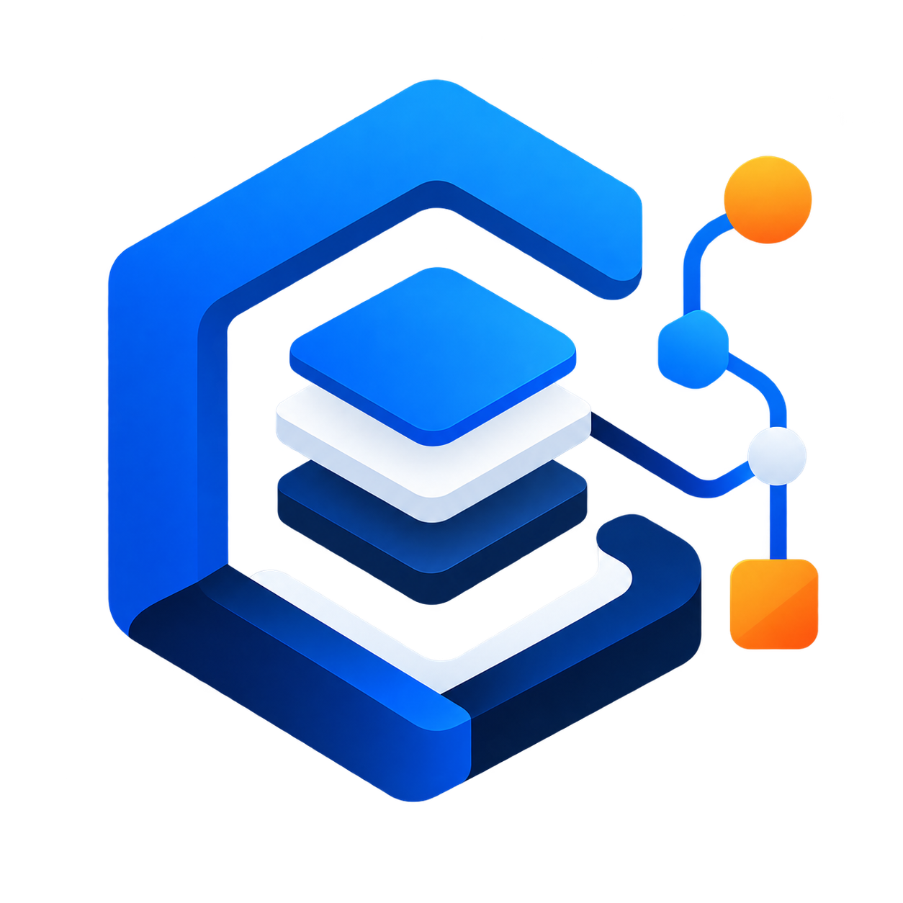
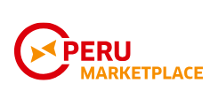

# Capítulo II: Requirements Elicitation & Analysis

## 2.1. Competidores

Este análisis permite identificar cómo se posiciona **MarketGo** frente a soluciones especializadas en la gestión y conservación de productos perecibles, así como frente a plataformas digitales orientadas a la conexión entre compradores y proveedores. A partir de ello, se busca definir una ventaja competitiva basada en la integración de la gestión de inventarios, conservación y abastecimiento de productos orgánicos dentro de una misma plataforma.

### 2.1.1. Análisis competitivo

<table style="text-align: center; width: 100%;">
  <tbody>
    <tr>
      <td colspan="5"><strong>Competitive Analysis Landscape</strong></td>
    </tr>
    <tr>
      <td colspan="2"><strong>¿Por qué llevar a cabo este análisis?</strong></td>
      <td colspan="3">
        Este análisis permite identificar las principales soluciones existentes relacionadas con la gestión de productos perecibles,
        conservación de inventarios y conexión entre compradores y proveedores, diferenciando la propuesta de MarketGo frente a
        plataformas especializadas en una sola parte del proceso.
      </td>
    </tr>
    <tr>
      <td colspan="2"><strong>Logotipos</strong></td>
      <td></td>
      <td></td>
      <td></td>
      <td></td>
    </tr>
    <tr>
      <td colspan="2"><strong>Software</strong></td>
      <td><strong>MarketGo</strong></td>
      <td><strong>FreshTracker</strong></td>
      <td><strong>ShelfLife</strong></td>
      <td><strong>Peru Marketplace</strong></td>
    </tr>
    <tr>
      <td rowspan="2"><strong>Perfil</strong></td>
      <td>Overview</td>
      <td>Startup SaaS orientada a centralizar la gestión, conservación y abastecimiento de productos orgánicos para minimarkets y proveedores.</td>
      <td>Plataforma orientada al monitoreo y conservación de productos frescos mediante control de temperatura, humedad, vencimientos y alertas.</td>
      <td>Plataforma especializada en la gestión de inventarios de productos perecibles, lotes, fechas de vencimiento y reducción de desperdicios.</td>
      <td>Marketplace B2B que conecta compradores y proveedores, facilitando la búsqueda de productos, solicitudes y operaciones comerciales.</td>
    </tr>
    <tr>
      <td>Ventaja competitiva, ¿Qué valor ofrece a los clientes?</td>
      <td>Integra inventario, lotes, conservación y abastecimiento en una sola plataforma, utilizando un dashboard común con permisos según el rol del usuario.</td>
      <td>Monitoreo de condiciones ambientales y generación de alertas para prevenir pérdidas relacionadas con la conservación.</td>
      <td>Control especializado de inventario y vencimientos para reducir mermas de productos perecibles.</td>
      <td>Conexión entre compradores y proveedores mediante un ecosistema digital orientado a operaciones B2B.</td>
    </tr>
    <tr>
      <td rowspan="2"><strong>Perfil de Marketing</strong></td>
      <td>Mercado objetivo</td>
      <td>Minimarkets y proveedores de productos orgánicos que buscan centralizar sus procesos de inventario, conservación y abastecimiento.</td>
      <td>Comercios y negocios que manejan productos frescos y requieren controlar sus condiciones de almacenamiento.</td>
      <td>Negocios que comercializan productos perecibles y necesitan mejorar el control de inventarios y vencimientos.</td>
      <td>Empresas y compradores que buscan proveedores y productos mediante una plataforma digital B2B en Perú.</td>
    </tr>
    <tr>
      <td>Estrategias de marketing</td>
      <td>Propuesta B2B enfocada en reducción de pérdidas, trazabilidad y centralización de procesos para pequeños y medianos negocios.</td>
      <td>Posicionamiento basado en reducción del desperdicio mediante monitoreo y automatización de la conservación.</td>
      <td>Enfoque en reducción de desperdicio y optimización de inventarios de productos perecibles.</td>
      <td>Construcción de un ecosistema digital que facilite la interacción entre compradores y proveedores.</td>
    </tr>
    <tr>
      <td rowspan="3"><strong>Perfil de Producto</strong></td>
      <td>Productos &amp; Servicios</td>
      <td>Gestión de inventarios, lotes, vencimientos, conservación, alertas, mermas, donaciones, productos de proveedores y pedidos de abastecimiento.</td>
      <td>Monitoreo de temperatura y humedad, seguimiento de productos frescos, alertas y herramientas para control de conservación.</td>
      <td>Gestión de inventario, seguimiento de lotes, fechas de vencimiento y herramientas para reducir pérdidas.</td>
      <td>Marketplace B2B, búsqueda de proveedores, productos, solicitudes, cotizaciones y pedidos.</td>
    </tr>
    <tr>
      <td>Precios &amp; Costos</td>
      <td>Modelo SaaS proyectado para pequeños y medianos negocios, con acceso según el plan contratado.</td>
      <td>Servicio basado en funcionalidades de monitoreo y gestión de conservación.</td>
      <td>Servicio orientado a negocios que requieren herramientas especializadas de control de inventario.</td>
      <td>Modelo comercial asociado a servicios de intermediación y operaciones B2B.</td>
    </tr>
    <tr>
      <td>Canales de distribución (Web y/o Móvil)</td>
      <td>Plataforma web con dashboard común y permisos diferenciados para administradores de minimarkets y proveedores.</td>
      <td>Plataforma digital orientada a monitoreo y gestión de productos frescos.</td>
      <td>Plataforma digital orientada a la gestión de inventarios perecibles.</td>
      <td>Plataforma web orientada a operaciones comerciales B2B.</td>
    </tr>
    <tr>
      <td rowspan="4"><strong>Análisis SWOT</strong></td>
      <td>Fortalezas</td>
      <td>
        <ul style="text-align: left; margin: 0; padding-left: 18px;">
          <li>Integra inventario y conservación.</li>
          <li>Conecta minimarkets y proveedores.</li>
          <li>Dashboard común con permisos por rol.</li>
          <li>Automatización de incorporación al inventario.</li>
        </ul>
      </td>
      <td>
        <ul style="text-align: left; margin: 0; padding-left: 18px;">
          <li>Monitoreo de temperatura y humedad.</li>
          <li>Alertas de conservación.</li>
          <li>Enfoque en productos frescos.</li>
          <li>Prevención de pérdidas.</li>
        </ul>
      </td>
      <td>
        <ul style="text-align: left; margin: 0; padding-left: 18px;">
          <li>Especialización en productos perecibles.</li>
          <li>Control de inventario.</li>
          <li>Seguimiento de vencimientos.</li>
          <li>Reducción de desperdicio.</li>
        </ul>
      </td>
      <td>
        <ul style="text-align: left; margin: 0; padding-left: 18px;">
          <li>Conexión entre compradores y proveedores.</li>
          <li>Catálogo de productos.</li>
          <li>Operaciones B2B.</li>
          <li>Presencia en el mercado peruano.</li>
        </ul>
      </td>
    </tr>
    <tr>
      <td>Debilidades</td>
      <td>
        <ul style="text-align: left; margin: 0; padding-left: 18px;">
          <li>Marca nueva.</li>
          <li>Menor reconocimiento inicial.</li>
          <li>Red de usuarios limitada durante la etapa inicial.</li>
          <li>Dependencia de la adopción de minimarkets y proveedores.</li>
        </ul>
      </td>
      <td>
        <ul style="text-align: left; margin: 0; padding-left: 18px;">
          <li>Mayor especialización en conservación.</li>
          <li>Menor enfoque en abastecimiento B2B.</li>
          <li>Dependencia de datos de monitoreo.</li>
          <li>No integra todo el ciclo de abastecimiento.</li>
        </ul>
      </td>
      <td>
        <ul style="text-align: left; margin: 0; padding-left: 18px;">
          <li>Enfoque principalmente interno.</li>
          <li>Menor interacción con proveedores.</li>
          <li>No integra monitoreo ambiental completo.</li>
          <li>Menor enfoque en abastecimiento.</li>
        </ul>
      </td>
      <td>
        <ul style="text-align: left; margin: 0; padding-left: 18px;">
          <li>Menor especialización en conservación.</li>
          <li>No está orientado específicamente a productos orgánicos.</li>
          <li>No centraliza el control interno del inventario.</li>
          <li>Menor integración con monitoreo ambiental.</li>
        </ul>
      </td>
    </tr>
    <tr>
      <td>Oportunidades</td>
      <td>
        <ul style="text-align: left; margin: 0; padding-left: 18px;">
          <li>Crecimiento de la digitalización de pequeños negocios.</li>
          <li>Necesidad de reducir desperdicio.</li>
          <li>Mayor demanda de trazabilidad.</li>
          <li>Integración futura con IoT y Machine Learning.</li>
        </ul>
      </td>
      <td>
        <ul style="text-align: left; margin: 0; padding-left: 18px;">
          <li>Creciente interés en reducción de desperdicios.</li>
          <li>Mayor adopción de monitoreo digital.</li>
          <li>Expansión hacia nuevos comercios.</li>
          <li>Integración con sistemas de inventario.</li>
        </ul>
      </td>
      <td>
        <ul style="text-align: left; margin: 0; padding-left: 18px;">
          <li>Crecimiento del comercio de alimentos frescos.</li>
          <li>Digitalización del control de inventarios.</li>
          <li>Mayor preocupación por el desperdicio.</li>
          <li>Expansión a nuevos mercados.</li>
        </ul>
      </td>
      <td>
        <ul style="text-align: left; margin: 0; padding-left: 18px;">
          <li>Crecimiento del comercio digital B2B.</li>
          <li>Mayor conexión entre compradores y proveedores.</li>
          <li>Digitalización de pequeñas empresas.</li>
          <li>Expansión de categorías de productos.</li>
        </ul>
      </td>
    </tr>
    <tr>
      <td>Amenazas</td>
      <td>
        <ul style="text-align: left; margin: 0; padding-left: 18px;">
          <li>Resistencia al cambio.</li>
          <li>Uso persistente de Excel y aplicaciones de mensajería.</li>
          <li>Competidores especializados.</li>
          <li>Dificultad inicial para construir una red de usuarios.</li>
        </ul>
      </td>
      <td>
        <ul style="text-align: left; margin: 0; padding-left: 18px;">
          <li>Mayor adopción de soluciones IoT.</li>
          <li>Entrada de nuevos competidores.</li>
          <li>Reducción de costos de sensores.</li>
          <li>Integración de monitoreo en ERPs.</li>
        </ul>
      </td>
      <td>
        <ul style="text-align: left; margin: 0; padding-left: 18px;">
          <li>Competencia de sistemas de inventario generales.</li>
          <li>Uso de herramientas tradicionales.</li>
          <li>Mayor oferta de soluciones especializadas.</li>
          <li>Preferencia por soluciones integrales.</li>
        </ul>
      </td>
      <td>
        <ul style="text-align: left; margin: 0; padding-left: 18px;">
          <li>Competencia de marketplaces generales.</li>
          <li>Negociación directa entre compradores y proveedores.</li>
          <li>Dependencia de la cantidad de usuarios registrados.</li>
          <li>Mayor competencia digital B2B.</li>
        </ul>
      </td>
    </tr>
  </tbody>
</table>

### 2.1.2. Estrategias y tácticas frente a competidores

A partir de la identificación de fortalezas y debilidades competitivas, la startup **Market-Labs** aplicará el siguiente conjunto de estrategias y tácticas preliminares para posicionar a **MarketGo** como una solución integral para la gestión y abastecimiento de productos orgánicos en minimarkets.

#### Estrategia ofensiva: integración de capacidades frente a FreshTracker y ShelfLife

FreshTracker y ShelfLife presentan una especialización en aspectos concretos relacionados con la conservación e inventario de productos perecibles. MarketGo aprovechará esta brecha para integrar dichas necesidades con el proceso de abastecimiento entre minimarkets y proveedores.

- **Gestión integral:** centralizar en una misma plataforma el inventario, lotes, vencimientos, conservación y abastecimiento.
- **Trazabilidad completa:** permitir relacionar los productos recibidos desde proveedores con los lotes registrados en el inventario del minimarket.
- **Automatización del inventario:** incorporar automáticamente los productos correspondientes al inventario cuando el administrador acepte un pedido.

#### Estrategia defensiva: diferenciación frente a Peru Marketplace

Peru Marketplace facilita la conexión entre compradores y proveedores, pero MarketGo buscará diferenciarse mediante la integración de la operación comercial con el control interno del inventario y conservación de los productos.

- **Abastecimiento conectado al inventario:** permitir que los pedidos no sean únicamente operaciones comerciales, sino que formen parte del flujo de actualización del inventario del minimarket.
- **Control de productos perecibles:** complementar el proceso de abastecimiento con información de lotes, vencimientos y condiciones de conservación.
- **Enfoque especializado:** orientar la propuesta específicamente a minimarkets y proveedores relacionados con productos orgánicos.

#### Estrategia adaptativa: reducción de la resistencia al cambio

Para afrontar la dependencia de herramientas tradicionales como Excel y aplicaciones de mensajería, MarketGo buscará simplificar las principales operaciones de sus usuarios.

- **Dashboard común:** utilizar una misma interfaz para ambos segmentos, reduciendo la complejidad de aprendizaje.
- **Permisos según rol:** permitir que los administradores de minimarkets cuenten con permisos de lectura y escritura, mientras que los proveedores dispongan de permisos de consulta y acciones específicas como la generación de pedidos.
- **Flujo simplificado:** reducir la cantidad de pasos necesarios para consultar productos, generar pedidos y actualizar el inventario.

#### Estrategia de innovación y escalabilidad

MarketGo buscará construir una base tecnológica que permita ampliar progresivamente sus capacidades de acuerdo con las necesidades del mercado.

- **Monitoreo inteligente:** utilizar datos simulados de temperatura y humedad durante la etapa inicial, con posibilidad de integrar sensores IoT reales posteriormente.
- **Analítica futura:** incorporar progresivamente herramientas de analítica y Machine Learning para identificar patrones de deterioro y apoyar la toma de decisiones.
- **Escalabilidad:** extender la solución hacia otros negocios que gestionen productos perecibles manteniendo el enfoque inicial en minimarkets y proveedores de productos orgánicos.

## 2.2. Entrevistas

En esta sección se aborda la investigación tomando como base la recolección de información mediante entrevistas a representantes de los segmentos objetivo. Las entrevistas serán registradas en video como evidencia del proceso de obtención de requisitos.

### 2.2.1. Diseño de entrevistas

Para el desarrollo de las entrevistas de los segmentos objetivo, se redactaron las siguientes preguntas siguiendo las buenas prácticas para el diseño de recolección de información:

**Segmento objetivo: Administradores de Minimarkets**

#### Preguntas Demográficas

1. ¿Cuál es su nombre completo y qué edad tiene?
2. ¿Cómo se definiría profesionalmente?
3. ¿Cuál es su cargo dentro del minimarket y cuántos años de experiencia tiene en la gestión del negocio?
4. ¿Cuánto tiempo lleva administrando o participando en las operaciones del minimarket?
5. ¿En qué distrito/provincia se encuentra ubicado el minimarket?

#### Preguntas de Hábitos Digitales

6. ¿Qué dispositivo utiliza con mayor frecuencia durante su jornada laboral para gestionar las actividades del minimarket (Laptop, Tablet o Celular)?
7. ¿Qué herramientas digitales utiliza actualmente para registrar o consultar información del inventario?
8. ¿Qué canales digitales utiliza con mayor frecuencia para comunicarse con sus proveedores?
9. ¿Utiliza actualmente algún software especializado para gestionar inventarios, productos o pedidos?

#### Preguntas Principales

10. ¿Cuántos productos o lotes suele gestionar aproximadamente durante una semana?
11. ¿Podría describir el proceso que sigue desde que identifica la necesidad de abastecer un producto hasta que este queda registrado en el inventario?
12. ¿Cómo consulta actualmente la disponibilidad de productos ofrecidos por sus proveedores?
13. ¿Cómo registra y controla actualmente los lotes y fechas de vencimiento de los productos?
14. ¿Cómo realiza actualmente el control de las condiciones de almacenamiento de los productos, como temperatura y humedad?
15. ¿Ha experimentado pérdidas debido al deterioro, vencimiento o almacenamiento inadecuado de productos? ¿Cómo las gestiona?
16. ¿Considera que una plataforma que centralice el inventario, conservación y abastecimiento facilitaría la gestión del minimarket? ¿Por qué?

---

**Segmento objetivo: Proveedores de Productos Orgánicos**

#### Preguntas Demográficas

1. ¿Cuál es su nombre completo y qué edad tiene?
2. ¿Cómo se definiría profesionalmente?
3. ¿Cuál es su cargo dentro de la empresa y cuántos años de experiencia tiene en la comercialización o distribución de productos?
4. ¿Cuánto tiempo lleva trabajando con minimarkets u otros establecimientos como clientes?
5. ¿En qué distrito/provincia se encuentra ubicado su centro de operaciones?

#### Preguntas de Hábitos Digitales

6. ¿Qué dispositivo utiliza con mayor frecuencia durante su jornada laboral para gestionar pedidos y operaciones comerciales (Laptop, Tablet o Celular)?
7. ¿Qué herramientas digitales utiliza actualmente para registrar o consultar los productos que ofrece a sus clientes?
8. ¿Qué canales digitales utiliza con mayor frecuencia para comunicarse con los minimarkets?
9. ¿Utiliza actualmente algún software especializado para gestionar productos, pedidos o relaciones con sus clientes?

#### Preguntas Principales

10. ¿Cuántos productos o pedidos suele gestionar aproximadamente durante una semana?
11. ¿Podría describir el proceso que sigue desde que un minimarket solicita un producto hasta que se coordina su abastecimiento?
12. ¿Cómo comunica actualmente a sus clientes la disponibilidad de los productos que ofrece?
13. ¿Cómo registra y realiza actualmente el seguimiento de los pedidos realizados por sus clientes?
14. ¿Qué dificultades encuentra actualmente al coordinar pedidos y abastecimiento con los minimarkets?
15. ¿Ha experimentado problemas debido a errores de comunicación, pérdida de información o retrasos en la gestión de pedidos? ¿Cómo los resuelve?
16. ¿Considera que una plataforma que permita consultar productos, generar pedidos y realizar seguimiento de su estado facilitaría la coordinación con los minimarkets? ¿Por qué?
