# Capítulo IV: Product Design

## 4.1. Styles Guidelines

### 4.1.1. General Style Guidelines
**Branding:** 

El logo pricipal se trata de una representación de capas que representan almacenes y ramificaciones que representan el enlace en el ecosistema digital de proveedores y administradores de minimarkets. Usa colores azules, naranjas y blancos para demostrar seriedad, confianza y dinamismo.

| Logo (Isotipo) | Logotipo / Imagotipo |
| :---: | :---: |
|  |  |
| **Isotipo**: Icono representativo de capas y conexiones para avatares, favicon y accesos directos. | **Logotipo**: Versión principal completa con tipografía para cabeceras, landing page y documentación oficial. |

**Tipografía**

La tipografía elegida para nuestro producto es Arimo, una font de la familia Sans Serif. Esta fuente resalta por ser moderna, legible y usada en contextos de tecnología y modernidad. Se utilizará esta fuente en todos los textos y título para mantener consistencia y armonía visual. 

La jerarquía tipografía:

- Títulos principales (H1): Arimo SemiBold, 32 px
- Encabezados de sección (H2): Arimo Medium, 24 px
- Subtítulos (H3): Arimo Medium, 20 px
- Texto de cuerpo: Arimo Regular, 18px
- Botones y elementos interactivos: Arimo Medium, 18 px

**Colores:**

La paleta de colores ha sido seleccionada para demostrar seriedad, confianza y modernidad. Se trata de colores complementarios en la paleta de colores compatibles entre ellos para dar una visión cohesiva y serena. Los colores claros se utilizaran como los colores que ocupan más espacio en la interfaz, y los más oscuros para secciones de importante contraste y botones. 

**Spacing**

## Design Tokens - Spacing

| Token          | Uso                                          | Desktop | Mobile |
|----------------|-----------------------------------------------|---------|--------|
| spacing-xs     | Separación entre encabezados y párrafos       | 16px    | 8px    |
| spacing-sm     | Separación vertical de elementos              | 12px    | 12px*  |
| spacing-sm     | Separación horizontal de elementos            | 16px    | 8px    |
| spacing-md     | Padding de botones (vertical)                 | 12px    | 12px   |
| spacing-md     | Separación entre párrafos o bloques de texto  | 24px    | 16px   |
| spacing-lg     | Padding de tarjetas y contenedores             | 24px    | 16px   |
| spacing-lg     | Separación entre títulos principales y contenido | 24px | 16px   |
| spacing-lg     | Padding de botones (horizontal)               | 24px    | 20px   |
| spacing-xl     | Margen lateral principal de la interfaz       | 40px    | 16px   |

**Tono de comunicación**

El tono de comunicación de MarketGo debe ser sencillo y directo. Los usuarios la utilizan para acciones puntuales, por lo cual la información debe ser presentada con la mayor claridad posible, evitando confusiones de lenguaje o de entendimiento y el usuario pueda completar la acción lo más rápido posible. 

**Lenguage aplicado**

El lenguaje que se aplicará es el lenguaje común de nuestros usuarios en su entorno cotidiano y laboral. Tanto para los usuarios Administradores como los usuarios Proveedores, el lenguaje combina instrucciones directas y claras, e información técnica brindada por el sistema necesaria para toma de decisiones del usuario. 

### 4.1.2. Web Style Guidelines 

En esta sección se detallan las decisiones de diseño que conforman la identidad visual de MarketGo. Estos estándares garantizan una interfaz coherente, profesional y adaptable (responsive), facilitando tanto el desarrollo de software como la experiencia del usuario final.

## a. Paleta de colores
 
La paleta actual está compuesta por seis colores, organizados en dos familias:
 
**Azules (color principal de marca)**

- `#0d8cfb` — Azul primario. Es el tono más vibrante de la paleta y el que aparece en el logo como color dominante. Debe usarse para elementos interactivos principales: botones de acción primaria, enlaces activos, íconos seleccionados.
- `#023192` — Azul secundario, más oscuro. Adecuado para textos sobre fondos claros que requieran énfasis, encabezados de sección, o estados "hover" del azul primario.
- `#021c45` — Azul oscuro/marino. El más oscuro de la paleta, apto para textos de alto contraste, fondos de barra lateral (sidebar) o elementos de navegación que buscan distinguirse del contenido principal.

**Acento y neutros**
- `#fc6910` — Naranja. Es el color de acento que aparece como el punto de conexión en el logo. Debe reservarse para llamadas de atención puntuales: alertas, notificaciones, badges de estado urgente (por ejemplo, productos próximos a vencer), o el botón de acción secundaria más importante de una pantalla.
- `#eff3fa` — Azul muy claro, casi blanco. Funciona como color de fondo general de la interfaz o de tarjetas y contenedores, dado su bajo contraste.
- `#fbdc91` — Amarillo/durazno claro. Color de soporte, útil para estados de advertencia intermedios (ni urgente como el naranja, ni neutro), o como acento decorativo en ilustraciones y estados vacíos.

**Recomendación de uso jerárquico:**
1. Azul primario (`#0d8cfb`) → acciones principales
2. Naranja (`#fc6910`) → alertas y urgencia
3. Azules oscuros (`#023192`, `#021c45`) → texto y navegación
4. Claros (`#eff3fa`, `#fbdc91`) → fondos y estados secundarios
Dado que el sistema maneja alertas de vencimiento y conservación (temperatura/humedad fuera de rango), se recomienda definir explícitamente un color adicional de error/riesgo (rojo) que no está presente en la paleta actual, ya que el naranja por sí solo puede no ser suficiente para diferenciar "advertencia" de "crítico".

## b. Tipografía
 
La tipografía definida es Arimo, una fuente sans-serif de la familia de fuentes web abiertas (métricamente compatible con Arial), lo que garantiza buena legibilidad en pantalla y renderizado consistente entre distintos sistemas operativos y navegadores.
 
Al no haberse especificado pesos ni escala tipográfica en el material original, se sugiere una escala base para mantener consistencia en toda la aplicación:
 
- Títulos principales: Arimo Bold, 24–28px
- Subtítulos / encabezados de sección: Arimo Semibold o Bold, 18–20px
- Cuerpo de texto: Arimo Regular, 14–16px
- Texto secundario / metadatos (fechas, etiquetas): Arimo Regular, 12–13px
- Botones: Arimo Medium o Semibold, 14px
Esta escala es consistente con los espaciados de 40/24/16/12px ya definidos para el sistema, manteniendo proporciones armónicas entre texto y espacio en blanco.

## c. Botones y elementos de interfaz
 
Este punto no está cubierto explícitamente en el material de referencia, por lo que se documentan aquí lineamientos propuestos, derivados de la paleta y la tipografía ya definidas, para mantener coherencia visual:
 
**Botones**

- Botón primario: fondo `#0d8cfb`, texto blanco, esquinas redondeadas (radio sugerido 6–8px)
- Botón secundario: fondo `#eff3fa` o transparente con borde `#023192`, texto `#023192`
- Botón de alerta/peligro: fondo en tono rojo (a definir, ver nota en sección de colores), reservado para acciones destructivas como rechazar un pedido
- Botón deshabilitado: opacidad reducida (40–50%) sobre el color base, sin cambiar de tono

**Elementos de formulario**
- Campos de texto con borde `#eff3fa` o gris neutro en estado normal, y borde en color de error al fallar una validación
- Estados de foco con borde en azul primario (`#0d8cfb`)

**Tarjetas y contenedores**
- Fondo blanco o `#eff3fa`, con bordes sutiles y sombra ligera para diferenciarse del fondo general de la aplicación
- Padding interno siguiendo el estándar de espaciado ya definido para el proyecto (24px en desktop, 16px en mobile)

**Badges de estado**
- Aprovechar la paleta para diferenciar estados: naranja para "pendiente/atención", azul para "informativo", y el color de error propuesto para "riesgo/rechazado".

## d. Iconografía

**1. Librería base**
 
Tabler Icons (estilo outline/línea), por tres razones:
- Es de licencia libre (MIT), por lo que se puede usar sin restricciones en un proyecto académico o comercial
- Tiene una cobertura muy amplia (más de 4,000 íconos), suficiente para cubrir todos los módulos sin tener que mezclar librerías
- Su estilo de línea con grosor uniforme es compatible con el trazo simple que ya se ve en los íconos existentes del style guide (termómetro, papelera, lupa).

**2. Mapa de íconos por módulo**
 
| Módulo | Ícono | Función |
|---|---|---|
| **Global / navegación** | Casa u ojo de panel | Dashboard general |
| | Caja/paquete | Inventario |
| | Etiqueta o código de barras | Gestión de lotes |
| | Termómetro con copo de nieve *(ya existe)* | Conservación |
| | Camión de reparto | Abastecimiento |
| | Apretón de manos o tienda | Proveedores y productos |
| | Persona/usuario *(ya existe)* | Usuarios y seguridad |
| | Gráfico de barras | Análisis |
| **Acciones comunes** | Lupa *(ya existe)* | Buscar |
| | Embudo | Filtrar |
| | Signo + *(ya existe)* | Registrar / crear |
| | Lápiz | Editar |
| | Papelera *(ya existe)* | Eliminar |
| | Ojo | Ver detalle |
| **Alertas y estado** | Campana | Notificaciones generales |
| | Triángulo de alerta | Alerta de vencimiento o conservación |
| | Check dentro de círculo | Confirmación / aceptar |
| | X dentro de círculo | Rechazar / cancelar |
| | Reloj | Pendiente / tiempo transcurrido |
| **Conservación específico** | Gota de agua | Humedad |
| | Termómetro solo | Temperatura (sin el copo, para diferenciarlo del ícono de "congelado") |
| | Enchufe tachado | Sensor desconectado / sin datos |
| **Abastecimiento y proveedores** | Documento con líneas | Pedido / orden |
| | Historial / reloj con flecha circular | Historial de abastecimiento |
| | Insignia con check | Certificación orgánica |
| **Merma y donación** | Caja tachada o cesto | Registrar merma |
| | Corazón o mano ofreciendo | Registrar donación |

 
| Propiedad | Valor |
|---|---|
| Estilo | Outline (línea), no relleno sólido |
| Grosor de trazo | 1.5–2px, constante en todos los íconos |
| Tamaño base | 24×24px |
| Tamaños adicionales | 16×16 (texto en línea, badges), 20×20 (botones compactos, sidebar), 32×32 (estados vacíos, encabezados destacados) |
| Área de seguridad | 2px de margen interno dentro del área de 24×24, para que el trazo no toque el borde del frame |
| Esquinas | Redondeadas (consistente con el radio de 6–8px ya propuesto para botones) |

## e. Rejilla y adaptabilidad
 
Este punto no está documentado en el material de referencia. Se recomienda basarlo en el estándar de espaciado ya definido previamente para el proyecto, extendiéndolo a una rejilla formal:
 
**Desktop**

- Sistema de rejilla de 12 columnas, con márgenes laterales de 40px (consistente con el margen lateral principal ya definido)
- Gutter entre columnas de 16–24px, alineado con la separación horizontal de elementos ya establecida
- Ancho máximo de contenido recomendado: 1280–1440px, con centrado en pantallas más anchas.

**Mobile**

- Rejilla de 4 columnas, con márgenes laterales de 16px (consistente con el margen ya definido para esta versión)
- Gutter reducido a 8px entre columnas
- Los componentes de múltiples columnas en desktop (por ejemplo, tarjetas de resumen o catálogo en grid) deben colapsar a 1 o 2 columnas en mobile

**Puntos de quiebre (breakpoints) sugeridos**

- Mobile: hasta 599px
- Tablet: 600px–1023px
- Desktop: 1024px en adelante

**Adaptabilidad de componentes clave**

- El sidebar de navegación (ya definido en los wireframes del proyecto) debe colapsar a un menú tipo drawer o barra inferior en mobile, dado el espacio lateral limitado
- Las tablas con múltiples columnas (inventario, lotes, pedidos) deben priorizar las columnas más relevantes en mobile y mover el resto a una vista de detalle o acordeón, en vez de forzar scroll horizontal
- Las vistas tipo Kanban (pedidos) deben pasar de columnas lado a lado en desktop a un scroll horizontal por estado, o a una lista con filtro de estado, en mobile.

## 4.1. Styles Guidelines

Esta sección describe la estructura de la información, estilos y sistemas que se utilizarán en la plataforma web de MarketGo. Se consideran los sistemas de organización, etiquetado, búsqueda, navegación y SEO, con el fin de garantizar una experiencia clara y enfocada en la visualización de datos de inventario, lotes, conservación y abastecimiento para minimarkets de productos orgánicos.

### 4.2.1 Organization Systems

**Sistemas de Organización visual de contenido**

**1. Organización Jerárquica (Visual Hierarchy)**

MarketGo organiza su contenido en tres niveles de jerarquía visual, consistentes con la estructura de navegación ya definida para la plataforma:
 
- **Nivel 1 — Categorías de módulo:** agrupan las 7 áreas funcionales del sistema en 4 secciones de mayor nivel según frecuencia de uso: *Operación* (Inventario, Gestión de Lotes, Conservación), *Abastecimiento* (Pedidos, Proveedores y productos), *Análisis* (Dashboard general) y *Administración* (Usuarios y seguridad).
- **Nivel 2 — Pantallas dentro de cada módulo:** por ejemplo, dentro de Inventario existen la vista de listado completo y el detalle de producto; dentro de Lotes, la lista de lotes y el formulario de registro.
- **Nivel 3 — Componentes de detalle:** tarjetas de resumen, tablas de datos, paneles de alertas y modales de acción (registrar, aceptar, rechazar).

**2. Organización Secuencial (Step by Step)**

Se aplica una organización secuencial principalmente en los flujos que representan un proceso con pasos obligatorios y dependientes entre sí.
 
- **Registro de lote:** selección de producto → cantidad y unidad → fechas de ingreso/vencimiento → proveedor → confirmación.
- **Creación de pedido de abastecimiento (rol proveedor):** selección de minimarket destino → selección de productos del catálogo propio → cantidades → confirmación (genera ID único y estado "Pendiente").
- **Rechazo de un pedido (rol administrador):** selección de la acción "Rechazar" → registro obligatorio del motivo → confirmación (no se permite omitir el paso del motivo).
- **Registro de merma:** selección de producto en inventario → cantidad y motivo → validación contra el stock disponible → confirmación.
Estos flujos secuenciales se presentan como formularios de un solo paso con validación en línea (no wizards de múltiples pantallas), dado que la cantidad de campos por flujo es reducida.

**3. Organización Matricial**

Haremos uso de la organización matricial cuando el usuario necesite cruzar dos o más dimensiones de información para tomar una decisión, principalmente en las vistas de estado:
 
- **Pedidos de abastecimiento:** Organizados matricialmente por *estado* (Pendiente / Aceptado / Rechazado) en columnas tipo Kanban, permitiendo comparar volumen y urgencia entre estados de un vistazo.
- **Conservación:** Las zonas de almacenamiento se cruzan con sus condiciones (temperatura, humedad) y su estado (Normal / Riesgoso / Sin datos), mostrando una matriz de tarjetas por zona.
- **Catálogo de proveedores (vista administrador):** Cruce entre producto y proveedor, filtrable por categoría, permitiendo comparar la misma categoría de producto entre distintos proveedores.

**Esquemas de categorización de contenido**

El contenido de MarketGo se categoriza bajo tres esquemas complementarios:
 
- **Por función del módulo:** Operación, Abastecimiento, Análisis, Administración.
- **Por estado del dato:** aplicado transversalmente a productos (Vigente / Próximo a vencer / Vencido), pedidos (Pendiente / Aceptado / Rechazado) y condiciones de conservación (Normal / Riesgoso / Sin datos). Este esquema es el que más se refuerza con color, siguiendo la paleta de la marca.
- **Por rol de usuario:** administrador de minimarket, proveedor y (a nivel de plataforma) usuario con permisos administrativos sobre cuentas. El contenido visible y las acciones disponibles cambian según este esquema, no la estructura general de la información.

### 4.2.2. Labeling Systems
 
 En esta sección se detalla el sistema de etiquetado, diseñado para ofrecer una experiencia de usuario intuitiva mediante términos breves y reconocibles. Estas etiquetas permiten que tanto los visitantes como los usuarios finales comprendan las funciones del software sin ambigüedades.

 **Etiquetas de Navegación (Sidebar & Menu Labels)**

 | Grupo | Etiquetas |
|---|---|
| Operación | Inventario · Gestión de Lotes · Conservación |
| Abastecimiento | Pedidos · Proveedores y productos |
| Análisis | Dashboard general |
| Administración | Usuarios y seguridad |
 
Reglas: sustantivos cortos (1–2 palabras), sin verbos, consistentes con lo ya validado en los wireframes de sidebar. Se evita duplicar la palabra "Gestión" en todas las etiquetas para no saturar el menú (por eso "Inventario" y "Conservación" van sin ese prefijo, mientras "Gestión de Lotes" lo conserva por claridad frente a "Lotes" solo, que podría confundirse con lotes de compra).

**Etiquetas de Acción y Control (Command Labels)**

- Botones primarios: "Registrar lote", "Registrar producto", "Aceptar pedido", "Confirmar rechazo", "Guardar lote"
- Botones secundarios/cancelación: "Cancelar", "Rechazar"
- Acciones en línea (íconos con tooltip): "Ver detalle", "Editar", "Eliminar", "Registrar merma", "Registrar donación"
- Acciones de filtrado y búsqueda: "Buscar producto o código de lote", "Filtrar por estado"

**Etiquetas de Estado y Datos (Informational Labels)**

Etiquetas cortas, en badges de color, siguiendo el esquema de categorización por estado ya definido:
 
- Vencimiento: "Vigente", "Próximo a vencer", "Vencido" (o el conteo de días, ej. "Vence en 2 días")
- Pedidos: "Pendiente", "Aceptado", "Rechazado"
- Conservación: "Normal", "Riesgoso", "Sin registros disponibles"
- Metadatos: "hace 3 días", "hace 4 horas" (tiempos relativos en vez de timestamps completos, para lectura más rápida)

**Etiquetas de Formulario (Field Labels)**

Etiquetas descriptivas ubicadas sobre el campo (no placeholders como único label, para mantener accesibilidad):
 
- "Producto", "Cantidad", "Unidad", "Fecha de ingreso", "Fecha de vencimiento", "Proveedor", "Motivo del rechazo", "Minimarket destino"
- Campos obligatorios marcados con asterisco (`*`) en color de error, consistente con el modal de rechazo ya diseñado
- Mensajes de validación en primera persona desde el sistema, en tono directo: "Este campo es obligatorio para continuar", "La cantidad supera el stock disponible"

### 4.2.3. SEO Tags and Meta Tags

***Landing Page (Sitio Web Estático)**

El objetivo de estas etiquetas es el posicionamiento orgánico para atraer a dueños de negocios o analistas interesados en la solución.
 
- `<title>`: "MarketGo — Gestión de inventario para minimarkets orgánicos"
- `<meta name="description">`: descripción orientada a beneficios de negocio (control de vencimientos, trazabilidad de proveedores, reducción de mermas), con palabras clave como "inventario orgánico", "gestión de minimarket", "control de vencimientos"
- Encabezados `<h1>`–`<h3>` estructurados jerárquicamente reflejando los beneficios del producto (uno por sección de la landing: control de inventario, alertas de conservación, gestión de proveedores)
- URLs amigables y descriptivas (ej. `/funcionalidades`, `/precios`, `/contacto`) en vez de rutas genéricas.

**Web Application (Plataforma de Usuario)**

Aquí las etiquetas están orientadas a la funcionalidad y seguridad, evitando que motores de búsqueda indexen información privada de los usuarios, pero manteniendo la identidad de la marca.
 
- `<meta name="robots" content="noindex, nofollow">` en todas las rutas internas de la aplicación (dashboard, inventario, lotes, pedidos), para evitar que datos de inventario o proveedores de un minimarket específico aparezcan en buscadores.
- `<title>` dinámico pero genérico por pantalla, sin datos sensibles: "MarketGo — Inventario", "MarketGo — Pedidos" (nunca el nombre del minimarket o de un producto específico en el título de la pestaña).
- Favicon e ícono de marca mantenidos en todas las rutas para reforzar identidad visual, incluso sin indexación.

### 4.2.4. Searching Systems

**Mecanismos de búsqueda**

MarketGo utiliza búsqueda por texto libre combinada con filtros estructurados, disponible en los módulos de Inventario, Lotes, Pedidos y Catálogo de proveedores. La búsqueda es del tipo "buscar mientras se escribe" (incremental), sin necesidad de confirmar con Enter, dado que los catálogos manejados no son de gran volumen.
 
#### Búsqueda filtrada (específica)

Las opciones de filtrado (varían según el módulo, pero siguen el mismo patrón de ubicación — barra superior a la tabla o grid):
 
- Inventario: categoría, condición de conservación, proveedor, rango de stock
- Gestión de Lotes: estado de vencimiento (chips rápidos "Todos" / "Por vencer" / "Vencidos"), rango de fechas
- Pedidos: estado (Pendiente/Aceptado/Rechazado), fecha, minimarket (para el rol proveedor, que abastece a varios)
- Catálogo de proveedores: proveedor específico, categoría de producto.

#### Visualización de Resultados
 
- Resultados en tabla (Inventario, Lotes) cuando el usuario necesita comparar muchos registros con múltiples atributos, o en tarjetas/grid (Catálogo de proveedores, Pedidos en vista Kanban) cuando el contenido se explora más que se audita.
- Estado vacío consistente en toda la plataforma cuando la búsqueda o el filtro no arroja resultados: mensaje informativo breve (ej. "No se encontraron productos con estos filtros"), sin ilustraciones que distraigan, siguiendo el patrón ya usado para conservación sin datos
- Contador de resultados visible ("Mostrando 4 de 86 lotes") para dar contexto de escala, especialmente en tablas paginadas.

### 4.2.5. Navigation Systems

#### Navigation strategies

MarketGo combina dos estrategias de navegación según el tipo de sitio:
 
- **Navegación jerárquica con acceso directo (Landing):** estructura simple de una sola página con scroll y anclas, complementada por un menú superior fijo
- **Navegación estructural persistente (Web Application):** sidebar fijo que actúa como mapa completo de la aplicación, con la sección activa siempre resaltada, complementado por accesos rápidos contextuales (badges de alerta, botones de acción directa) que no reemplazan al sidebar sino que aceleran tareas frecuentes.

#### Landing Page Navigation

- Menú superior con anclas a las secciones de la propia landing: Descripción del producto, Videos, Planes, Contacto
- Sección "Videos": agrupa contenido audiovisual de dos tipos — videos institucionales sobre el equipo (presentación, misión, quiénes están detrás de MarketGo) y videos demostrativos del producto (recorrido funcional por los módulos: inventario, lotes, conservación, abastecimiento). Se recomienda separarlos en dos sub-bloques dentro de la misma sección ("Conoce al equipo" / "Cómo funciona MarketGo") en vez de mezclarlos en un solo carrusel, para que el visitante identifique rápido cuál quiere ver primero
- Llamado a la acción (CTA) persistente ("Solicitar demo" o "Iniciar sesión") visible en todo momento en la esquina superior derecha
- Sin navegación lateral ni jerarquía profunda — es una navegación plana con scroll continuo entre Descripción del producto → Videos → Planes → Contacto, ya que el objetivo es informar y convertir, no gestionar datos

#### Web Application Navigation 

- **Sidebar como navegación primaria**, con los 4 grupos ya definidos (Operación, Abastecimiento, Análisis, Administración) y sus etiquetas correspondientes.
- **Ítem activo resaltado** mediante fondo o borde en azul primario, para reforzar la ubicación actual dentro del sistema (relevante para la fase de "Seguimiento y control" del mapa de empatía del usuario).
- **Navegación dinámica por rol:** el sidebar no muestra los mismos ítems a todos los usuarios — un proveedor no ve "Usuarios y seguridad" ni el catálogo interno de conservación de un minimarket, mientras que un administrador ve el set completo según sus permisos
- **Navegación secundaria contextual:** tabs dentro de una sección (ej. "Pendientes" / "Historial" dentro de Pedidos) para separar sub-vistas sin salir del módulo principal.
- **Accesos directos cruzados:** por ejemplo, al aceptar un pedido, un botón "Ver inventario actualizado" lleva directamente al módulo de Inventario, rompiendo la navegación estrictamente jerárquica cuando el flujo de trabajo lo justifica.

## 4.3. Landing Page UI Design

### 4.3.1. Landing Page Wireframe

En esta sección se presenta el desarrollo de los primeros wireframes como primer paso para la producción de interfaz visual de la solución, realizados en la plataforma *Figma*.

<strong>Figura 1</strong> 
  <em>Wireframe de Landing Page sección Home</em> 
  <small><em>Nota.</em> Elaboración propia.</small>
    
  

<strong>Figura 2</strong> 
  <em>Wireframe de Landing Page sección Información</em> 
  <small><em>Nota.</em> Elaboración propia.</small>
    
  

<strong>Figura 3</strong> 
  <em>Wireframe de Landing Page sección Videos</em> 
  <small><em>Nota.</em> Elaboración propia.</small>
    
  

<strong>Figura 4</strong> 
  <em>Wireframe de Landing Page sección Planes</em> 
  <small><em>Nota.</em> Elaboración propia.</small>
    
  

<strong>Figura 5</strong> 
  <em>Wireframe de Landing Page sección Contacto</em> 
  <small><em>Nota.</em> Elaboración propia.</small>
    
  

### 4.3.2 Landing Page Mock Up

<strong>Figura 1</strong> 
  <em>Mock up de Landing Page sección Home</em> 
  <small><em>Nota.</em> Elaboración propia.</small>
    
  

<strong>Figura 2</strong> 
  <em>Mock up de Landing Page sección Información del producto</em> 
  <small><em>Nota.</em> Elaboración propia.</small>
    
  

<strong>Figura 3</strong> 
  <em>Mock up de Landing Page sección Videos</em> 
  <small><em>Nota.</em> Elaboración propia.</small>
    
  

<strong>Figura 4</strong> 
  <em>Mock up de Landing Page sección Planes/em> 
  <small><em>Nota.</em> Elaboración propia.</small>
    
  

<strong>Figura 5</strong> 
  <em>Mock up de Landing Page sección Contacto/em> 
  <small><em>Nota.</em> Elaboración propia.</small>
    
  

## 4.6. Domain-Driven Software Architecture

La arquitectura de software de MarketGo se construye a partir del análisis del dominio de gestión de productos orgánicos, inventario, conservación, abastecimiento y control operativo para minimarkets y proveedores. A partir de este análisis se aplican los principios de Domain-Driven Design (DDD), permitiendo dividir la solución en bounded contexts coherentes con las responsabilidades principales del negocio.

En las siguientes secciones se presenta cada nivel del modelo arquitectónico, explicando la estructura, responsabilidades y comunicación entre los elementos que conforman la arquitectura de MarketGo.

### 4.6.1. Design-Level Event Storming

Para identificar los eventos de dominio y la lógica de negocio de MarketGo, se realizó un proceso de Event Storming orientado a comprender los flujos principales de la plataforma: registro de productos, control de inventario, monitoreo de conservación, solicitudes de abastecimiento, gestión de proveedores, alertas y análisis operativo.

El desarrollo del proceso de Domain-Driven Design se realizó en Lucidspark: [https://lucid.app/lucidspark/d7f4679c-eca6-4e34-a638-733027262712/edit?viewport_loc=-8761%2C-2894%2C1920%2C1532%2C0_0&invitationId=inv_ffb713f0-52eb-4b51-9e5e-1d11e4d93b05](https://lucid.app/lucidspark/d7f4679c-eca6-4e34-a638-733027262712/edit?viewport_loc=-8761%2C-2894%2C1920%2C1532%2C0_0&invitationId=inv_ffb713f0-52eb-4b51-9e5e-1d11e4d93b05)

A continuación, se presenta la leyenda utilizada durante el proceso de Event Storming:

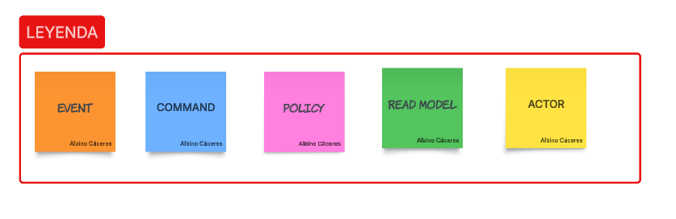

El siguiente diagrama presenta el Event Storming general de MarketGo y permite visualizar los principales eventos, comandos, actores y procesos identificados en el dominio:

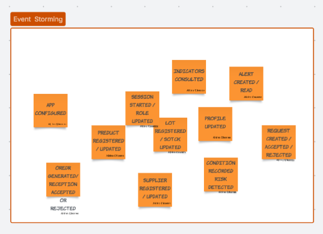

A partir de este análisis se identificaron los siguientes bounded contexts:

1. **IAM**

   El bounded context IAM se encarga de la autenticación, autorización y control de acceso dentro de MarketGo. Gestiona usuarios, roles y permisos, asegurando que cada actor, como el administrador de minimarket o el proveedor, acceda únicamente a las funcionalidades correspondientes a su perfil.

   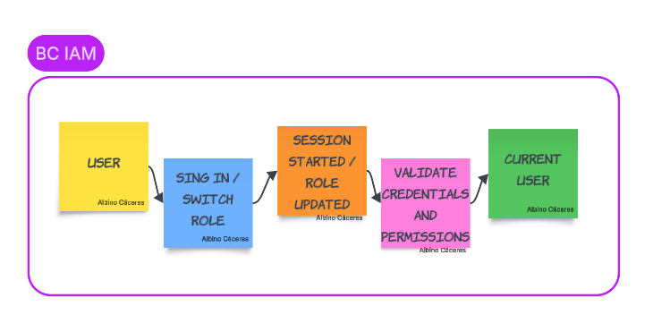

2. **Profiles**

   El bounded context Profiles administra la información de los usuarios, minimarkets y proveedores registrados en la plataforma. Su propósito es centralizar los datos de perfil necesarios para personalizar la experiencia, controlar responsabilidades y asociar operaciones con el actor correspondiente.

   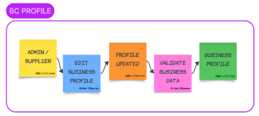

3. **Dashboard**

   El bounded context Dashboard presenta una vista general del estado operativo de la plataforma según el rol del usuario. Permite visualizar indicadores relevantes sobre inventario, abastecimiento, conservación, alertas y actividad reciente.

   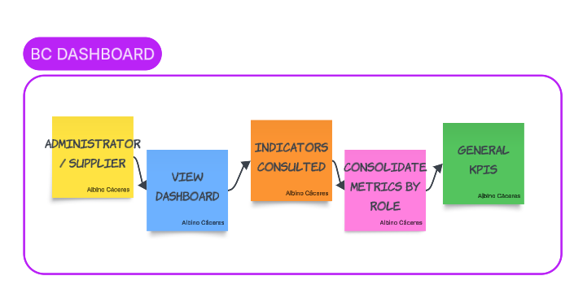

4. **Analytics**

   El bounded context Analytics procesa información operativa para generar indicadores, métricas y resúmenes que apoyan la toma de decisiones. Permite analizar el estado del inventario, productos próximos a vencer, alertas de conservación, desempeño de proveedores y movimientos de abastecimiento.

5. **Inventory**

   El bounded context Inventory gestiona los productos registrados en el minimarket, sus cantidades, lotes, fechas de vencimiento, estados y movimientos asociados. Su propósito es mantener trazabilidad sobre las existencias y facilitar el control de productos disponibles, en riesgo o con pérdidas.

   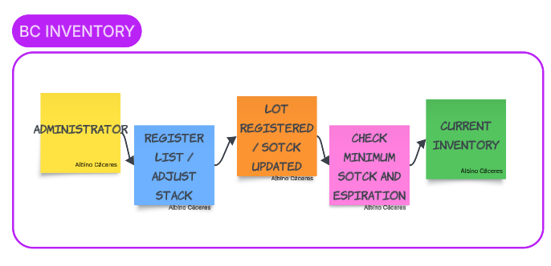

6. **Products**

   El bounded context Products administra el catálogo de productos orgánicos ofrecidos por proveedores o registrados por minimarkets. Centraliza información como nombre, categoría, descripción, unidad de medida, disponibilidad y datos relevantes para su comercialización o abastecimiento.

   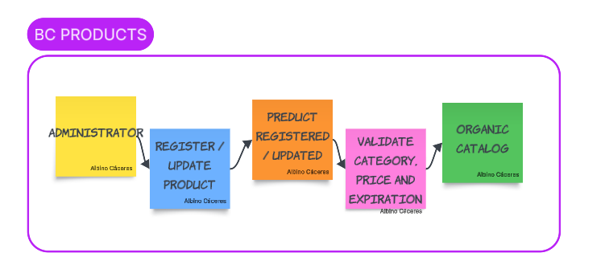

7. **Requisition**

   El bounded context Requisition gestiona las solicitudes de abastecimiento generadas por los minimarkets hacia los proveedores. Permite registrar productos solicitados, cantidades, estado de la solicitud y trazabilidad del proceso de aceptación o rechazo.

   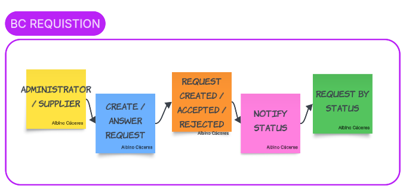

8. **Procurements**

   El bounded context Procurements administra las órdenes de envío asociadas a solicitudes de abastecimiento aceptadas. Su responsabilidad es permitir al proveedor registrar los productos y cantidades que serán enviados, mientras que el administrador del minimarket puede revisar, aceptar o rechazar la recepción. Cuando una orden de envío es aceptada, los productos recibidos pueden incorporarse al inventario correspondiente.

   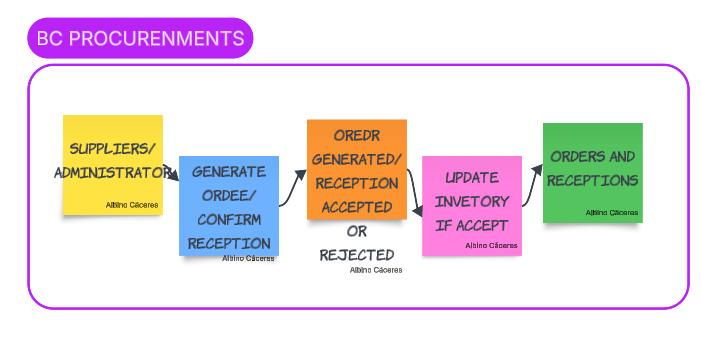

9. **Suppliers**

   El bounded context Suppliers gestiona el directorio de proveedores de productos orgánicos, así como los productos que ofrecen y su participación dentro de los procesos de abastecimiento.

   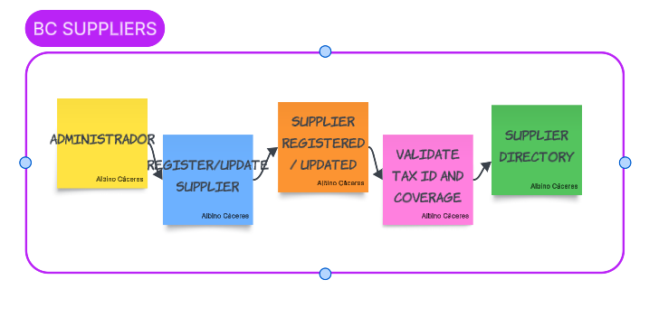

10. **Conservation**

    El bounded context Conservation permite monitorear condiciones de conservación de productos, como temperatura y humedad. Su propósito es identificar riesgos de deterioro y generar alertas cuando las condiciones se encuentren fuera de los rangos aceptables.

    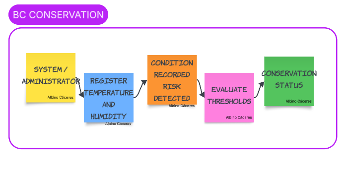

11. **Communication**

    El bounded context Communication gestiona las alertas y notificaciones generadas por la plataforma. Incluye avisos sobre productos próximos a vencer, condiciones de conservación riesgosas, solicitudes pendientes, órdenes de envío y eventos relevantes para los usuarios.

    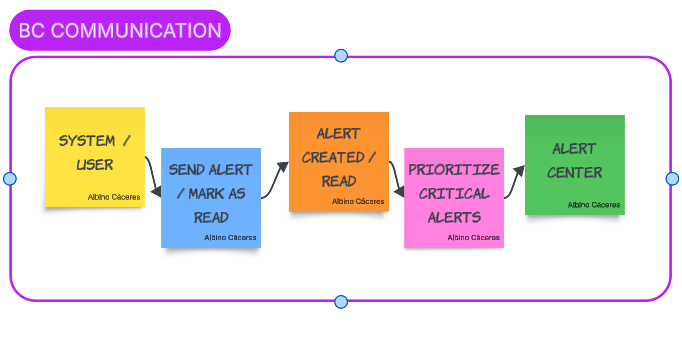

12. **Shared Kernel**

    El bounded context Shared Kernel contiene elementos comunes utilizados por los demás contextos, como utilidades compartidas, contratos base, configuraciones, validaciones comunes y estructuras transversales del sistema.

### 4.6.2. Software Architecture Context Diagram

En este nivel se presenta una vista de alto nivel de la arquitectura, donde el foco está en el sistema MarketGo como una caja negra y en las interacciones que mantiene con sus usuarios y servicios externos.

El context diagram muestra al **MarketGo Software System** como el sistema central, rodeado por los principales actores y sistemas con los que interactúa:

- **Administrador de minimarket**: usuario encargado de registrar productos, controlar inventario, gestionar lotes, revisar fechas de vencimiento, crear solicitudes de abastecimiento y confirmar o rechazar la recepción de órdenes de envío.
- **Proveedor de productos orgánicos**: usuario responsable de registrar productos ofrecidos, revisar solicitudes de abastecimiento, aceptarlas o rechazarlas, y crear órdenes de envío asociadas a solicitudes aceptadas.
- **Administrador del sistema**: usuario encargado de gestionar cuentas, roles, permisos y configuración general de la plataforma.
- **Servicio de notificaciones**: sistema externo utilizado para enviar alertas y comunicaciones relacionadas con vencimientos, conservación, solicitudes y abastecimiento.
- **Servicio de monitoreo de conservación**: fuente externa o módulo de integración encargado de proporcionar información relacionada con temperatura y humedad para evaluar condiciones de conservación.

En el diagrama se representan las relaciones entre estos elementos, destacando que los actores humanos interactúan con MarketGo mediante la aplicación web, mientras que el sistema coordina los procesos internos y las integraciones necesarias para alertas, monitoreo y trazabilidad operativa.

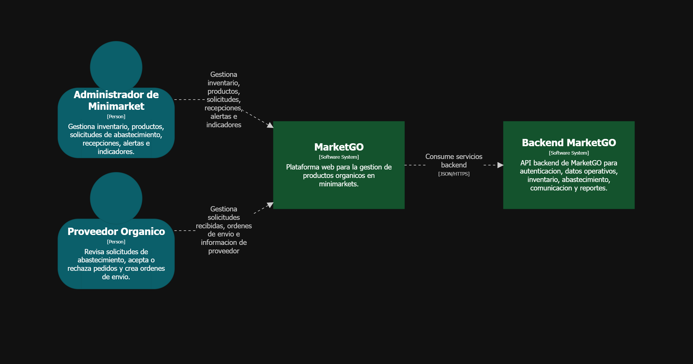

---

### 4.6.3. Software Architecture Container Diagrams

En el nivel de contenedores, la arquitectura de MarketGo se organiza en aplicaciones y fuentes de datos que colaboran para brindar la experiencia completa de la plataforma.

La arquitectura lógica de MarketGo se estructura en los siguientes contenedores:

- **Landing Page**: aplicación web pública orientada a presentar la propuesta de valor de MarketGo, sus beneficios y funcionalidades principales para minimarkets y proveedores de productos orgánicos.
- **Single Page Application (SPA)**: aplicación web principal donde los usuarios interactúan con los módulos de inventario, productos, proveedores, solicitudes de abastecimiento, órdenes de envío, conservación, analítica, dashboard, perfiles, comunicación e IAM.
- **API REST Application**: backend encargado de exponer los servicios de negocio mediante endpoints REST. Centraliza la lógica de aplicación, validaciones, reglas de dominio y coordinación entre bounded contexts.
- **Database**: base de datos donde se persiste la información del sistema, incluyendo usuarios, perfiles, productos, inventario, lotes, solicitudes de abastecimiento, órdenes de envío, proveedores, alertas, métricas y registros de conservación.

En el diagrama se observa que:

- Los usuarios pueden conocer la solución mediante la **Landing Page** y luego acceder a la **SPA**.
- La **SPA** se comunica con la **API REST Application** mediante peticiones HTTP/HTTPS y mensajes JSON.
- La **API REST Application** procesa la lógica del dominio y persiste la información en la **Database**.
- Los módulos de comunicación y conservación pueden integrarse con servicios externos para notificaciones y monitoreo de condiciones ambientales.

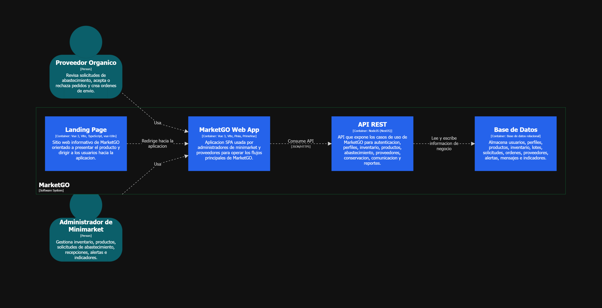

---

### 4.6.4. Software Architecture Components Diagrams

En el nivel de componentes se detalla la descomposición interna de la arquitectura de MarketGo, especialmente del contenedor **API REST Application**, donde se agrupan los componentes principales alineados con los bounded contexts del dominio.

La API REST organiza sus responsabilidades en componentes especializados:

- **IAM Component**: gestiona autenticación, autorización, usuarios, roles y permisos.
- **Profiles Component**: administra perfiles de usuarios, minimarkets y proveedores.
- **Dashboard Component**: consolida información relevante para mostrar vistas generales según el rol del usuario.
- **Analytics Component**: procesa indicadores, métricas y reportes operativos.
- **Inventory Component**: gestiona inventario, lotes, cantidades, vencimientos, pérdidas y ofertas.
- **Products Component**: administra el catálogo de productos orgánicos registrados u ofrecidos.
- **Requisition Component**: gestiona solicitudes de abastecimiento entre minimarkets y proveedores.
- **Procurements Component**: administra órdenes de envío, aceptación, rechazo y recepción de productos.
- **Suppliers Component**: gestiona proveedores y sus productos ofrecidos.
- **Conservation Component**: monitorea condiciones de conservación y detecta riesgos.
- **Communication Component**: administra alertas y notificaciones del sistema.
- **Shared Kernel Component**: agrupa elementos transversales reutilizados por los demás componentes.

#### IAM Component Diagram

#### Profiles Component Diagram

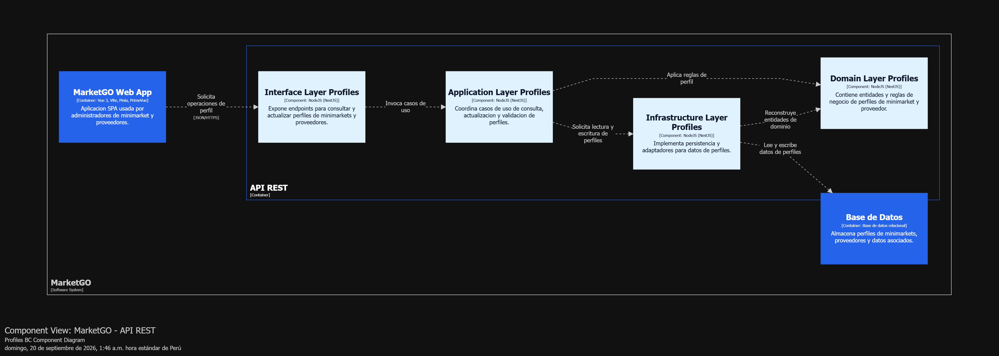

#### Dashboard Component Diagram

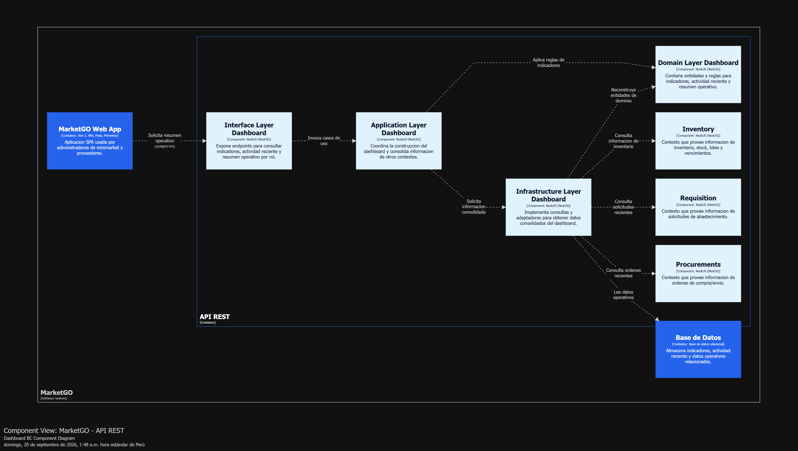

#### Analytics Component Diagram

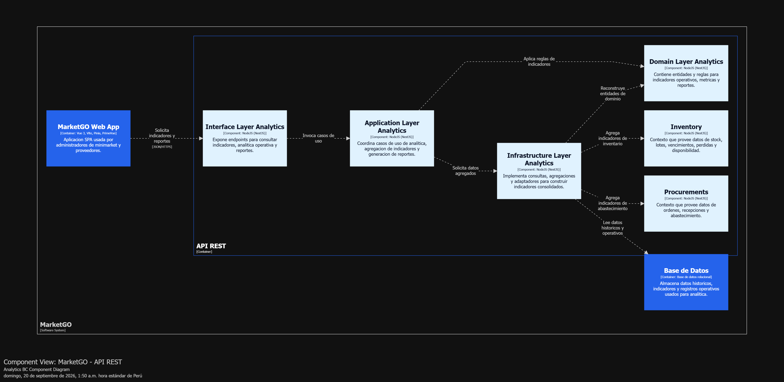

#### Inventory Component Diagram

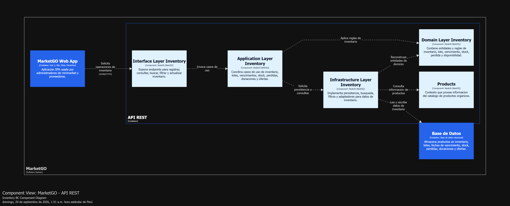

#### Products Component Diagram

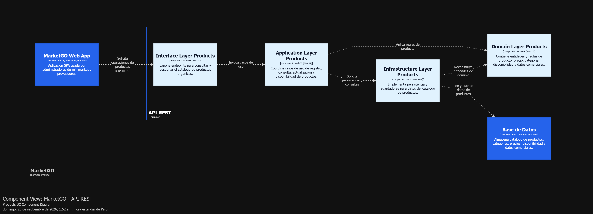

#### Procurements Component Diagram

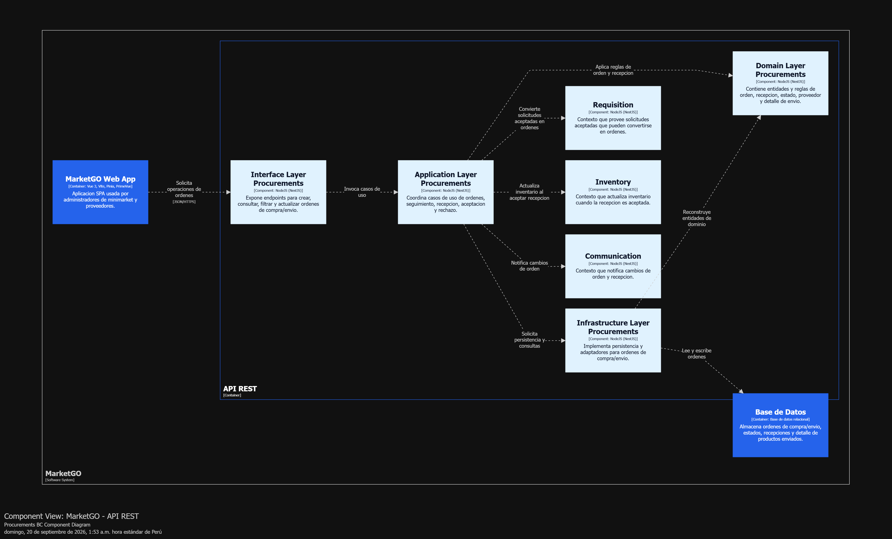

#### Suppliers Component Diagram

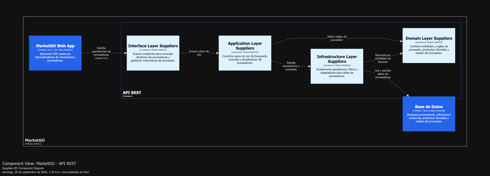

#### Conservation Component Diagram

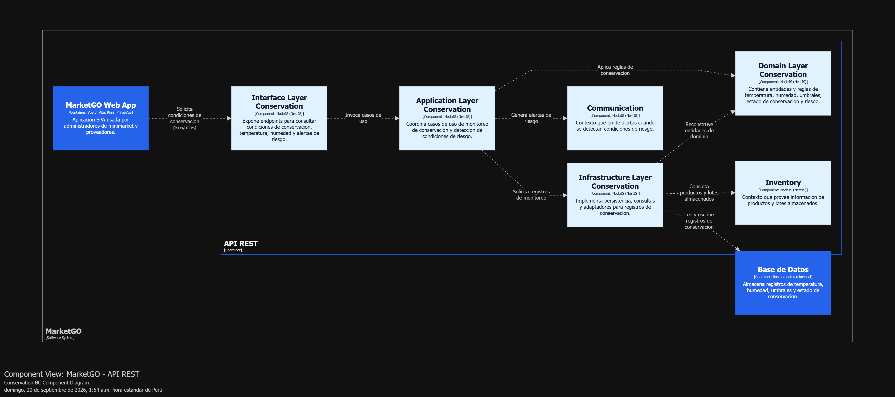

#### Communication Component Diagram

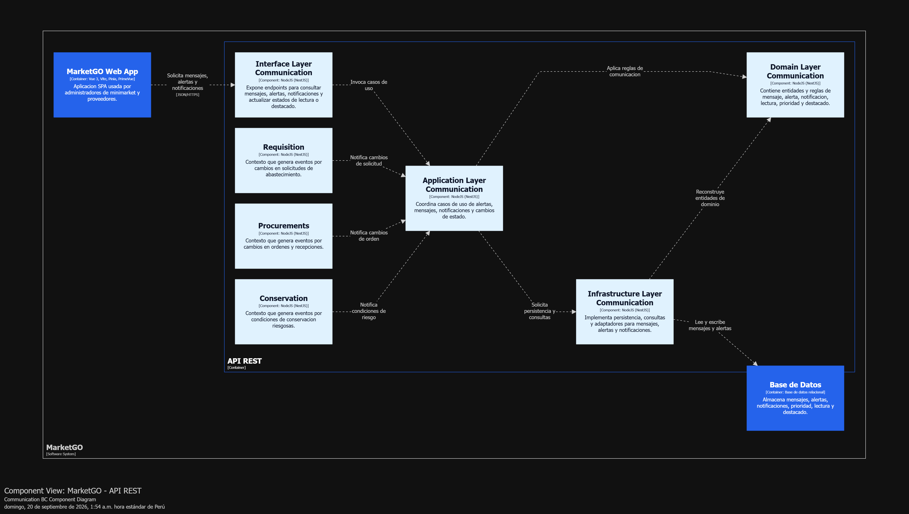

#### Shared Kernel Component Diagram

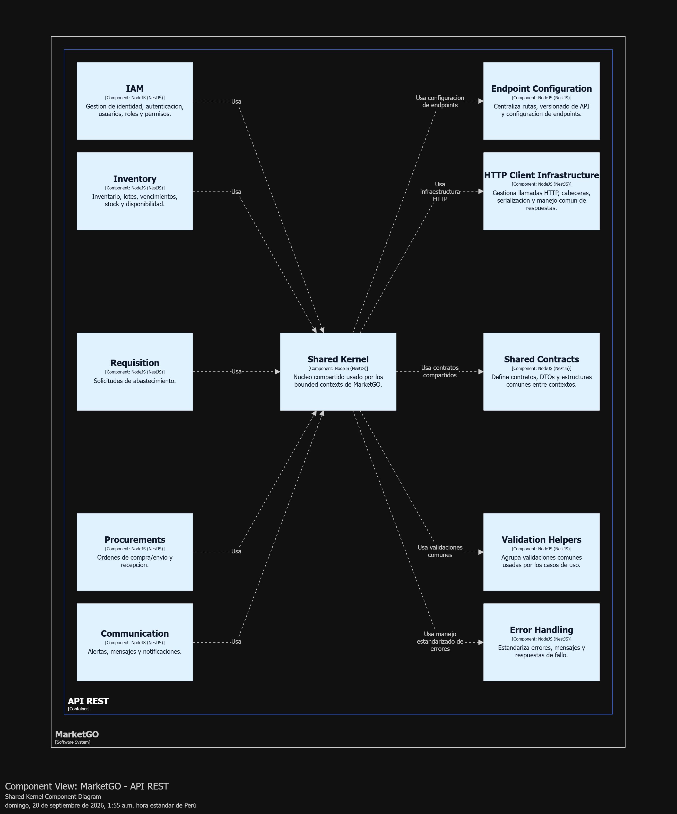

De esta forma, los component diagrams complementan la visión general de la arquitectura, mostrando cómo MarketGo organiza sus responsabilidades internas en componentes coherentes con el dominio y cómo estos colaboran para implementar la gestión de productos orgánicos, inventario, conservación, abastecimiento, proveedores, comunicación y analítica.

## 4.7. Software Object-Oriented Design

En esta sección se presenta el diseño orientado a objetos de MarketGo, representando la estructura de clases principales del sistema y su organización por bounded contexts. Estos diagramas permiten visualizar las responsabilidades de cada clase, sus atributos, métodos y relaciones dentro de la arquitectura de la aplicación.

### 4.7.7. Class Diagrams

Los diagramas de clases muestran la organización interna de los componentes principales de MarketGo, siguiendo una estructura alineada con los bounded contexts definidos previamente. Cada diagrama representa las clases más relevantes dentro de un módulo específico, permitiendo comprender cómo se modelan los conceptos del dominio y cómo se relacionan con la lógica de aplicación.

A continuación, se presentan los diagramas de clases correspondientes a los principales bounded contexts de MarketGo:

#### Communication Class Diagram

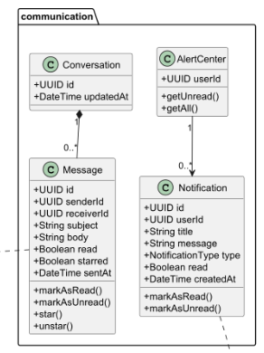

#### Procurements Class Diagram

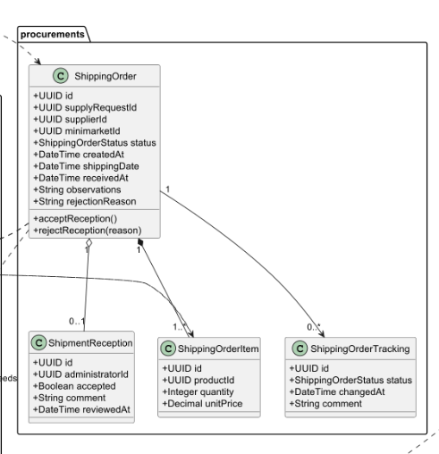

#### Dashboard Class Diagram

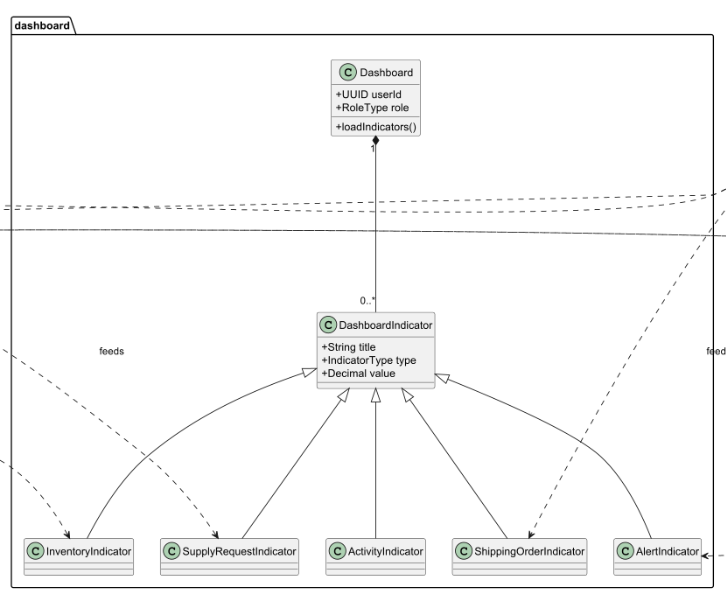

#### Conservation Class Diagram

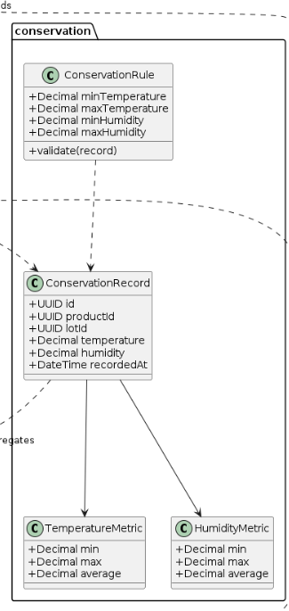

#### Analytics Class Diagram

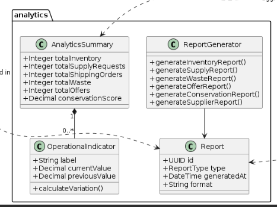

#### Inventory Class Diagram

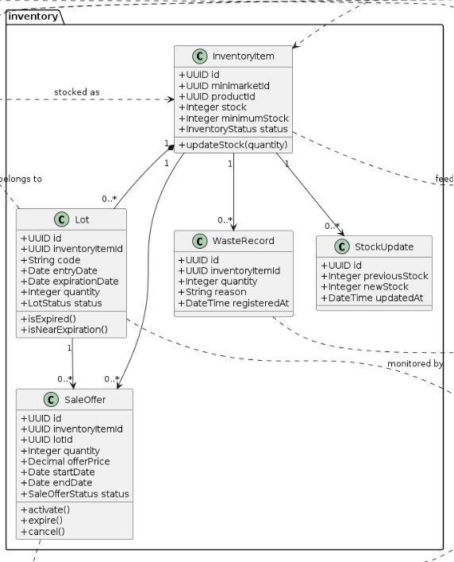

#### Products Class Diagram

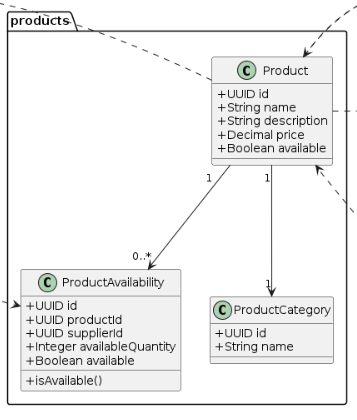

#### IAM Class Diagram

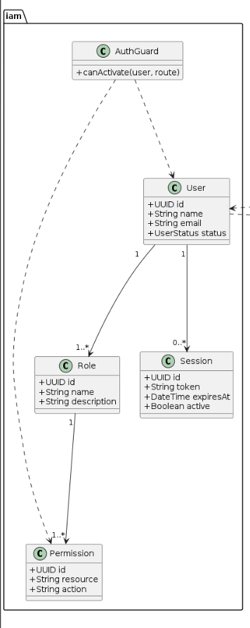

#### Profiles Class Diagram

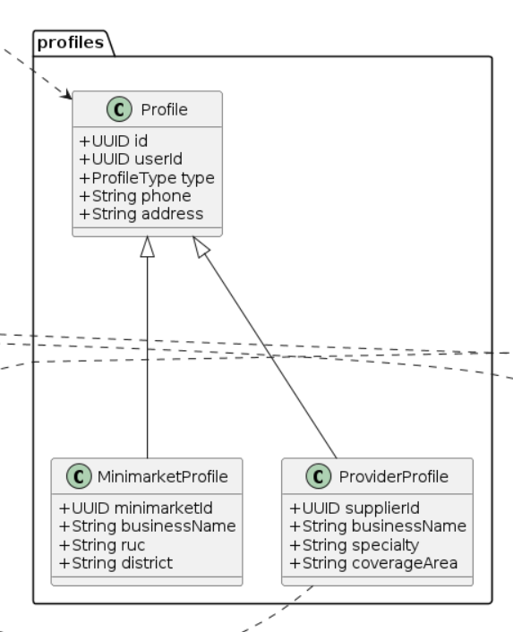

#### Suppliers Class Diagram

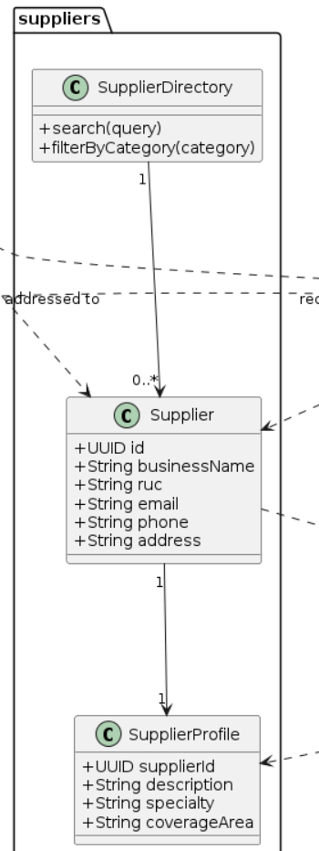

#### Requisition Class Diagram

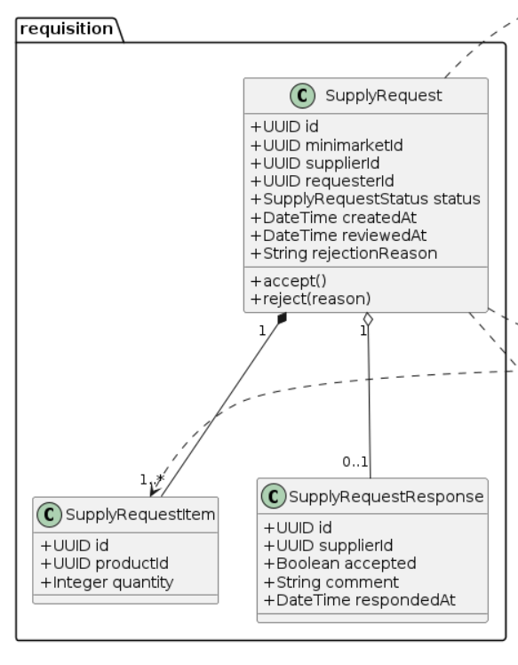

Estos diagramas permiten complementar la arquitectura de software, mostrando una vista más detallada del diseño orientado a objetos de MarketGo. A través de ellos se puede identificar cómo se distribuyen las responsabilidades entre las clases y cómo estas representan los principales conceptos de cada bounded context.

---

## 4.8. Database Design

El diseño de base de datos de MarketGo define la estructura de persistencia necesaria para almacenar y gestionar la información principal de la plataforma. Este diseño considera los datos relacionados con usuarios, perfiles, productos, inventario, proveedores, solicitudes de abastecimiento, órdenes de envío, conservación, comunicación, analítica y auditoría.

La base de datos se encuentra organizada de acuerdo con los bounded contexts definidos en la arquitectura del sistema, permitiendo mantener una separación lógica entre las distintas áreas funcionales. Esta organización facilita la trazabilidad de la información, la consistencia de los datos y la evolución del sistema conforme se incorporen nuevas funcionalidades.

### 4.8.1. Database Diagrams

El diagrama de base de datos muestra las entidades principales de MarketGo, sus atributos, claves primarias, claves foráneas y relaciones. Esta vista permite comprender cómo se estructura la persistencia de los datos y cómo se relacionan las entidades que soportan los procesos principales de la plataforma.

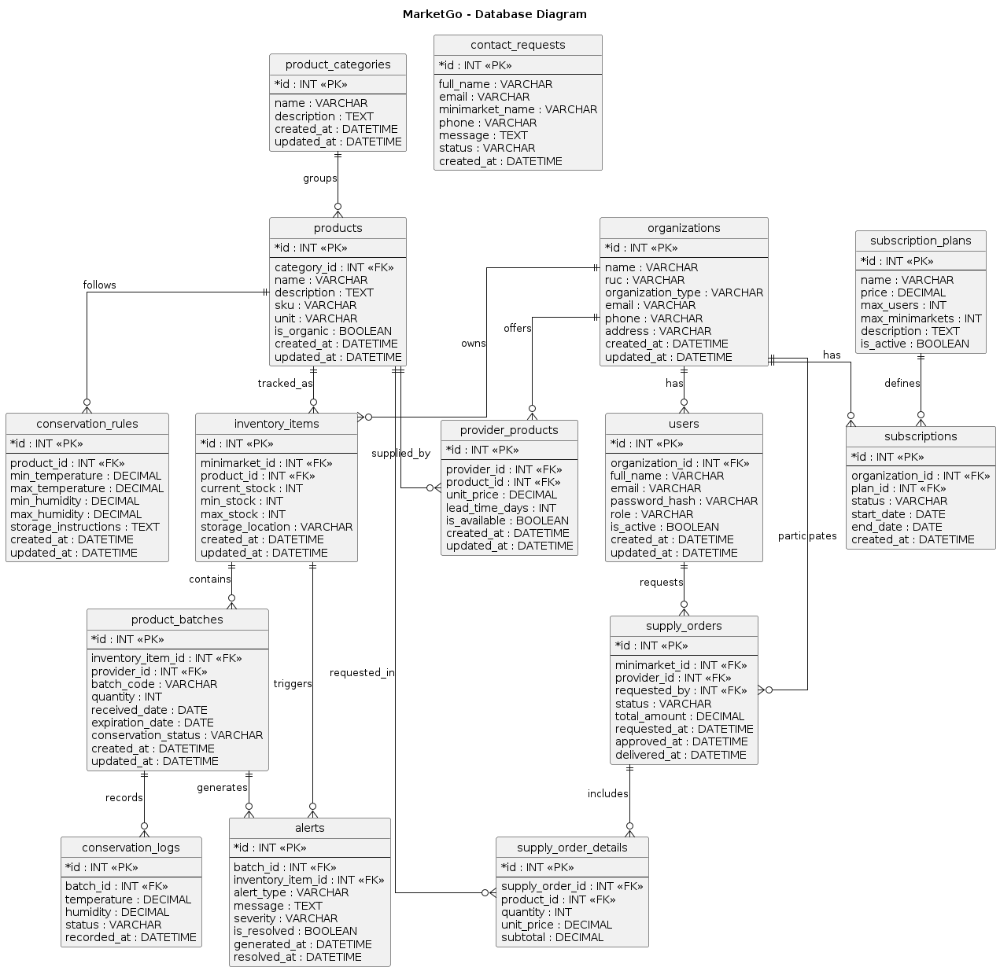
