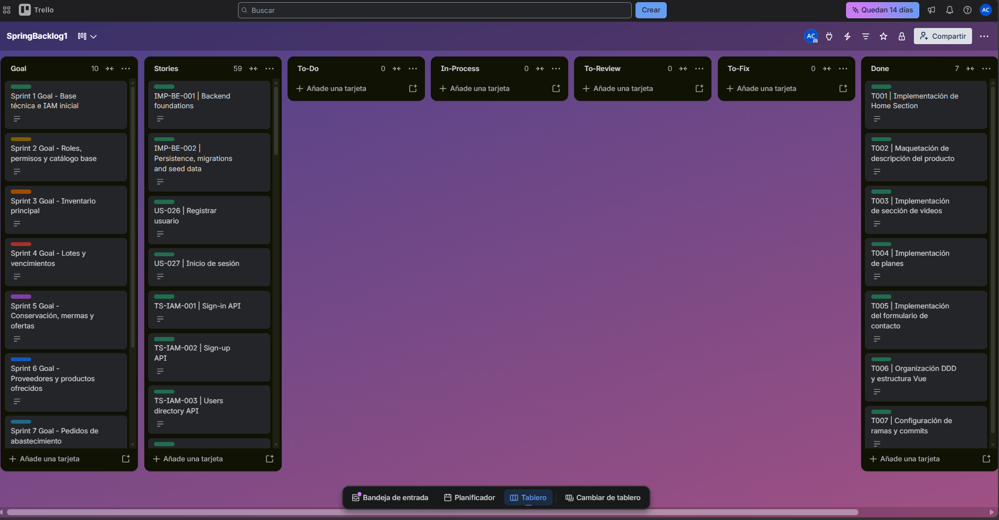
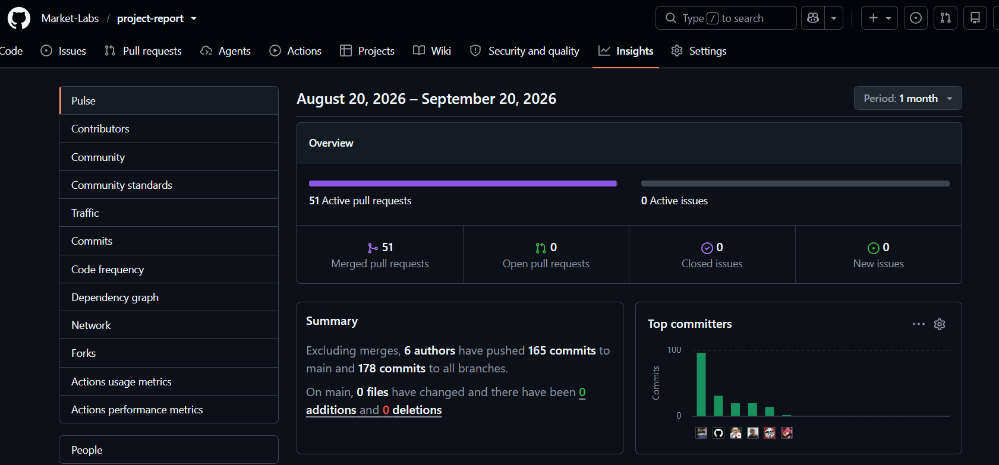
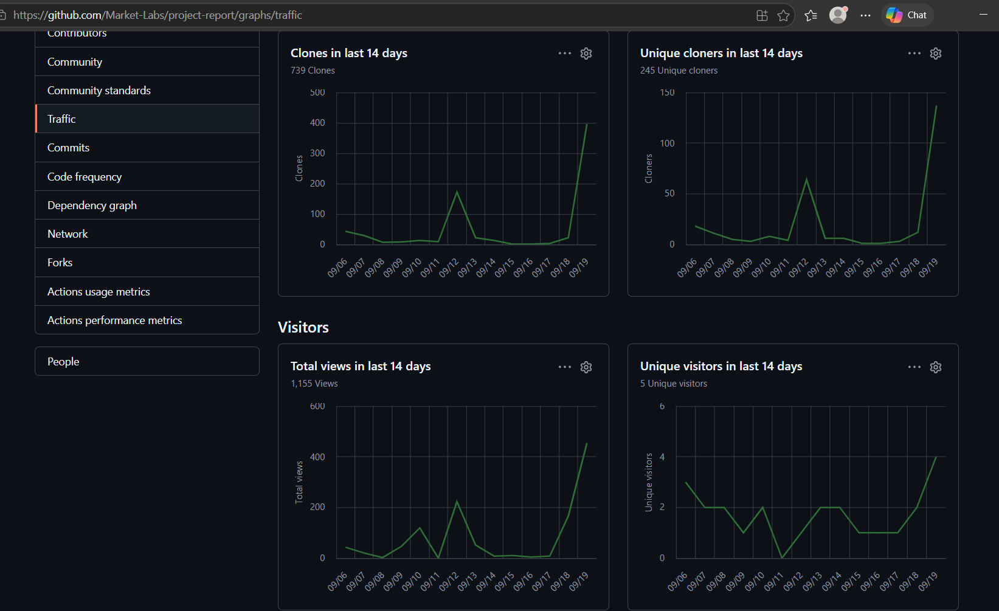

# Capítulo V: Product Implementation, Validation & Deployment

## 5.1. Software Configuration Management

En esta sección se describen las decisiones, convenciones y principios adoptados por el equipo de **Market-Labs** para garantizar la coherencia, trazabilidad y control de versiones durante el ciclo de vida del desarrollo de la solución **MarketGo**. Se establecen los lineamientos para la configuración del entorno de desarrollo, gestión del código fuente, convenciones de estilo y configuración de despliegue orientada a la nube.

### 5.1.1. Software Development Environment Configuration

Se especifican los productos de software utilizados durante el ciclo de vida del proyecto, organizados por disciplinas técnicas para asegurar la estandarización del entorno entre los desarrolladores de Buildline.

#### Project Management
* **Trello:** Empleado para la organización visual del flujo de trabajo diario y la priorización rápida de tareas durante el desarrollo de los módulos de requisición.
    * **Ruta:** [https://trello.com/invite/b/6aaf23b3497a9f7b08a946ed/ATTIc6df49d5561e92016f5670f633077371DA4CB5DA/marketgo](https://trello.com/invite/b/6aaf23b3497a9f7b08a946ed/ATTIc6df49d5561e92016f5670f633077371DA4CB5DA/marketgo)
 
#### Product UX/UI Design
1.  **Miro:** Pizarra colaborativa fundamental para el Design-Level Event Storming de Buildline, permitiendo identificar los eventos de dominio entre obra y oficina.
2.  **Figma:** Herramienta principal para el diseño de la interfaz móvil (Field App) y la plataforma web de gestión, incluyendo el diseño del sistema de diseño (Design System).
3.  **LucidChart:** Utilizado para el modelado de la arquitectura de software mediante diagramas C4 y diagramas de base de datos relacional.

#### Software Development
1.  **GitHub:** Hosting de repositorios bajo la organización RQLS. Implementación de GitFlow para separar las funcionalidades de inventario, compras y reportes.
2.  **WebStorm:** IDE especializado para el desarrollo del Frontend de Buildline, optimizando la codificación con Vue.js y la gestión de estilos.
3.  **JetBrains Rider:** IDE principal para el desarrollo del Backend robusto basado en .NET/C#, facilitando la integración con servicios de base de datos y lógica de negocio.
4.  **Vue.js Framework:** Framework progresivo de JavaScript elegido para construir la SPA de Buildline por su ligereza y velocidad de carga en condiciones de baja conectividad en obra.
5.  **ASP.NET Core / C# sobre .NET 10:** Tecnología de backend para garantizar la escalabilidad, seguridad transaccional en las Órdenes de Compra y alto rendimiento.

#### Software Testing
* **Lenguaje Gherkin:** Utilizado para definir los criterios de aceptación en formato Given-When-Then, asegurando que las validaciones de "Way Match" y presupuestos funcionen correctamente.

#### Software Documentation
* **Swagger / OpenAPI:** Generación de documentación interactiva para que el equipo de Frontend pueda consumir los servicios de requisiciones y proveedores de forma eficiente.

---
### 5.1.2. Source Code Management

Se establecen los repositorios oficiales de la solución Buildline para garantizar la integridad del código fuente.

#### Repositorios del Proyecto
<table>
  <thead>
    <tr>
      <th>Producto</th>
      <th>URL del Repositorio</th>
    </tr>
  </thead>
  <tbody>
    <tr>
      <td>Organización Market-Labs</td>
      <td><a href="https://github.com/Market-Labs">https://github.com/Market-Labs</a></td>
    </tr>
    <tr>
      <td>Landing Page</td>
      <td><a href="https://github.com/Market-Labs/landign-page">https://github.com/Market-Labs/landign-page</a></td>
    </tr>
    <tr>
      <td>Frontend Web Application</td>
      <td><a href="https://github.com/Market-Labs/front-end">https://github.com/Market-Labs/front-end</a></td>
    </tr>
    <tr>
      <td>Backend Web Services</td>
      <td><a href="https://github.com/Market-Labs/backend.git">https://github.com/Market-Labs/backend.git</a></td>
    </tr>
  </tbody>
</table>

#### GitFlow Workflow and Collaboration Strategy

Para asegurar una colaboración organizada, evitar conflictos en el código y mantener una integración continua clara, el equipo de **MarketLab** aplica **GitFlow** como flujo de trabajo de ramificación para el desarrollo de la landing page de **MarketGo**.

La estrategia de colaboración se define de la siguiente manera:

- **main:** Rama que contiene la versión estable y lista para producción de la landing page. Solo recibe integraciones finales desde `develop` cuando los cambios han sido revisados, probados y aprobados.

- **develop:** Rama principal de integración. En esta rama se unifican las funcionalidades terminadas antes de ser promovidas a `main`.

- **feature/<section>:** Ramas temporales creadas a partir de `develop` para aislar el desarrollo de cada sección o mejora de la landing page.  
  Ejemplos:
  - `feature/home-section`
  - `feature/product-information-section`
  - `feature/video-section`
  - `feature/pricing-section`
  - `feature/contact-section`

- **hotfix/<issue>:** Ramas creadas desde `main` para corregir errores críticos detectados en la versión estable de la landing page.

El flujo de trabajo establece que cada rama `feature` debe integrarse a `develop` mediante **Pull Request (PR)** en GitHub, permitiendo revisión de código antes de aprobar la integración.

Cada commit debe seguir la convención de **Conventional Commits**, permitiendo una trazabilidad clara de los cambios realizados en el proyecto.

Ejemplos:

- `feat(home): implement hero section`
- `feat(contact): complete contact landing section`
- `fix(contact): polish mobile section layout`
- `refactor(landing): align Vue sections with mockups`
- `docs(readme): update GitFlow workflow`

### 5.1.3. Source Code Style Guide & Conventions

En esta sección se establecen las convenciones de estilo y nomenclatura adoptadas para los lenguajes utilizados en el proyecto Buildline: HTML, CSS, JavaScript, TypeScript (Vue.js), C# (.NET 10) y Gherkin. Se aplica nomenclatura en inglés para todos los elementos del código, siguiendo el Ubiquitous Language definido para el dominio logístico de la construcción.

#### Referencias de Guías de Estilo Adoptadas

| Lenguaje/Tecnología | Guía de Estilo |
| :--- | :--- |
| HTML/CSS | [Google HTML/CSS Style Guide](https://google.github.io/styleguide/htmlcssguide.html) |
| JavaScript | [Google JavaScript Style Guide](https://google.github.io/styleguide/jsguide.html) |
| TypeScript / Vue.js | [Vue.js Priority A Guide](https://vuejs.org/style-guide/rules-essential.html) |
| C# / .NET | [Microsoft C# Coding Conventions](https://learn.microsoft.com/en-us/dotnet/csharp/fundamentals/coding-style/coding-conventions) |
| Gherkin | [Gherkin Reference](https://cucumber.io/docs/gherkin/reference/) |

Se utiliza nomenclatura en inglés relacionada con las entidades del dominio de la landing page y la plataforma MarketGo, manteniendo nombres claros, consistentes y alineados al producto.
| Elemento                     | Convención             | Ejemplo                                             |
| :--------------------------- | :--------------------- | :-------------------------------------------------- |
| Componentes Vue              | PascalCase             | `HomeSection.vue`, `PricingSection.vue`             |
| Archivos de estilos CSS      | kebab-case             | `home-section.css`, `pricing-section.css`           |
| Variables / Métodos TS       | camelCase              | `activeSection`, `scrollToSection()`                |
| Constantes                   | SCREAMING_SNAKE_CASE   | `DEFAULT_LOCALE`, `CONTACT_EMAIL`                   |
| Rutas / IDs de secciones     | kebab-case             | `product-information`, `contact-section`            |
| Claves de i18n               | camelCase / dot.case   | `home.title`, `pricing.professionalPlan`            |
| Ramas Git feature            | kebab-case             | `feature/home-section`, `feature/contact-section`   |
| Commits                      | Conventional Commits   | `feat(home): implement hero section`                |

#### Sangría y Formato
* Se aplica una indentación de dos espacios para archivos web (HTML, CSS, TS) y de cuatro espacios para C# (estándar de Rider/Visual Studio).
* Las llaves de apertura en C# se colocan en una nueva línea (Estilo Allman), mientras que en TS/JS van en la misma línea (Estilo K&R).

---
### 5.1.4. Software Deployment Configuration

Se especifica la configuración de despliegue para los entornos de Buildline, garantizando alta disponibilidad para ingenieros en obra.

#### Landing Page - Azure
Despliegue automático del contenido estático mediante la integración con Vercel tras cada merge a la rama `main`.
* **URL:** https://agreeable-meadow-0a900b010.3.azurestaticapps.net/
## 5.2. Landing Page, Services & Applications Implementation

### 5.2.1. Sprint 1

| **Sprint Planning Sprint 1** |  |
|---|---|
| **Sprint Planning Background** |  |
| Date | 05/04/2026 |
| Time | 10:00 p.m. |
| Location | Discord / WhatsApp |
| Prepared By | Albino Florencio Cáceres Pizarro |
| Attendees | Albino Florencio Cáceres Pizarro Matias Daniel Huaranga Romero Winnie Lisbeth Merino Ordinola Andre Sebastian Quispe Almonacid Alexis Calin Torres Huaman |
| **Sprint Goal & User Stories** |  |
| **Sprint 1 Goal** | Our focus is on delivering the first marketing landing page of MarketGo, a product by MarketLab, that clearly communicates the value proposition regarding inventory management, batch tracking, product conservation alerts, and supplier-minimarket coordination.  We believe it delivers a clear, professional first impression for minimarket owners, administrators, and organic product providers, helping them understand how MarketGo centralizes daily inventory operations and improves operational traceability.  This will be confirmed when users can navigate through all core sections of the landing page, including Home, Product Description, Videos, Plans, and Contact, and can seamlessly request more information or contact the MarketLab team. |
| Sprint 1 Velocity | 14 Story Points |

  <strong>Repositorio:</strong>
  <a href="https://github.com/Market-Labs/landign-page">
    https://github.com/Market-Labs/landign-page
  </a>

#### 5.2.1.2. Aspect Leaders and Collaborators

Esta matriz <strong>LACX</strong> identifica los aspectos principales del sprint y asigna responsabilidades de Líder (L) y Colaborador (C) para organizar al equipo de <strong>MarketLab</strong> durante el desarrollo de la landing page de <strong>MarketGo</strong>.

<table border="1" cellpadding="4" cellspacing="0" align="center">
  <thead>
    <tr>
      <th>Team Member</th>
      <th>Aspect: UI/UX & Visual Design</th>
      <th>Aspect: Vue Structure & Components</th>
      <th>Aspect: Content & i18n</th>
      <th>Aspect: GitFlow & Deployment</th>
    </tr>
  </thead>
  <tbody>
    <tr>
      <td>Cáceres Pizarro, Albino Florencio</td>
      <td>L</td>
      <td>C</td>
      <td>C</td>
      <td>L</td>
    </tr>
    <tr>
      <td>Huaranga Romero, Matias Daniel</td>
      <td>C</td>
      <td>L</td>
      <td>C</td>
      <td>C</td>
    </tr>
    <tr>
      <td>Merino Ordinola, Winnie Lisbeth</td>
      <td>C</td>
      <td>C</td>
      <td>L</td>
      <td>C</td>
    </tr>
    <tr>
      <td>Quispe Almonacid, Andre Sebastian</td>
      <td>C</td>
      <td>C</td>
      <td>C</td>
      <td>C</td>
    </tr>
    <tr>
      <td>Torres Huaman, Alexis Calin</td>
      <td>C</td>
      <td>C</td>
      <td>C</td>
      <td>C</td>
    </tr>
  </tbody>
</table>

### 5.2.1.3. Sprint Backlog 1

El Sprint Backlog agrupa las tareas iniciales correspondientes al diseño, desarrollo y documentación de la landing page de **MarketGo**, producto de **MarketLab** orientado a la gestión de inventario, lotes, conservación y abastecimiento de productos orgánicos para minimarkets.

  
  
<em>Figura: Tablero del Sprint 1 en Jira Software (Proyecto MarketGo)</em>

| User Story Id | Title | Task Id | Title | Description | Estimation (Hours) | Assigned To | Status |
| :--- | :--- | :--- | :--- | :--- | :--- | :--- | :--- |
| **US00** | Landing Page Base | T001 | Implementación de Home Section | Desarrollo de la sección principal de la landing page en Vue, presentando la propuesta de valor de MarketGo para minimarkets. | 4h | Cáceres Pizarro, Albino Florencio | Done |
| **US00** | Product Information | T002 | Maquetación de descripción del producto | Implementación de la sección informativa sobre inventario, lotes, alertas de conservación, pedidos y accesos por rol. | 4h | Huaranga Romero, Matias Daniel | Done |
| **US00** | Videos Section | T003 | Implementación de sección de videos | Desarrollo del apartado visual para presentar al equipo y mostrar el funcionamiento general de MarketGo. | 3h | Merino Ordinola, Winnie Lisbeth | Done |
| **US00** | Pricing Section | T004 | Implementación de planes | Maquetación de los planes Básico, Profesional y Empresarial, incluyendo precios, beneficios y llamadas a la acción. | 3h | Quispe Almonacid, Andre Sebastian | Done |
| **US00** | Contact Section | T005 | Implementación del formulario de contacto | Desarrollo de la sección de contacto con datos del equipo, formulario para minimarkets y aceptación de política de privacidad. | 4h | Torres Huaman, Alexis Calin | Done |
| **US00** | Landing Page Architecture | T006 | Organización DDD y estructura Vue | Refactorización de carpetas siguiendo una arquitectura orientada por secciones, separando componentes, estilos, assets e internacionalización. | 5h | Cáceres Pizarro, Albino Florencio | Done |
| **US00** | GitFlow Setup | T007 | Configuración de ramas y commits | Organización de ramas feature, integración en develop y actualización de main aplicando Conventional Commits. | 3h | Cáceres Pizarro, Albino Florencio | Done |

#### 5.2.1.4. Development Evidence for Sprint Review

  Resumen de los commits más relevantes en el repositorio de la Landing Page de <strong>MarketGo</strong>, producto desarrollado por <strong>MarketLab</strong>.

<table border="1" cellpadding="4" cellspacing="0">
  <thead>
    <tr>
      <th>Branch</th>
      <th>Commit Id</th>
      <th>Commit Message</th>
      <th>Committed on</th>
    </tr>
  </thead>
  <tbody>
    <tr>
      <td>feature/marketgo-landing-page</td>
      <td><code>d49b631</code></td>
      <td>refactor(landing): align Vue sections with mockups</td>
      <td>19-09-2026</td>
    </tr>
    <tr>
      <td>feature/contact-section</td>
      <td><code>a6446e1</code></td>
      <td>feat(contact): complete contact landing section</td>
      <td>19-09-2026</td>
    </tr>
    <tr>
      <td>feature/contact-section</td>
      <td><code>fbf450a</code></td>
      <td>fix(contact): render email outside i18n parser</td>
      <td>19-09-2026</td>
    </tr>
    <tr>
      <td>develop</td>
      <td><code>1f850de</code></td>
      <td>fix(contact): polish mobile section layout</td>
      <td>19-09-2026</td>
    </tr>
    <tr>
      <td>main</td>
      <td><code>1f850de</code></td>
      <td>fix(contact): polish mobile section layout</td>
      <td>19-09-2026</td>
    </tr>
  </tbody>
</table>

#### 5.2.1.5. Execution Evidence for Sprint Review

Durante el Sprint 1, el equipo logró implementar con éxito el diseño, maquetación y despliegue de la Landing Page estática de **MarketGo**. A continuación, se presentan las evidencias visuales de la ejecución del producto de software, demostrando el cumplimiento de los Criterios de Aceptación de las Historias de Usuario planificadas:

**Evidencia 1: Home Section y Propuesta de Valor**

Se desarrolló la pantalla de inicio principal destacando la propuesta de valor de **MarketGo**: controlar el inventario antes de que sea tarde mediante alertas de vencimiento, condiciones de conservación y pedidos de abastecimiento para minimarkets orgánicos. La navegación superior permite acceder a las secciones principales de la landing page y el diseño respeta los lineamientos *responsive* para dispositivos móviles.

  
  
<em>Figura: Vista principal de MarketGo desplegada en la Landing Page.</em>

**Evidencia 2: Sección de Descripción del Producto**

Se maquetó la sección informativa donde se presentan las principales capacidades de **MarketGo**, incluyendo inventario centralizado, control de lotes, alertas inteligentes, pedidos de abastecimiento y accesos por rol. Esta sección permite comunicar de forma clara cómo la plataforma ayuda a centralizar la operación diaria de un minimarket orgánico.

  
  
<em>Figura: Sección de descripción del producto y funcionalidades principales.</em>

**Evidencia 3: Sección de Videos**

Se implementó una sección dedicada a presentar al equipo y mostrar el funcionamiento general de **MarketGo** mediante contenido audiovisual. Esta sección permite reforzar la confianza del usuario y explicar visualmente el propósito de la solución.

  
  
<em>Figura: Sección de videos para presentación del equipo y demostración del producto.</em>

**Evidencia 4: Sección de Planes**

Se desarrolló la sección de planes comerciales, presentando las alternativas **Básico**, **Profesional** y **Empresarial**. Cada plan comunica de manera ordenada sus beneficios principales, permitiendo que los minimarkets identifiquen la opción más adecuada según su tamaño y necesidades operativas.

  
  
<em>Figura: Sección de planes disponibles para los usuarios de MarketGo.</em>

**Evidencia 5: Sección de Contacto**

Se implementó la sección de contacto, incluyendo información de correo, WhatsApp, horario de atención y un formulario para que los minimarkets interesados puedan solicitar más información o agendar una demostración. Esta sección cumple el objetivo de facilitar la comunicación directa con el equipo de **MarketLab**.

  
  
<em>Figura: Sección de contacto para solicitar información sobre MarketGo.</em>

#### 5.2.1.6. Services Documentation Evidence

  Dado que el Sprint 1 abarca únicamente contenido estático correspondiente a la Landing Page de marketing de <strong>MarketGo</strong>, la implementación y consumo de servicios backend para la gestión de inventario, lotes, conservación, pedidos y proveedores será abordada en sprints posteriores orientados al desarrollo de la plataforma web.

#### 5.2.1.7. Software Deployment Evidence

  <strong>URL de Producción:</strong>
  <a href="https://agreeable-meadow-0a900b010.3.azurestaticapps.net/">
    https://agreeable-meadow-0a900b010.3.azurestaticapps.net/
  </a>

#### 5.2.1.8. Team Collaboration Insights during Sprint

  Durante este primer sprint, el esfuerzo principal del equipo de <strong>MarketLab</strong> se centró en la estructuración del proyecto, el diseño UX/UI, la implementación de la landing page, la organización de ramas mediante GitFlow y la documentación inicial del producto <strong>MarketGo</strong>. Por lo tanto, las evidencias de colaboración presentadas a continuación corresponden al trabajo realizado para construir la presencia digital inicial del producto.

  En primer lugar, el <strong>Historial de Commits</strong> del repositorio demuestra que el trabajo fue organizado mediante ramas feature y commits siguiendo la convención de <strong>Conventional Commits</strong>. Durante el sprint se realizaron cambios incrementales relacionados con la maquetación de secciones, la adaptación visual basada en los mockups, la internacionalización de contenido y la corrección de detalles responsive.

  
  
<em>Figura: Historial de commits demostrando el avance incremental de la landing page de MarketGo.</em>

  En segundo lugar, el gráfico de <strong>Visitors (Traffic)</strong> proporcionado por los Insights de GitHub permite evidenciar la actividad de consulta del repositorio. Las visitas y usuarios únicos reflejan que el equipo revisó recurrentemente el avance del proyecto, validando la estructura visual, el contenido de las secciones y la coherencia general de la landing page antes del despliegue.

  
  
<em>Figura: Gráfica de visitantes mostrando la revisión constante del repositorio por parte del equipo MarketLab.</em>

