# Capítulo V: Product Implementation, Validation & Deployment

## 5.1. Software Configuration Management.

En esta sección se describen las decisiones, convenciones y principios adoptados por el equipo de **Market-Labs** para garantizar la coherencia, trazabilidad y control de versiones durante el ciclo de vida del desarrollo de la solución **MarketGo**. Se establecen los lineamientos para la configuración del entorno de desarrollo, gestión del código fuente, convenciones de estilo y configuración de despliegue orientada a la nube.

### 5.1.1. Software Development Environment Configuration.

Se especifican los productos de software utilizados durante el ciclo de vida del proyecto, organizados por disciplinas técnicas para asegurar la estandarización del entorno entre los desarrolladores de MarketGo.

#### Project Management
* **Jira:** Empleado para la organización visual del flujo de trabajo diario y la priorización rápida de tareas durante el desarrollo de los módulos de inventario y pedidos (Atlassian, s. f.).
    * **Ruta:** [https://trello.com/invite/b/6aaf23b3497a9f7b08a946ed/ATTIc6df49d5561e92016f5670f633077371DA4CB5DA/marketgo](https://trello.com/invite/b/6aaf23b3497a9f7b08a946ed/ATTIc6df49d5561e92016f5670f633077371DA4CB5DA/marketgo)
 
#### Product UX/UI Design
1.  **LucidChart:** Pizarra colaborativa usada para el Design-Level EventStorming de MarketGo y la identificación de eventos de inventario y abastecimiento.
2.  **Figma:** Herramienta principal para el diseño de la landing page y la plataforma web de gestión, incluyendo el diseño del sistema de diseño (Design System).
3.  **Structurizr:** Utilizado para el modelado de la arquitectura de software mediante diagramas C4 y diagramas de base de datos relacional.

#### Software Development
1.  **GitHub:** Hosting de repositorios bajo la organización Market-Labs. Implementación de GitFlow para separar las funcionalidades de inventario, compras y reportes (GitHub, s. f.).
2.  **WebStorm:** IDE especializado para el desarrollo del Frontend de MarketGo, optimizando la codificación con Vue.js y la gestión de estilos.
3.  **JetBrains Rider:** IDE principal para el desarrollo del Backend robusto basado en .NET/C#, facilitando la integración con servicios de base de datos y lógica de negocio.
4.  **Vue.js Framework:** Framework de JavaScript elegido para construir la interfaz de la aplicación web de MarketGo (Vue.js, s. f.-a).
5.  **ASP.NET Core / C# sobre .NET 10:** Tecnología de backend para garantizar la escalabilidad, seguridad transaccional en las órdenes de pedido y alto rendimiento.

#### Software Testing
* **Lenguaje Gherkin:** Utilizado para definir los criterios de aceptación en formato Given-When-Then de pedidos e inventario (Cucumber, s. f.).

#### Software Documentation
* **Swagger / OpenAPI:** Generación de documentación interactiva para que el equipo de Frontend pueda consumir los servicios de pedidos y proveedores de forma eficiente.

---
### 5.1.2. Source Code Management.

Se establecen los repositorios oficiales de la solución MarketGo para garantizar la integridad del código fuente.

#### Repositorios del Proyecto
<table>
  <thead>
    <tr>
      <th>Producto</th>
      <th>URL del Repositorio</th>
    </tr>
  </thead>
  <tbody>
    <tr>
      <td>Organización Market-Labs</td>
      <td><a href="https://github.com/Market-Labs">https://github.com/Market-Labs</a></td>
    </tr>
    <tr>
      <td>Landing Page</td>
      <td><a href="https://github.com/Market-Labs/landign-page">https://github.com/Market-Labs/landign-page</a></td>
    </tr>
    <tr>
      <td>Frontend Web Application</td>
      <td><a href="https://github.com/Market-Labs/front-end">https://github.com/Market-Labs/front-end</a></td>
    </tr>
    <tr>
      <td>Backend Web Services</td>
      <td><a href="https://github.com/Market-Labs/backend.git">https://github.com/Market-Labs/backend.git</a></td>
    </tr>
  </tbody>
</table>

#### GitFlow Workflow and Collaboration Strategy

Para asegurar una colaboración organizada, evitar conflictos en el código y mantener una integración continua clara, el equipo de **MarketLab** aplica **GitFlow** como flujo de trabajo de ramificación para el desarrollo de la landing page de **MarketGo**.

La estrategia de colaboración se define de la siguiente manera:

- **main:** Rama que contiene la versión estable y lista para producción de la landing page. Solo recibe integraciones finales desde `develop` cuando los cambios han sido revisados, probados y aprobados.

- **develop:** Rama principal de integración. En esta rama se unifican las funcionalidades terminadas antes de ser promovidas a `main`.

- **feature/<section>:** Ramas temporales creadas a partir de `develop` para aislar el desarrollo de cada sección o mejora de la landing page.  
  Ejemplos:
  - `feature/home-section`
  - `feature/product-information-section`
  - `feature/video-section`
  - `feature/pricing-section`
  - `feature/contact-section`

- **hotfix/<issue>:** Ramas creadas desde `main` para corregir errores críticos detectados en la versión estable de la landing page.

El flujo de trabajo establece que cada rama `feature` debe integrarse a `develop` mediante **Pull Request (PR)** en GitHub, permitiendo revisión de código antes de aprobar la integración.

Cada commit debe seguir la convención de **Conventional Commits**, permitiendo una trazabilidad clara de los cambios realizados en el proyecto.

Ejemplos:

- `feat(home): implement hero section`
- `feat(contact): complete contact landing section`
- `fix(contact): polish mobile section layout`
- `refactor(landing): align Vue sections with mockups`
- `docs(readme): update GitFlow workflow`

### 5.1.3. Source Code Style Guide & Conventions.

En esta sección se establecen las convenciones de estilo y nomenclatura adoptadas para los lenguajes utilizados en el proyecto MarketGo: HTML, CSS, JavaScript, TypeScript (Vue.js), C# (.NET 10) y Gherkin. Se aplica nomenclatura en inglés para todos los elementos del código, siguiendo el Ubiquitous Language definido para el dominio de inventario y abastecimiento.

#### Referencias de Guías de Estilo Adoptadas

| Lenguaje/Tecnología | Guía de Estilo |
| :--- | :--- |
| HTML/CSS | [Google HTML/CSS Style Guide](https://google.github.io/styleguide/htmlcssguide.html) (Google, s. f.-a) |
| JavaScript | [Google JavaScript Style Guide](https://google.github.io/styleguide/jsguide.html) (Google, s. f.-b) |
| TypeScript / Vue.js | [Vue.js Priority A Guide](https://vuejs.org/style-guide/rules-essential.html) (Vue.js, s. f.-b) |
| C# / .NET | [Microsoft C# Coding Conventions](https://learn.microsoft.com/en-us/dotnet/csharp/fundamentals/coding-style/coding-conventions) (Microsoft, s. f.) |
| Gherkin | [Gherkin Reference](https://cucumber.io/docs/gherkin/reference/) (Cucumber, s. f.) |

Se utiliza nomenclatura en inglés relacionada con las entidades del dominio de la landing page y la plataforma MarketGo, manteniendo nombres claros, consistentes y alineados al producto.
| Elemento                     | Convención             | Ejemplo                                             |
| :--------------------------- | :--------------------- | :-------------------------------------------------- |
| Componentes Vue              | PascalCase             | `HomeSection.vue`, `PricingSection.vue`             |
| Archivos de estilos CSS      | kebab-case             | `home-section.css`, `pricing-section.css`           |
| Variables / Métodos TS       | camelCase              | `activeSection`, `scrollToSection()`                |
| Constantes                   | SCREAMING_SNAKE_CASE   | `DEFAULT_LOCALE`, `CONTACT_EMAIL`                   |
| Rutas / IDs de secciones     | kebab-case             | `product-information`, `contact-section`            |
| Claves de i18n               | camelCase / dot.case   | `home.title`, `pricing.professionalPlan`            |
| Ramas Git feature            | kebab-case             | `feature/home-section`, `feature/contact-section`   |
| Commits                      | Conventional Commits   | `feat(home): implement hero section`                |

#### Sangría y Formato
* Se aplica una indentación de dos espacios para archivos web (HTML, CSS, TS) y de cuatro espacios para C# (estándar de Rider/Visual Studio).
* Las llaves de apertura en C# se colocan en una nueva línea (Estilo Allman), mientras que en TS/JS van en la misma línea (Estilo K&R).

---
### 5.1.4. Software Deployment Configuration.

Se especifica la configuración de despliegue para los entornos de MarketGo, garantizando alta disponibilidad para usuarios de la plataforma.

#### Landing Page - Azure
El despliegue de la landing page se documenta mediante la siguiente URL de Azure Static Web Apps (Microsoft, 2024).
* **URL:** https://agreeable-meadow-0a900b010.3.azurestaticapps.net/
## 5.2. Landing Page, Services & Applications Implementation.

### 5.2.1. Sprint 1.

#### 5.2.1.1. Sprint Planning 1.

| **Sprint Planning Sprint 1** |  |
|---|---|
| **Sprint Planning Background** |  |
| Date | 05/04/2026 |
| Time | 10:00 p.m. |
| Location | Discord / WhatsApp |
| Prepared By | Albino Florencio Cáceres Pizarro |
| Attendees | Albino Florencio Cáceres Pizarro Matias Daniel Huaranga Romero Winnie Lisbeth Merino Ordinola Andre Sebastian Quispe Almonacid Alexis Calin Torres Huaman |
| **Sprint Goal & User Stories** |  |
| **Sprint 1 Goal** | Our focus is on delivering the first marketing landing page of MarketGo, a product by MarketLab, that clearly communicates the value proposition regarding inventory management, batch tracking, product conservation alerts, and supplier-minimarket coordination.  We believe it delivers a clear, professional first impression for minimarket owners, administrators, and organic product providers, helping them understand how MarketGo centralizes daily inventory operations and improves operational traceability.  This will be confirmed when users can navigate through all core sections of the landing page, including Home, Product Description, Videos, Plans, and Contact, and can seamlessly request more information or contact the MarketLab team. |
| Sprint 1 Velocity | 14 Story Points |

  <strong>Repositorio:</strong>
  <a href="https://github.com/Market-Labs/landign-page">
    https://github.com/Market-Labs/landign-page
  </a>

#### 5.2.1.2. Aspect Leaders and Collaborators.

Esta matriz <strong>LACX</strong> identifica los aspectos principales del sprint y asigna responsabilidades de Líder (L) y Colaborador (C) para organizar al equipo de <strong>MarketLab</strong> durante el desarrollo de la landing page de <strong>MarketGo</strong>.

<table border="1" cellpadding="4" cellspacing="0" align="center">
  <thead>
    <tr>
      <th>Team Member</th>
      <th>Aspect: UI/UX & Visual Design</th>
      <th>Aspect: Vue Structure & Components</th>
      <th>Aspect: Content & i18n</th>
      <th>Aspect: GitFlow & Deployment</th>
    </tr>
  </thead>
  <tbody>
    <tr>
      <td>Cáceres Pizarro, Albino Florencio</td>
      <td>L</td>
      <td>C</td>
      <td>C</td>
      <td>L</td>
    </tr>
    <tr>
      <td>Huaranga Romero, Matias Daniel</td>
      <td>C</td>
      <td>L</td>
      <td>C</td>
      <td>C</td>
    </tr>
    <tr>
      <td>Merino Ordinola, Winnie Lisbeth</td>
      <td>C</td>
      <td>C</td>
      <td>L</td>
      <td>C</td>
    </tr>
    <tr>
      <td>Quispe Almonacid, Andre Sebastian</td>
      <td>C</td>
      <td>C</td>
      <td>C</td>
      <td>C</td>
    </tr>
    <tr>
      <td>Torres Huaman, Alexis Calin</td>
      <td>C</td>
      <td>C</td>
      <td>C</td>
      <td>C</td>
    </tr>
  </tbody>
</table>

#### 5.2.1.3. Sprint Backlog 1.

El Sprint Backlog agrupa las tareas iniciales correspondientes al diseño, desarrollo y documentación de la landing page de **MarketGo**, producto de **MarketLab** orientado a la gestión de inventario, lotes, conservación y abastecimiento de productos orgánicos para minimarkets.

  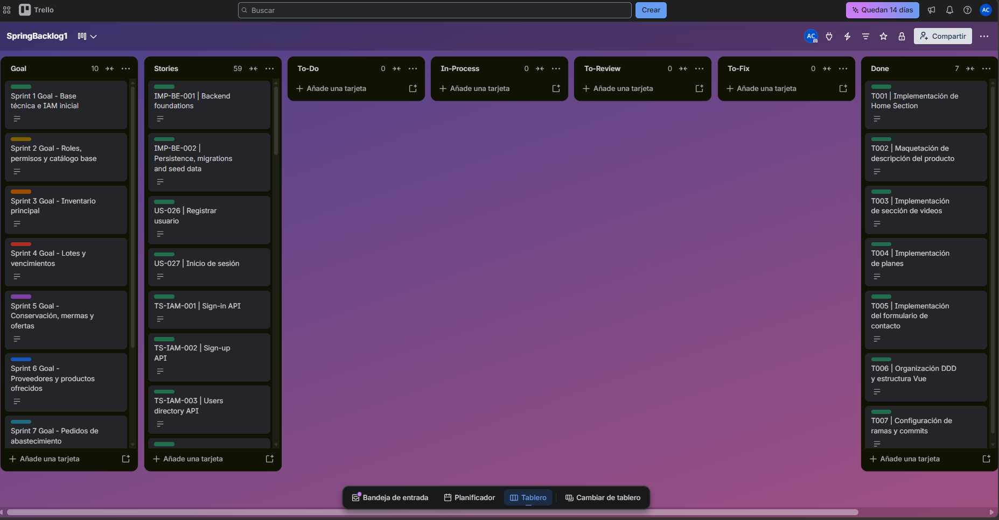
  
<em>Figura: Tablero del Sprint 1 en Jira Software (Proyecto MarketGo)</em>

| User Story Id | Title | Task Id | Title | Description | Estimation (Hours) | Assigned To | Status |
| :--- | :--- | :--- | :--- | :--- | :--- | :--- | :--- |
| **US00** | Landing Page Base | T001 | Implementación de Home Section | Desarrollo de la sección principal de la landing page en Vue, presentando la propuesta de valor de MarketGo para minimarkets. | 4h | Cáceres Pizarro, Albino Florencio | Done |
| **US00** | Product Information | T002 | Maquetación de descripción del producto | Implementación de la sección informativa sobre inventario, lotes, alertas de conservación, pedidos y accesos por rol. | 4h | Huaranga Romero, Matias Daniel | Done |
| **US00** | Videos Section | T003 | Implementación de sección de videos | Desarrollo del apartado visual para presentar al equipo y mostrar el funcionamiento general de MarketGo. | 3h | Merino Ordinola, Winnie Lisbeth | Done |
| **US00** | Pricing Section | T004 | Implementación de planes | Maquetación de los planes Básico, Profesional y Empresarial, incluyendo precios, beneficios y llamadas a la acción. | 3h | Quispe Almonacid, Andre Sebastian | Done |
| **US00** | Contact Section | T005 | Implementación del formulario de contacto | Desarrollo de la sección de contacto con datos del equipo, formulario para minimarkets y aceptación de política de privacidad. | 4h | Torres Huaman, Alexis Calin | Done |
| **US00** | Landing Page Architecture | T006 | Organización DDD y estructura Vue | Refactorización de carpetas siguiendo una arquitectura orientada por secciones, separando componentes, estilos, assets e internacionalización. | 5h | Cáceres Pizarro, Albino Florencio | Done |
| **US00** | GitFlow Setup | T007 | Configuración de ramas y commits | Organización de ramas feature, integración en develop y actualización de main aplicando Conventional Commits. | 3h | Cáceres Pizarro, Albino Florencio | Done |

#### 5.2.1.4. Development Evidence for Sprint Review.

  Resumen de los commits más relevantes en el repositorio de la Landing Page de <strong>MarketGo</strong>, producto desarrollado por <strong>MarketLab</strong>.

<table border="1" cellpadding="4" cellspacing="0">
  <thead>
    <tr>
      <th>Branch</th>
      <th>Commit Id</th>
      <th>Commit Message</th>
      <th>Committed on</th>
    </tr>
  </thead>
  <tbody>
    <tr>
      <td>feature/marketgo-landing-page</td>
      <td><code>d49b631</code></td>
      <td>refactor(landing): align Vue sections with mockups</td>
      <td>19-09-2026</td>
    </tr>
    <tr>
      <td>feature/contact-section</td>
      <td><code>a6446e1</code></td>
      <td>feat(contact): complete contact landing section</td>
      <td>19-09-2026</td>
    </tr>
    <tr>
      <td>feature/contact-section</td>
      <td><code>fbf450a</code></td>
      <td>fix(contact): render email outside i18n parser</td>
      <td>19-09-2026</td>
    </tr>
    <tr>
      <td>develop</td>
      <td><code>1f850de</code></td>
      <td>fix(contact): polish mobile section layout</td>
      <td>19-09-2026</td>
    </tr>
    <tr>
      <td>main</td>
      <td><code>1f850de</code></td>
      <td>fix(contact): polish mobile section layout</td>
      <td>19-09-2026</td>
    </tr>
  </tbody>
</table>

#### 5.2.1.5. Execution Evidence for Sprint Review.

Durante el Sprint 1, el equipo logró implementar con éxito el diseño, maquetación y despliegue de la Landing Page estática de **MarketGo**. A continuación, se presentan las evidencias visuales de la ejecución del producto de software, demostrando el cumplimiento de los Criterios de Aceptación de las Historias de Usuario planificadas:

**Evidencia 1: Home Section y Propuesta de Valor**

Se desarrolló la pantalla de inicio principal destacando la propuesta de valor de **MarketGo**: controlar el inventario antes de que sea tarde mediante alertas de vencimiento, condiciones de conservación y pedidos de abastecimiento para minimarkets orgánicos. La navegación superior permite acceder a las secciones principales de la landing page y el diseño respeta los lineamientos *responsive* para dispositivos móviles.

  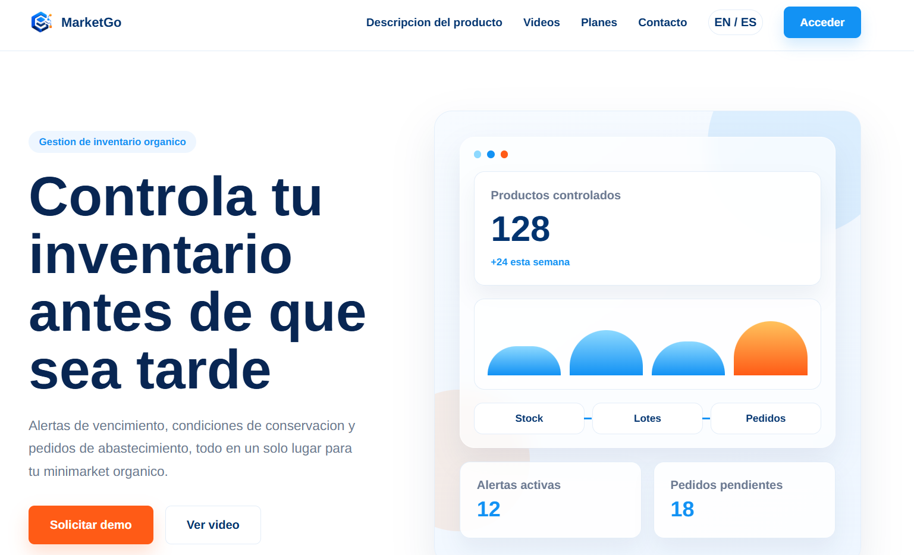
  
<em>Figura: Vista principal de MarketGo desplegada en la Landing Page.</em>

**Evidencia 2: Sección de Descripción del Producto**

Se maquetó la sección informativa donde se presentan las principales capacidades de **MarketGo**, incluyendo inventario centralizado, control de lotes, alertas inteligentes, pedidos de abastecimiento y accesos por rol. Esta sección permite comunicar de forma clara cómo la plataforma ayuda a centralizar la operación diaria de un minimarket orgánico.

  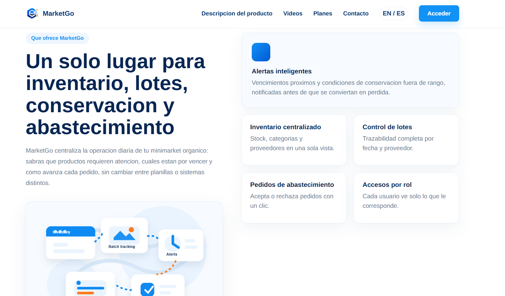
  
<em>Figura: Sección de descripción del producto y funcionalidades principales.</em>

**Evidencia 3: Sección de Videos**

Se implementó una sección dedicada a presentar al equipo y mostrar el funcionamiento general de **MarketGo** mediante contenido audiovisual. Esta sección permite reforzar la confianza del usuario y explicar visualmente el propósito de la solución.

  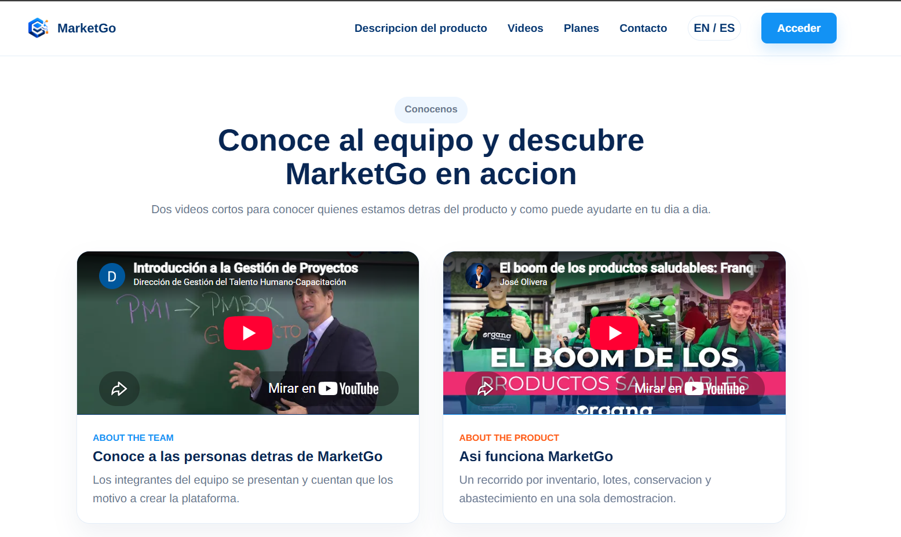
  
<em>Figura: Sección de videos para presentación del equipo y demostración del producto.</em>

**Evidencia 4: Sección de Planes**

Se desarrolló la sección de planes comerciales, presentando las alternativas **Básico**, **Profesional** y **Empresarial**. Cada plan comunica de manera ordenada sus beneficios principales, permitiendo que los minimarkets identifiquen la opción más adecuada según su tamaño y necesidades operativas.

  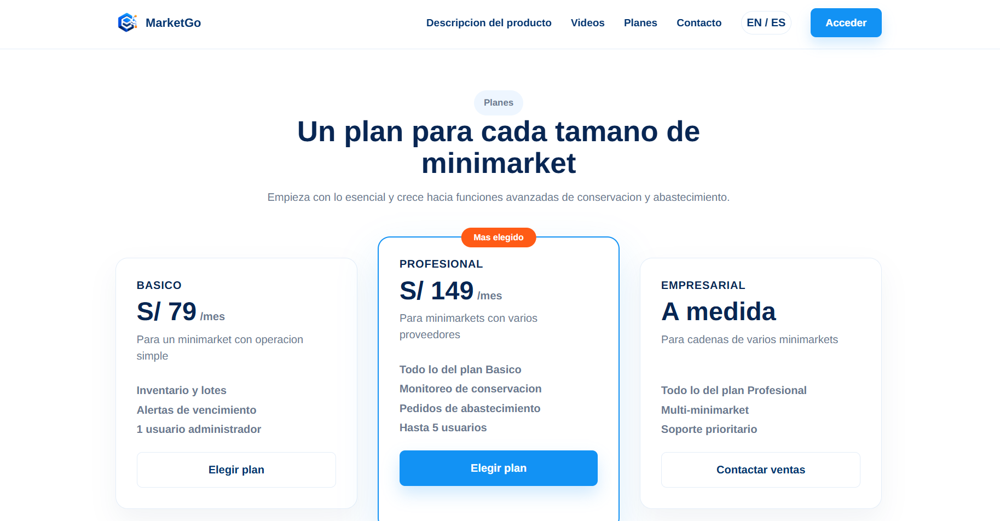
  
<em>Figura: Sección de planes disponibles para los usuarios de MarketGo.</em>

**Evidencia 5: Sección de Contacto**

Se implementó la sección de contacto, incluyendo información de correo, WhatsApp, horario de atención y un formulario para que los minimarkets interesados puedan solicitar más información o agendar una demostración. Esta sección cumple el objetivo de facilitar la comunicación directa con el equipo de **MarketLab**.

  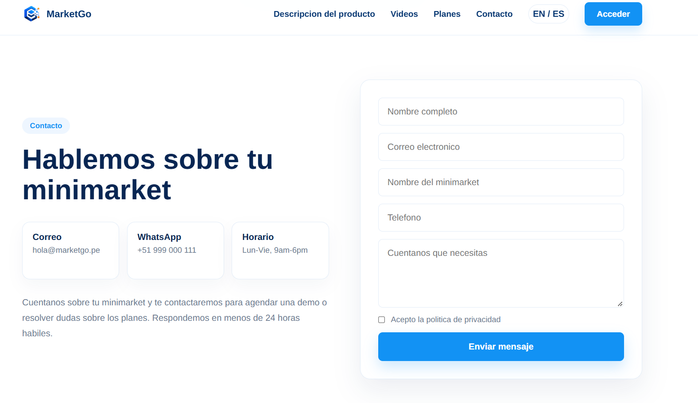
  
<em>Figura: Sección de contacto para solicitar información sobre MarketGo.</em>

#### 5.2.1.6. Services Documentation Evidence for Sprint Review.

  Dado que el Sprint 1 abarca únicamente contenido estático correspondiente a la Landing Page de marketing de <strong>MarketGo</strong>, la implementación y consumo de servicios backend para la gestión de inventario, lotes, conservación, pedidos y proveedores será abordada en sprints posteriores orientados al desarrollo de la plataforma web.

#### 5.2.1.7. Software Deployment Evidence for Sprint Review.

  <strong>URL de Producción:</strong>
  <a href="https://agreeable-meadow-0a900b010.3.azurestaticapps.net/">
    https://agreeable-meadow-0a900b010.3.azurestaticapps.net/
  </a>

#### 5.2.1.8. Team Collaboration Insights during Sprint.

  Durante este primer sprint, el esfuerzo principal del equipo de <strong>MarketLab</strong> se centró en la estructuración del proyecto, el diseño UX/UI, la implementación de la landing page, la organización de ramas mediante GitFlow y la documentación inicial del producto <strong>MarketGo</strong>. Por lo tanto, las evidencias de colaboración presentadas a continuación corresponden al trabajo realizado para construir la presencia digital inicial del producto.

  En primer lugar, el <strong>Historial de Commits</strong> del repositorio demuestra que el trabajo fue organizado mediante ramas feature y commits siguiendo la convención de <strong>Conventional Commits</strong>. Durante el sprint se realizaron cambios incrementales relacionados con la maquetación de secciones, la adaptación visual basada en los mockups, la internacionalización de contenido y la corrección de detalles responsive.

  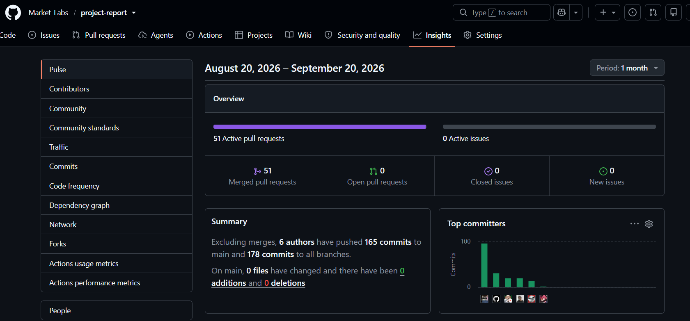
  
<em>Figura: Historial de commits demostrando el avance incremental de la landing page de MarketGo.</em>

  En segundo lugar, el gráfico de <strong>Visitors (Traffic)</strong> proporcionado por los Insights de GitHub permite evidenciar la actividad de consulta del repositorio. Las visitas y usuarios únicos reflejan que el equipo revisó recurrentemente el avance del proyecto, validando la estructura visual, el contenido de las secciones y la coherencia general de la landing page antes del despliegue.

  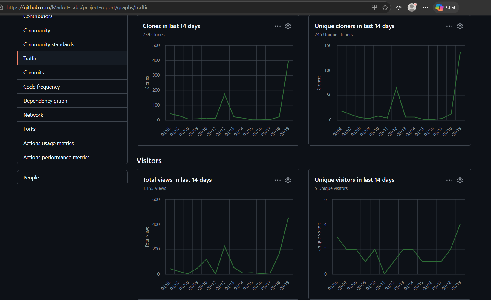
  
<em>Figura: Gráfica de visitantes mostrando la revisión constante del repositorio por parte del equipo MarketLab.</em>

### 5.2.2. Sprint 2

#### 5.2.2.1. Sprint Planning 2.

La planificación del Sprint 2 se centró en definir el primer incremento del frontend web de MarketGo y el resultado que el equipo presentará en la revisión del sprint.

| **Sprint Planning Sprint 2** |  |
|---|---|
| **Sprint Planning Background** |  |
| Date | 2026-09-26 |
| Time | 10:00 p.m. |
| Location | Discord / WhatsApp |
| Prepared By | Albino Florencio Cáceres Pizarro |
| Attendees | Albino Florencio Cáceres Pizarro Matias Daniel Huaranga Romero Winnie Lisbeth Merino Ordinola Andre Sebastian Quispe Almonacid Alexis Calin Torres Huaman |
| Sprint 1 Review Summary | En el Sprint 1 se implementó y desplegó la primera versión de la landing page de MarketGo, con las secciones Home, información del producto, videos, planes y contacto. La entrega permitió presentar la propuesta de valor y comprobar la navegación inicial y la adaptación a distintos tamaños de pantalla. Este resultado sirve como punto de partida para construir el frontend de la aplicación web durante el Sprint 2. La evidencia disponible no registra comentarios específicos del Product Owner. |
| Sprint 1 Retrospective Summary | La documentación del Sprint 1 muestra trabajo incremental mediante ramas feature, commits convencionales y colaboración en diseño, contenido y despliegue. Para el Sprint 2 se propone reforzar la coordinación entre quienes implementan las pantallas, la navegación por roles y la integración visual, y revisar temprano la experiencia responsive antes de la Sprint Review. |
| **Sprint Goal & User Stories** |  |
| **Sprint 2 Goal** | Our focus is on developing and deploying the first navigable version of the MarketGo frontend web application for minimarket administrators and organic product suppliers. The sprint will translate the approved UX/UI designs into responsive screens, clear navigation for each role, and representative flows for the platform's core operations.  We believe this will give both user groups a concrete interface for exploring MarketGo's daily workflows and will let the team validate the usability and consistency of the frontend before expanding its integration with services.  This will be confirmed when the first frontend version is accessible in a deployed environment, its principal screens work on desktop and mobile, and the planned navigation and interaction flows can be demonstrated during the Sprint Review. |
| User Stories del tablero con puntos definidos | US-026 Registrar usuario (3 SP); US-027 Inicio de sesión (3 SP); US-028 Gestionar permisos por rol (5 SP); US-029 Controlar acceso según operación (5 SP); US-030 Dashboard general (5 SP). US-033 figura en Trello, pero no está estimada en el Product Backlog del capítulo 3. |
| Velocidad de referencia (Sprint 1) | 14 Story Points; se usa como antecedente, no como velocidad lograda en Sprint 2. |
| Sum of Story Points | 21 Story Points (3 + 3 + 5 + 5 + 5) para las cinco historias del tablero que tienen estimación en el capítulo 3. US-033 queda pendiente de incorporación y estimación en el Product Backlog. |

**Repositorio Landing Page:** https://github.com/Market-Labs/landign-page.git

**Repositorio Frontend:** https://github.com/Market-Labs/front-end.git

#### 5.2.2.2. Aspect Leaders and Collaborators.

Para el Sprint 2 se identificaron aspectos funcionales que corresponden a los bounded contexts implementados en el frontend, más un aspecto transversal de configuración del proyecto (Vue 3, Vite, Pinia e i18n). La siguiente matriz LACX recoge la asignación documentada para el Sprint 2. La captura general de Trello no permite verificar los responsables de todos los aspectos; los liderazgos deben contrastarse con las tarjetas asignadas y los commits de cada integrante.

| Team Member | IAM & Project Setup | Requisition & Procurement | Suppliers & Products | Inventory & Conservation | Dashboard & Profiles | Communication | Analytics |
|---|---|---|---|---|---|---|---|
| Cáceres Pizarro, Albino Florencio | L | C | C | C | L | C | C |
| Huaranga Romero, Matias Daniel | C | C | C | C | C | C | C |
| Merino Ordinola, Winnie Lisbeth | C | L | C | C | C | C | C |
| Quispe Almonacid, Andre Sebastian | C | L | C | L | C | C | C |
| Torres Huaman, Alexis Calin | C | C | C | C | L | L | C |

#### 5.2.2.3. Sprint Backlog 2.

El Sprint Backlog 2 agrupa los User Stories priorizados del Product Backlog que corresponden al primer release navegable del Frontend Web Application, organizados por bounded context. Se utilizó Trello Software como herramienta de control de estado.

  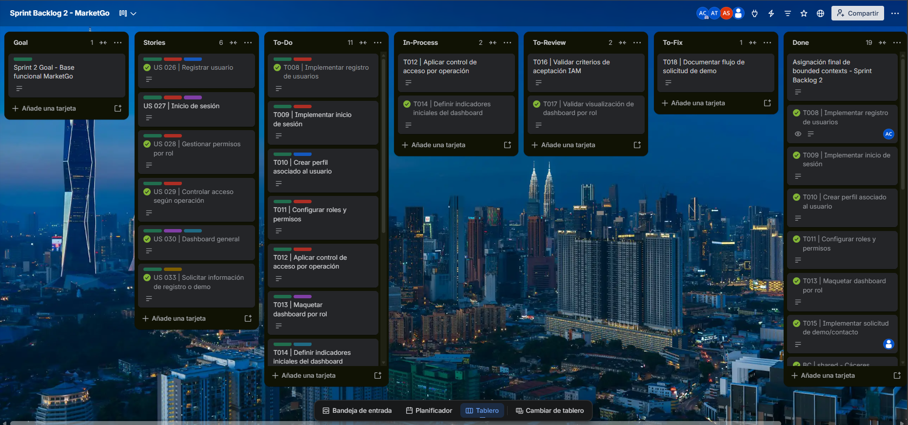
  
<strong>Figura: Tablero del Sprint 2 en Trello (Proyecto MarketGo)</strong> <em>Nota. Elaboración propia.</em>

| User Story Id | Title | Task Id | Title | Description | Estimation (Hours) | Assigned To | Status |
| :--- | :--- | :--- | :--- | :--- | :--- | :--- | :--- |
| **US-026** | Registrar usuario | T008 | Implementar registro de usuarios | Implementación del formulario de registro de usuarios y validación de los datos ingresados para permitir el acceso controlado a MarketGo. | 4h | Cáceres Pizarro, Albino Florencio | To-Do |
| **US-027** | Inicio de sesión | T009 | Implementar inicio de sesión | Desarrollo de la interfaz de autenticación y validación de credenciales para permitir el acceso según el rol del usuario. | 4h | Cáceres Pizarro, Albino Florencio | To-Do |
| **US-026** | Registrar usuario | T010 | Crear perfil asociado al usuario | Implementación de la creación de un perfil vinculado a cada usuario registrado en MarketGo. | 3h | Cáceres Pizarro, Albino Florencio | To-Do |
| **US-028** | Gestionar permisos por rol | T011 | Configurar roles y permisos | Configuración de los roles del administrador de minimarket y proveedor, estableciendo los permisos correspondientes. | 4h | Cáceres Pizarro, Albino Florencio | To-Do |
| **US-029** | Controlar acceso según operación | T012 | Aplicar control de acceso por operación | Implementación de restricciones de acceso a las funcionalidades de pedidos, órdenes de envío e inventario según el rol del usuario. | 4h | Cáceres Pizarro, Albino Florencio | In-Progress |
| **US-030** | Dashboard general | T013 | Maquetar dashboard por rol | Diseño y desarrollo de la estructura visual del dashboard con información diferenciada para administradores y proveedores. | 4h | Torres Huaman, Alexis Calin | To-Do |
| **US-030** | Dashboard general | T014 | Definir indicadores iniciales del dashboard | Definición de indicadores operativos para visualizar información relevante sobre inventario, abastecimiento y operaciones según el rol. | 3h | Torres Huaman, Alexis Calin | In-Progress |
| **US-028** | Gestionar permisos por rol | T016 | Validar criterios de aceptación IAM | Verificación de los criterios de aceptación relacionados con registro, autenticación, roles y permisos de usuarios. | 3h | Cáceres Pizarro, Albino Florencio | To-Review |
| **US-030** | Dashboard general | T017 | Validar visualización de dashboard por rol | Validación de la información e indicadores mostrados en el dashboard según los permisos del administrador y proveedor. | 3h | Torres Huaman, Alexis Calin | To-Review |
| **US-033** | Solicitar información o demo | T018 | Documentar flujo de solicitud de demo | Documentación del proceso de solicitud de información o demostración mediante el formulario de contacto de la landing page. | 2h | Huaranga Romero, Matias Daniel | To-Fix |
| **US-026** | Registrar usuario | — | Definir historia de registro de usuario | Definición de la funcionalidad de registro de usuarios y sus criterios de aceptación para el Sprint 2. | 2h | Cáceres Pizarro, Albino Florencio | Stories |
| **US-027** | Inicio de sesión | — | Definir historia de inicio de sesión | Definición de los requisitos de autenticación y acceso a MarketGo según el rol del usuario. | 2h | Cáceres Pizarro, Albino Florencio | Stories |
| **US-028** | Gestionar permisos por rol | — | Definir historia de gestión de permisos | Definición de los permisos correspondientes a los diferentes roles del sistema. | 2h | Cáceres Pizarro, Albino Florencio | Stories |
| **US-029** | Controlar acceso según operación | — | Definir historia de control de acceso | Definición de restricciones de operaciones según los permisos asociados a cada rol. | 2h | Cáceres Pizarro, Albino Florencio | Stories |
| **US-030** | Dashboard general | — | Definir historia del dashboard general | Definición de la visualización de información y los indicadores correspondientes a cada rol. | 2h | Torres Huaman, Alexis Calin | Stories |
| **US-033** | Solicitar información o demo | — | Definir historia de solicitud de demo | Definición de los requisitos del formulario de contacto para solicitar información sobre MarketGo. | 2h | Huaranga Romero, Matias Daniel | Stories |
| **Tech** | Requisition Bounded Context | BC-001 | Definir Bounded Context de Requisition | Documentación y delimitación del contexto de pedidos de abastecimiento, sus responsabilidades y relaciones con los demás contextos del sistema. | 3h | Merino Ordinola, Winnie Lisbeth | Done |
| **Tech** | Procurements Bounded Context | BC-002 | Definir Bounded Context de Procurements | Documentación del contexto de gestión de abastecimiento y órdenes de envío, identificando sus responsabilidades y procesos. | 3h | Quispe Almonacid, Andre Sebastian | Done |
| **Tech** | Conservation Bounded Context | BC-003 | Definir Bounded Context de Conservation | Definición del contexto encargado del monitoreo de condiciones de almacenamiento, temperatura, humedad y alertas de conservación. | 3h | Quispe Almonacid, Andre Sebastian | Done |
| **Tech** | Sales Bounded Context | BC-004 | Definir Bounded Context de Sales | Documentación del contexto relacionado con las ofertas de productos y las operaciones comerciales de MarketGo. | 3h | Torres Huaman, Alexis Calin | Done |
| **Tech** | Dashboard Bounded Context | BC-005 | Definir Bounded Context de Dashboard | Identificación de las responsabilidades e indicadores del dashboard general para administradores y proveedores. | 3h | Torres Huaman, Alexis Calin | Done |
| **Tech** | Profiles Bounded Context | BC-006 | Definir Bounded Context de Profiles | Documentación del contexto de perfiles de usuario y su relación con IAM y los demás contextos de MarketGo. | 3h | Cáceres Pizarro, Albino Florencio | Done |
| **Tech** | Communication Bounded Context | BC-007 | Definir Bounded Context de Communication | Definición del contexto de comunicación, notificaciones y alertas relacionadas con las operaciones del sistema. | 3h | Torres Huaman, Alexis Calin | Done |

<em>Nota de trazabilidad.</em> El tablero de Trello incluye US-033, pero el Product Backlog documentado en el capítulo 3 termina en US-030. Las estimaciones en horas y los responsables de esta tabla requieren contrastarse con el detalle de cada tarjeta; la captura general solo muestra títulos y columnas.

#### 5.2.2.4. Development Evidence for Sprint Review.

El siguiente cuadro reúne los 26 commits de <code>Market-Labs/front-end</code> presentes en <code>origin/main</code> desde la planificación del Sprint 2 (26-09-2026) hasta el 09-10-2026. Se usan la fecha y hora de <em>commit</em> registradas por Git, convertidas a la zona horaria de Lima (UTC-5). La columna <code>main</code> indica la rama en la que se verificaron; Git no conserva la rama original en el objeto commit.

| Repositorio | Rama verificada | Commit Id | Commit Message | Fecha y hora (Lima, UTC-5) |
|---|---|---|---|---|
| front-end | main | [f5e9d4c](https://github.com/Market-Labs/front-end/commit/f5e9d4cae6213bbae9164b6a0d0d289564ba3c6e) | Refactor alert center for i18n and styling updates | 09-10-2026 18:57 |
| front-end | main | [da1b357](https://github.com/Market-Labs/front-end/commit/da1b357e892ba7d713eff11644b51d127a11eaa1) | Refactor communication routes with Pinia store | 09-10-2026 18:54 |
| front-end | main | [fdc4c7a](https://github.com/Market-Labs/front-end/commit/fdc4c7aff65d2e8fca3b9a48354e43b835a019ed) | Refactor MessageAssembler to handle default values | 09-10-2026 18:53 |
| front-end | main | [b0f1dc4](https://github.com/Market-Labs/front-end/commit/b0f1dc4c60849f8f880342ade104e3c5a19e64ca) | Modify getNotifications to handle supplier alerts | 09-10-2026 18:52 |
| front-end | main | [6ff080f](https://github.com/Market-Labs/front-end/commit/6ff080f6c64d90d2c7b4d2d7cdda4aeefcdca56b) | Refactor communication store to handle Firebase mode | 09-10-2026 18:51 |
| front-end | main | [ac5d708](https://github.com/Market-Labs/front-end/commit/ac5d7086332a647849dd1813ce5ea44b04ab0ad3) | Add files via upload | 09-10-2026 18:43 |
| front-end | main | [2726351](https://github.com/Market-Labs/front-end/commit/27263515c7285c1f86d2ff02ec8f6734f9254034) | docs(iam): add jsdoc comments to access role model | 09-10-2026 18:33 |
| front-end | main | [095849b](https://github.com/Market-Labs/front-end/commit/095849b03e20098caca93f14ba05d1c243a2c7fe) | fix(procurements): open shipping order form from accepted request | 09-10-2026 08:08 |
| front-end | main | [cc66031](https://github.com/Market-Labs/front-end/commit/cc66031b67df19746a79b3726f2172f4a63ec7bd) | fix(requisition): create Firestore documents without denied reads | 09-10-2026 06:51 |
| front-end | main | [1d2cc47](https://github.com/Market-Labs/front-end/commit/1d2cc47dd47779ae993c72bb2a26f13e75312177) | fix(iam): wait for initial route before mounting app | 09-10-2026 05:24 |
| front-end | main | [04953dd](https://github.com/Market-Labs/front-end/commit/04953dd1450bb59a595f0cfaa6a66ebc9816a263) | fix(shared): use MarketGo logo as favicon | 09-10-2026 05:16 |
| front-end | main | [f5d8415](https://github.com/Market-Labs/front-end/commit/f5d841505bbbcd72f1a9560d5f70296f400b747b) | feat(inventory): track lot expiration and offers | 09-10-2026 01:39 |
| front-end | main | [51e6052](https://github.com/Market-Labs/front-end/commit/51e6052b856fba45e5b3d4347a170a15c9e9b84d) | fix(iam): count available organization roles | 09-10-2026 01:00 |
| front-end | main | [39ef675](https://github.com/Market-Labs/front-end/commit/39ef675dd1f5eb2190841aa01d7c23ae4803cd54) | feat(iam): add administrator and collaborator roles | 09-10-2026 00:57 |
| front-end | main | [5ae76e1](https://github.com/Market-Labs/front-end/commit/5ae76e12ffdc3c4e7001209c9ad303df51de5236) | fix(iam): validate signup email and explain failures | 08-10-2026 23:51 |
| front-end | main | [d8e8683](https://github.com/Market-Labs/front-end/commit/d8e868361c5d8e82e03aaefe326da7961e01abaf) | feat(iam): add tenant-scoped Firebase sign-up | 08-10-2026 23:37 |
| front-end | main | [c08ef33](https://github.com/Market-Labs/front-end/commit/c08ef3329db18501287da641569284718d1fd1df) | feat(suppliers): add sequential IDs and soft removal | 08-10-2026 23:03 |
| front-end | main | [56f891d](https://github.com/Market-Labs/front-end/commit/56f891dd4385497be6da3db01fcb2efbe33ec393) | feat(frontend): align inventory outputs and supply navigation | 08-10-2026 22:40 |
| front-end | main | [db37db8](https://github.com/Market-Labs/front-end/commit/db37db8174455672f3ad67d4f624ee7592ae59df) | Update README.md | 05-10-2026 13:27 |
| front-end | main | [df41d89](https://github.com/Market-Labs/front-end/commit/df41d8981060aeb8448d3702efeaf42f437d0336) | chore: edit frontend contract coverage | 05-10-2026 12:30 |
| front-end | main | [b91254a](https://github.com/Market-Labs/front-end/commit/b91254a50380098a97657d7aab1a0316f5300429) | chore : add news frontend contract Coverage | 05-10-2026 12:29 |
| front-end | main | [dff02e6](https://github.com/Market-Labs/front-end/commit/dff02e64ad4ca232f99a05b82538f7cd945dae43) | feat(firebase): persist MarketGo data and provision role-scoped users | 05-10-2026 11:53 |
| front-end | main | [890f87b](https://github.com/Market-Labs/front-end/commit/890f87bbce5c8810a18471b7781f7c5c9c7a0d19) | feat(shared): add read-only Azure demo mode | 03-10-2026 00:15 |
| front-end | main | [9705a3d](https://github.com/Market-Labs/front-end/commit/9705a3dc7f0635fb33da9c9c45553b0ba181ea9b) | chore(release): merge develop for Azure deployment | 02-10-2026 23:41 |
| front-end | main | [46e7f93](https://github.com/Market-Labs/front-end/commit/46e7f939815a71c47dc28dedf02d67fdc3fbd8d2) | docs(server): describe demo API and report endpoints | 02-10-2026 23:36 |
| front-end | main | [5f67499](https://github.com/Market-Labs/front-end/commit/5f6749987235358371810ed28b12e5b877ed788d) | feat(frontend): complete role-based workflows and reports | 02-10-2026 23:36 |

Las correcciones de la landing page fechadas el 19-09-2026 preceden a la planificación del Sprint 2; se documentan como antecedente y no como commits de este sprint.

#### 5.2.2.5. Execution Evidence for Sprint Review.

  Durante el Sprint 2, el equipo de MarketLab documentó los avances
  funcionales del Frontend Web Application de <strong>MarketGo</strong>,
  una plataforma orientada a la gestión de inventarios, productos,
  abastecimiento y conservación de productos orgánicos en minimarkets.
  La aplicación fue desarrollada con Vue 3, Vite y Pinia, y organizada
  mediante componentes, servicios y bounded contexts, con interfaces
  diferenciadas para los roles de Administrador de Minimarket y
  Proveedor. El repositorio organiza 12 módulos: 11 áreas
  funcionales y <strong>Shared</strong> como soporte transversal.
  El alcance documentado comprende:

<ul>
  <li>
    <strong>IAM (Identity and Access Management):</strong>
    Registro de usuarios, inicio de sesión, configuración de roles
    y permisos, y control de acceso a las operaciones del sistema
    según el tipo de usuario.
  </li>
  <li>
    <strong>Requisition:</strong>
    Gestión de pedidos de abastecimiento realizados por los
    administradores de minimarkets, permitiendo crear y consultar
    solicitudes de productos dirigidas a proveedores.
  </li>
  <li>
    <strong>Suppliers:</strong>
    Gestión y consulta del directorio de proveedores orgánicos,
    incluyendo información de contacto y productos disponibles
    para el abastecimiento de los minimarkets.
  </li>
  <li>
    <strong>Products:</strong>
    Catálogo de productos orgánicos con datos de nombre, precio,
    disponibilidad y características para las operaciones comerciales.
  </li>
  <li>
    <strong>Procurements:</strong>
    Gestión de pedidos y órdenes de envío, permitiendo que los
    proveedores acepten o rechacen solicitudes y que los
    administradores confirmen o rechacen la recepción de productos.
  </li>
  <li>
    <strong>Conservation:</strong>
    Consulta y monitoreo de las condiciones de conservación de
    productos mediante indicadores de temperatura y humedad,
    así como alertas relacionadas con condiciones de almacenamiento.
  </li>
  <li>
    <strong>Inventory:</strong>
    Visualización y administración del inventario de los
    minimarkets, incluyendo registro de productos, control
    de lotes, fechas de vencimiento y actualización de existencias.
  </li>
  <li>
    <strong>Dashboard:</strong>
    Panel general con indicadores operativos adaptados al rol
    del usuario, permitiendo visualizar información relevante
    sobre inventario, abastecimiento, productos y alertas.
  </li>
  <li>
    <strong>Analytics:</strong>
    Indicadores operativos y generación de reportes sobre inventario,
    abastecimiento, mermas, conservación y proveedores.
  </li>
  <li>
    <strong>Profiles:</strong>
    Gestión de perfiles de usuario asociados a las cuentas
    registradas, incluyendo información personal y datos
    correspondientes al administrador o proveedor.
  </li>
  <li>
    <strong>Communication:</strong>
    Visualización de mensajes, notificaciones y alertas
    relacionadas con las operaciones de abastecimiento,
    conservación e inventario.
  </li>
  <li>
    <strong>Shared:</strong>
    Infraestructura transversal para el layout, rutas, componentes
    reutilizables, internacionalización y adaptadores de datos.
  </li>
</ul>

  La aplicación contempla soporte de internacionalización
  <strong>i18n</strong> (español e inglés), una interfaz basada
  en Vue 3 y navegación mediante Vue Router. Asimismo,
  se trabajó en la validación de criterios de aceptación de IAM,
  la visualización del dashboard por rol y las mejoras de la
  Landing Page solicitadas por el docente, incluyendo la
  adaptación de las Historias de Usuario al rol
  <strong>Visitante (Visitor)</strong> y la incorporación de
  enlaces interactivos a LinkedIn, X y Facebook.
  A continuación, se incluyen las capturas representativas
  del Sprint Review.

  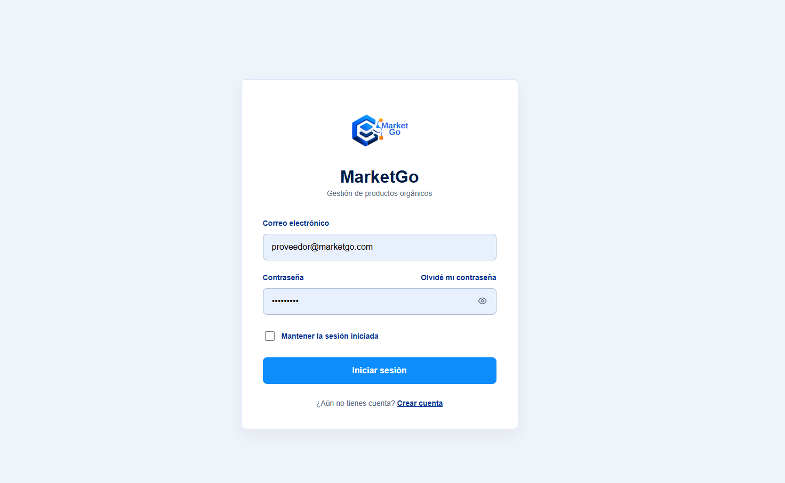
  
<strong>Figura: Vista de inicio de sesión de MarketGo.</strong> <em>Nota. Elaboración propia.</em>

  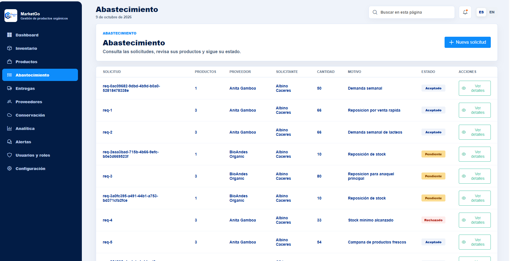
  
<strong>Figura: Solicitudes de abastecimiento de MarketGo.</strong> <em>Nota. Elaboración propia.</em>

  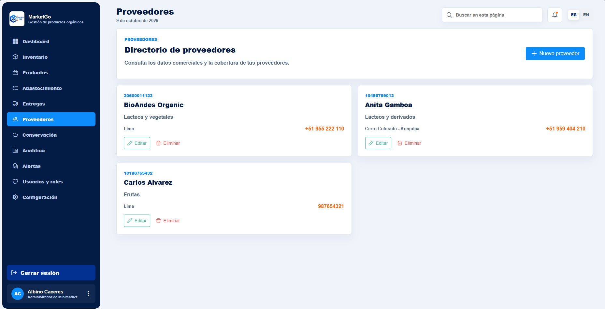
  
<strong>Figura: Directorio de proveedores orgánicos de MarketGo.</strong> <em>Nota. Elaboración propia.</em>

<em>La captura específica de órdenes de envío aún no se ha adjuntado a esta evidencia del Sprint 2.</em>

  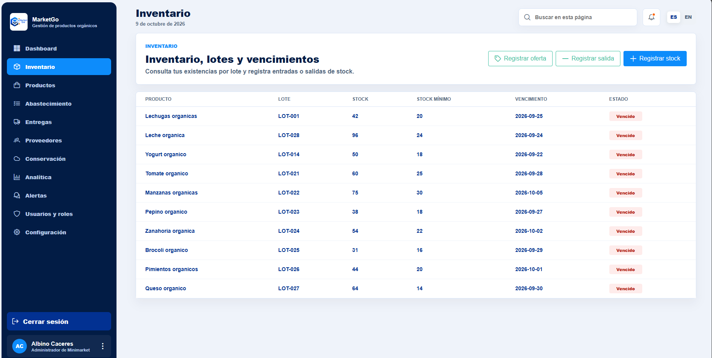
  
<strong>Figura: Inventario de MarketGo con productos, lotes, existencias y vencimientos.</strong> <em>Nota. Elaboración propia.</em>

  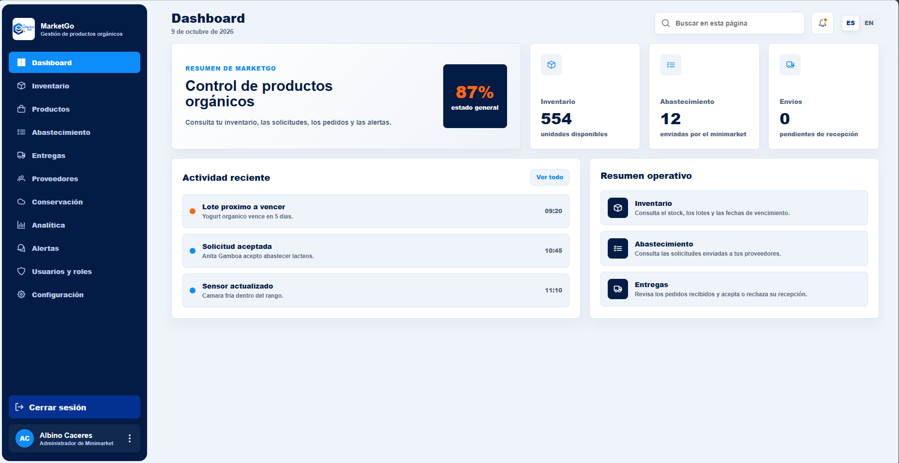
  
<strong>Figura: Dashboard general de MarketGo con indicadores de inventario, abastecimiento y envíos.</strong> <em>Nota. Elaboración propia.</em>

<h4>Product Navigation Video Evidence</h4>

  En esta sección se presenta el video demostrativo de navegación
  de la plataforma <strong>MarketGo</strong>, desarrollado por
  <strong>MarketLab</strong> como evidencia del Sprint 2.
  El propósito de este material audiovisual es mostrar los
  principales flujos del Frontend Web Application, incluyendo
  el registro e inicio de sesión, la gestión de perfiles,
  el acceso diferenciado según el rol, la administración
  del inventario, la consulta de proveedores, la gestión
  de pedidos de abastecimiento y órdenes de envío,
  así como la visualización de indicadores en el dashboard.
  Asimismo, se busca evidenciar la interacción entre los
  bounded contexts y la navegación general del sistema
  para los roles de Administrador de Minimarket y Proveedor.
  El material audiovisual puede alojarse en la plataforma
  institucional <strong>Microsoft Stream</strong>.

<strong>Nombre del archivo de video:</strong>
<code>marketgo-productnavigation-sprint-2.mp4</code>

  <a href="https://upcedupe-my.sharepoint.com/:v:/g/personal/u201923820_upc_edu_pe/IQADWTad-EyvSqVDDT4XLbUfARe43Rpcn6uBFHpgZRcl68I?nav=eyJyZWZlcnJhbEluZm8iOnsicmVmZXJyYWxBcHAiOiJPbmVEcml2ZUZvckJ1c2luZXNzIiwicmVmZXJyYWxBcHBQbGF0Zm9ybSI6IldlYiIsInJlZmVycmFsTW9kZSI6InZpZXciLCJyZWZlcnJhbFZpZXciOiJNeUZpbGVzTGlua0NvcHkifX0&e=GlflNR" target="_blank">
    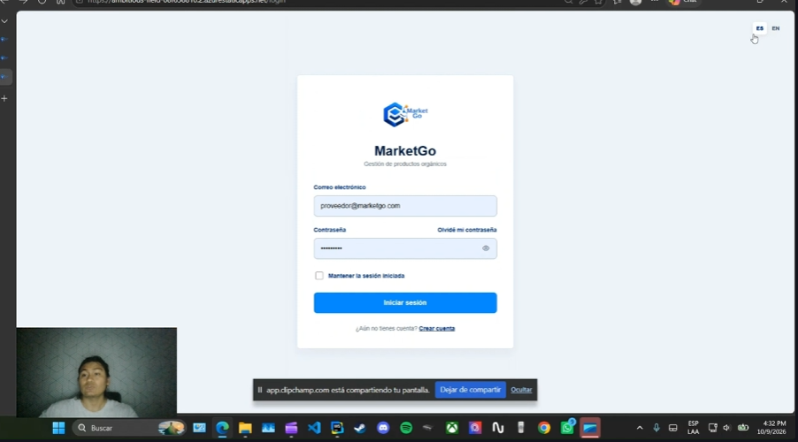
  </a>
  
<strong>Figura: Vista del video demostrativo de navegación de MarketGo.</strong> <em>Nota. Elaboración propia.</em>

Enlace directo: https://upcedupe-my.sharepoint.com/:v:/g/personal/u201923820_upc_edu_pe/IQADWTad-EyvSqVDDT4XLbUfARe43Rpcn6uBFHpgZRcl68I?nav=eyJyZWZlcnJhbEluZm8iOnsicmVmZXJyYWxBcHAiOiJPbmVEcml2ZUZvckJ1c2luZXNzIiwicmVmZXJyYWxBcHBQbGF0Zm9ybSI6IldlYiIsInJlZmVycmFsTW9kZSI6InZpZXciLCJyZWZlcnJhbFZpZXciOiJNeUZpbGVzTGlua0NvcHkifX0&e=GlflNR

#### 5.2.2.6. Services Documentation Evidence for Sprint Review.

El frontend de MarketGo está desarrollado con Vue 3, Vite y Pinia. El repositorio <code>Market-Labs/front-end</code> documenta dos fuentes de datos para validar los flujos de IAM, proveedores, inventario, abastecimiento, órdenes de envío y dashboard:

**Local (interfaz web):** http://localhost:5173/. Con <code>npm run dev:firebase</code> la interfaz utiliza Firebase; con <code>npm run dev:mock</code> utiliza la fake API de <code>json-server</code> en <code>http://localhost:3000</code>. Los dos puertos corresponden a procesos distintos.

| Entorno | Servicio de datos | Evidencia en el repositorio |
|---|---|---|
| Desarrollo local | <code>json-server</code> expone una fake API HTTP en <code>http://localhost:3000</code> al ejecutar <code>npm run dev:mock</code>. | <code>server/db.json</code>, <code>server/routes.json</code> y <code>server/README.md</code>. |
| Frontend publicado en Azure | Firebase Authentication gestiona el inicio de sesión y Cloud Firestore almacena los datos de demostración. La app se compila con <code>VITE_DATA_SOURCE=firebase</code> y usa el SDK de Firebase y un adaptador de Firestore. | <code>firebase.json</code>, <code>src/shared/infrastructure/firebase-client.js</code>, adaptadores de los bounded contexts y el workflow de Azure Static Web Apps. |

La siguiente tabla resume rutas comprobables de la fake API <strong>local</strong>. Son rutas del servidor de prueba; Firebase no publica estas rutas HTTP. Los contratos futuros de ASP.NET Core/C# descritos en el capítulo 3 no constituyen evidencia de un backend desplegado en este sprint.

| Funcionalidad | Ruta de la fake API local | Uso en MarketGo |
|---|---|---|
| Autenticación | <code>/api/v1/auth/*</code> | Simular las operaciones de acceso en desarrollo local. |
| Usuarios | <code>/api/v1/minimarkets/:minimarketId/users</code> | Consultar y administrar usuarios del minimarket. |
| Productos | <code>/api/v1/products</code> | Consultar y actualizar el catálogo. |
| Proveedores | <code>/api/v1/suppliers</code> | Consultar el directorio de proveedores. |
| Inventario | <code>/api/v1/minimarkets/:minimarketId/inventory</code> | Consultar y registrar existencias y lotes. |
| Solicitudes de abastecimiento | <code>/api/v1/minimarkets/:minimarketId/requisitions</code> | Crear y consultar solicitudes. |
| Órdenes de envío | <code>/api/v1/minimarkets/:minimarketId/purchase-orders</code> | Consultar y gestionar envíos. |
| Dashboard | <code>/api/v1/minimarkets/:minimarketId/dashboard</code> | Obtener indicadores para el administrador. |

En el entorno publicado, las operaciones equivalentes se realizan mediante Firebase Authentication y Firestore. El proyecto Firebase configurado en el cliente es <code>marketgo-d9c75</code>; no existe una URL pública de API REST de MarketGo que corresponda a la tabla local. La documentación de OpenAPI/Swagger pertenece al backend ASP.NET Core/C# planificado y no se presenta como servicio implementado en Sprint 2.

#### 5.2.2.7. Software Deployment Evidence for Sprint Review.

El Frontend Web Application de MarketGo se aloja en Azure Static Web Apps y utiliza Firebase Authentication y Cloud Firestore como servicios de datos de demostración. La aplicación es una SPA de Vue 3, Vite, Pinia y Vue Router. La fake API de <code>json-server</code> se ejecuta solo en desarrollo local; no es el servicio publicado en Azure ni un servidor alojado en Firebase.

| Componente | Configuración comprobada | Propósito |
|---|---|---|
| Frontend | El workflow <code>.github/workflows/azure-static-web-apps-ambitious-field-08f658810.yml</code> del repositorio <code>front-end</code> se ejecuta al hacer push a <code>main</code>, usa Azure Static Web Apps y publica la salida <code>dist</code>. | Alojar la interfaz web de MarketGo en Azure. |
| Datos de demostración | El workflow establece <code>VITE_DATA_SOURCE=firebase</code>; el cliente inicializa Firebase Authentication y Cloud Firestore para el proyecto <code>marketgo-d9c75</code>. | Autenticar usuarios y persistir los datos mostrados por el frontend desplegado. |
| Frontend local | <code>npm run dev</code> o <code>npm run dev:firebase</code> sirven la interfaz con Vite en <code>http://localhost:5173/</code>. | Revisar la aplicación desde el navegador durante el desarrollo. |
| Fake API local | <code>npm run dev:mock</code> inicia Vite en <code>http://localhost:5173/</code> y <code>json-server</code> en <code>http://localhost:3000</code>. | Probar la interfaz y los contratos HTTP sin el entorno publicado. |

El repositorio contiene además reglas de Firestore en <code>firestore.rules</code> y la configuración <code>firebase.json</code>. El workflow usa un secreto de GitHub para el token de Azure; su valor y el resultado de cada ejecución no pueden verificarse a partir de los archivos locales.

**URLs públicas del proyecto (comprobadas con respuesta HTTP 200 el 09-10-2026):**

- **Frontend Web Application:** https://ambitious-field-08f658810.2.azurestaticapps.net/
- **Landing page:** https://agreeable-meadow-0a900b010.3.azurestaticapps.net/

La landing page enlaza al inicio de sesión del frontend desde sus botones de acceso y demostración. El código de <code>HomeSection.vue</code> y <code>TheHeader.vue</code> usa la URL del frontend con la ruta <code>/login?redirect=/home</code>. Para completar la evidencia visual del despliegue queda por adjuntar una captura o enlace de la ejecución correcta del workflow de Azure y, si se requiere, una captura de la configuración de Firebase.

#### 5.2.2.8. Team Collaboration Insights during Sprint.

  Durante el Sprint 2, el equipo de <strong>MarketLab</strong>
  utilizó <strong>Trello</strong> para organizar y supervisar
  las actividades del desarrollo de MarketGo. El tablero permitió
  clasificar las tareas en columnas como <em>To-Do</em>,
  <em>In-Progress</em>, <em>To-Review</em>,
  <em>To-Fix</em> y <em>Done</em>,
  facilitando la identificación del estado de cada actividad,
  el seguimiento del avance y la coordinación entre los integrantes.
  Esta organización permitió mantener una visión general de
  las responsabilidades asociadas al Sprint Backlog.

  El trabajo se organizó por <em>bounded contexts</em>,
  distribuyendo las responsabilidades entre los cinco integrantes:
  <strong>Cáceres Pizarro, Albino Florencio</strong>,
  como líder general del equipo;
  <strong>Huaranga Romero, Matias Daniel</strong>;
  <strong>Merino Ordinola, Winnie Lisbeth</strong>;
  <strong>Quispe Almonacid, Andre Sebastian</strong>;
  y <strong>Torres Huaman, Alexis Calin</strong>.
  Esta distribución permitió trabajar en las funcionalidades
  y la documentación de IAM, Profiles, Requisition,
  Procurements, Suppliers, Products, Inventory,
  Conservation, Dashboard y Communication.
  La coordinación del equipo comprendió la asignación
  de tareas en Trello, el seguimiento de los avances,
  la integración de cambios en GitHub y la revisión
  de los entregables correspondientes al Sprint 2.

Como evidencia de colaboración, la vista <em>Pulse</em> de GitHub Insights del repositorio <code>Market-Labs/front-end</code> muestra el periodo del 2 al 9 de octubre de 2026. En esa ventana, cuatro autores registraron 26 commits en <code>main</code> y 46 commits en todas las ramas, excluidos los merges. GitHub también registra 100 archivos modificados en <code>main</code>, con 8&nbsp;663 adiciones y 807 eliminaciones, además de una versión publicada. La captura indica cero pull requests fusionados o abiertos y cero issues nuevos o cerrados durante ese periodo. Los cuatro autores con commits no representan necesariamente a todos los cinco integrantes que participaron en el Sprint 2; la colaboración en tareas y documentación se registra por separado en Trello y en la matriz LACX.

  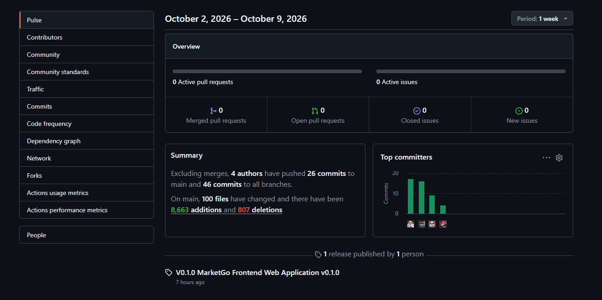
  
<strong>Figura: Actividad de colaboración y commits del repositorio front-end durante el Sprint 2.</strong> <em>Nota. Captura de GitHub Insights / Pulse del repositorio Market-Labs/front-end.</em>

La vista <em>Traffic</em> del mismo repositorio muestra, para la ventana de 14 días indicada en la captura, 76 clonaciones realizadas por 40 clonadores únicos y 27 visualizaciones del repositorio por cuatro visitantes únicos. Estas métricas describen el acceso al repositorio de GitHub; no miden usuarios de MarketGo ni visitas a la aplicación o a la landing page. Tampoco permiten calcular Story Points completados.

  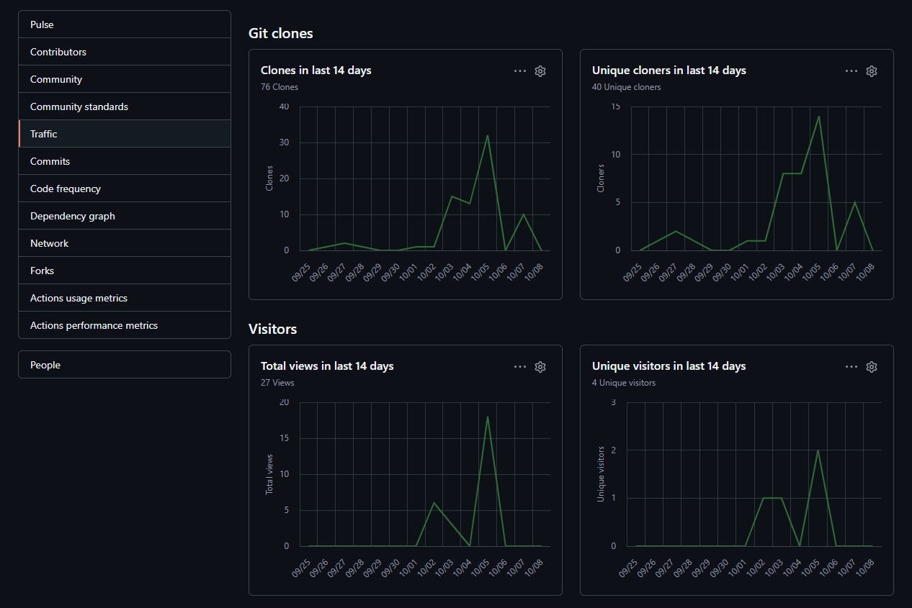
  
<strong>Figura: Tráfico del repositorio front-end, con clonaciones y visualizaciones registradas por GitHub.</strong> <em>Nota. Captura de GitHub Insights / Traffic del repositorio Market-Labs/front-end.</em>

<strong>Aciertos del Sprint:</strong>

<ul>
  <li>
    La organización del frontend por <em>bounded contexts</em>
    (<code>iam</code>, <code>profiles</code>,
    <code>products</code>, <code>suppliers</code>,
    <code>inventory</code>, <code>requisition</code>,
    <code>procurements</code>, <code>conservation</code>,
    <code>dashboard</code> y <code>communication</code>)
    permitió distribuir las responsabilidades entre
    los integrantes y mantener una separación clara
    de las funcionalidades del sistema.
  </li>
  <li>
    La organización de los adaptadores de datos facilitó el uso
    de Firebase Authentication y Firestore en el frontend publicado,
    junto con la fake API HTTP de desarrollo local,
    manteniendo la coherencia entre las operaciones
    de inventario, proveedores y abastecimiento.
  </li>
  <li>
    El uso de Vue 3, Vite y Pinia permitió establecer
    una arquitectura frontend basada en componentes
    reutilizables y gestión centralizada del estado.
    Asimismo, se consideró la internacionalización
    mediante <strong>i18n</strong> para ofrecer soporte
    en español e inglés.
  </li>
</ul>

<strong>Oportunidades de mejora identificadas:</strong>

<ul>
  <li>
    Reforzar la validación de formularios y los criterios
    de aceptación de IAM, especialmente en el registro
    de usuarios, inicio de sesión y asignación de permisos,
    para garantizar un comportamiento consistente
    según el rol.
  </li>
  <li>
    Mejorar la documentación de los componentes,
    stores de Pinia y adaptadores de Firebase y de la fake API local,
    estableciendo convenciones de nombres y
    responsabilidades claras entre los bounded contexts
    para facilitar el mantenimiento del código.
  </li>
  <li>
    Incrementar la cobertura de pruebas funcionales
    y de integración, principalmente en los flujos
    de pedidos de abastecimiento, órdenes de envío,
    actualización del inventario y visualización del
    dashboard según el rol del usuario.
  </li>
</ul>
